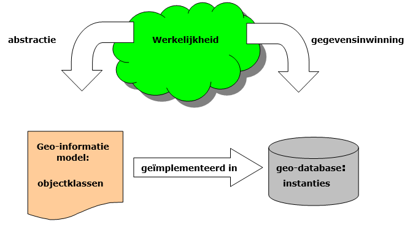
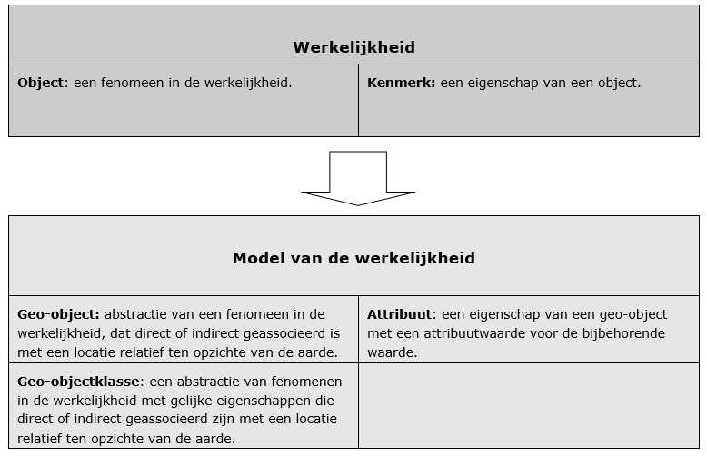
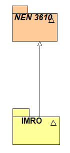

# Het Informatiemodel voor de Ruimtelijke Ordening {#48DDA048}

## Een toepassing van NEN 3610 {#7F7D935B}

Het informatiemodel voor de ruimtelijke ordening is een toepassing van het Basismodel Geo-informatie, NEN 3610, voor het beleidsveld van de ruimtelijke ordening. Het is hiermee één van de mogelijke toepassingen van deze norm. NEN 3610 vervult als algemeen geldende norm een paraplufunctie voor bestaande of nog te ontwikkelen informatiemodellen voor specifieke beleidsvelden. Hierdoor ontstaat de mogelijkheid om beleidsveld-eigen registraties van geo-informatie via de algemene overlappende classificatie van NEN 3610 met andere beleidsvelden uit te wisselen. In het proces van de ruimtelijke ordening wordt er van velerlei beleidsvelden informatie gebruikt. Op hun beurt bieden de omgevingsinstrumenten weer informatie voor andere beleidsvelden. Door de koppeling van sectormodellen met NEN 3610 is er de mogelijkheid om ruimtelijke informatie van verschillende sectormodellen eenvoudig te integreren.

## Structuur van het informatiemodel {#77599823}

De structuur van IMRO is ontleend aan het Basismodel Geo-informatie. Voor de gedetailleerde omschrijving wordt verwezen naar het normdocument NEN 3610:2011 Basismodel Geo-informatie. Voor dit document is het voldoende om de grote lijn te schetsen.
 

<b>Beschrijving van de werkelijkheid</b> 
Binnen veel sectoren in het bedrijfsleven en de overheid wordt er een groot en toenemend belang gehecht aan het delen en gebruiken van elkaars informatie. Geo-informatie vormt hierin de kern van het gemeenschappelijke werkdomein. Dit werkdomein of werkelijkheid kunnen we efficiënt beschrijven door van deze werkelijkheid een abstractie te maken die ons de informatie levert die we nodig hebben. Deze abstractie van de werkelijkheid vormt de basis voor het informatiemodel. In de onderlinge communicatie over en uitwisseling van geo-informatie wordt deze abstractie van de werkelijkheid gebruikt (zie <a href='#'>Figuur</a><b><a href='#'> 1</a></b>). Het is dus van wezenlijk belang dat bepaald is wat er met ‘de werkelijkheid’ wordt bedoeld. 
<figure></img>
<figcaption>Het Basismodel Geo-informatie beschrijft een abstractie van de werkelijkheid die wordt vastgelegd in een geo-database</figcaption></figure>

Voor het Basismodel Geo-informatie wordt deze werkelijkheid gevormd door alle objecten met een geografische dimensie. Voor het beschrijven van de werkelijkheid staan een aantal begrippen centraal. 
De werkelijkheid is opgebouwd uit objecten (ISO: real world objects). Eigenschappen van objecten worden beschreven doormiddel van kenmerken. Het model is een representatie van de werkelijkheid. Objecten worden in het model geo-objecten genoemd (ISO: features) en de eigenschappen worden beschreven door attributen. Geo-objecten met gelijke eigenschappen worden in het model gegroepeerd in klassen (ISO: feature type of feature class). Het onderstaande figuur geeft een overzicht. 
<figure></img>
<figcaption>Representatie van de werkelijkheid</figcaption></figure>

Een geo-object heeft een directe associatie met een locatie doormiddel van coördinaten en of een indirecte associatie doormiddel van een verwijzing naar een adres, een postcode etc. 
Geo-object is het equivalent voor de ISO (Engelse) term feature. Het Basismodel Geo-informatie is hiermee een ‘feature based’ model in tegenstelling tot een ‘raster based’ model.
 

<b>Objectgericht</b> 
Het Basismodel Geo-informatie is objectgericht, dat wil zeggen dat het informatie geeft over individueel te onderscheiden objecten binnen de beschreven werkelijkheid. Het object is de eenheid van informatie. De informatie is per object gegroepeerd en daarom per object opvraagbaar.
 

<b>Groepering in objectklassen</b> 
De in de werkelijkheid voorkomende geo-objecten worden in het Basismodel Geo-informatie op hoofdlijn ingedeeld op basis van gelijke eigenschappen. Voor een deel is hiervoor de verschijningsvorm gebruikt en voor een deel is een functionele indeling gevolgd. Op basis van deze twee eigenschappen worden geo-objecten gegroepeerd in klassen. De objecten uit de ruimtelijke ordening vallen daarbij onder de klasse Planologische gebied met de definitie: Niet-tastbaar begrensd gebied waaraan een bepaalde (toekomstige) bestemming, functionele en / of bestuurlijke ruimtelijke ontwikkeling is gekoppeld.
 

<b>Attributen, attribuutwaarden en domeinwaarden.</b> 
De kenmerken van objecten in de werkelijkheid beschreven met behulp van attributen. Voor de attributen zijn mogelijke waardetypen gespecificeerd middels domeinen en enumeratiewaarden.

## IMRO geo-objectklassen {#48EBE709}

IMRO is een verdere uitwerking van de geo-objectklassen uit het Basismodel die relevant zijn voor het vakgebied van de ruimtelijke ordening, tenminste voorzover die terugkomen in omgevingsinstrumenten. Op modelniveau is het model IMRO een specialisatie van het model NEN 3610, zie onderstaande figuur. 
<figure></img>
<figcaption>Het informatiemodel IMRO is een specialisatie van het informatiemodel NEN 3610</figcaption></figure>

In het Basismodel zijn alle klassen abstract. In  is dit weergegeven door een cursief lettertype voor het informatiemodel NEN 3610. Dit betekent dat van de klassen uit het Basismodel geen instanties gemaakt kunnen worden, dat wil zeggen dat geen individuele geo-objecten uit een klasse beschreven kunnen worden. Dit kan pas in de sectormodellen. In dit geval IMRO. Bijvoorbeeld een geo-object ‘bestemmingsplangebied Amersfoort’ kan pas beschreven worden als instantie van de klasse Plangebied uit IMRO en niet als instantie van de klasse Plangebied uit het Basismodel. 

Alle objecten die in omgevingsinstrumenten voorkomen behoren tot de geo-objectklasse PlanologischGebied van het Basismodel. Deze klasse is het supertype waar alle IMRO klassen een verdere specialisatie van zijn. De geo-objectklasse PlanologischGebied met de subklassen Planobject en Plangebied vormen als het ware het aangrijpingspunt tussen het Basismodel Geo-informatie en IMRO.

