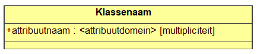
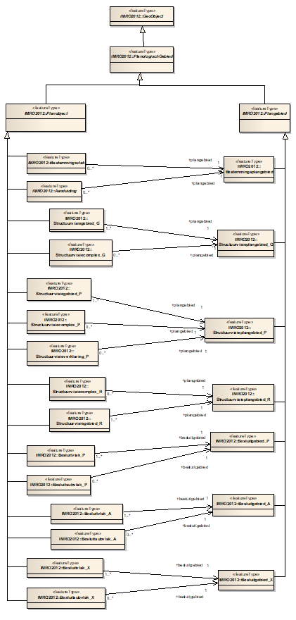
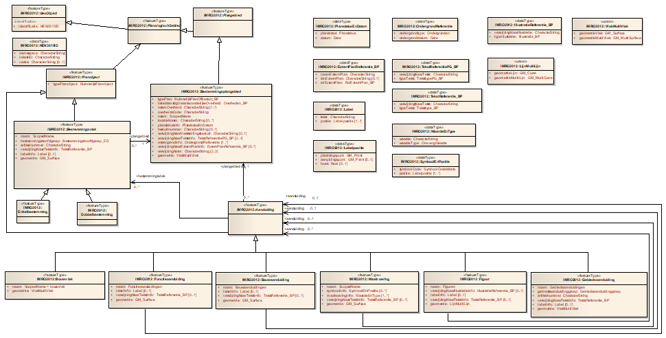
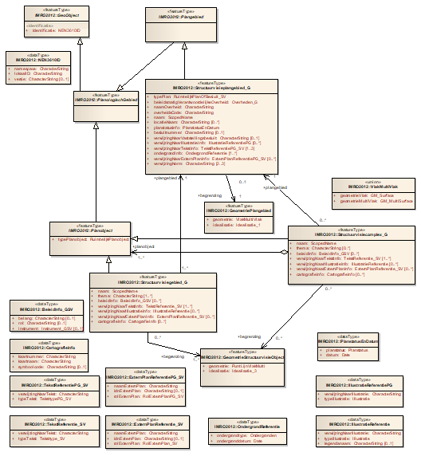
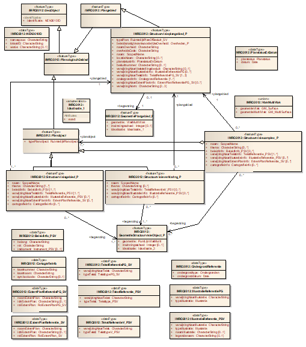
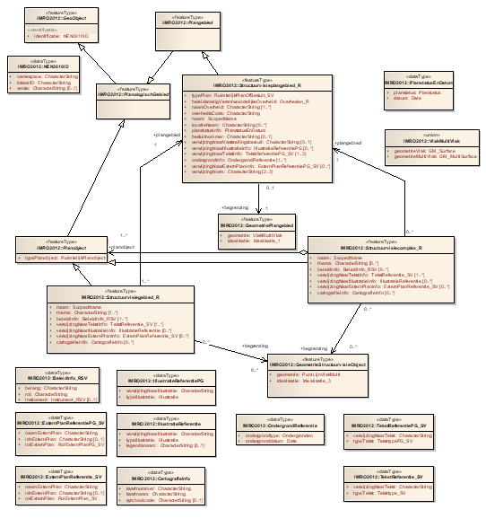
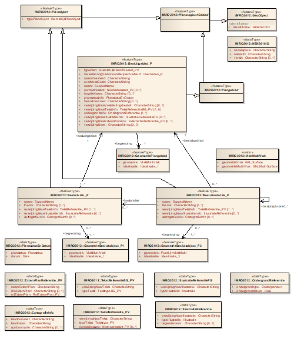
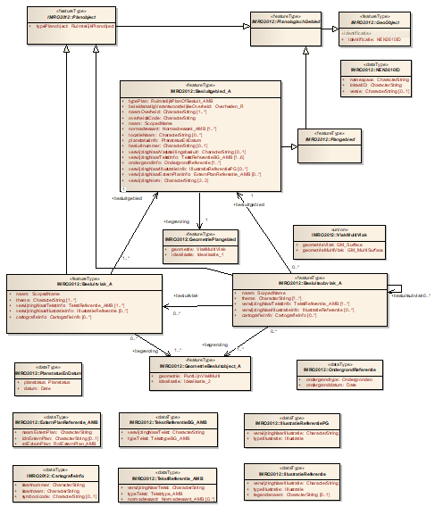
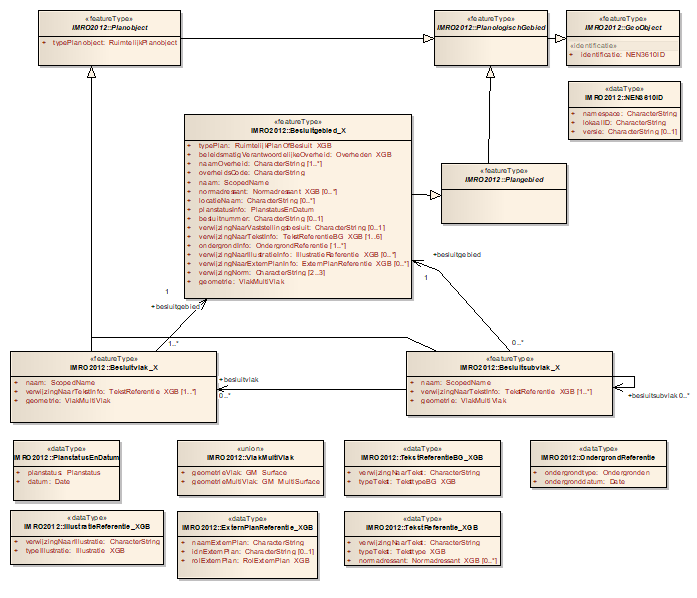

# Beschrijving model {#06474D64}

In het voorafgaande hoofdstuk is het concept van IMRO beschreven. In dit hoofdstuk worden dit concept verder uitgewerkt, ontstaan er subklassen van de superklasse PlanologischGebied. De klassen worden aan elkaar gerelateerd, attributen worden gedefinieerd, attribuutdomeinen toegekend en ontstaat het model IMRO. De toepassing van IMRO voor het modelleren van omgevingsinstrumenten in gemeentelijke, provinciale en nationale omgeving resulteert in aparte modellen voor elk van die deelsectoren. In dit hoofdstuk wordt voor elk van die toepassingen het model gepresenteerd. Doormiddel van UML klassediagrammen worden de objecten, de attributen en de relaties tussen objecten weergegeven. De principes van een UML klassediagram zijn beschreven in <a href='#7F7DAF04'>Bijlage 1</a> Schema-presentatie. 
## Format {#7F7D93A2}

Het volgende format wordt gebruikt voor de beschrijving van de klassen van IMRO. 
<figure></img>
<figcaption>Klassen IMRO</figcaption></figure>

In het figuur: 
<ul><li>‘Klassenaam’: de naam van de geo-objectklasse;</li>
<li>‘attribuutnaam’: de attributen die gedefinieerd zijn voor deze klasse;</li>
<li>&lt;attribuutdomein&gt;: een referentie naar de verzameling van toegestane attribuutwaarden, het domein;</li>
<li>[multipliciteit]: de cardinaliteit van het attribuut weergegeven in het aantal keren (multipliciteit) dat een attribuut kan of moet voorkomen.</li>
</ul>

Bij elke klasse is een tabel opgenomen waarin de definitie en andere informatie wordt gegeven. De tabel heeft de volgende indeling: 
<table style='width: 100%;'><caption>Tabel 1 Klasse indeling</caption>
<colgroup><col id='col1' style='width: 24.389961836475077%;'
<col id='col2' style='width: 14.953162946686712%;'
<col id='col3' style='width: 60.656875216838216%;'
</colgroup>
<thead valign='top'><tr><th align='left' style='border-top: 0.5pt solid #666666; border-left: 0.5pt solid #666666; border-bottom: 0.5pt solid #666666; border-right: 0.5pt solid #666666; background-color: #000000;'>Klasse 
</th>
<th align='left' style='border-top: 0.5pt solid #666666; border-left: 0.5pt solid #666666; border-bottom: 0.5pt solid #666666; border-right: 0.5pt solid #666666; background-color: #000000;' colspan='2'>Klassenaam 
</th>
</tr>
</thead>
<tbody valign='top'><tr><td align='left' style='border-top: 0.5pt solid #666666; border-left: 0.5pt solid #666666; border-bottom: 0.5pt solid #666666; border-right: 0.5pt solid #666666; background-color: none;'>Definitie 
</td>
<td align='left' style='border-top: 0.5pt solid #666666; border-left: 0.5pt solid #666666; border-bottom: 0.5pt solid #666666; border-right: 0.5pt solid #666666; background-color: none;' colspan='2'>Definitie van de klasse. 
</td>
</tr>
<tr><td align='left' style='border-top: 0.5pt solid #666666; border-left: 0.5pt solid #666666; border-bottom: 0.5pt solid #666666; border-right: 0.5pt solid #666666; background-color: none;'>Herkomst definitie  
</td>
<td align='left' style='border-top: 0.5pt solid #666666; border-left: 0.5pt solid #666666; border-bottom: 0.5pt solid #666666; border-right: 0.5pt solid #666666; background-color: none;' colspan='2'>De herkomst, bron, van de definitie. 
</td>
</tr>
<tr><td align='left' style='border-top: 0.5pt solid #666666; border-left: 0.5pt solid #666666; border-bottom: 0.5pt solid #666666; border-right: 0.5pt solid #666666; background-color: none;'>Inwinningsregels 
</td>
<td align='left' style='border-top: 0.5pt solid #666666; border-left: 0.5pt solid #666666; border-bottom: 0.5pt solid #666666; border-right: 0.5pt solid #666666; background-color: none;' colspan='2'>Beschrijving van de inwinningsregels met betrekking tot deze klasse. De inwinningsregels bepalen bijvoorbeeld hoe een object in de werkelijkheid wordt ingemeten, of hoe een oppervlak geïnterpreteerd moet worden. 
Er zijn in IMRO nog geen inwinningsregels gedefinieerd. 
</td>
</tr>
<tr><td align='left' style='border-top: 0.5pt solid #666666; border-left: 0.5pt solid #666666; border-bottom: 0.5pt solid #666666; border-right: 0.5pt solid #666666; background-color: none;'>Generalisatie 
</td>
<td align='left' style='border-top: 0.5pt solid #666666; border-left: 0.5pt solid #666666; border-bottom: 0.5pt solid #666666; border-right: 0.5pt solid #666666; background-color: none;' colspan='2'>Van welke klassen is deze klasse een generalisatie. 
</td>
</tr>
<tr><td align='left' style='border-top: 0.5pt solid #666666; border-left: 0.5pt solid #666666; border-bottom: 0.5pt solid #666666; border-right: 0.5pt solid #666666; background-color: none;'>Specialisatie 
</td>
<td align='left' style='border-top: 0.5pt solid #666666; border-left: 0.5pt solid #666666; border-bottom: 0.5pt solid #666666; border-right: 0.5pt solid #666666; background-color: none;' colspan='2'>Van welke klasse is deze klasse een specialisatie. 
</td>
</tr>
<tr><td align='left' style='border-top: 0.5pt solid #666666; border-left: 0.5pt solid #666666; border-bottom: 0.5pt solid #666666; border-right: 0.5pt solid #666666; background-color: none;'>Attributen 
</td>
<td align='left' style='border-top: 0.5pt solid #666666; border-left: 0.5pt solid #666666; border-bottom: 0.5pt solid #666666; border-right: 0.5pt solid #666666; background-color: none;' colspan='2'>De attributen die gedefinieerd zijn voor deze klasse. 
</td>
</tr>
<tr><td align='left' style='border-top: 0.5pt solid #666666; border-left: 0.5pt solid #666666; border-bottom: 0.5pt solid #666666; border-right: 0.5pt solid #666666; background-color: none;'><i>Attribuutnaam*</i> 
De naam van het attribuut 
</td>
<td align='left' style='border-top: 0.5pt solid #666666; border-left: 0.5pt solid #666666; border-bottom: 0.5pt solid #666666; border-right: 0.5pt solid #666666; background-color: none;'><b><i>m</i></b> 
multipliciteit 
</td>
<td align='left' style='border-top: 0.5pt solid #666666; border-left: 0.5pt solid #666666; border-bottom: 0.5pt solid #666666; border-right: 0.5pt solid #666666; background-color: none;'><b><i>Toelichting</i></b> 
Een toelichting op het doel en gebruik van het attribuut. 
</td>
</tr>
<tr><td align='left' style='border-top: 0.5pt solid #666666; border-left: 0.5pt solid #666666; border-bottom: 0.5pt solid #666666; border-right: 0.5pt solid #666666; background-color: none;'>Associaties 
</td>
<td align='left' style='border-top: 0.5pt solid #666666; border-left: 0.5pt solid #666666; border-bottom: 0.5pt solid #666666; border-right: 0.5pt solid #666666; background-color: none;' colspan='2'>Met welke klassen heeft deze klasse associaties. 
</td>
</tr>
<tr><td align='left' style='border-top: 0.5pt solid #666666; border-left: 0.5pt solid #666666; border-bottom: 0.5pt solid #666666; border-right: 0.5pt solid #666666; background-color: none;'>Gebruik/voorbeelden 
</td>
<td align='left' style='border-top: 0.5pt solid #666666; border-left: 0.5pt solid #666666; border-bottom: 0.5pt solid #666666; border-right: 0.5pt solid #666666; background-color: none;' colspan='2'>Toelichting bij het gebruik van deze klasse. 
</td>
</tr>
</tbody>
</table>

* De asterisk geeft aan dat het attribuut overgeërfd is van een hogere klasse en een specifieke uitwerking heeft voor deze klasse.  
 

In de UML klassediagrammen worden de klassen afgebeeld en hun onderlinge relaties. In het diagram zijn ook de datatypen aangegeven in het geval dat ze bestaan uit een combinatie van attributen. Bijvoorbeeld het Datatype PlantstatusEnDatum dat bestaat uit een combinatie van twee attributen. 
 De attribuutdomeinen die in de diagrammen genoemd worden zijn opgenomen in <a href='#090B956C'>Hoofdstuk 10</a>.

## IMRO toepassing van Basismodel Geo-informatie {#7F7D93DF}

In het diagram is afgebeeld dat IMRO via de NEN 3610 klassen Plangebied en Planobject en hun superklasse PlanologischGebied aan elkaar gekoppeld zijn. Dit is het ‘aangrijpingspunt’ waar IMRO aan het Basismodel gekoppeld is. De IMRO klasse GeoObject is een aangepaste versie van de NEN 3610 klasse GeoObject. Alleen de attributen die voor IMRO van toepassing zijn, zijn overgenomen. 
Van de klassen van het Basismodel die ook voor IMRO gelden is de beschrijving opgenomen in deze paragraaf. 
<figure></img>
<figcaption>UML-klassediagram van de relatie tussen IMRO en het Basismodel Geo-informatie</figcaption></figure>

### GeoObject (aangepast uit NEN 3610) {#7F7D93F5}

<table style='width: 100%;'><caption></caption>
<colgroup><col id='col1' style='width: 16.791950965652827%;'
<col id='col2' style='width: 6.349022782467909%;'
<col id='col3' style='width: 76.85902625187927%;'
</colgroup>
<thead valign='top'><tr><th align='left' style='border-top: 0.5pt solid #666666; border-left: 0.5pt solid #666666; border-bottom: 0.5pt solid #666666; border-right: 0.5pt solid #666666; background-color: #000000;' colspan='2'>
Klasse 
</th>
<th align='left' style='border-top: 0.5pt solid #666666; border-left: 0.5pt solid #666666; border-bottom: 0.5pt solid #666666; border-right: 0.5pt solid #666666; background-color: #000000;'>GeoObject 
</th>
</tr>
</thead>
<tbody valign='top'><tr><td align='left' style='border-top: 0.5pt solid #666666; border-left: 0.5pt solid #666666; border-bottom: 0.5pt solid #666666; border-right: 0.5pt solid #666666; background-color: none;' colspan='2'>Definitie 
</td>
<td align='left' style='border-top: 0.5pt solid #666666; border-left: 0.5pt solid #666666; border-bottom: 0.5pt solid #666666; border-right: 0.5pt solid #666666; background-color: none;'>Een geo-object is een abstractie van een fenomeen in de werkelijkheid, dat direct of indirect is geassocieerd met een locatie relatief ten opzichte van de aarde. 
</td>
</tr>
<tr><td align='left' style='border-top: 0.5pt solid #666666; border-left: 0.5pt solid #666666; border-bottom: 0.5pt solid #666666; border-right: 0.5pt solid #666666; background-color: none;' colspan='2'>Herkomst definitie  
</td>
<td align='left' style='border-top: 0.5pt solid #666666; border-left: 0.5pt solid #666666; border-bottom: 0.5pt solid #666666; border-right: 0.5pt solid #666666; background-color: none;'>NEN 3610 
</td>
</tr>
<tr><td align='left' style='border-top: 0.5pt solid #666666; border-left: 0.5pt solid #666666; border-bottom: 0.5pt solid #666666; border-right: 0.5pt solid #666666; background-color: none;' colspan='2'>Inwinningsregels 
</td>
<td align='left' style='border-top: 0.5pt solid #666666; border-left: 0.5pt solid #666666; border-bottom: 0.5pt solid #666666; border-right: 0.5pt solid #666666; background-color: none;'></td>
</tr>
<tr><td align='left' style='border-top: 0.5pt solid #666666; border-left: 0.5pt solid #666666; border-bottom: 0.5pt solid #666666; border-right: 0.5pt solid #666666; background-color: none;' colspan='2'>Generalisatie 
</td>
<td align='left' style='border-top: 0.5pt solid #666666; border-left: 0.5pt solid #666666; border-bottom: 0.5pt solid #666666; border-right: 0.5pt solid #666666; background-color: none;'>Deze klasse vormt de hoofdklasse (superklasse) van het Basismodel Geo-informatie. Hiermee is het de generalisatie-klasse van alle andere klassen in 
het model. 
</td>
</tr>
<tr><td align='left' style='border-top: 0.5pt solid #666666; border-left: 0.5pt solid #666666; border-bottom: 0.5pt solid #666666; border-right: 0.5pt solid #666666; background-color: none;' colspan='2'>Specialisatie 
</td>
<td align='left' style='border-top: 0.5pt solid #666666; border-left: 0.5pt solid #666666; border-bottom: 0.5pt solid #666666; border-right: 0.5pt solid #666666; background-color: none;'></td>
</tr>
<tr><td align='left' style='border-top: 0.5pt solid #666666; border-left: 0.5pt solid #666666; border-bottom: 0.5pt solid #666666; border-right: 0.5pt solid #666666; background-color: none;' colspan='2'>Attributen 
</td>
<td align='left' style='border-top: 0.5pt solid #666666; border-left: 0.5pt solid #666666; border-bottom: 0.5pt solid #666666; border-right: 0.5pt solid #666666; background-color: none;'></td>
</tr>
<tr><td align='left' style='border-top: 0.5pt solid #666666; border-left: 0.5pt solid #666666; border-bottom: 0.5pt solid #666666; border-right: 0.5pt solid #666666; background-color: none;'>Attribuutnaam 
</td>
<td align='left' style='border-top: 0.5pt solid #666666; border-left: 0.5pt solid #666666; border-bottom: 0.5pt solid #666666; border-right: 0.5pt solid #666666; background-color: none;'> m 
</td>
<td align='left' style='border-top: 0.5pt solid #666666; border-left: 0.5pt solid #666666; border-bottom: 0.5pt solid #666666; border-right: 0.5pt solid #666666; background-color: none;'><b>Toelichting</b> 
</td>
</tr>
<tr><td align='left' style='border-top: 0.5pt solid #666666; border-left: 0.5pt solid #666666; border-bottom: 0.5pt solid #666666; border-right: 0.5pt solid #666666; background-color: none;'>identificatie 
</td>
<td align='left' style='border-top: 0.5pt solid #666666; border-left: 0.5pt solid #666666; border-bottom: 0.5pt solid #666666; border-right: 0.5pt solid #666666; background-color: none;'> 1 
</td>
<td align='left' style='border-top: 0.5pt solid #666666; border-left: 0.5pt solid #666666; border-bottom: 0.5pt solid #666666; border-right: 0.5pt solid #666666; background-color: none;'>NEN3610ID: Dit is een attribuut ovegenomen uit NEN 3610:2011. Het attribuut zorgt voor een unieke identificatie van objecten binnen de NEN 3610 geo-informatie modellen. Het attribuut is samengesteld uit: 
<ul><li>namespace [1]: unieke verwijzing naar een registratie van objecten.</li>
</ul>

Het attribuut ‘namespace’ is een unieke verwijzing naar de registratie die de identificatie uitdeelt. Deze lijst van registraties wordt beheerd binnen de context van NEN 3610. Binnen Nederland zal deze namespace vrijwel altijd met ‘NL’ beginnen. De volgende karakters mogen in een namespaceaanduiding voorkomen: {”A”…”Z”, “a”…”z”, ”0”…”9”, “_”, “- “, “,”, ”.”} 
<ul><li>lokaalID: [1]: unieke identificatiecode binnen een registratie.</li>
</ul>

‘lokaalID’ is de identificatiecode die een object heeft binnen een (lokale) registratie. De volgende karakters mogen in een lokaal ID voorkomen: {”A”…”Z”, “a”…”z”, ”0”…”9”, “_”, “-“, “,”, ”.”} 
<ul><li>versie: [0..1]: versie-aanduiding van een object.</li>
</ul>

Maximaal 25 karakters. 
</td>
</tr>
<tr><td align='left' style='border-top: 0.5pt solid #666666; border-left: 0.5pt solid #666666; border-bottom: 0.5pt solid #666666; border-right: 0.5pt solid #666666; background-color: none;' colspan='2'></td>
<td align='left' style='border-top: 0.5pt solid #666666; border-left: 0.5pt solid #666666; border-bottom: 0.5pt solid #666666; border-right: 0.5pt solid #666666; background-color: none;'></td>
</tr>
<tr><td align='left' style='border-top: 0.5pt solid #666666; border-left: 0.5pt solid #666666; border-bottom: 0.5pt solid #666666; border-right: 0.5pt solid #666666; background-color: none;' colspan='2'></td>
<td align='left' style='border-top: 0.5pt solid #666666; border-left: 0.5pt solid #666666; border-bottom: 0.5pt solid #666666; border-right: 0.5pt solid #666666; background-color: none;'></td>
</tr>
<tr><td align='left' style='border-top: 0.5pt solid #666666; border-left: 0.5pt solid #666666; border-bottom: 0.5pt solid #666666; border-right: 0.5pt solid #666666; background-color: none;' colspan='2'>Gebruik/voorbeelden 
</td>
<td align='left' style='border-top: 0.5pt solid #666666; border-left: 0.5pt solid #666666; border-bottom: 0.5pt solid #666666; border-right: 0.5pt solid #666666; background-color: none;'>Voor deze klasse zijn die attributen gedefinieerd die voor alle subklassen gelden. Deze klasse wordt niet gebruikt voor het benoemen van bestaande geo-objecten. Als van een object niet bekend is, of niet van belang is, tot welke basisklasse het object behoort, dan moet in een sectormodel van deze klasse een subklasse gemaakt worden. 
Deze klasse is aangepast uit NEN3610. Alleen de attributen die in IMRO gebruikt worden zijn opgenomen. Deze worden bij de specifieke IMRO objecttypen verklaard. 
</td>
</tr>
</tbody>
</table>

<b>
Toelichting Geometrie</b> 
Hoewel een geo-object volgens de definitie altijd op een of andere wijze moet zijn geassocieerd met een geometrie, heeft de klasse GeoObject zelf geen geometrisch attribuut. De reden hiervoor is dat er op dit niveau nog geen keuze valt te maken over hoe het geo-object aan zijn geometrie komt. In IMRO is voor de verschillende klassen wel een geometrisch attribuut gedefinieerd. 

### PlanologischGebied (uit NEN 3610) {#7F7D9427}

<table style='width: 100%;'><caption></caption>
<colgroup><col id='col1' style='width: 24.389961836475077%;'
<col id='col2' style='width: 75.61003816352492%;'
</colgroup>
<tbody valign='top'><tr><td align='left' style='border-top: 0.5pt solid #666666; border-left: 0.5pt solid #666666; border-bottom: 0.5pt solid #666666; border-right: 0.5pt solid #666666; background-color: #000000;'>Klasse 
</td>
<td align='left' style='border-top: 0.5pt solid #666666; border-left: 0.5pt solid #666666; border-bottom: 0.5pt solid #666666; border-right: 0.5pt solid #666666; background-color: #000000;'>PlanologischGebied 
</td>
</tr>
<tr><td align='left' style='border-top: 0.5pt solid #666666; border-left: 0.5pt solid #666666; border-bottom: 0.5pt solid #666666; border-right: 0.5pt solid #666666; background-color: none;'>Definitie 
</td>
<td align='left' style='border-top: 0.5pt solid #666666; border-left: 0.5pt solid #666666; border-bottom: 0.5pt solid #666666; border-right: 0.5pt solid #666666; background-color: none;'>Niet tastbaar begrensd gebied waaraan een bepaalde (toekomstige) bestemming, functionele en / of bestuurlijke ruimtelijke ontwikkeling gekoppeld is. 
</td>
</tr>
<tr><td align='left' style='border-top: 0.5pt solid #666666; border-left: 0.5pt solid #666666; border-bottom: 0.5pt solid #666666; border-right: 0.5pt solid #666666; background-color: none;'>Herkomst definitie  
</td>
<td align='left' style='border-top: 0.5pt solid #666666; border-left: 0.5pt solid #666666; border-bottom: 0.5pt solid #666666; border-right: 0.5pt solid #666666; background-color: none;'>NEN 3610 
</td>
</tr>
<tr><td align='left' style='border-top: 0.5pt solid #666666; border-left: 0.5pt solid #666666; border-bottom: 0.5pt solid #666666; border-right: 0.5pt solid #666666; background-color: none;'>Inwinningsregels 
</td>
<td align='left' style='border-top: 0.5pt solid #666666; border-left: 0.5pt solid #666666; border-bottom: 0.5pt solid #666666; border-right: 0.5pt solid #666666; background-color: none;'></td>
</tr>
<tr><td align='left' style='border-top: 0.5pt solid #666666; border-left: 0.5pt solid #666666; border-bottom: 0.5pt solid #666666; border-right: 0.5pt solid #666666; background-color: none;'>Generalisatie 
</td>
<td align='left' style='border-top: 0.5pt solid #666666; border-left: 0.5pt solid #666666; border-bottom: 0.5pt solid #666666; border-right: 0.5pt solid #666666; background-color: none;'>Hoofdklasse van alle planologische gebieden.  
</td>
</tr>
<tr><td align='left' style='border-top: 0.5pt solid #666666; border-left: 0.5pt solid #666666; border-bottom: 0.5pt solid #666666; border-right: 0.5pt solid #666666; background-color: none;'>Specialisatie 
</td>
<td align='left' style='border-top: 0.5pt solid #666666; border-left: 0.5pt solid #666666; border-bottom: 0.5pt solid #666666; border-right: 0.5pt solid #666666; background-color: none;'>Van de klasse GeoObject 
</td>
</tr>
<tr><td align='left' style='border-top: 0.5pt solid #666666; border-left: 0.5pt solid #666666; border-bottom: 0.5pt solid #666666; border-right: 0.5pt solid #666666; background-color: none;'>Attributen 
</td>
<td align='left' style='border-top: 0.5pt solid #666666; border-left: 0.5pt solid #666666; border-bottom: 0.5pt solid #666666; border-right: 0.5pt solid #666666; background-color: none;'></td>
</tr>
<tr><td align='left' style='border-top: 0.5pt solid #666666; border-left: 0.5pt solid #666666; border-bottom: 0.5pt solid #666666; border-right: 0.5pt solid #666666; background-color: none;'><i>Attribuutnaam</i> 
</td>
<td align='left' style='border-top: 0.5pt solid #666666; border-left: 0.5pt solid #666666; border-bottom: 0.5pt solid #666666; border-right: 0.5pt solid #666666; background-color: none;'><b><i>Toelichting</i></b> 
</td>
</tr>
<tr><td align='left' style='border-top: 0.5pt solid #666666; border-left: 0.5pt solid #666666; border-bottom: 0.5pt solid #666666; border-right: 0.5pt solid #666666; background-color: none;'></td>
<td align='left' style='border-top: 0.5pt solid #666666; border-left: 0.5pt solid #666666; border-bottom: 0.5pt solid #666666; border-right: 0.5pt solid #666666; background-color: none;'></td>
</tr>
<tr><td align='left' style='border-top: 0.5pt solid #666666; border-left: 0.5pt solid #666666; border-bottom: 0.5pt solid #666666; border-right: 0.5pt solid #666666; background-color: none;' colspan='2'></td>
</tr>
<tr><td align='left' style='border-top: 0.5pt solid #666666; border-left: 0.5pt solid #666666; border-bottom: 0.5pt solid #666666; border-right: 0.5pt solid #666666; background-color: none;'>Associaties 
</td>
<td align='left' style='border-top: 0.5pt solid #666666; border-left: 0.5pt solid #666666; border-bottom: 0.5pt solid #666666; border-right: 0.5pt solid #666666; background-color: none;'></td>
</tr>
<tr><td align='left' style='border-top: 0.5pt solid #666666; border-left: 0.5pt solid #666666; border-bottom: 0.5pt solid #666666; border-right: 0.5pt solid #666666; background-color: none;'>Gebruik/voorbeelden 
</td>
<td align='left' style='border-top: 0.5pt solid #666666; border-left: 0.5pt solid #666666; border-bottom: 0.5pt solid #666666; border-right: 0.5pt solid #666666; background-color: none;'>Dit is een abstracte klasse waarvan alleen de onderliggende specialisaties gebruikt worden. Alle gebieden die in omgevingsinstrumenten onderscheiden worden en waar beleid aan gekoppeld is behoren tot deze klasse. 
</td>
</tr>
</tbody>
</table>

### Plangebied {#7F7D944C}

<table style='width: 100%;'><caption></caption>
<colgroup><col id='col1' style='width: 24.389961836475077%;'
<col id='col2' style='width: 75.61003816352492%;'
</colgroup>
<thead valign='top'><tr><th align='left' style='border-top: 0.5pt solid #666666; border-left: 0.5pt solid #666666; border-bottom: 0.5pt solid #666666; border-right: 0.5pt solid #666666; background-color: #000000;'>Klasse 
</th>
<th align='left' style='border-top: 0.5pt solid #666666; border-left: 0.5pt solid #666666; border-bottom: 0.5pt solid #666666; border-right: 0.5pt solid #666666; background-color: #000000;'>Plangebied 
</th>
</tr>
</thead>
<tbody valign='top'><tr><td align='left' style='border-top: 0.5pt solid #666666; border-left: 0.5pt solid #666666; border-bottom: 0.5pt solid #666666; border-right: 0.5pt solid #666666; background-color: none;'>Definitie 
</td>
<td align='left' style='border-top: 0.5pt solid #666666; border-left: 0.5pt solid #666666; border-bottom: 0.5pt solid #666666; border-right: 0.5pt solid #666666; background-color: none;'>Het object dat het gebied, of de gebieden, binnen de plangrenzen representeert. 
</td>
</tr>
<tr><td align='left' style='border-top: 0.5pt solid #666666; border-left: 0.5pt solid #666666; border-bottom: 0.5pt solid #666666; border-right: 0.5pt solid #666666; background-color: none;'>Herkomst definitie  
</td>
<td align='left' style='border-top: 0.5pt solid #666666; border-left: 0.5pt solid #666666; border-bottom: 0.5pt solid #666666; border-right: 0.5pt solid #666666; background-color: none;'>NEN 3610 
</td>
</tr>
<tr><td align='left' style='border-top: 0.5pt solid #666666; border-left: 0.5pt solid #666666; border-bottom: 0.5pt solid #666666; border-right: 0.5pt solid #666666; background-color: none;'>Inwinningsregels 
</td>
<td align='left' style='border-top: 0.5pt solid #666666; border-left: 0.5pt solid #666666; border-bottom: 0.5pt solid #666666; border-right: 0.5pt solid #666666; background-color: none;'></td>
</tr>
<tr><td align='left' style='border-top: 0.5pt solid #666666; border-left: 0.5pt solid #666666; border-bottom: 0.5pt solid #666666; border-right: 0.5pt solid #666666; background-color: none;'>Generalisatie 
</td>
<td align='left' style='border-top: 0.5pt solid #666666; border-left: 0.5pt solid #666666; border-bottom: 0.5pt solid #666666; border-right: 0.5pt solid #666666; background-color: none;'>Plangebied is een generalisatie van de klassen: 
Bestemmingsplangebied 
Structuurvisieplangebied_G (Gemeentelijke structuurvisie) 
Structuurvisieplangebied_P (Provinciale structuurvisie) 
Structuurvisieplangebied_R (Rijks structuurvisie) 
Besluitgebied_X (Overige besluitgebieden) 
Besluitgebied_P (Provinciale Verordening) 
Besluitgebied_A (Algemene Maatregel van Bestuur) 
</td>
</tr>
<tr><td align='left' style='border-top: 0.5pt solid #666666; border-left: 0.5pt solid #666666; border-bottom: 0.5pt solid #666666; border-right: 0.5pt solid #666666; background-color: none;'>Specialisatie 
</td>
<td align='left' style='border-top: 0.5pt solid #666666; border-left: 0.5pt solid #666666; border-bottom: 0.5pt solid #666666; border-right: 0.5pt solid #666666; background-color: none;'>Plangebied is een specialisatie van PlanologischGebied. 
</td>
</tr>
<tr><td align='left' style='border-top: 0.5pt solid #666666; border-left: 0.5pt solid #666666; border-bottom: 0.5pt solid #666666; border-right: 0.5pt solid #666666; background-color: none;'>Attributen 
</td>
<td align='left' style='border-top: 0.5pt solid #666666; border-left: 0.5pt solid #666666; border-bottom: 0.5pt solid #666666; border-right: 0.5pt solid #666666; background-color: none;'></td>
</tr>
<tr><td align='left' style='border-top: 0.5pt solid #666666; border-left: 0.5pt solid #666666; border-bottom: 0.5pt solid #666666; border-right: 0.5pt solid #666666; background-color: none;'><i>Attribuutnaam</i> 
</td>
<td align='left' style='border-top: 0.5pt solid #666666; border-left: 0.5pt solid #666666; border-bottom: 0.5pt solid #666666; border-right: 0.5pt solid #666666; background-color: none;'><b><i>Toelichting</i></b> 
</td>
</tr>
<tr><td align='left' style='border-top: 0.5pt solid #666666; border-left: 0.5pt solid #666666; border-bottom: 0.5pt solid #666666; border-right: 0.5pt solid #666666; background-color: none;'></td>
<td align='left' style='border-top: 0.5pt solid #666666; border-left: 0.5pt solid #666666; border-bottom: 0.5pt solid #666666; border-right: 0.5pt solid #666666; background-color: none;'></td>
</tr>
<tr><td align='left' style='border-top: 0.5pt solid #666666; border-left: 0.5pt solid #666666; border-bottom: 0.5pt solid #666666; border-right: 0.5pt solid #666666; background-color: none;' colspan='2'></td>
</tr>
<tr><td align='left' style='border-top: 0.5pt solid #666666; border-left: 0.5pt solid #666666; border-bottom: 0.5pt solid #666666; border-right: 0.5pt solid #666666; background-color: none;'>Associaties 
</td>
<td align='left' style='border-top: 0.5pt solid #666666; border-left: 0.5pt solid #666666; border-bottom: 0.5pt solid #666666; border-right: 0.5pt solid #666666; background-color: none;'></td>
</tr>
<tr><td align='left' style='border-top: 0.5pt solid #666666; border-left: 0.5pt solid #666666; border-bottom: 0.5pt solid #666666; border-right: 0.5pt solid #666666; background-color: none;'>Gebruik/voorbeelden 
</td>
<td align='left' style='border-top: 0.5pt solid #666666; border-left: 0.5pt solid #666666; border-bottom: 0.5pt solid #666666; border-right: 0.5pt solid #666666; background-color: none;'>Omvat het totale gebied van een benoemd ruimtelijk instrument. Bijvoorbeeld een bestemmingsplan, een structuurvisie een gebiedsgericht besluit. 
</td>
</tr>
</tbody>
</table>

### Planobject {#7F7D9478}

<table style='width: 100%;'><caption></caption>
<colgroup><col id='col1' style='width: 24.389961836475077%;'
<col id='col2' style='width: 6.765352145252688%;'
<col id='col3' style='width: 68.84468601827224%;'
</colgroup>
<thead valign='top'><tr><th align='left' style='border-top: 0.5pt solid #666666; border-left: 0.5pt solid #666666; border-bottom: 0.5pt solid #666666; border-right: 0.5pt solid #666666; background-color: #000000;'>Klasse 
</th>
<th align='left' style='border-top: 0.5pt solid #666666; border-left: 0.5pt solid #666666; border-bottom: 0.5pt solid #666666; border-right: 0.5pt solid #666666; background-color: #000000;' colspan='2'>Planobject 
</th>
</tr>
</thead>
<tbody valign='top'><tr><td align='left' style='border-top: 0.5pt solid #666666; border-left: 0.5pt solid #666666; border-bottom: 0.5pt solid #666666; border-right: 0.5pt solid #666666; background-color: none;'>Definitie 
</td>
<td align='left' style='border-top: 0.5pt solid #666666; border-left: 0.5pt solid #666666; border-bottom: 0.5pt solid #666666; border-right: 0.5pt solid #666666; background-color: none;' colspan='2'>Objecten waar een plangebied uit samengesteld is. 
</td>
</tr>
<tr><td align='left' style='border-top: 0.5pt solid #666666; border-left: 0.5pt solid #666666; border-bottom: 0.5pt solid #666666; border-right: 0.5pt solid #666666; background-color: none;'>Herkomst definitie  
</td>
<td align='left' style='border-top: 0.5pt solid #666666; border-left: 0.5pt solid #666666; border-bottom: 0.5pt solid #666666; border-right: 0.5pt solid #666666; background-color: none;' colspan='2'>NEN 3610 
</td>
</tr>
<tr><td align='left' style='border-top: 0.5pt solid #666666; border-left: 0.5pt solid #666666; border-bottom: 0.5pt solid #666666; border-right: 0.5pt solid #666666; background-color: none;'>Inwinningsregels 
</td>
<td align='left' style='border-top: 0.5pt solid #666666; border-left: 0.5pt solid #666666; border-bottom: 0.5pt solid #666666; border-right: 0.5pt solid #666666; background-color: none;' colspan='2'></td>
</tr>
<tr><td align='left' style='border-top: 0.5pt solid #666666; border-left: 0.5pt solid #666666; border-bottom: 0.5pt solid #666666; border-right: 0.5pt solid #666666; background-color: none;'>Generalisatie 
</td>
<td align='left' style='border-top: 0.5pt solid #666666; border-left: 0.5pt solid #666666; border-bottom: 0.5pt solid #666666; border-right: 0.5pt solid #666666; background-color: none;' colspan='2'>Van de klassen: 
Bestemmingsvlak 
Aanduiding 
Structuurvisiegebied_G 
Structuurvisiegebied_P 
Structuurvisiegebied_R 
Structuurvisiecomplex_G 
Structuurvisiecomplex_P 
Structuurvisiecomplex_R 
Structuurvisieverklaring_P 
Besluitvlak_X 
Besluitvlak_P 
Besluitvlak_A 
Besluitsubvlak_X 
Besluitsubvlak_P 
Besluitsubvlak_A 
</td>
</tr>
<tr><td align='left' style='border-top: 0.5pt solid #666666; border-left: 0.5pt solid #666666; border-bottom: 0.5pt solid #666666; border-right: 0.5pt solid #666666; background-color: none;'>Specialisatie 
</td>
<td align='left' style='border-top: 0.5pt solid #666666; border-left: 0.5pt solid #666666; border-bottom: 0.5pt solid #666666; border-right: 0.5pt solid #666666; background-color: none;' colspan='2'>Van de klasse PlanologischGebied. 
</td>
</tr>
<tr><td align='left' style='border-top: 0.5pt solid #666666; border-left: 0.5pt solid #666666; border-bottom: 0.5pt solid #666666; border-right: 0.5pt solid #666666; background-color: none;'>Attributen 
</td>
<td align='left' style='border-top: 0.5pt solid #666666; border-left: 0.5pt solid #666666; border-bottom: 0.5pt solid #666666; border-right: 0.5pt solid #666666; background-color: none;' colspan='2'></td>
</tr>
<tr><td align='left' style='border-top: 0.5pt solid #666666; border-left: 0.5pt solid #666666; border-bottom: 0.5pt solid #666666; border-right: 0.5pt solid #666666; background-color: none;'><i>Attribuutnaam</i> 
</td>
<td align='left' style='border-top: 0.5pt solid #666666; border-left: 0.5pt solid #666666; border-bottom: 0.5pt solid #666666; border-right: 0.5pt solid #666666; background-color: none;'><b><i> m</i></b> 
</td>
<td align='left' style='border-top: 0.5pt solid #666666; border-left: 0.5pt solid #666666; border-bottom: 0.5pt solid #666666; border-right: 0.5pt solid #666666; background-color: none;'><b><i>Toelichting</i></b> 
</td>
</tr>
<tr><td align='left' style='border-top: 0.5pt solid #666666; border-left: 0.5pt solid #666666; border-bottom: 0.5pt solid #666666; border-right: 0.5pt solid #666666; background-color: none;'>typePlanobject 
</td>
<td align='left' style='border-top: 0.5pt solid #666666; border-left: 0.5pt solid #666666; border-bottom: 0.5pt solid #666666; border-right: 0.5pt solid #666666; background-color: none;'> 1 
</td>
<td align='left' style='border-top: 0.5pt solid #666666; border-left: 0.5pt solid #666666; border-bottom: 0.5pt solid #666666; border-right: 0.5pt solid #666666; background-color: none;'>De klasse waar het planobject toebehoort. Soort planobject. Domein: RuimtelijkPlanobject 
</td>
</tr>
<tr><td align='left' style='border-top: 0.5pt solid #666666; border-left: 0.5pt solid #666666; border-bottom: 0.5pt solid #666666; border-right: 0.5pt solid #666666; background-color: none;'></td>
<td align='left' style='border-top: 0.5pt solid #666666; border-left: 0.5pt solid #666666; border-bottom: 0.5pt solid #666666; border-right: 0.5pt solid #666666; background-color: none;' colspan='2'></td>
</tr>
<tr><td align='left' style='border-top: 0.5pt solid #666666; border-left: 0.5pt solid #666666; border-bottom: 0.5pt solid #666666; border-right: 0.5pt solid #666666; background-color: none;' colspan='3'></td>
</tr>
<tr><td align='left' style='border-top: 0.5pt solid #666666; border-left: 0.5pt solid #666666; border-bottom: 0.5pt solid #666666; border-right: 0.5pt solid #666666; background-color: none;'>Associaties 
</td>
<td align='left' style='border-top: 0.5pt solid #666666; border-left: 0.5pt solid #666666; border-bottom: 0.5pt solid #666666; border-right: 0.5pt solid #666666; background-color: none;' colspan='2'></td>
</tr>
<tr><td align='left' style='border-top: 0.5pt solid #666666; border-left: 0.5pt solid #666666; border-bottom: 0.5pt solid #666666; border-right: 0.5pt solid #666666; background-color: none;'>Gebruik/voorbeelden 
</td>
<td align='left' style='border-top: 0.5pt solid #666666; border-left: 0.5pt solid #666666; border-bottom: 0.5pt solid #666666; border-right: 0.5pt solid #666666; background-color: none;' colspan='2'>Dit zijn de planobjecten waar een benoemd instrument uit de klasse Plangebied uit opgebouwd is. Bijvoorbeeld een object Bestemmingsvlak een object Aanduiding, Besluitvlak etc. Het zijn de ruimtelijke objecten waar de planinformatie aan gekoppeld is. 
</td>
</tr>
</tbody>
</table>

## IMRO: Het basisprincipe {#3E67BD78}

In de sector ruimtelijke ordening worden diverse soorten omgevingsinstrumenten gemaakt. Voor het IMRO model is het relevant om een onderscheid te maken tussen instrumenten die op gemeentelijk, provinciaal en nationaal niveau gemaakt worden. Voor elk van deze niveaus gelden specifieke instrumenten die elk een aparte toepassing van IMRO impliceren. Een bestemmingsplan kent andere planobjecten dan een provinciale structuurvisie of een Algemene Maatregel van Bestuur. Ook de relaties tussen planobjecten zijn anders en natuurlijk gelden er ook andere attributen bij de verschillende planobjecten. Maar er zijn ook overeenkomsten tussen de verschillende instrumenten.  
 

IMRO is het model dat alleen het ruimtelijke deel van een ruimtelijk instrument modelleert. Binnen deze context is het te verklaren dat het plangebied, het gebied dat het hele instrument omvat, als equivalent van het ruimtelijk instrument gezien wordt.  

Een belangrijke overeenkomst tussen alle instrumenten is dat een plangebied opgebouwd is uit planobjecten. Dit principe wordt ook bij alle specifieke typen instrumenten gevolgd. Elke type instrument (bestemmingsplan, structuurvisie enz) kent vervolgens zijn eigen specifieke planobjecten. IMRO is in die zin een verzameling van verschillende modellen (voor elke type instrument 1 model) in één informatiemodel. Vanwege de leesbaarheid van het model wordt elke type instrument in een apart hoofdstuk beschreven. Het hoofdstuk begint elke keer met een afbeelding van een gedeelte van het UML van het totale IMRO model. Het gehele IMRO model is in principe een optelling van de modellen van alle typen instrumenten. Bij elk UML is wel elke keer de koppeling met de superklassen uit NEN 3610 (GeoObject, PlanologischGebied, Plangebied en Planobject) herhaalt.  
 

<b>Overerving tussen superklasse en subklasse</b> 
In een UML klassediagram geldt de afspraak dat een subklasse (specialisatie-klasse) alle eigenschappen erft die op het niveau van de superklasse (generalisatie klasse) gedefinieerd zijn. Dit betekent dat attributen die bij een superklasse gedefinieerd zijn, bij een subklasse niet meer worden herhaald. Zo is bijvoorbeeld het attribuut identificatie bij de klasse GeoObject al gedefinieerd. Door de overerving is het een attribuut dat ook voor de subklassen geldt. Het wordt echter niet meer opgenomen in de afbeelding van de subklasse. Bij het ‘lezen’ van de diagrammen dient hier rekening mee te worden gehouden.

Het volgende figuur toont het UML klassediagram waarin alle omgevingsinstrumenten voorkomen. De instrumenten worden in de rechterkolom getypeerd door hun overeenkomstige plan- of besluitgebieden en in de linkerkolom de daarbijhorende planobjecten. 
<figure></img>
<figcaption>Overzicht van alle in IMRO onderscheiden omgevingsinstrumenten met bijbehorende planobjecten</figcaption></figure>

## IMRO voor Bestemmingsplan {#2AFEA1FD}

Het bestemmingsplan vormt samen met het inpassingsplan en het rijksbestemmingsplan een groep van beleidsinstrumenten van de Wro die door eenzelfde model beschreven kunnen worden. Als benaming van dit model is ´Bestemmingsplan´ gekozen.

In de volgende paragrafen wordt het model gepresenteerd en worden van alle klassen de bijbehorende attributen en de onderlinge relaties toegelicht. Het is van belang om te realiseren dat een objectklasse alle attributen overerft van zijn superklasse. Deze attributen worden niet nog een keer herhaald.

Bij het model voor bestemmingsplannen zijn voorzieningen opgenomen voor het uitwisselen van een aantal presentatie-elementen. Dit betreffen informatie over symboolcodes, tekstlabels en bijbehorende plaatsingsinformatie. Deze informatie is opgenomen voor het realiseren van correcte analoge printouts van de gegevens. In de visualisatie of ontsluiting van de digitale gegevens hebben deze voorzieningen geen waarde.

Hieronder staat het model van IMRO voor bestemmingsplannen. 
<figure></img>
<figcaption>IMRO voor het beschrijven van een Bestemmingsplan</figcaption></figure>

De verschillende klassen en relaties worden in de volgende subparagrafen toegelicht. De domeinwaarden die bij de attributen gelden zijn opgenomen in <a href='#090B956C'>Hoofdstuk 10</a>. 
### Bestemmingsplangebied {#0DD49B91}

<table style='width: 100%;'><caption></caption>
<colgroup><col id='col1' style='width: 24.155193992490613%;'
<col id='col2' style='width: 6.439868016839231%;'
<col id='col3' style='width: 69.40493799067016%;'
</colgroup>
<thead valign='top'><tr><th align='left' style='border-top: 0.5pt solid #666666; border-left: 0.5pt solid #666666; border-bottom: 0.5pt solid #666666; border-right: 0.5pt solid #666666; background-color: #000000;'>Klasse 
</th>
<th align='left' style='border-top: 0.5pt solid #666666; border-left: 0.5pt solid #666666; border-bottom: 0.5pt solid #666666; border-right: 0.5pt solid #666666; background-color: #000000;' colspan='2'>Bestemmingsplangebied 
</th>
</tr>
</thead>
<tbody valign='top'><tr><td align='left' style='border-top: 0.5pt solid #666666; border-left: 0.5pt solid #666666; border-bottom: 0.5pt solid #666666; border-right: 0.5pt solid #666666; background-color: none;'>Definitie 
</td>
<td align='left' style='border-top: 0.5pt solid #666666; border-left: 0.5pt solid #666666; border-bottom: 0.5pt solid #666666; border-right: 0.5pt solid #666666; background-color: none;' colspan='2'>Gebied, of de gebieden, binnen de grenzen van het bestemmingsplan. 
</td>
</tr>
<tr><td align='left' style='border-top: 0.5pt solid #666666; border-left: 0.5pt solid #666666; border-bottom: 0.5pt solid #666666; border-right: 0.5pt solid #666666; background-color: none;'>Herkomst definitie  
</td>
<td align='left' style='border-top: 0.5pt solid #666666; border-left: 0.5pt solid #666666; border-bottom: 0.5pt solid #666666; border-right: 0.5pt solid #666666; background-color: none;' colspan='2'>IMRO 
</td>
</tr>
<tr><td align='left' style='border-top: 0.5pt solid #666666; border-left: 0.5pt solid #666666; border-bottom: 0.5pt solid #666666; border-right: 0.5pt solid #666666; background-color: none;'>Inwinningsregels 
</td>
<td align='left' style='border-top: 0.5pt solid #666666; border-left: 0.5pt solid #666666; border-bottom: 0.5pt solid #666666; border-right: 0.5pt solid #666666; background-color: none;' colspan='2'></td>
</tr>
<tr><td align='left' style='border-top: 0.5pt solid #666666; border-left: 0.5pt solid #666666; border-bottom: 0.5pt solid #666666; border-right: 0.5pt solid #666666; background-color: none;'>Generalisatie 
</td>
<td align='left' style='border-top: 0.5pt solid #666666; border-left: 0.5pt solid #666666; border-bottom: 0.5pt solid #666666; border-right: 0.5pt solid #666666; background-color: none;' colspan='2'></td>
</tr>
<tr><td align='left' style='border-top: 0.5pt solid #666666; border-left: 0.5pt solid #666666; border-bottom: 0.5pt solid #666666; border-right: 0.5pt solid #666666; background-color: none;'>Specialisatie 
</td>
<td align='left' style='border-top: 0.5pt solid #666666; border-left: 0.5pt solid #666666; border-bottom: 0.5pt solid #666666; border-right: 0.5pt solid #666666; background-color: none;' colspan='2'>Van Plangebied. 
</td>
</tr>
<tr><td align='left' style='border-top: 0.5pt solid #666666; border-left: 0.5pt solid #666666; border-bottom: 0.5pt solid #666666; border-right: 0.5pt solid #666666; background-color: none;' colspan='3'>Attributen 
</td>
</tr>
<tr><td align='left' style='border-top: 0.5pt solid #666666; border-left: 0.5pt solid #666666; border-bottom: 0.5pt solid #666666; border-right: 0.5pt solid #666666; background-color: none;'><i>Attribuutnaam</i> 
</td>
<td align='left' style='border-top: 0.5pt solid #666666; border-left: 0.5pt solid #666666; border-bottom: 0.5pt solid #666666; border-right: 0.5pt solid #666666; background-color: none;'><b><i>m</i></b> 
</td>
<td align='left' style='border-top: 0.5pt solid #666666; border-left: 0.5pt solid #666666; border-bottom: 0.5pt solid #666666; border-right: 0.5pt solid #666666; background-color: none;'><b><i>Toelichting</i></b> 
</td>
</tr>
<tr><td align='left' style='border-top: 0.5pt solid #666666; border-left: 0.5pt solid #666666; border-bottom: 0.5pt solid #666666; border-right: 0.5pt solid #666666; background-color: none;'>identificatie* 
</td>
<td align='left' style='border-top: 0.5pt solid #666666; border-left: 0.5pt solid #666666; border-bottom: 0.5pt solid #666666; border-right: 0.5pt solid #666666; background-color: none;'>1 
</td>
<td align='left' style='border-top: 0.5pt solid #666666; border-left: 0.5pt solid #666666; border-bottom: 0.5pt solid #666666; border-right: 0.5pt solid #666666; background-color: none;'>NEN3610ID: Identificatiecode. Een attribuut samengesteld uit: 
<ul><li>namespace [1]: ‘NL.IMRO’</li>
<li>lokaalID: [1]: unieke identificatiecode binnen IMRO.</li>
</ul>

Het format is conform de STRI2012. Hiervoor geldt de volgende reguliere expressie. 
[0-9]{4}\.[A-Za-z0-9]{1,18} 
<ul><li>versie: [0..1]: versie-aanduiding van het plangebied.</li>
</ul>

Hiervoor geldt de volgende reguliere expressie [A-Za-z0-9]{4}. 
Toelichting: Uit de waarden van deze attributen wordt de bestandsnaam van het plan opgebouwd conform STRI2012:
namespace.lokaalID-versie. 
Met constraint zie <a href='#1B9B615D'>hoofdstuk 8</a>. 
</td>
</tr>
<tr><td align='left' style='border-top: 0.5pt solid #666666; border-left: 0.5pt solid #666666; border-bottom: 0.5pt solid #666666; border-right: 0.5pt solid #666666; background-color: none;'>typePlan 
</td>
<td align='left' style='border-top: 0.5pt solid #666666; border-left: 0.5pt solid #666666; border-bottom: 0.5pt solid #666666; border-right: 0.5pt solid #666666; background-color: none;'>1 
</td>
<td align='left' style='border-top: 0.5pt solid #666666; border-left: 0.5pt solid #666666; border-bottom: 0.5pt solid #666666; border-right: 0.5pt solid #666666; background-color: none;'>Nadere aanduiding van het type ruimtelijk instrument. Domein: RuimtelijkPlanOfBesluit_BP. 
</td>
</tr>
<tr><td align='left' style='border-top: 0.5pt solid #666666; border-left: 0.5pt solid #666666; border-bottom: 0.5pt solid #666666; border-right: 0.5pt solid #666666; background-color: none;'>beleidsmatigVerantwoordelijkeOverheid 
</td>
<td align='left' style='border-top: 0.5pt solid #666666; border-left: 0.5pt solid #666666; border-bottom: 0.5pt solid #666666; border-right: 0.5pt solid #666666; background-color: none;'>1 
</td>
<td align='left' style='border-top: 0.5pt solid #666666; border-left: 0.5pt solid #666666; border-bottom: 0.5pt solid #666666; border-right: 0.5pt solid #666666; background-color: none;'>Overheid die beleidsmatig verantwoordelijk is voor het ruimtelijk instrument. Domein: Overheden_BP. 
</td>
</tr>
<tr><td align='left' style='border-top: 0.5pt solid #666666; border-left: 0.5pt solid #666666; border-bottom: 0.5pt solid #666666; border-right: 0.5pt solid #666666; background-color: none;'>naamOverheid 
</td>
<td align='left' style='border-top: 0.5pt solid #666666; border-left: 0.5pt solid #666666; border-bottom: 0.5pt solid #666666; border-right: 0.5pt solid #666666; background-color: none;'>1..* 
</td>
<td align='left' style='border-top: 0.5pt solid #666666; border-left: 0.5pt solid #666666; border-bottom: 0.5pt solid #666666; border-right: 0.5pt solid #666666; background-color: none;'>Naam van de verantwoordelijke overheid. Volgens format in de vorm gemeente …., deelgemeente/stadsdeel …, provincie …., of ministerie ….. Alleen bij ministeries kunnen er meerdere overheden verantwoordelijk zijn.. In dat geval wordt de naamOverheid evenzoveel maal opgenomen. 
</td>
</tr>
<tr><td align='left' style='border-top: 0.5pt solid #666666; border-left: 0.5pt solid #666666; border-bottom: 0.5pt solid #666666; border-right: 0.5pt solid #666666; background-color: none;'>overheidsCode 
</td>
<td align='left' style='border-top: 0.5pt solid #666666; border-left: 0.5pt solid #666666; border-bottom: 0.5pt solid #666666; border-right: 0.5pt solid #666666; background-color: none;'>1 
</td>
<td align='left' style='border-top: 0.5pt solid #666666; border-left: 0.5pt solid #666666; border-bottom: 0.5pt solid #666666; border-right: 0.5pt solid #666666; background-color: none;'>CBS-code van de beleidsmatig verantwoordelijke overheid. Altijd 4 cijfers, indien nodig aangevuld met voorloopnullen. Ingeval Rijk “. Ingeval provincie: CBS-code provincie met voorafgaand 2 voorloopnegens. Ingeval deelgemeente/stadsdeel: CBS-code gemeente. 
</td>
</tr>
<tr><td align='left' style='border-top: 0.5pt solid #666666; border-left: 0.5pt solid #666666; border-bottom: 0.5pt solid #666666; border-right: 0.5pt solid #666666; background-color: none;'>naam 
</td>
<td align='left' style='border-top: 0.5pt solid #666666; border-left: 0.5pt solid #666666; border-bottom: 0.5pt solid #666666; border-right: 0.5pt solid #666666; background-color: none;'>1 
</td>
<td align='left' style='border-top: 0.5pt solid #666666; border-left: 0.5pt solid #666666; border-bottom: 0.5pt solid #666666; border-right: 0.5pt solid #666666; background-color: none;'>De naam van het bestemmingsplan volgens de aanhaaltitel zoals aangegeven in de SVBP2012.  
</td>
</tr>
<tr><td align='left' style='border-top: 0.5pt solid #666666; border-left: 0.5pt solid #666666; border-bottom: 0.5pt solid #666666; border-right: 0.5pt solid #666666; background-color: none;'>locatieNaam 
</td>
<td align='left' style='border-top: 0.5pt solid #666666; border-left: 0.5pt solid #666666; border-bottom: 0.5pt solid #666666; border-right: 0.5pt solid #666666; background-color: none;'>0..* 
</td>
<td align='left' style='border-top: 0.5pt solid #666666; border-left: 0.5pt solid #666666; border-bottom: 0.5pt solid #666666; border-right: 0.5pt solid #666666; background-color: none;'>Naam van de locatie. Verplicht ingeval naamOverheid anders dan gemeente. 
Met constraint zie <a href='#1B9B615D'>hoofdstuk 8</a>. 
</td>
</tr>
<tr><td align='left' style='border-top: 0.5pt solid #666666; border-left: 0.5pt solid #666666; border-bottom: 0.5pt solid #666666; border-right: 0.5pt solid #666666; background-color: none;'>planstatusInfo 
</td>
<td align='left' style='border-top: 0.5pt solid #666666; border-left: 0.5pt solid #666666; border-bottom: 0.5pt solid #666666; border-right: 0.5pt solid #666666; background-color: none;'>1 
</td>
<td align='left' style='border-top: 0.5pt solid #666666; border-left: 0.5pt solid #666666; border-bottom: 0.5pt solid #666666; border-right: 0.5pt solid #666666; background-color: none;'>PlanstatusEnDatum: 
Een samengesteld attribuut waarbij de status van een bestemmingsplan en de datum waarop die is toegekend wordt opgenomen: 
<ul><li>planstatus [1]: aanduiding van de planstatus. Domein: Planstatus</li>
<li>datum: datum [1]: waarop de planstatus ingaat of is ingegaan. In format jjjj-mm-dd</li>
</ul>

</td>
</tr>
<tr><td align='left' style='border-top: 0.5pt solid #666666; border-left: 0.5pt solid #666666; border-bottom: 0.5pt solid #666666; border-right: 0.5pt solid #666666; background-color: none;'>besluitnummer 
</td>
<td align='left' style='border-top: 0.5pt solid #666666; border-left: 0.5pt solid #666666; border-bottom: 0.5pt solid #666666; border-right: 0.5pt solid #666666; background-color: none;'>0..1 
</td>
<td align='left' style='border-top: 0.5pt solid #666666; border-left: 0.5pt solid #666666; border-bottom: 0.5pt solid #666666; border-right: 0.5pt solid #666666; background-color: none;'>Nummer waaronder het vaststellingsbesluit van een plan is vastgelegd. Alleen toegestaan en verplicht bij de planstatus vastgesteld. 
Met constraint zie <a href='#1B9B615D'>hoofdstuk 8</a>. 
</td>
</tr>
<tr><td align='left' style='border-top: 0.5pt solid #666666; border-left: 0.5pt solid #666666; border-bottom: 0.5pt solid #666666; border-right: 0.5pt solid #666666; background-color: none;'>verwijzingNaarVaststellingsbesluit 
</td>
<td align='left' style='border-top: 0.5pt solid #666666; border-left: 0.5pt solid #666666; border-bottom: 0.5pt solid #666666; border-right: 0.5pt solid #666666; background-color: none;'>0..1 
</td>
<td align='left' style='border-top: 0.5pt solid #666666; border-left: 0.5pt solid #666666; border-bottom: 0.5pt solid #666666; border-right: 0.5pt solid #666666; background-color: none;'>Verwijzing naar de tekst van het vaststellingsbesluit. Alleen toegestaan en verplicht bij de planstatus vastgesteld. Opgenomen wordt het identificerende gedeelte van een (hyper)link naar een bestand en of locatie daarin. De locatie van het bestand zelf wordt niet opgenomen. 
De waarde kan als een hyperlink geïmplementeerd worden. 
Met constraint zie <a href='#1B9B615D'>hoofdstuk 8</a>. 
</td>
</tr>
<tr><td align='left' style='border-top: 0.5pt solid #666666; border-left: 0.5pt solid #666666; border-bottom: 0.5pt solid #666666; border-right: 0.5pt solid #666666; background-color: none;'>verwijzingNaarTekstInfo 
</td>
<td align='left' style='border-top: 0.5pt solid #666666; border-left: 0.5pt solid #666666; border-bottom: 0.5pt solid #666666; border-right: 0.5pt solid #666666; background-color: none;'>2..4 
</td>
<td align='left' style='border-top: 0.5pt solid #666666; border-left: 0.5pt solid #666666; border-bottom: 0.5pt solid #666666; border-right: 0.5pt solid #666666; background-color: none;'>Verwijzing naar tekst. 
Afhankelijk of als norm ook de IMROPT2012 is toegepast wordt er gebruik gemaakt van objectgerichte tekst of niet-objectgerichte tekst. 
TekstReferentiePG_BP: Samengesteld attribuut waarin opgenomen: 
<ul><li>verwijzingNaarTekst [1]: Verwijzing naar de plantekst in format conform de STRI2012. Opgenomen wordt het identificerende gedeelte van een (hyper)link naar een bestand en of locatie daarin. De locatie van het bestand zelf wordt niet opgenomen. De waarde kan als een hyperlink geïmplementeerd worden.</li>
<li>typeTekst [1]: aanduiding van het type tekst waarnaar verwezen wordt. Domein: TeksttypePG_BP.</li>
</ul>

Attribuut wordt met de volgende cardinaliteit opgenomen: 
1 verwijzing naar volledige toelichting. 
1 verwijzing naar volledige regels. 
0..1 verwijzing naar elk typeTekst volledige bijlagen. 
Met constraint zie <a href='#1B9B615D'>hoofdstuk 8</a>. 
</td>
</tr>
<tr><td align='left' style='border-top: 0.5pt solid #666666; border-left: 0.5pt solid #666666; border-bottom: 0.5pt solid #666666; border-right: 0.5pt solid #666666; background-color: none;'>ondergrondInfo 
</td>
<td align='left' style='border-top: 0.5pt solid #666666; border-left: 0.5pt solid #666666; border-bottom: 0.5pt solid #666666; border-right: 0.5pt solid #666666; background-color: none;'>1..* 
</td>
<td align='left' style='border-top: 0.5pt solid #666666; border-left: 0.5pt solid #666666; border-bottom: 0.5pt solid #666666; border-right: 0.5pt solid #666666; background-color: none;'>OndergrondReferentie: 
Een samengesteld attribuut bestaande uit. 
<ul><li>ondergrondtype [1]: naam van de ondergrond volgens domein Ondergronden.</li>
<li>ondergronddatum [1]: datum van de gebruikte ondergrond.</li>
</ul>

Indien geen gebruik is gemaakt van een ondergrond uit het domein Ondergronden wordt een eenduidige referentie naar de gebruikte ondergrond(en) gegeven. 
</td>
</tr>
<tr><td align='left' style='border-top: 0.5pt solid #666666; border-left: 0.5pt solid #666666; border-bottom: 0.5pt solid #666666; border-right: 0.5pt solid #666666; background-color: none;'>verwijzingNaarExternPlanInfo 
</td>
<td align='left' style='border-top: 0.5pt solid #666666; border-left: 0.5pt solid #666666; border-bottom: 0.5pt solid #666666; border-right: 0.5pt solid #666666; background-color: none;'>0..* 
</td>
<td align='left' style='border-top: 0.5pt solid #666666; border-left: 0.5pt solid #666666; border-bottom: 0.5pt solid #666666; border-right: 0.5pt solid #666666; background-color: none;'>ExternPlanReferentie_BP: 
Een samengesteld attribuut bestaande uit: 
<ul><li>        naamExternPlan [1]: naam van het externe plan of besluit.</li>
<li>        idnExternPlan [0..1]: idn van het externe plan of besluit.</li>
<li>        rolExternPlan_BP [1]: betekenis van het externe plan of besluit in relatie tot dit plan of besluit. Domein: RolExternPlan_BP.</li>
</ul>

Verplicht bij een uitwerkingsplan en wijzigingsplan. 
Met constraint zie <a href='#1B9B615D'>hoofdstuk 8</a>. 
</td>
</tr>
<tr><td align='left' style='border-top: 0.5pt solid #666666; border-left: 0.5pt solid #666666; border-bottom: 0.5pt solid #666666; border-right: 0.5pt solid #666666; background-color: none;'>verwijzingNorm 
</td>
<td align='left' style='border-top: 0.5pt solid #666666; border-left: 0.5pt solid #666666; border-bottom: 0.5pt solid #666666; border-right: 0.5pt solid #666666; background-color: none;'>2..4 
</td>
<td align='left' style='border-top: 0.5pt solid #666666; border-left: 0.5pt solid #666666; border-bottom: 0.5pt solid #666666; border-right: 0.5pt solid #666666; background-color: none;'>Opname van de norm en de praktijkrichtlijn volgens welke het plan gecodeerd is. Vaste waarden: IMRO2012 en PRBP2012. Indien gebruik wordt gemaakt van objectgerichte planteksten wordt ook de norm IMROPT2012 opgenomen. In dat geval geldt het gebruik van objectgerichte planteksten bij alle attributen waar dit van toepassing kan zijn. Indien gebruik wordt gemaakt van een vaste weergave voor de analoge bestemmingsplan kaart wordt ook de verwijzing naar de PRABPK2012 opgenomen bij het bestemmingsplangebied. In dat geval geldt het gebruik van de opmaak van de analoge bestemmingsplan kaart conform PRABPK2012 voor dit gehele bestemmingsplan. 
Met constraint zie <a href='#1B9B615D'>hoofdstuk 8</a>. 
</td>
</tr>
<tr><td align='left' style='border-top: 0.5pt solid #666666; border-left: 0.5pt solid #666666; border-bottom: 0.5pt solid #666666; border-right: 0.5pt solid #666666; background-color: none;'>geometrie 
</td>
<td align='left' style='border-top: 0.5pt solid #666666; border-left: 0.5pt solid #666666; border-bottom: 0.5pt solid #666666; border-right: 0.5pt solid #666666; background-color: none;'>1 
</td>
<td align='left' style='border-top: 0.5pt solid #666666; border-left: 0.5pt solid #666666; border-bottom: 0.5pt solid #666666; border-right: 0.5pt solid #666666; background-color: none;'>Coördinaten in GML format. Domein: VlakMultivlak: Een vlak of een multivlak. Zie <a href='#1139BF9A'>hoofdstuk 7</a>: Geometrietypen. 
</td>
</tr>
<tr><td align='left' style='border-top: 0.5pt solid #666666; border-left: 0.5pt solid #666666; border-bottom: 0.5pt solid #666666; border-right: 0.5pt solid #666666; background-color: none;' colspan='3'></td>
</tr>
<tr><td align='left' style='border-top: 0.5pt solid #666666; border-left: 0.5pt solid #666666; border-bottom: 0.5pt solid #666666; border-right: 0.5pt solid #666666; background-color: none;'>Associaties 
</td>
<td align='left' style='border-top: 0.5pt solid #666666; border-left: 0.5pt solid #666666; border-bottom: 0.5pt solid #666666; border-right: 0.5pt solid #666666; background-color: none;' colspan='2'></td>
</tr>
<tr><td align='left' style='border-top: 0.5pt solid #666666; border-left: 0.5pt solid #666666; border-bottom: 0.5pt solid #666666; border-right: 0.5pt solid #666666; background-color: none;'>Gebruik/voorbeelden 
</td>
<td align='left' style='border-top: 0.5pt solid #666666; border-left: 0.5pt solid #666666; border-bottom: 0.5pt solid #666666; border-right: 0.5pt solid #666666; background-color: none;' colspan='2'></td>
</tr>
</tbody>
</table>

### Bestemmingsvlak {#0A0233FA}

<table style='width: 100%;'><caption></caption>
<colgroup><col id='col1' style='width: 25.70258277392195%;'
<col id='col2' style='width: 6.439868016839231%;'
<col id='col3' style='width: 67.85754920923883%;'
</colgroup>
<thead valign='top'><tr><th align='left' style='border-top: 0.5pt solid #666666; border-left: 0.5pt solid #666666; border-bottom: 0.5pt solid #666666; border-right: 0.5pt solid #666666; background-color: #000000;'>Klasse 
</th>
<th align='left' style='border-top: 0.5pt solid #666666; border-left: 0.5pt solid #666666; border-bottom: 0.5pt solid #666666; border-right: 0.5pt solid #666666; background-color: #000000;' colspan='2'><i>Bestemmingsvlak</i> 
</th>
</tr>
</thead>
<tbody valign='top'><tr><td align='left' style='border-top: 0.5pt solid #666666; border-left: 0.5pt solid #666666; border-bottom: 0.5pt solid #666666; border-right: 0.5pt solid #666666; background-color: none;'>Definitie 
</td>
<td align='left' style='border-top: 0.5pt solid #666666; border-left: 0.5pt solid #666666; border-bottom: 0.5pt solid #666666; border-right: 0.5pt solid #666666; background-color: none;' colspan='2'>Gebied waar een bestemming aan toegekend is. 
</td>
</tr>
<tr><td align='left' style='border-top: 0.5pt solid #666666; border-left: 0.5pt solid #666666; border-bottom: 0.5pt solid #666666; border-right: 0.5pt solid #666666; background-color: none;'>Herkomst definitie  
</td>
<td align='left' style='border-top: 0.5pt solid #666666; border-left: 0.5pt solid #666666; border-bottom: 0.5pt solid #666666; border-right: 0.5pt solid #666666; background-color: none;' colspan='2'>IMRO 
</td>
</tr>
<tr><td align='left' style='border-top: 0.5pt solid #666666; border-left: 0.5pt solid #666666; border-bottom: 0.5pt solid #666666; border-right: 0.5pt solid #666666; background-color: none;'>Inwinningsregels 
</td>
<td align='left' style='border-top: 0.5pt solid #666666; border-left: 0.5pt solid #666666; border-bottom: 0.5pt solid #666666; border-right: 0.5pt solid #666666; background-color: none;' colspan='2'></td>
</tr>
<tr><td align='left' style='border-top: 0.5pt solid #666666; border-left: 0.5pt solid #666666; border-bottom: 0.5pt solid #666666; border-right: 0.5pt solid #666666; background-color: none;'>Generalisatie 
</td>
<td align='left' style='border-top: 0.5pt solid #666666; border-left: 0.5pt solid #666666; border-bottom: 0.5pt solid #666666; border-right: 0.5pt solid #666666; background-color: none;' colspan='2'>Van Enkelbestemming en Dubbelbestemming. 
</td>
</tr>
<tr><td align='left' style='border-top: 0.5pt solid #666666; border-left: 0.5pt solid #666666; border-bottom: 0.5pt solid #666666; border-right: 0.5pt solid #666666; background-color: none;'>Specialisatie 
</td>
<td align='left' style='border-top: 0.5pt solid #666666; border-left: 0.5pt solid #666666; border-bottom: 0.5pt solid #666666; border-right: 0.5pt solid #666666; background-color: none;' colspan='2'>Van Planobject. 
</td>
</tr>
<tr><td align='left' style='border-top: 0.5pt solid #666666; border-left: 0.5pt solid #666666; border-bottom: 0.5pt solid #666666; border-right: 0.5pt solid #666666; background-color: none;' colspan='3'>Attributen 
</td>
</tr>
<tr><td align='left' style='border-top: 0.5pt solid #666666; border-left: 0.5pt solid #666666; border-bottom: 0.5pt solid #666666; border-right: 0.5pt solid #666666; background-color: none;'><i>Attribuutnaam</i> 
</td>
<td align='left' style='border-top: 0.5pt solid #666666; border-left: 0.5pt solid #666666; border-bottom: 0.5pt solid #666666; border-right: 0.5pt solid #666666; background-color: none;'><b><i>m</i></b> 
</td>
<td align='left' style='border-top: 0.5pt solid #666666; border-left: 0.5pt solid #666666; border-bottom: 0.5pt solid #666666; border-right: 0.5pt solid #666666; background-color: none;'><b><i>Toelichting</i></b> 
</td>
</tr>
<tr><td align='left' style='border-top: 0.5pt solid #666666; border-left: 0.5pt solid #666666; border-bottom: 0.5pt solid #666666; border-right: 0.5pt solid #666666; background-color: none;'>identificatie* 
</td>
<td align='left' style='border-top: 0.5pt solid #666666; border-left: 0.5pt solid #666666; border-bottom: 0.5pt solid #666666; border-right: 0.5pt solid #666666; background-color: none;'>1 
</td>
<td align='left' style='border-top: 0.5pt solid #666666; border-left: 0.5pt solid #666666; border-bottom: 0.5pt solid #666666; border-right: 0.5pt solid #666666; background-color: none;'>NEN3610ID: Identificatiecode. Een attribuut samengesteld uit: 
<ul><li>namespace [1]: ‘NL.IMRO’</li>
<li>lokaalID: [1]: unieke identificatiecode binnen dit bestand. Maximaal 32 karakters. Toegestane tekens: {”A”…”Z”, “a”…”z”, ”0”…”9”, “_”, “- “, “,”, ”.”}.</li>
<li>versie: [0..1]: wordt niet gebruikt</li>
</ul>

Met constraint zie <a href='#1B9B615D'>hoofdstuk 8</a>. 
</td>
</tr>
<tr><td align='left' style='border-top: 0.5pt solid #666666; border-left: 0.5pt solid #666666; border-bottom: 0.5pt solid #666666; border-right: 0.5pt solid #666666; background-color: none;'>typePlanobject* 
</td>
<td align='left' style='border-top: 0.5pt solid #666666; border-left: 0.5pt solid #666666; border-bottom: 0.5pt solid #666666; border-right: 0.5pt solid #666666; background-color: none;'> 1 
</td>
<td align='left' style='border-top: 0.5pt solid #666666; border-left: 0.5pt solid #666666; border-bottom: 0.5pt solid #666666; border-right: 0.5pt solid #666666; background-color: none;'>De klasse waar het planobject toebehoort. Soort planobject. Domein: RuimtelijkPlanobject 
</td>
</tr>
<tr><td align='left' style='border-top: 0.5pt solid #666666; border-left: 0.5pt solid #666666; border-bottom: 0.5pt solid #666666; border-right: 0.5pt solid #666666; background-color: none;'>naam 
</td>
<td align='left' style='border-top: 0.5pt solid #666666; border-left: 0.5pt solid #666666; border-bottom: 0.5pt solid #666666; border-right: 0.5pt solid #666666; background-color: none;'>1 
</td>
<td align='left' style='border-top: 0.5pt solid #666666; border-left: 0.5pt solid #666666; border-bottom: 0.5pt solid #666666; border-right: 0.5pt solid #666666; background-color: none;'>Naam van de bestemming volgens de regels in de SVBP2012 
</td>
</tr>
<tr><td align='left' style='border-top: 0.5pt solid #666666; border-left: 0.5pt solid #666666; border-bottom: 0.5pt solid #666666; border-right: 0.5pt solid #666666; background-color: none;'>bestemmingshoofdgroep 
</td>
<td align='left' style='border-top: 0.5pt solid #666666; border-left: 0.5pt solid #666666; border-bottom: 0.5pt solid #666666; border-right: 0.5pt solid #666666; background-color: none;'>1 
</td>
<td align='left' style='border-top: 0.5pt solid #666666; border-left: 0.5pt solid #666666; border-bottom: 0.5pt solid #666666; border-right: 0.5pt solid #666666; background-color: none;'>Opname van de bestemmingshoofdgroep waaronder de specifieke bestemming van dit bestemmingsvlak valt. Indien de bestemming een enkelbestemming betreft geldt het domein: Bestemmingshoofdgroep_E. Indien het een dubbelbestemming betreft: Bestemmingshoofdgroep_D. 
In het model zijn beide lijsten samengevoegd in het domein: Bestemmingshoofdgroep_ED. 
</td>
</tr>
<tr><td align='left' style='border-top: 0.5pt solid #666666; border-left: 0.5pt solid #666666; border-bottom: 0.5pt solid #666666; border-right: 0.5pt solid #666666; background-color: none;'>artikelnummer 
</td>
<td align='left' style='border-top: 0.5pt solid #666666; border-left: 0.5pt solid #666666; border-bottom: 0.5pt solid #666666; border-right: 0.5pt solid #666666; background-color: none;'>1 
</td>
<td align='left' style='border-top: 0.5pt solid #666666; border-left: 0.5pt solid #666666; border-bottom: 0.5pt solid #666666; border-right: 0.5pt solid #666666; background-color: none;'>Verwijzing naar de plantekst door opname van het artikelnummer waarnaar verwezen wordt. Format conform SVBP2012. 
</td>
</tr>
<tr><td align='left' style='border-top: 0.5pt solid #666666; border-left: 0.5pt solid #666666; border-bottom: 0.5pt solid #666666; border-right: 0.5pt solid #666666; background-color: none;'>verwijzingNaarTekstInfo 
</td>
<td align='left' style='border-top: 0.5pt solid #666666; border-left: 0.5pt solid #666666; border-bottom: 0.5pt solid #666666; border-right: 0.5pt solid #666666; background-color: none;'>1 
</td>
<td align='left' style='border-top: 0.5pt solid #666666; border-left: 0.5pt solid #666666; border-bottom: 0.5pt solid #666666; border-right: 0.5pt solid #666666; background-color: none;'>Verwijzing naar tekst. 
Afhankelijk of als norm ook de IMROPT2012 is toegepast wordt er gebruik gemaakt van objectgerichte tekst of niet-objectgerichte tekst. 
TekstReferentie_BP: Samengesteld attribuut waarin opgenomen: 
<ul><li>verwijzingNaarTekst [1]: Verwijzing naar de plantekst. Opgenomen wordt het identificerende gedeelte van een (hyper)link naar een bestand en of locatie daarin. De locatie van het bestand zelf wordt niet opgenomen. De waarde kan als een hyperlink geïmplementeerd worden.</li>
<li>typeTekst [1]: aanduiding van het type tekst waarnaar verwezen wordt. Domein: Teksttype_BP.</li>
</ul>

Met constraint zie <a href='#1B9B615D'>hoofdstuk 8</a>. 
</td>
</tr>
<tr><td align='left' style='border-top: 0.5pt solid #666666; border-left: 0.5pt solid #666666; border-bottom: 0.5pt solid #666666; border-right: 0.5pt solid #666666; background-color: none;'>labelInfo 
</td>
<td align='left' style='border-top: 0.5pt solid #666666; border-left: 0.5pt solid #666666; border-bottom: 0.5pt solid #666666; border-right: 0.5pt solid #666666; background-color: none;'>0..1 
</td>
<td align='left' style='border-top: 0.5pt solid #666666; border-left: 0.5pt solid #666666; border-bottom: 0.5pt solid #666666; border-right: 0.5pt solid #666666; background-color: none;'>Label: Een samengesteld attribuut voor verwijzing naar een te plaatsen labeltekst en positie daarvan: 
<ul><li>tekst [1]: lettercode voor het label conform de weergave op de analoge bestemmingsplankaart.</li>
<li>positie [1..*]: Labelpositie: Samengesteld attribuut:<ul><li>plaatsingspunt [1]: coördinaten van het plaatsingspunt van het label. Punt links beneden (bottom left) t.o.v. de labeltekst.</li>
<li>aanpijlingspunt [0..1]: coördinaten van het punt waar het label bij hoort (indien dit niet het plaatsingspunt is). De lijn tussen plaatsingspunt en aanpijlingspunt wordt niet opgenomen.</li>
<li>hoek [0..1]: hoek waaronder het label geplaatst wordt. Eenheid: graden; tov Noordpijl; rechtsom = positief.</li>
</ul>

</li>
</ul>

</td>
</tr>
<tr><td align='left' style='border-top: 0.5pt solid #666666; border-left: 0.5pt solid #666666; border-bottom: 0.5pt solid #666666; border-right: 0.5pt solid #666666; background-color: none;'>geometrie 
</td>
<td align='left' style='border-top: 0.5pt solid #666666; border-left: 0.5pt solid #666666; border-bottom: 0.5pt solid #666666; border-right: 0.5pt solid #666666; background-color: none;'>1 
</td>
<td align='left' style='border-top: 0.5pt solid #666666; border-left: 0.5pt solid #666666; border-bottom: 0.5pt solid #666666; border-right: 0.5pt solid #666666; background-color: none;'>Coördinaten in GML format. Domein: Vlak. Een bestemmingsvlak kan alleen een vlakgeometrie hebben. Zie <a href='#1139BF9A'>hoofdstuk 7</a>: Geometrietypen. 
</td>
</tr>
<tr><td align='left' style='border-top: 0.5pt solid #666666; border-left: 0.5pt solid #666666; border-bottom: 0.5pt solid #666666; border-right: 0.5pt solid #666666; background-color: none;' colspan='3'></td>
</tr>
<tr><td align='left' style='border-top: 0.5pt solid #666666; border-left: 0.5pt solid #666666; border-bottom: 0.5pt solid #666666; border-right: 0.5pt solid #666666; background-color: none;'>Associaties 
</td>
<td align='left' style='border-top: 0.5pt solid #666666; border-left: 0.5pt solid #666666; border-bottom: 0.5pt solid #666666; border-right: 0.5pt solid #666666; background-color: none;' colspan='2'><ul><li>plangebied [1]: Verwijzing naar (de identificatiecode van) het plangebied waar het bestemmingsvlak deel van uit maakt. In GML als Xlink opgenomen.</li>
</ul>

</td>
</tr>
<tr><td align='left' style='border-top: 0.5pt solid #666666; border-left: 0.5pt solid #666666; border-bottom: 0.5pt solid #666666; border-right: 0.5pt solid #666666; background-color: none;'>Gebruik/voorbeelden 
</td>
<td align='left' style='border-top: 0.5pt solid #666666; border-left: 0.5pt solid #666666; border-bottom: 0.5pt solid #666666; border-right: 0.5pt solid #666666; background-color: none;' colspan='2'>Een bestemmingsvlak is het belangrijkste planobject in een bestemmingsplan. Aan het bestemmingsvlak is de bestemming gekoppeld. Er moet een keuze gemaakt worden uit twee subklassen van de klasse bestemmingsvlak: 
Enkelbestemming: Bestemming die van toepassing is op een gebied. 
Dubbelbestemming: Een bestemming die (een) andere bestemming(en) willekeurig overlapt. 
</td>
</tr>
</tbody>
</table>

### Aanduiding {#22DE54FF}

<table style='width: 100%;'><caption></caption>
<colgroup><col id='col1' style='width: 24.200705427238596%;'
<col id='col2' style='width: 6.451245875526227%;'
<col id='col3' style='width: 69.34804869723517%;'
</colgroup>
<thead valign='top'><tr><th align='left' style='border-top: 0.5pt solid #666666; border-left: 0.5pt solid #666666; border-bottom: 0.5pt solid #666666; border-right: 0.5pt solid #666666; background-color: #000000;'>Klasse 
</th>
<th align='left' style='border-top: 0.5pt solid #666666; border-left: 0.5pt solid #666666; border-bottom: 0.5pt solid #666666; border-right: 0.5pt solid #666666; background-color: #000000;' colspan='2'><i>Aanduiding</i> 
</th>
</tr>
</thead>
<tbody valign='top'><tr><td align='left' style='border-top: 0.5pt solid #666666; border-left: 0.5pt solid #666666; border-bottom: 0.5pt solid #666666; border-right: 0.5pt solid #666666; background-color: none;'>Definitie 
</td>
<td align='left' style='border-top: 0.5pt solid #666666; border-left: 0.5pt solid #666666; border-bottom: 0.5pt solid #666666; border-right: 0.5pt solid #666666; background-color: none;' colspan='2'>Een aanduiding is een object gericht op een specificatie van een bestemming of andere aanduiding. 
</td>
</tr>
<tr><td align='left' style='border-top: 0.5pt solid #666666; border-left: 0.5pt solid #666666; border-bottom: 0.5pt solid #666666; border-right: 0.5pt solid #666666; background-color: none;'>Herkomst definitie  
</td>
<td align='left' style='border-top: 0.5pt solid #666666; border-left: 0.5pt solid #666666; border-bottom: 0.5pt solid #666666; border-right: 0.5pt solid #666666; background-color: none;' colspan='2'>IMRO 
</td>
</tr>
<tr><td align='left' style='border-top: 0.5pt solid #666666; border-left: 0.5pt solid #666666; border-bottom: 0.5pt solid #666666; border-right: 0.5pt solid #666666; background-color: none;'>Inwinningsregels 
</td>
<td align='left' style='border-top: 0.5pt solid #666666; border-left: 0.5pt solid #666666; border-bottom: 0.5pt solid #666666; border-right: 0.5pt solid #666666; background-color: none;' colspan='2'></td>
</tr>
<tr><td align='left' style='border-top: 0.5pt solid #666666; border-left: 0.5pt solid #666666; border-bottom: 0.5pt solid #666666; border-right: 0.5pt solid #666666; background-color: none;'>Generalisatie 
</td>
<td align='left' style='border-top: 0.5pt solid #666666; border-left: 0.5pt solid #666666; border-bottom: 0.5pt solid #666666; border-right: 0.5pt solid #666666; background-color: none;' colspan='2'>Van de klassen Figuur, Functieaanduiding, Gebiedsaanduiding, Maatvoering, Bouwvlak en Bouwaanduiding. 
</td>
</tr>
<tr><td align='left' style='border-top: 0.5pt solid #666666; border-left: 0.5pt solid #666666; border-bottom: 0.5pt solid #666666; border-right: 0.5pt solid #666666; background-color: none;'>Specialisatie 
</td>
<td align='left' style='border-top: 0.5pt solid #666666; border-left: 0.5pt solid #666666; border-bottom: 0.5pt solid #666666; border-right: 0.5pt solid #666666; background-color: none;' colspan='2'>Van Planobject. 
</td>
</tr>
<tr><td align='left' style='border-top: 0.5pt solid #666666; border-left: 0.5pt solid #666666; border-bottom: 0.5pt solid #666666; border-right: 0.5pt solid #666666; background-color: none;' colspan='3'>Attributen 
</td>
</tr>
<tr><td align='left' style='border-top: 0.5pt solid #666666; border-left: 0.5pt solid #666666; border-bottom: 0.5pt solid #666666; border-right: 0.5pt solid #666666; background-color: none;'><i>Attribuutnaam</i> 
</td>
<td align='left' style='border-top: 0.5pt solid #666666; border-left: 0.5pt solid #666666; border-bottom: 0.5pt solid #666666; border-right: 0.5pt solid #666666; background-color: none;'><b><i>m</i></b> 
</td>
<td align='left' style='border-top: 0.5pt solid #666666; border-left: 0.5pt solid #666666; border-bottom: 0.5pt solid #666666; border-right: 0.5pt solid #666666; background-color: none;'><b><i>Toelichting</i></b> 
</td>
</tr>
<tr><td align='left' style='border-top: 0.5pt solid #666666; border-left: 0.5pt solid #666666; border-bottom: 0.5pt solid #666666; border-right: 0.5pt solid #666666; background-color: none;'></td>
<td align='left' style='border-top: 0.5pt solid #666666; border-left: 0.5pt solid #666666; border-bottom: 0.5pt solid #666666; border-right: 0.5pt solid #666666; background-color: none;'></td>
<td align='left' style='border-top: 0.5pt solid #666666; border-left: 0.5pt solid #666666; border-bottom: 0.5pt solid #666666; border-right: 0.5pt solid #666666; background-color: none;'></td>
</tr>
<tr><td align='left' style='border-top: 0.5pt solid #666666; border-left: 0.5pt solid #666666; border-bottom: 0.5pt solid #666666; border-right: 0.5pt solid #666666; background-color: none;' colspan='3'></td>
</tr>
<tr><td align='left' style='border-top: 0.5pt solid #666666; border-left: 0.5pt solid #666666; border-bottom: 0.5pt solid #666666; border-right: 0.5pt solid #666666; background-color: none;'>Associaties 
</td>
<td align='left' style='border-top: 0.5pt solid #666666; border-left: 0.5pt solid #666666; border-bottom: 0.5pt solid #666666; border-right: 0.5pt solid #666666; background-color: none;' colspan='2'><ul><li>Bestemmingsvlak [0..*]: Verwijzing naar (de identificatiecode van) het bestemmingsvlak waar de aanduiding een nadere specificatie van geeft. In GML als Xlink opgenomen.</li>
<li>Plangebied [1]: Verwijzing naar (de identificatiecode van) het plangebied waar de aanduiding deel van uit maakt. In GML als Xlink opgenomen.</li>
</ul>

</td>
</tr>
<tr><td align='left' style='border-top: 0.5pt solid #666666; border-left: 0.5pt solid #666666; border-bottom: 0.5pt solid #666666; border-right: 0.5pt solid #666666; background-color: none;'>Gebruik/voorbeelden 
</td>
<td align='left' style='border-top: 0.5pt solid #666666; border-left: 0.5pt solid #666666; border-bottom: 0.5pt solid #666666; border-right: 0.5pt solid #666666; background-color: none;' colspan='2'>Aan een bestemmingsvlak is de bestemming met het bijbehorende artikel gekoppeld. Alle andere ruimtelijk bepaalde informatie die nodig is om het ruimtelijk beleid vast te leggen, wordt gekoppeld aan objecten uit de klasse Aanduiding. Aanduidingen verwijzen daarom in bijna alle gevallen naar een ander object waar ze nadere informatie over bevatten. Soms omvat een object Aanduiding hetzelfde gebied als het object waarnaar verwezen wordt en soms een gedeelte van dat gebied. Een gebiedsaanduiding maakt daarop een uitzondering; deze kan over meerdere bestemming heen liggen.  
</td>
</tr>
</tbody>
</table>

### Bouwvlak {#7F7D960B}

<table style='width: 100%;'><caption></caption>
<colgroup><col id='col1' style='width: 24.155193992490613%;'
<col id='col2' style='width: 6.439868016839231%;'
<col id='col3' style='width: 69.40493799067016%;'
</colgroup>
<thead valign='top'><tr><th align='left' style='border-top: 0.5pt solid #666666; border-left: 0.5pt solid #666666; border-bottom: 0.5pt solid #666666; border-right: 0.5pt solid #666666; background-color: #000000;'>Klasse 
</th>
<th align='left' style='border-top: 0.5pt solid #666666; border-left: 0.5pt solid #666666; border-bottom: 0.5pt solid #666666; border-right: 0.5pt solid #666666; background-color: #000000;' colspan='2'>Bouwvlak 
</th>
</tr>
</thead>
<tbody valign='top'><tr><td align='left' style='border-top: 0.5pt solid #666666; border-left: 0.5pt solid #666666; border-bottom: 0.5pt solid #666666; border-right: 0.5pt solid #666666; background-color: none;'>Definitie 
</td>
<td align='left' style='border-top: 0.5pt solid #666666; border-left: 0.5pt solid #666666; border-bottom: 0.5pt solid #666666; border-right: 0.5pt solid #666666; background-color: none;' colspan='2'>Een gebied binnen een bestemming waarbinnen volgens de voorschriften de mogelijkheden voor bouwen nader worden benoemd.  
</td>
</tr>
<tr><td align='left' style='border-top: 0.5pt solid #666666; border-left: 0.5pt solid #666666; border-bottom: 0.5pt solid #666666; border-right: 0.5pt solid #666666; background-color: none;'>Herkomst definitie  
</td>
<td align='left' style='border-top: 0.5pt solid #666666; border-left: 0.5pt solid #666666; border-bottom: 0.5pt solid #666666; border-right: 0.5pt solid #666666; background-color: none;' colspan='2'>IMRO 
</td>
</tr>
<tr><td align='left' style='border-top: 0.5pt solid #666666; border-left: 0.5pt solid #666666; border-bottom: 0.5pt solid #666666; border-right: 0.5pt solid #666666; background-color: none;'>Inwinningsregels 
</td>
<td align='left' style='border-top: 0.5pt solid #666666; border-left: 0.5pt solid #666666; border-bottom: 0.5pt solid #666666; border-right: 0.5pt solid #666666; background-color: none;' colspan='2'></td>
</tr>
<tr><td align='left' style='border-top: 0.5pt solid #666666; border-left: 0.5pt solid #666666; border-bottom: 0.5pt solid #666666; border-right: 0.5pt solid #666666; background-color: none;'>Generalisatie 
</td>
<td align='left' style='border-top: 0.5pt solid #666666; border-left: 0.5pt solid #666666; border-bottom: 0.5pt solid #666666; border-right: 0.5pt solid #666666; background-color: none;' colspan='2'></td>
</tr>
<tr><td align='left' style='border-top: 0.5pt solid #666666; border-left: 0.5pt solid #666666; border-bottom: 0.5pt solid #666666; border-right: 0.5pt solid #666666; background-color: none;'>Specialisatie 
</td>
<td align='left' style='border-top: 0.5pt solid #666666; border-left: 0.5pt solid #666666; border-bottom: 0.5pt solid #666666; border-right: 0.5pt solid #666666; background-color: none;' colspan='2'>Van de klasse Aanduiding 
</td>
</tr>
<tr><td align='left' style='border-top: 0.5pt solid #666666; border-left: 0.5pt solid #666666; border-bottom: 0.5pt solid #666666; border-right: 0.5pt solid #666666; background-color: none;' colspan='3'>Attributen 
</td>
</tr>
<tr><td align='left' style='border-top: 0.5pt solid #666666; border-left: 0.5pt solid #666666; border-bottom: 0.5pt solid #666666; border-right: 0.5pt solid #666666; background-color: none;'><i>Attribuutnaam</i> 
</td>
<td align='left' style='border-top: 0.5pt solid #666666; border-left: 0.5pt solid #666666; border-bottom: 0.5pt solid #666666; border-right: 0.5pt solid #666666; background-color: none;'><b><i>m</i></b> 
</td>
<td align='left' style='border-top: 0.5pt solid #666666; border-left: 0.5pt solid #666666; border-bottom: 0.5pt solid #666666; border-right: 0.5pt solid #666666; background-color: none;'><b><i>Toelichting</i></b> 
</td>
</tr>
<tr><td align='left' style='border-top: 0.5pt solid #666666; border-left: 0.5pt solid #666666; border-bottom: 0.5pt solid #666666; border-right: 0.5pt solid #666666; background-color: none;'>identificatie* 
</td>
<td align='left' style='border-top: 0.5pt solid #666666; border-left: 0.5pt solid #666666; border-bottom: 0.5pt solid #666666; border-right: 0.5pt solid #666666; background-color: none;'>1 
</td>
<td align='left' style='border-top: 0.5pt solid #666666; border-left: 0.5pt solid #666666; border-bottom: 0.5pt solid #666666; border-right: 0.5pt solid #666666; background-color: none;'>NEN3610ID: Dit is een attribuut overgenomen uit NEN 3610:2011 en toegepast in IMRO. Het attribuut zorgt voor een unieke identificatie van objecten binnen IMRO en binnen de NEN 3610 geo-informatiemodellen. Het attribuut bestaat uit: 
<ul><li>namespace [1]: ‘NL.IMRO’</li>
<li>lokaalID: [1]: unieke identificatiecode binnen dit bestand. Maximaal 32 karakters. Toegestane tekens: {”A”…”Z”, “a”…”z”, ”0”…”9”, “_”, “- “, “,”, ”.”}.</li>
<li> versie: [0..1]: wordt niet gebruikt</li>
</ul>

Met constraint zie <a href='#1B9B615D'>hoofdstuk 8</a>. 
</td>
</tr>
<tr><td align='left' style='border-top: 0.5pt solid #666666; border-left: 0.5pt solid #666666; border-bottom: 0.5pt solid #666666; border-right: 0.5pt solid #666666; background-color: none;'>typePlanobject* 
</td>
<td align='left' style='border-top: 0.5pt solid #666666; border-left: 0.5pt solid #666666; border-bottom: 0.5pt solid #666666; border-right: 0.5pt solid #666666; background-color: none;'>1 
</td>
<td align='left' style='border-top: 0.5pt solid #666666; border-left: 0.5pt solid #666666; border-bottom: 0.5pt solid #666666; border-right: 0.5pt solid #666666; background-color: none;'>De klasse waar het planobject toebehoort. Soort planobject. Domein: RuimtelijkPlanobject 
</td>
</tr>
<tr><td align='left' style='border-top: 0.5pt solid #666666; border-left: 0.5pt solid #666666; border-bottom: 0.5pt solid #666666; border-right: 0.5pt solid #666666; background-color: none;'>naam 
</td>
<td align='left' style='border-top: 0.5pt solid #666666; border-left: 0.5pt solid #666666; border-bottom: 0.5pt solid #666666; border-right: 0.5pt solid #666666; background-color: none;'>1 
</td>
<td align='left' style='border-top: 0.5pt solid #666666; border-left: 0.5pt solid #666666; border-bottom: 0.5pt solid #666666; border-right: 0.5pt solid #666666; background-color: none;'>Naam van het bouwvlak. In alle gevallen wordt hier ‘bouwvlak’ ingevuld. 
Met constraint zie <a href='#1B9B615D'>hoofdstuk 8</a>. 
</td>
</tr>
<tr><td align='left' style='border-top: 0.5pt solid #666666; border-left: 0.5pt solid #666666; border-bottom: 0.5pt solid #666666; border-right: 0.5pt solid #666666; background-color: none;'></td>
<td align='left' style='border-top: 0.5pt solid #666666; border-left: 0.5pt solid #666666; border-bottom: 0.5pt solid #666666; border-right: 0.5pt solid #666666; background-color: none;'></td>
<td align='left' style='border-top: 0.5pt solid #666666; border-left: 0.5pt solid #666666; border-bottom: 0.5pt solid #666666; border-right: 0.5pt solid #666666; background-color: none;'></td>
</tr>
<tr><td align='left' style='border-top: 0.5pt solid #666666; border-left: 0.5pt solid #666666; border-bottom: 0.5pt solid #666666; border-right: 0.5pt solid #666666; background-color: none;'>geometrie 
</td>
<td align='left' style='border-top: 0.5pt solid #666666; border-left: 0.5pt solid #666666; border-bottom: 0.5pt solid #666666; border-right: 0.5pt solid #666666; background-color: none;'>1 
</td>
<td align='left' style='border-top: 0.5pt solid #666666; border-left: 0.5pt solid #666666; border-bottom: 0.5pt solid #666666; border-right: 0.5pt solid #666666; background-color: none;'>Coördinaten in GML format. Domein: VlakMultivlak: Vlak of Multivlak. Zie <a href='#1139BF9A'>hoofdstuk 7</a>: Geometrietypen. 
</td>
</tr>
<tr><td align='left' style='border-top: 0.5pt solid #666666; border-left: 0.5pt solid #666666; border-bottom: 0.5pt solid #666666; border-right: 0.5pt solid #666666; background-color: none;' colspan='3'></td>
</tr>
<tr><td align='left' style='border-top: 0.5pt solid #666666; border-left: 0.5pt solid #666666; border-bottom: 0.5pt solid #666666; border-right: 0.5pt solid #666666; background-color: none;'>Associaties 
</td>
<td align='left' style='border-top: 0.5pt solid #666666; border-left: 0.5pt solid #666666; border-bottom: 0.5pt solid #666666; border-right: 0.5pt solid #666666; background-color: none;' colspan='2'><ul><li>bestemmingsvlak [0..1]: Een bouwvlak ligt in een bestemmingsvlak en specificeert hiermee de bestemming. In deze relatie wordt verwezen naar de identificatiecode van het bestemmingsvlak. In GML als Xlink opgenomen.</li>
</ul>

In het model is de multipliciteit van deze associatie [0..*]. Voor deze objectklasse is het echter beperkt tot [0..1]. 0 is alleen mogelijk bij plantype wijzigingsplan en inpassingsplan of indien bij het plangebied bij rolExternPlan de waarde ‘ter vervanging van extern plan’ is ingevuld. 
Met constraint zie <a href='#1B9B615D'>hoofdstuk 8</a>. 
</td>
</tr>
<tr><td align='left' style='border-top: 0.5pt solid #666666; border-left: 0.5pt solid #666666; border-bottom: 0.5pt solid #666666; border-right: 0.5pt solid #666666; background-color: none;'>Gebruik/voorbeelden 
</td>
<td align='left' style='border-top: 0.5pt solid #666666; border-left: 0.5pt solid #666666; border-bottom: 0.5pt solid #666666; border-right: 0.5pt solid #666666; background-color: none;' colspan='2'>Bijna ieder bestemmingsplan zal bouwvlakken kennen. Bouwvlakken behoren altijd bij een bestemming, waardoor te allen tijde een directe relatie aanwezig is tussen het object bouwvlak het object bestemmingsvlak. 
</td>
</tr>
<tr><td align='left' style='border-top: 0.5pt solid #666666; border-left: 0.5pt solid #666666; border-bottom: 0.5pt solid #666666; border-right: 0.5pt solid #666666; background-color: none;'>naam 
</td>
<td align='left' style='border-top: 0.5pt solid #666666; border-left: 0.5pt solid #666666; border-bottom: 0.5pt solid #666666; border-right: 0.5pt solid #666666; background-color: none;'>1 
</td>
<td align='left' style='border-top: 0.5pt solid #666666; border-left: 0.5pt solid #666666; border-bottom: 0.5pt solid #666666; border-right: 0.5pt solid #666666; background-color: none;'>Naam van het bouwvlak. In alle gevallen wordt hier ‘bouwvlak’ ingevuld. 
Met constraint zie <a href='#1B9B615D'>hoofdstuk 8</a>. 
</td>
</tr>
</tbody>
</table>

### Functieaanduiding {#768EC072}

<table style='width: 100%;'><caption></caption>
<colgroup><col id='col1' style='width: 24.155193992490613%;'
<col id='col2' style='width: 6.439868016839231%;'
<col id='col3' style='width: 69.40493799067016%;'
</colgroup>
<thead valign='top'><tr><th align='left' style='border-top: 0.5pt solid #666666; border-left: 0.5pt solid #666666; border-bottom: 0.5pt solid #666666; border-right: 0.5pt solid #666666; background-color: #000000;'>Klasse 
</th>
<th align='left' style='border-top: 0.5pt solid #666666; border-left: 0.5pt solid #666666; border-bottom: 0.5pt solid #666666; border-right: 0.5pt solid #666666; background-color: #000000;' colspan='2'>Functieaanduiding 
</th>
</tr>
</thead>
<tbody valign='top'><tr><td align='left' style='border-top: 0.5pt solid #666666; border-left: 0.5pt solid #666666; border-bottom: 0.5pt solid #666666; border-right: 0.5pt solid #666666; background-color: none;'>Definitie 
</td>
<td align='left' style='border-top: 0.5pt solid #666666; border-left: 0.5pt solid #666666; border-bottom: 0.5pt solid #666666; border-right: 0.5pt solid #666666; background-color: none;' colspan='2'>Specificatie van de gebruiksmogelijkheden binnen een bestemming of een gedeelte daarvan. 
</td>
</tr>
<tr><td align='left' style='border-top: 0.5pt solid #666666; border-left: 0.5pt solid #666666; border-bottom: 0.5pt solid #666666; border-right: 0.5pt solid #666666; background-color: none;'>Herkomst definitie  
</td>
<td align='left' style='border-top: 0.5pt solid #666666; border-left: 0.5pt solid #666666; border-bottom: 0.5pt solid #666666; border-right: 0.5pt solid #666666; background-color: none;' colspan='2'>IMRO 
</td>
</tr>
<tr><td align='left' style='border-top: 0.5pt solid #666666; border-left: 0.5pt solid #666666; border-bottom: 0.5pt solid #666666; border-right: 0.5pt solid #666666; background-color: none;'>Inwinningsregels 
</td>
<td align='left' style='border-top: 0.5pt solid #666666; border-left: 0.5pt solid #666666; border-bottom: 0.5pt solid #666666; border-right: 0.5pt solid #666666; background-color: none;' colspan='2'></td>
</tr>
<tr><td align='left' style='border-top: 0.5pt solid #666666; border-left: 0.5pt solid #666666; border-bottom: 0.5pt solid #666666; border-right: 0.5pt solid #666666; background-color: none;'>Generalisatie 
</td>
<td align='left' style='border-top: 0.5pt solid #666666; border-left: 0.5pt solid #666666; border-bottom: 0.5pt solid #666666; border-right: 0.5pt solid #666666; background-color: none;' colspan='2'></td>
</tr>
<tr><td align='left' style='border-top: 0.5pt solid #666666; border-left: 0.5pt solid #666666; border-bottom: 0.5pt solid #666666; border-right: 0.5pt solid #666666; background-color: none;'>Specialisatie 
</td>
<td align='left' style='border-top: 0.5pt solid #666666; border-left: 0.5pt solid #666666; border-bottom: 0.5pt solid #666666; border-right: 0.5pt solid #666666; background-color: none;' colspan='2'>Van de klasse Aanduiding 
</td>
</tr>
<tr><td align='left' style='border-top: 0.5pt solid #666666; border-left: 0.5pt solid #666666; border-bottom: 0.5pt solid #666666; border-right: 0.5pt solid #666666; background-color: none;' colspan='3'>Attributen 
</td>
</tr>
<tr><td align='left' style='border-top: 0.5pt solid #666666; border-left: 0.5pt solid #666666; border-bottom: 0.5pt solid #666666; border-right: 0.5pt solid #666666; background-color: none;'><i>Attribuutnaam</i> 
</td>
<td align='left' style='border-top: 0.5pt solid #666666; border-left: 0.5pt solid #666666; border-bottom: 0.5pt solid #666666; border-right: 0.5pt solid #666666; background-color: none;'><b><i>m</i></b> 
</td>
<td align='left' style='border-top: 0.5pt solid #666666; border-left: 0.5pt solid #666666; border-bottom: 0.5pt solid #666666; border-right: 0.5pt solid #666666; background-color: none;'><b><i>Toelichting</i></b> 
</td>
</tr>
<tr><td align='left' style='border-top: 0.5pt solid #666666; border-left: 0.5pt solid #666666; border-bottom: 0.5pt solid #666666; border-right: 0.5pt solid #666666; background-color: none;'>identificatie* 
</td>
<td align='left' style='border-top: 0.5pt solid #666666; border-left: 0.5pt solid #666666; border-bottom: 0.5pt solid #666666; border-right: 0.5pt solid #666666; background-color: none;'>1 
</td>
<td align='left' style='border-top: 0.5pt solid #666666; border-left: 0.5pt solid #666666; border-bottom: 0.5pt solid #666666; border-right: 0.5pt solid #666666; background-color: none;'>NEN3610ID: Identificatiecode. Een attribuut samengesteld uit: 
<ul><li>namespace [1]: ‘NL.IMRO’</li>
<li>lokaalID: [1]: unieke identificatiecode binnen IMRO.</li>
<li>Maximaal 32 karakters. Toegestane tekens: {”A”…”Z”, “a”…”z”, ”0”…”9”, “_”, “- “, “,”, ”.”}.</li>
<li>versie: [0..1]: wordt niet gebruikt</li>
</ul>

Met constraint zie <a href='#1B9B615D'>hoofdstuk 8</a>. 
</td>
</tr>
<tr><td align='left' style='border-top: 0.5pt solid #666666; border-left: 0.5pt solid #666666; border-bottom: 0.5pt solid #666666; border-right: 0.5pt solid #666666; background-color: none;'>typePlanobject* 
</td>
<td align='left' style='border-top: 0.5pt solid #666666; border-left: 0.5pt solid #666666; border-bottom: 0.5pt solid #666666; border-right: 0.5pt solid #666666; background-color: none;'>1 
</td>
<td align='left' style='border-top: 0.5pt solid #666666; border-left: 0.5pt solid #666666; border-bottom: 0.5pt solid #666666; border-right: 0.5pt solid #666666; background-color: none;'>De klasse waar het planobject toebehoort. Soort planobject. Domein: RuimtelijkPlanobject 
</td>
</tr>
<tr><td align='left' style='border-top: 0.5pt solid #666666; border-left: 0.5pt solid #666666; border-bottom: 0.5pt solid #666666; border-right: 0.5pt solid #666666; background-color: none;'>naam 
</td>
<td align='left' style='border-top: 0.5pt solid #666666; border-left: 0.5pt solid #666666; border-bottom: 0.5pt solid #666666; border-right: 0.5pt solid #666666; background-color: none;'>1 
</td>
<td align='left' style='border-top: 0.5pt solid #666666; border-left: 0.5pt solid #666666; border-bottom: 0.5pt solid #666666; border-right: 0.5pt solid #666666; background-color: none;'>De volledige naam van de functieaanduiding volgens de in de SVBP2012 opgenomen regel. 
</td>
</tr>
<tr><td align='left' style='border-top: 0.5pt solid #666666; border-left: 0.5pt solid #666666; border-bottom: 0.5pt solid #666666; border-right: 0.5pt solid #666666; background-color: none;'>labelInfo 
</td>
<td align='left' style='border-top: 0.5pt solid #666666; border-left: 0.5pt solid #666666; border-bottom: 0.5pt solid #666666; border-right: 0.5pt solid #666666; background-color: none;'>0..1 
</td>
<td align='left' style='border-top: 0.5pt solid #666666; border-left: 0.5pt solid #666666; border-bottom: 0.5pt solid #666666; border-right: 0.5pt solid #666666; background-color: none;'>Label: Een samengesteld attribuut voor verwijzing naar een te plaatsen labeltekst en positie daarvan: 
<ul><li>tekst [1]: lettercode voor het label conform de weergave op de analoge bestemmingsplankaart.</li>
<li>positie [1..*]: Labelpositie: Samengesteld attribuut:<ul><li>plaatsingspunt [1]: coördinaten van het plaatsingspunt van het label. Punt links beneden (bottom left) t.o.v. de labeltekst.</li>
<li>aanpijlingspunt [0..1]: coördinaten van het punt waar het label bij hoort (indien dit niet het plaatsingspunt is). De lijn tussen plaatsingspunt en aanpijlingspunt wordt niet opgenomen.</li>
<li>hoek [0..1]: hoek waaronder het label geplaatst wordt. Eenheid: graden; tov Noordpijl; rechtsom = positief.</li>
</ul>

</li>
</ul>

</td>
</tr>
<tr><td align='left' style='border-top: 0.5pt solid #666666; border-left: 0.5pt solid #666666; border-bottom: 0.5pt solid #666666; border-right: 0.5pt solid #666666; background-color: none;'>verwijzingNaarTekstInfo 
</td>
<td align='left' style='border-top: 0.5pt solid #666666; border-left: 0.5pt solid #666666; border-bottom: 0.5pt solid #666666; border-right: 0.5pt solid #666666; background-color: none;'>0..1 
</td>
<td align='left' style='border-top: 0.5pt solid #666666; border-left: 0.5pt solid #666666; border-bottom: 0.5pt solid #666666; border-right: 0.5pt solid #666666; background-color: none;'>Verwijzing naar tekst. 
Afhankelijk of als norm ook de IMROPT2012 is toegepast wordt er gebruik gemaakt van objectgerichte tekst of niet-objectgerichte tekst. 
TekstReferentie_BP: Samengesteld attribuut waarin opgenomen: 
<ul><li>verwijzingNaarTekst [1]: Verwijzing naar de plantekst. Opgenomen wordt het identificerende gedeelte van een (hyper)link naar een bestand en of locatie daarin. De locatie van het bestand zelf wordt niet opgenomen. De waarde kan als een hyperlink geïmplementeerd worden.</li>
<li>typeTekst [1]: aanduiding van het type tekst waarnaar verwezen wordt. Domein: Teksttype_BP.</li>
</ul>

Met constraint zie <a href='#1B9B615D'>hoofdstuk 8</a>. 
</td>
</tr>
<tr><td align='left' style='border-top: 0.5pt solid #666666; border-left: 0.5pt solid #666666; border-bottom: 0.5pt solid #666666; border-right: 0.5pt solid #666666; background-color: none;'></td>
<td align='left' style='border-top: 0.5pt solid #666666; border-left: 0.5pt solid #666666; border-bottom: 0.5pt solid #666666; border-right: 0.5pt solid #666666; background-color: none;'></td>
<td align='left' style='border-top: 0.5pt solid #666666; border-left: 0.5pt solid #666666; border-bottom: 0.5pt solid #666666; border-right: 0.5pt solid #666666; background-color: none;'></td>
</tr>
<tr><td align='left' style='border-top: 0.5pt solid #666666; border-left: 0.5pt solid #666666; border-bottom: 0.5pt solid #666666; border-right: 0.5pt solid #666666; background-color: none;'>geometrie 
</td>
<td align='left' style='border-top: 0.5pt solid #666666; border-left: 0.5pt solid #666666; border-bottom: 0.5pt solid #666666; border-right: 0.5pt solid #666666; background-color: none;'>1 
</td>
<td align='left' style='border-top: 0.5pt solid #666666; border-left: 0.5pt solid #666666; border-bottom: 0.5pt solid #666666; border-right: 0.5pt solid #666666; background-color: none;'>Coördinaten in GML format. Domein: Vlak: Geometrie is altijd een vlak. Zie <a href='#1139BF9A'>hoofdstuk 7</a>: Geometrietypen. 
</td>
</tr>
<tr><td align='left' style='border-top: 0.5pt solid #666666; border-left: 0.5pt solid #666666; border-bottom: 0.5pt solid #666666; border-right: 0.5pt solid #666666; background-color: none;' colspan='3'></td>
</tr>
<tr><td align='left' style='border-top: 0.5pt solid #666666; border-left: 0.5pt solid #666666; border-bottom: 0.5pt solid #666666; border-right: 0.5pt solid #666666; background-color: none;'>Associaties 
</td>
<td align='left' style='border-top: 0.5pt solid #666666; border-left: 0.5pt solid #666666; border-bottom: 0.5pt solid #666666; border-right: 0.5pt solid #666666; background-color: none;' colspan='2'><ul><li>aanduiding* [0..1]: verwijzing naar (de idn van) een object Gebiedsaanduiding waar het object Functieaanduiding betrekking op heeft. In GML als Xlink opgenomen.</li>
<li>bestemmingsvlak* [0..1]: Verwijzing naar (de identificatiecode van) het bestemmingsvlak waar het object Functieaanduiding een nadere specificatie van geeft. In GML als Xlink opgenomen.</li>
</ul>

De associaties kunnen niet beide tegelijk voorkomen. In het model is de multipliciteit van beide associaties [0..*]. Voor deze objectklasse is het echter beperkt tot [0..1]. Indien het plantype niet gelijk is aan inpassingsplan,wijzigingsplan of indien bij het plangebied bij rolExternPlan de waarde ‘ter vervanging van extern plan’ niet is ingevuld dient 1 van beide associaties te zijn opgenomen. 
Met constraint zie <a href='#1B9B615D'>hoofdstuk 8</a>. 
</td>
</tr>
<tr><td align='left' style='border-top: 0.5pt solid #666666; border-left: 0.5pt solid #666666; border-bottom: 0.5pt solid #666666; border-right: 0.5pt solid #666666; background-color: none;'>Gebruik/voorbeelden 
</td>
<td align='left' style='border-top: 0.5pt solid #666666; border-left: 0.5pt solid #666666; border-bottom: 0.5pt solid #666666; border-right: 0.5pt solid #666666; background-color: none;' colspan='2'></td>
</tr>
</tbody>
</table>

### Bouwaanduiding {#1F5EA14F}

<table style='width: 100%;'><caption></caption>
<colgroup><col id='col1' style='width: 24.155193992490613%;'
<col id='col2' style='width: 6.439868016839231%;'
<col id='col3' style='width: 69.40493799067016%;'
</colgroup>
<thead valign='top'><tr><th align='left' style='border-top: 0.5pt solid #666666; border-left: 0.5pt solid #666666; border-bottom: 0.5pt solid #666666; border-right: 0.5pt solid #666666; background-color: #000000;'>Klasse 
</th>
<th align='left' style='border-top: 0.5pt solid #666666; border-left: 0.5pt solid #666666; border-bottom: 0.5pt solid #666666; border-right: 0.5pt solid #666666; background-color: #000000;' colspan='2'>Bouwaanduiding 
</th>
</tr>
</thead>
<tbody valign='top'><tr><td align='left' style='border-top: 0.5pt solid #666666; border-left: 0.5pt solid #666666; border-bottom: 0.5pt solid #666666; border-right: 0.5pt solid #666666; background-color: none;'>Definitie 
</td>
<td align='left' style='border-top: 0.5pt solid #666666; border-left: 0.5pt solid #666666; border-bottom: 0.5pt solid #666666; border-right: 0.5pt solid #666666; background-color: none;' colspan='2'>Aanduiding met betrekking tot de wijze van bouwen, dan wel de verschijningsvorm van bouwwerken. 
</td>
</tr>
<tr><td align='left' style='border-top: 0.5pt solid #666666; border-left: 0.5pt solid #666666; border-bottom: 0.5pt solid #666666; border-right: 0.5pt solid #666666; background-color: none;'>Herkomst definitie  
</td>
<td align='left' style='border-top: 0.5pt solid #666666; border-left: 0.5pt solid #666666; border-bottom: 0.5pt solid #666666; border-right: 0.5pt solid #666666; background-color: none;' colspan='2'>IMRO 
</td>
</tr>
<tr><td align='left' style='border-top: 0.5pt solid #666666; border-left: 0.5pt solid #666666; border-bottom: 0.5pt solid #666666; border-right: 0.5pt solid #666666; background-color: none;'>Inwinningsregels 
</td>
<td align='left' style='border-top: 0.5pt solid #666666; border-left: 0.5pt solid #666666; border-bottom: 0.5pt solid #666666; border-right: 0.5pt solid #666666; background-color: none;' colspan='2'></td>
</tr>
<tr><td align='left' style='border-top: 0.5pt solid #666666; border-left: 0.5pt solid #666666; border-bottom: 0.5pt solid #666666; border-right: 0.5pt solid #666666; background-color: none;'>Generalisatie 
</td>
<td align='left' style='border-top: 0.5pt solid #666666; border-left: 0.5pt solid #666666; border-bottom: 0.5pt solid #666666; border-right: 0.5pt solid #666666; background-color: none;' colspan='2'></td>
</tr>
<tr><td align='left' style='border-top: 0.5pt solid #666666; border-left: 0.5pt solid #666666; border-bottom: 0.5pt solid #666666; border-right: 0.5pt solid #666666; background-color: none;'>Specialisatie 
</td>
<td align='left' style='border-top: 0.5pt solid #666666; border-left: 0.5pt solid #666666; border-bottom: 0.5pt solid #666666; border-right: 0.5pt solid #666666; background-color: none;' colspan='2'>Van de klasse Aanduiding 
</td>
</tr>
<tr><td align='left' style='border-top: 0.5pt solid #666666; border-left: 0.5pt solid #666666; border-bottom: 0.5pt solid #666666; border-right: 0.5pt solid #666666; background-color: none;' colspan='3'>Attributen 
</td>
</tr>
<tr><td align='left' style='border-top: 0.5pt solid #666666; border-left: 0.5pt solid #666666; border-bottom: 0.5pt solid #666666; border-right: 0.5pt solid #666666; background-color: none;'><i>Attribuutnaam</i> 
</td>
<td align='left' style='border-top: 0.5pt solid #666666; border-left: 0.5pt solid #666666; border-bottom: 0.5pt solid #666666; border-right: 0.5pt solid #666666; background-color: none;'><b><i>m</i></b> 
</td>
<td align='left' style='border-top: 0.5pt solid #666666; border-left: 0.5pt solid #666666; border-bottom: 0.5pt solid #666666; border-right: 0.5pt solid #666666; background-color: none;'><b><i>Toelichting</i></b> 
</td>
</tr>
<tr><td align='left' style='border-top: 0.5pt solid #666666; border-left: 0.5pt solid #666666; border-bottom: 0.5pt solid #666666; border-right: 0.5pt solid #666666; background-color: none;'>identificatie* 
</td>
<td align='left' style='border-top: 0.5pt solid #666666; border-left: 0.5pt solid #666666; border-bottom: 0.5pt solid #666666; border-right: 0.5pt solid #666666; background-color: none;'>1 
</td>
<td align='left' style='border-top: 0.5pt solid #666666; border-left: 0.5pt solid #666666; border-bottom: 0.5pt solid #666666; border-right: 0.5pt solid #666666; background-color: none;'>NEN3610ID: Identificatiecode. Een attribuut samengesteld uit: 
<ul><li>namespace [1]: ‘NL.IMRO’</li>
<li>lokaalID: [1]: unieke identificatiecode binnen IMRO.</li>
<li>Toegestane tekens: {”A”…”Z”, “a”…”z”, ”0”…”9”, “_”, “- “, “,”, ”.”}.</li>
<li>versie: [0..1]: wordt niet gebruikt</li>
</ul>

Met constraint zie <a href='#1B9B615D'>hoofdstuk 8</a>. 
</td>
</tr>
<tr><td align='left' style='border-top: 0.5pt solid #666666; border-left: 0.5pt solid #666666; border-bottom: 0.5pt solid #666666; border-right: 0.5pt solid #666666; background-color: none;'>typePlanobject* 
</td>
<td align='left' style='border-top: 0.5pt solid #666666; border-left: 0.5pt solid #666666; border-bottom: 0.5pt solid #666666; border-right: 0.5pt solid #666666; background-color: none;'>1 
</td>
<td align='left' style='border-top: 0.5pt solid #666666; border-left: 0.5pt solid #666666; border-bottom: 0.5pt solid #666666; border-right: 0.5pt solid #666666; background-color: none;'>De klasse waar het planobject toebehoort. Soort planobject. Domein: RuimtelijkPlanobject 
</td>
</tr>
<tr><td align='left' style='border-top: 0.5pt solid #666666; border-left: 0.5pt solid #666666; border-bottom: 0.5pt solid #666666; border-right: 0.5pt solid #666666; background-color: none;'>naam 
</td>
<td align='left' style='border-top: 0.5pt solid #666666; border-left: 0.5pt solid #666666; border-bottom: 0.5pt solid #666666; border-right: 0.5pt solid #666666; background-color: none;'>1 
</td>
<td align='left' style='border-top: 0.5pt solid #666666; border-left: 0.5pt solid #666666; border-bottom: 0.5pt solid #666666; border-right: 0.5pt solid #666666; background-color: none;'>Naam van de bouwaanduiding. Domein: Bouwaanduidingen. In met name genoemde gevallen aangevuld met vrije tekst conform SVBP2012. 
</td>
</tr>
<tr><td align='left' style='border-top: 0.5pt solid #666666; border-left: 0.5pt solid #666666; border-bottom: 0.5pt solid #666666; border-right: 0.5pt solid #666666; background-color: none;'>labelInfo 
</td>
<td align='left' style='border-top: 0.5pt solid #666666; border-left: 0.5pt solid #666666; border-bottom: 0.5pt solid #666666; border-right: 0.5pt solid #666666; background-color: none;'>0..1 
</td>
<td align='left' style='border-top: 0.5pt solid #666666; border-left: 0.5pt solid #666666; border-bottom: 0.5pt solid #666666; border-right: 0.5pt solid #666666; background-color: none;'>Label: Een samengesteld attribuut voor verwijzing naar een te plaatsen labeltekst en positie daarvan: 
<ul><li>tekst [1]: tekst voor het label als op analoge plankaart verbeeld conform PRABP2012.</li>
<li>positie [1..*]: Labelpositie: Samengesteld attribuut:<ul><li>plaatsingspunt [1]: coördinaten van het plaatsingspunt van het label. Punt links beneden (bottom left) t.o.v. de labeltekst.</li>
<li>aanpijlingspunt [0..1]: coördinaten van het punt waar het label bij hoort (indien dit niet het plaatsingspunt is). De lijn tussen plaatsingspunt en aanpijlingspunt wordt niet opgenomen.</li>
<li>hoek [0..1]: hoek waaronder het label geplaatst wordt. Eenheid: graden; tov Noordpijl; rechtsom = positief.</li>
</ul>

</li>
</ul>

</td>
</tr>
<tr><td align='left' style='border-top: 0.5pt solid #666666; border-left: 0.5pt solid #666666; border-bottom: 0.5pt solid #666666; border-right: 0.5pt solid #666666; background-color: none;'>verwijzingNaarTekstInfo 
</td>
<td align='left' style='border-top: 0.5pt solid #666666; border-left: 0.5pt solid #666666; border-bottom: 0.5pt solid #666666; border-right: 0.5pt solid #666666; background-color: none;'>0..1  
</td>
<td align='left' style='border-top: 0.5pt solid #666666; border-left: 0.5pt solid #666666; border-bottom: 0.5pt solid #666666; border-right: 0.5pt solid #666666; background-color: none;'>Verwijzing naar tekst. 
Afhankelijk of als norm ook de IMROPT2012 is toegepast wordt er gebruik gemaakt van objectgerichte tekst of niet-objectgerichte tekst. 
TekstReferentie_BP: Samengesteld attribuut waarin opgenomen: 
<ul><li>verwijzingNaarTekst [1]: Verwijzing naar de plantekst. Opgenomen wordt het identificerende gedeelte van een (hyper)link naar een bestand en of locatie daarin. De locatie van het bestand zelf wordt niet opgenomen. De waarde kan als een hyperlink geïmplementeerd worden.</li>
<li>typeTekst [1]: aanduiding van het type tekst waarnaar verwezen wordt. Domein: Teksttype_BP.</li>
</ul>

Met constraint zie <a href='#1B9B615D'>hoofdstuk 8</a>. 
</td>
</tr>
<tr><td align='left' style='border-top: 0.5pt solid #666666; border-left: 0.5pt solid #666666; border-bottom: 0.5pt solid #666666; border-right: 0.5pt solid #666666; background-color: none;'></td>
<td align='left' style='border-top: 0.5pt solid #666666; border-left: 0.5pt solid #666666; border-bottom: 0.5pt solid #666666; border-right: 0.5pt solid #666666; background-color: none;'></td>
<td align='left' style='border-top: 0.5pt solid #666666; border-left: 0.5pt solid #666666; border-bottom: 0.5pt solid #666666; border-right: 0.5pt solid #666666; background-color: none;'></td>
</tr>
<tr><td align='left' style='border-top: 0.5pt solid #666666; border-left: 0.5pt solid #666666; border-bottom: 0.5pt solid #666666; border-right: 0.5pt solid #666666; background-color: none;'>geometrie 
</td>
<td align='left' style='border-top: 0.5pt solid #666666; border-left: 0.5pt solid #666666; border-bottom: 0.5pt solid #666666; border-right: 0.5pt solid #666666; background-color: none;'>1 
</td>
<td align='left' style='border-top: 0.5pt solid #666666; border-left: 0.5pt solid #666666; border-bottom: 0.5pt solid #666666; border-right: 0.5pt solid #666666; background-color: none;'>Coördinaten in GML format. Domein: Vlak: Geometrie is altijd een vlak. Zie <a href='#1139BF9A'>hoofdstuk 7</a>: Geometrietypen. 
</td>
</tr>
<tr><td align='left' style='border-top: 0.5pt solid #666666; border-left: 0.5pt solid #666666; border-bottom: 0.5pt solid #666666; border-right: 0.5pt solid #666666; background-color: none;' colspan='3'></td>
</tr>
<tr><td align='left' style='border-top: 0.5pt solid #666666; border-left: 0.5pt solid #666666; border-bottom: 0.5pt solid #666666; border-right: 0.5pt solid #666666; background-color: none;'>Associaties 
</td>
<td align='left' style='border-top: 0.5pt solid #666666; border-left: 0.5pt solid #666666; border-bottom: 0.5pt solid #666666; border-right: 0.5pt solid #666666; background-color: none;' colspan='2'><ul><li>aanduiding* [0..1]: verwijzing naar (de idn van) een object Bouwvlak of een object Gebiedsaanduiding waar het object Bouwaanduiding betrekking op heeft. In GML als Xlink opgenomen.</li>
<li>bestemmingsvlak* [0..1]: Verwijzing naar (de identificatiecode van) het bestemmingsvlak waar het object Bouwaanduiding een nadere specificatie van geeft. In GML als Xlink opgenomen.</li>
</ul>

De associaties kunnen niet beide tegelijk voorkomen. In het model is de multipliciteit van beide associaties [0..*]. Voor deze objectklasse is het echter beperkt tot [0..1]. Indien het plantype niet gelijk is aan inpassingsplan, wijzigingsplan of indien bij het plangebied bij rolExternPlan de waarde ‘ter vervanging van extern plan’ niet is ingevuld, dient 1 van beide associaties te zijn opgenomen. 
Met constraint zie <a href='#1B9B615D'>hoofdstuk 8</a>. 
</td>
</tr>
<tr><td align='left' style='border-top: 0.5pt solid #666666; border-left: 0.5pt solid #666666; border-bottom: 0.5pt solid #666666; border-right: 0.5pt solid #666666; background-color: none;'>Gebruik/voorbeelden 
</td>
<td align='left' style='border-top: 0.5pt solid #666666; border-left: 0.5pt solid #666666; border-bottom: 0.5pt solid #666666; border-right: 0.5pt solid #666666; background-color: none;' colspan='2'></td>
</tr>
</tbody>
</table>

### Maatvoering {#120DAC60}

<table style='width: 100%;'><caption></caption>
<colgroup><col id='col1' style='width: 24.155193992490613%;'
<col id='col2' style='width: 8.04414609170554%;'
<col id='col3' style='width: 67.80065991580383%;'
</colgroup>
<thead valign='top'><tr><th align='left' style='border-top: 0.5pt solid #666666; border-left: 0.5pt solid #666666; border-bottom: 0.5pt solid #666666; border-right: 0.5pt solid #666666; background-color: #000000;'>Klasse 
</th>
<th align='left' style='border-top: 0.5pt solid #666666; border-left: 0.5pt solid #666666; border-bottom: 0.5pt solid #666666; border-right: 0.5pt solid #666666; background-color: #000000;' colspan='2'>Maatvoering 
</th>
</tr>
</thead>
<tbody valign='top'><tr><td align='left' style='border-top: 0.5pt solid #666666; border-left: 0.5pt solid #666666; border-bottom: 0.5pt solid #666666; border-right: 0.5pt solid #666666; background-color: none;'>Definitie 
</td>
<td align='left' style='border-top: 0.5pt solid #666666; border-left: 0.5pt solid #666666; border-bottom: 0.5pt solid #666666; border-right: 0.5pt solid #666666; background-color: none;' colspan='2'>Gebied waaraan gekoppeld informatie over maatvoering. 
</td>
</tr>
<tr><td align='left' style='border-top: 0.5pt solid #666666; border-left: 0.5pt solid #666666; border-bottom: 0.5pt solid #666666; border-right: 0.5pt solid #666666; background-color: none;'>Herkomst definitie  
</td>
<td align='left' style='border-top: 0.5pt solid #666666; border-left: 0.5pt solid #666666; border-bottom: 0.5pt solid #666666; border-right: 0.5pt solid #666666; background-color: none;' colspan='2'>IMRO 
</td>
</tr>
<tr><td align='left' style='border-top: 0.5pt solid #666666; border-left: 0.5pt solid #666666; border-bottom: 0.5pt solid #666666; border-right: 0.5pt solid #666666; background-color: none;'>Inwinningsregels 
</td>
<td align='left' style='border-top: 0.5pt solid #666666; border-left: 0.5pt solid #666666; border-bottom: 0.5pt solid #666666; border-right: 0.5pt solid #666666; background-color: none;' colspan='2'></td>
</tr>
<tr><td align='left' style='border-top: 0.5pt solid #666666; border-left: 0.5pt solid #666666; border-bottom: 0.5pt solid #666666; border-right: 0.5pt solid #666666; background-color: none;'>Generalisatie 
</td>
<td align='left' style='border-top: 0.5pt solid #666666; border-left: 0.5pt solid #666666; border-bottom: 0.5pt solid #666666; border-right: 0.5pt solid #666666; background-color: none;' colspan='2'></td>
</tr>
<tr><td align='left' style='border-top: 0.5pt solid #666666; border-left: 0.5pt solid #666666; border-bottom: 0.5pt solid #666666; border-right: 0.5pt solid #666666; background-color: none;'>Specialisatie 
</td>
<td align='left' style='border-top: 0.5pt solid #666666; border-left: 0.5pt solid #666666; border-bottom: 0.5pt solid #666666; border-right: 0.5pt solid #666666; background-color: none;' colspan='2'>Van de klasse Aanduiding. 
</td>
</tr>
<tr><td align='left' style='border-top: 0.5pt solid #666666; border-left: 0.5pt solid #666666; border-bottom: 0.5pt solid #666666; border-right: 0.5pt solid #666666; background-color: none;' colspan='3'>Attributen 
</td>
</tr>
<tr><td align='left' style='border-top: 0.5pt solid #666666; border-left: 0.5pt solid #666666; border-bottom: 0.5pt solid #666666; border-right: 0.5pt solid #666666; background-color: none;'><i>Attribuutnaam</i> 
</td>
<td align='left' style='border-top: 0.5pt solid #666666; border-left: 0.5pt solid #666666; border-bottom: 0.5pt solid #666666; border-right: 0.5pt solid #666666; background-color: none;'><b><i>m</i></b> 
</td>
<td align='left' style='border-top: 0.5pt solid #666666; border-left: 0.5pt solid #666666; border-bottom: 0.5pt solid #666666; border-right: 0.5pt solid #666666; background-color: none;'><b><i>Toelichting</i></b> 
</td>
</tr>
<tr><td align='left' style='border-top: 0.5pt solid #666666; border-left: 0.5pt solid #666666; border-bottom: 0.5pt solid #666666; border-right: 0.5pt solid #666666; background-color: none;'>identificatie* 
</td>
<td align='left' style='border-top: 0.5pt solid #666666; border-left: 0.5pt solid #666666; border-bottom: 0.5pt solid #666666; border-right: 0.5pt solid #666666; background-color: none;'>1 
</td>
<td align='left' style='border-top: 0.5pt solid #666666; border-left: 0.5pt solid #666666; border-bottom: 0.5pt solid #666666; border-right: 0.5pt solid #666666; background-color: none;'>NEN3610ID: Identificatiecode. Een attribuut samengesteld uit: 
<ul><li>namespace [1]: ‘NL.IMRO’</li>
<li>lokaalID: [1]: unieke identificatiecode binnen IMRO.</li>
<li>Maximaal 32 karakters. Toegestane tekens: {”A”…”Z”, “a”…”z”, ”0”…”9”, “_”, “- “, “,”, ”.”}.</li>
<li>versie: [0..1]: wordt niet gebruikt</li>
</ul>

</td>
</tr>
<tr><td align='left' style='border-top: 0.5pt solid #666666; border-left: 0.5pt solid #666666; border-bottom: 0.5pt solid #666666; border-right: 0.5pt solid #666666; background-color: none;'>typePlanobject* 
</td>
<td align='left' style='border-top: 0.5pt solid #666666; border-left: 0.5pt solid #666666; border-bottom: 0.5pt solid #666666; border-right: 0.5pt solid #666666; background-color: none;'>1 
</td>
<td align='left' style='border-top: 0.5pt solid #666666; border-left: 0.5pt solid #666666; border-bottom: 0.5pt solid #666666; border-right: 0.5pt solid #666666; background-color: none;'>De klasse waar het planobject toebehoort. Soort planobject. Domein: RuimtelijkPlanobject 
</td>
</tr>
<tr><td align='left' style='border-top: 0.5pt solid #666666; border-left: 0.5pt solid #666666; border-bottom: 0.5pt solid #666666; border-right: 0.5pt solid #666666; background-color: none;'>naam 
</td>
<td align='left' style='border-top: 0.5pt solid #666666; border-left: 0.5pt solid #666666; border-bottom: 0.5pt solid #666666; border-right: 0.5pt solid #666666; background-color: none;'>1 
</td>
<td align='left' style='border-top: 0.5pt solid #666666; border-left: 0.5pt solid #666666; border-bottom: 0.5pt solid #666666; border-right: 0.5pt solid #666666; background-color: none;'>Opsomming van alle waardetypen die in dit maatvoeringsobject voorkomen. Elk van elkaar gescheiden door een komma en een spatie.

</td>
</tr>
<tr><td align='left' style='border-top: 0.5pt solid #666666; border-left: 0.5pt solid #666666; border-bottom: 0.5pt solid #666666; border-right: 0.5pt solid #666666; background-color: none;'>symboolInfo 
</td>
<td align='left' style='border-top: 0.5pt solid #666666; border-left: 0.5pt solid #666666; border-bottom: 0.5pt solid #666666; border-right: 0.5pt solid #666666; background-color: none;'>0..* 
</td>
<td align='left' style='border-top: 0.5pt solid #666666; border-left: 0.5pt solid #666666; border-bottom: 0.5pt solid #666666; border-right: 0.5pt solid #666666; background-color: none;'>SymboolEnPositie: Samengesteld attribuut: 
<ul><li>symboolCode [1]: code van het te gebruiken symbool.</li>
<li>positie: Labelpositie [1..*]: Samengesteld attribuut voor de positie van het matrixsymbool.<ul><li>plaatsingspunt [1]: plaatsingspunt voor de matrix. Coördinaten van het zwaartepunt (center, center) van de matrix.</li>
<li>aanpijlingspunt [0..1]: coördinaten van het punt waar de matrix bij hoort (indien dit niet het plaatsingspunt is). De lijn tussen plaatsingspunt en aanpijlingspunt wordt niet opgenomen.</li>
<li>hoek [0..1]: hoek waaronder het matrixsymbool geplaatst wordt. Eenheid: graden; tov Noordpijl; rechtsom = positief.</li>
</ul>

</li>
</ul>

</td>
</tr>
<tr><td align='left' style='border-top: 0.5pt solid #666666; border-left: 0.5pt solid #666666; border-bottom: 0.5pt solid #666666; border-right: 0.5pt solid #666666; background-color: none;'>maatvoeringInfo 
</td>
<td align='left' style='border-top: 0.5pt solid #666666; border-left: 0.5pt solid #666666; border-bottom: 0.5pt solid #666666; border-right: 0.5pt solid #666666; background-color: none;'>1..* 
</td>
<td align='left' style='border-top: 0.5pt solid #666666; border-left: 0.5pt solid #666666; border-bottom: 0.5pt solid #666666; border-right: 0.5pt solid #666666; background-color: none;'>WaardeEnType: Samengesteld attribuut, bestaande uit een combinatie van attributen om de waarden en waardetypen op te nemen: 
<ul><li>waarde [1]: De bij het waardeType horende waarde. Bij niet-gehele getallen wordt gebruik gemaakt van een komma als decimaal scheidingsteken. Voor duizendtallen wordt geen scheidingsteken gehanteerd.</li>
<li>waardeType [1]: Een keuze wordt gemaakt uit het open domein OmvangWaarde of toegevoegd als vrije tekst.</li>
<li>symboolcode [0..1]: code van het symbool waar deze waarde in wordt afgebeeld. Aanwezig en verplicht alleen indien bij verwijzingNorm een waarde PRABPK2012 is ingevuld. Met constraint zie <a href='#1B9B615D'>hoofdstuk 8</a>.</li>
</ul>

</td>
</tr>
<tr><td align='left' style='border-top: 0.5pt solid #666666; border-left: 0.5pt solid #666666; border-bottom: 0.5pt solid #666666; border-right: 0.5pt solid #666666; background-color: none;'>verwijzingNaarTekstInfo 
</td>
<td align='left' style='border-top: 0.5pt solid #666666; border-left: 0.5pt solid #666666; border-bottom: 0.5pt solid #666666; border-right: 0.5pt solid #666666; background-color: none;'>0..1  
</td>
<td align='left' style='border-top: 0.5pt solid #666666; border-left: 0.5pt solid #666666; border-bottom: 0.5pt solid #666666; border-right: 0.5pt solid #666666; background-color: none;'>Verwijzing naar tekst. 
Afhankelijk of als norm ook de IMROPT2012 is toegepast wordt er gebruik gemaakt van objectgerichte tekst of niet-objectgerichte tekst. 
TekstReferentie_BP: Samengesteld attribuut waarin opgenomen: 
<ul><li>verwijzingNaarTekst [1]: Verwijzing naar de plantekst. Opgenomen wordt het identificerende gedeelte van een (hyper)link naar een bestand en of locatie daarin. De locatie van het bestand zelf wordt niet opgenomen. De waarde kan als een hyperlink geïmplementeerd worden.</li>
<li>typeTekst [1]: aanduiding van het type tekst waarnaar verwezen wordt. Domein: Teksttype_BP.</li>
</ul>

Met constraint zie <a href='#1B9B615D'>hoofdstuk 8</a>. 
</td>
</tr>
<tr><td align='left' style='border-top: 0.5pt solid #666666; border-left: 0.5pt solid #666666; border-bottom: 0.5pt solid #666666; border-right: 0.5pt solid #666666; background-color: none;'></td>
<td align='left' style='border-top: 0.5pt solid #666666; border-left: 0.5pt solid #666666; border-bottom: 0.5pt solid #666666; border-right: 0.5pt solid #666666; background-color: none;'></td>
<td align='left' style='border-top: 0.5pt solid #666666; border-left: 0.5pt solid #666666; border-bottom: 0.5pt solid #666666; border-right: 0.5pt solid #666666; background-color: none;'></td>
</tr>
<tr><td align='left' style='border-top: 0.5pt solid #666666; border-left: 0.5pt solid #666666; border-bottom: 0.5pt solid #666666; border-right: 0.5pt solid #666666; background-color: none;'>geometrie 
</td>
<td align='left' style='border-top: 0.5pt solid #666666; border-left: 0.5pt solid #666666; border-bottom: 0.5pt solid #666666; border-right: 0.5pt solid #666666; background-color: none;'>1 
</td>
<td align='left' style='border-top: 0.5pt solid #666666; border-left: 0.5pt solid #666666; border-bottom: 0.5pt solid #666666; border-right: 0.5pt solid #666666; background-color: none;'>Coördinaten in GML formaat. Domein: Vlak: Geometrie is altijd een vlak. Zie <a href='#1139BF9A'>hoofdstuk 7</a>: Geometrietypen. 
</td>
</tr>
<tr><td align='left' style='border-top: 0.5pt solid #666666; border-left: 0.5pt solid #666666; border-bottom: 0.5pt solid #666666; border-right: 0.5pt solid #666666; background-color: none;' colspan='3'></td>
</tr>
<tr><td align='left' style='border-top: 0.5pt solid #666666; border-left: 0.5pt solid #666666; border-bottom: 0.5pt solid #666666; border-right: 0.5pt solid #666666; background-color: none;'>Associaties 
</td>
<td align='left' style='border-top: 0.5pt solid #666666; border-left: 0.5pt solid #666666; border-bottom: 0.5pt solid #666666; border-right: 0.5pt solid #666666; background-color: none;' colspan='2'><ul><li>aanduiding* [0..1]: verwijzing naar (de idn van) een object Bouwvlak of een object Gebiedsaanduiding waar het object Maatvoering betrekking op heeft. In GML als Xlink opgenomen.</li>
<li>bestemmingsvlak* [0..1]: Verwijzing naar (de identificatiecode van) het bestemmingsvlak waar het object Maatvoering een nadere specificatie van geeft. In GML als Xlink opgenomen.</li>
</ul>

Beide associaties kunnen niet tegelijk voorkomen. In het model is de multipliciteit van beide associaties [0..*]. Voor deze objectklasse is het echter beperkt tot [0..1]. Indien het plantype niet gelijk is aan inpassingsplan, wijzigingsplan of indien bij het plangebied bij rolExternPlan de waarde ‘ter vervanging van extern plan’ niet is ingevuld, dient 1 van beide associaties te zijn opgenomen. 
Met constraint zie <a href='#1B9B615D'>hoofdstuk 8</a>. 
</td>
</tr>
<tr><td align='left' style='border-top: 0.5pt solid #666666; border-left: 0.5pt solid #666666; border-bottom: 0.5pt solid #666666; border-right: 0.5pt solid #666666; background-color: none;'>Gebruik/voorbeelden 
</td>
<td align='left' style='border-top: 0.5pt solid #666666; border-left: 0.5pt solid #666666; border-bottom: 0.5pt solid #666666; border-right: 0.5pt solid #666666; background-color: none;' colspan='2'>Een object Maatvoering geeft een maatvoering of een aantal maatvoeringen behorend bij een (gedeelte van) een ander object. De geometrie van het object maatvoering is de ruimtelijke representatie van het gebied waarvoor de maatvoering geldt. In alle gevallen is dit een vlak. 
Een maatvoering of een set aan maatvoeringen kan op een analoge kaart afgebeeld doormiddel van een matrixfiguur. De symboolcode kan gebruikt worden bij de keuze van het matrixfiguur. Bij een object maatvoering kunnen meerdere verschillende matrixfiguren worden opgenomen. Het totaal aan matrixfiguren verklaart de opgenomen maatvoeringen. 
</td>
</tr>
</tbody>
</table>

### Figuur {#7F7D9741}

<table style='width: 100%;'><caption></caption>
<colgroup><col id='col1' style='width: 24.155193992490613%;'
<col id='col2' style='width: 6.439868016839231%;'
<col id='col3' style='width: 69.40493799067016%;'
</colgroup>
<thead valign='top'><tr><th align='left' style='border-top: 0.5pt solid #666666; border-left: 0.5pt solid #666666; border-bottom: 0.5pt solid #666666; border-right: 0.5pt solid #666666; background-color: #000000;'>Klasse 
</th>
<th align='left' style='border-top: 0.5pt solid #666666; border-left: 0.5pt solid #666666; border-bottom: 0.5pt solid #666666; border-right: 0.5pt solid #666666; background-color: #000000;' colspan='2'>Figuur 
</th>
</tr>
</thead>
<tbody valign='top'><tr><td align='left' style='border-top: 0.5pt solid #666666; border-left: 0.5pt solid #666666; border-bottom: 0.5pt solid #666666; border-right: 0.5pt solid #666666; background-color: none;'>Definitie 
</td>
<td align='left' style='border-top: 0.5pt solid #666666; border-left: 0.5pt solid #666666; border-bottom: 0.5pt solid #666666; border-right: 0.5pt solid #666666; background-color: none;' colspan='2'>Aanduiding in de vorm van een figuur. 
</td>
</tr>
<tr><td align='left' style='border-top: 0.5pt solid #666666; border-left: 0.5pt solid #666666; border-bottom: 0.5pt solid #666666; border-right: 0.5pt solid #666666; background-color: none;'>Herkomst definitie  
</td>
<td align='left' style='border-top: 0.5pt solid #666666; border-left: 0.5pt solid #666666; border-bottom: 0.5pt solid #666666; border-right: 0.5pt solid #666666; background-color: none;' colspan='2'>IMRO 
</td>
</tr>
<tr><td align='left' style='border-top: 0.5pt solid #666666; border-left: 0.5pt solid #666666; border-bottom: 0.5pt solid #666666; border-right: 0.5pt solid #666666; background-color: none;'>Inwinningsregels 
</td>
<td align='left' style='border-top: 0.5pt solid #666666; border-left: 0.5pt solid #666666; border-bottom: 0.5pt solid #666666; border-right: 0.5pt solid #666666; background-color: none;' colspan='2'></td>
</tr>
<tr><td align='left' style='border-top: 0.5pt solid #666666; border-left: 0.5pt solid #666666; border-bottom: 0.5pt solid #666666; border-right: 0.5pt solid #666666; background-color: none;'>Generalisatie 
</td>
<td align='left' style='border-top: 0.5pt solid #666666; border-left: 0.5pt solid #666666; border-bottom: 0.5pt solid #666666; border-right: 0.5pt solid #666666; background-color: none;' colspan='2'></td>
</tr>
<tr><td align='left' style='border-top: 0.5pt solid #666666; border-left: 0.5pt solid #666666; border-bottom: 0.5pt solid #666666; border-right: 0.5pt solid #666666; background-color: none;'>Specialisatie 
</td>
<td align='left' style='border-top: 0.5pt solid #666666; border-left: 0.5pt solid #666666; border-bottom: 0.5pt solid #666666; border-right: 0.5pt solid #666666; background-color: none;' colspan='2'>Van de klasse Aanduiding 
</td>
</tr>
<tr><td align='left' style='border-top: 0.5pt solid #666666; border-left: 0.5pt solid #666666; border-bottom: 0.5pt solid #666666; border-right: 0.5pt solid #666666; background-color: none;' colspan='3'>Attributen 
</td>
</tr>
<tr><td align='left' style='border-top: 0.5pt solid #666666; border-left: 0.5pt solid #666666; border-bottom: 0.5pt solid #666666; border-right: 0.5pt solid #666666; background-color: none;'><i>Attribuutnaam</i> 
</td>
<td align='left' style='border-top: 0.5pt solid #666666; border-left: 0.5pt solid #666666; border-bottom: 0.5pt solid #666666; border-right: 0.5pt solid #666666; background-color: none;'><b><i>m</i></b> 
</td>
<td align='left' style='border-top: 0.5pt solid #666666; border-left: 0.5pt solid #666666; border-bottom: 0.5pt solid #666666; border-right: 0.5pt solid #666666; background-color: none;'><b><i>Toelichting</i></b> 
</td>
</tr>
<tr><td align='left' style='border-top: 0.5pt solid #666666; border-left: 0.5pt solid #666666; border-bottom: 0.5pt solid #666666; border-right: 0.5pt solid #666666; background-color: none;'>identificatie* 
</td>
<td align='left' style='border-top: 0.5pt solid #666666; border-left: 0.5pt solid #666666; border-bottom: 0.5pt solid #666666; border-right: 0.5pt solid #666666; background-color: none;'>1 
</td>
<td align='left' style='border-top: 0.5pt solid #666666; border-left: 0.5pt solid #666666; border-bottom: 0.5pt solid #666666; border-right: 0.5pt solid #666666; background-color: none;'>NEN3610ID: Identificatiecode. Een attribuut samengesteld uit: 
<ul><li>namespace [1]: ‘NL.IMRO’</li>
<li>lokaalID: [1]: unieke identificatiecode binnen IMRO.</li>
</ul>

Maximaal 32 karakters. Toegestane tekens: {”A”…”Z”, “a”…”z”, ”0”…”9”, “_”, “- “, “,”, ”.”}. 
<ul><li>versie: [0..1]: wordt niet gebruikt</li>
</ul>

Met constraint zie <a href='#1B9B615D'>hoofdstuk 8</a>. 
</td>
</tr>
<tr><td align='left' style='border-top: 0.5pt solid #666666; border-left: 0.5pt solid #666666; border-bottom: 0.5pt solid #666666; border-right: 0.5pt solid #666666; background-color: none;'>typePlanobject* 
</td>
<td align='left' style='border-top: 0.5pt solid #666666; border-left: 0.5pt solid #666666; border-bottom: 0.5pt solid #666666; border-right: 0.5pt solid #666666; background-color: none;'>1 
</td>
<td align='left' style='border-top: 0.5pt solid #666666; border-left: 0.5pt solid #666666; border-bottom: 0.5pt solid #666666; border-right: 0.5pt solid #666666; background-color: none;'>De klasse waar het planobject toebehoort. Soort planobject. Domein: RuimtelijkPlanobject. 
</td>
</tr>
<tr><td align='left' style='border-top: 0.5pt solid #666666; border-left: 0.5pt solid #666666; border-bottom: 0.5pt solid #666666; border-right: 0.5pt solid #666666; background-color: none;'>naam 
</td>
<td align='left' style='border-top: 0.5pt solid #666666; border-left: 0.5pt solid #666666; border-bottom: 0.5pt solid #666666; border-right: 0.5pt solid #666666; background-color: none;'>1 
</td>
<td align='left' style='border-top: 0.5pt solid #666666; border-left: 0.5pt solid #666666; border-bottom: 0.5pt solid #666666; border-right: 0.5pt solid #666666; background-color: none;'>Naam van het figuur. Domein: Figuren. In met name genoemde gevallen aangevuld met vrije tekst conform SVBP2012. 
</td>
</tr>
<tr><td align='left' style='border-top: 0.5pt solid #666666; border-left: 0.5pt solid #666666; border-bottom: 0.5pt solid #666666; border-right: 0.5pt solid #666666; background-color: none;'>verwijzingNaarIllustratieInfo 
</td>
<td align='left' style='border-top: 0.5pt solid #666666; border-left: 0.5pt solid #666666; border-bottom: 0.5pt solid #666666; border-right: 0.5pt solid #666666; background-color: none;'>0..1 
</td>
<td align='left' style='border-top: 0.5pt solid #666666; border-left: 0.5pt solid #666666; border-bottom: 0.5pt solid #666666; border-right: 0.5pt solid #666666; background-color: none;'>IllustratieReferentie_BP: Samengesteld attribuut. Alleen gebruiken bij het figuur dwarsprofiel. 
<ul><li>verwijzingNaarIllustratie: naam van het bestand dat de illustratie omvat. De waarde kan als een hyperlink geïmplementeerd worden.</li>
<li>typeIllustratie: soort illustratie. Domein: Illustratie_BP.</li>
</ul>

</td>
</tr>
<tr><td align='left' style='border-top: 0.5pt solid #666666; border-left: 0.5pt solid #666666; border-bottom: 0.5pt solid #666666; border-right: 0.5pt solid #666666; background-color: none;'>labelInfo 
</td>
<td align='left' style='border-top: 0.5pt solid #666666; border-left: 0.5pt solid #666666; border-bottom: 0.5pt solid #666666; border-right: 0.5pt solid #666666; background-color: none;'>0..1 
</td>
<td align='left' style='border-top: 0.5pt solid #666666; border-left: 0.5pt solid #666666; border-bottom: 0.5pt solid #666666; border-right: 0.5pt solid #666666; background-color: none;'>Label: Een samengesteld attribuut voor verwijzing naar een te plaatsen labeltekst en positie daarvan: 
<ul><li>tekst [1]: lettercode voor het label conform de weergave op de analoge bestemmingsplankaart.</li>
<li>positie [1..*]: Labelpositie: Samengesteld attribuut:<ul><li>plaatsingspunt [1]: coördinaten van het plaatsingspunt van het label. Punt links beneden (bottom left) t.o.v. de labeltekst.</li>
<li>aanpijlingspunt [0..1]: coördinaten van het punt waar het label bij hoort (indien dit niet het plaatsingspunt is). De lijn tussen plaatsingspunt en aanpijlingspunt wordt niet opgenomen.</li>
<li>hoek [0..1]: hoek waaronder het label geplaatst wordt. Eenheid: graden; tov Noordpijl; rechtsom = positief.</li>
</ul>

</li>
</ul>

</td>
</tr>
<tr><td align='left' style='border-top: 0.5pt solid #666666; border-left: 0.5pt solid #666666; border-bottom: 0.5pt solid #666666; border-right: 0.5pt solid #666666; background-color: none;'>verwijzingNaarTekstInfo 
</td>
<td align='left' style='border-top: 0.5pt solid #666666; border-left: 0.5pt solid #666666; border-bottom: 0.5pt solid #666666; border-right: 0.5pt solid #666666; background-color: none;'>0..1 
</td>
<td align='left' style='border-top: 0.5pt solid #666666; border-left: 0.5pt solid #666666; border-bottom: 0.5pt solid #666666; border-right: 0.5pt solid #666666; background-color: none;'>Verwijzing naar tekst. 
Afhankelijk of als norm ook de IMROPT2012 is toegepast wordt er gebruik gemaakt van objectgerichte tekst of niet-objectgerichte tekst. 
TekstReferentie_BP: Samengesteld attribuut waarin opgenomen: 
<ul><li>verwijzingNaarTekst [1]: Verwijzing naar de plantekst. Opgenomen wordt het identificerende gedeelte van een (hyper)link naar een bestand en of locatie daarin. De locatie van het bestand zelf wordt niet opgenomen. De waarde kan als een hyperlink geïmplementeerd worden.</li>
<li>typeTekst [1]: aanduiding van het type tekst waarnaar verwezen wordt. Domein: Teksttype_BP.</li>
</ul>

Met constraint zie <a href='#1B9B615D'>hoofdstuk 8</a>. 
</td>
</tr>
<tr><td align='left' style='border-top: 0.5pt solid #666666; border-left: 0.5pt solid #666666; border-bottom: 0.5pt solid #666666; border-right: 0.5pt solid #666666; background-color: none;'></td>
<td align='left' style='border-top: 0.5pt solid #666666; border-left: 0.5pt solid #666666; border-bottom: 0.5pt solid #666666; border-right: 0.5pt solid #666666; background-color: none;'></td>
<td align='left' style='border-top: 0.5pt solid #666666; border-left: 0.5pt solid #666666; border-bottom: 0.5pt solid #666666; border-right: 0.5pt solid #666666; background-color: none;'></td>
</tr>
<tr><td align='left' style='border-top: 0.5pt solid #666666; border-left: 0.5pt solid #666666; border-bottom: 0.5pt solid #666666; border-right: 0.5pt solid #666666; background-color: none;'>geometrie 
</td>
<td align='left' style='border-top: 0.5pt solid #666666; border-left: 0.5pt solid #666666; border-bottom: 0.5pt solid #666666; border-right: 0.5pt solid #666666; background-color: none;'>1 
</td>
<td align='left' style='border-top: 0.5pt solid #666666; border-left: 0.5pt solid #666666; border-bottom: 0.5pt solid #666666; border-right: 0.5pt solid #666666; background-color: none;'>Coördinaten in GML format. Domein: LijnMultilijn: Lijn of multilijn. Zie <a href='#1139BF9A'>hoofdstuk 7</a>: Geometrietypen. 
</td>
</tr>
<tr><td align='left' style='border-top: 0.5pt solid #666666; border-left: 0.5pt solid #666666; border-bottom: 0.5pt solid #666666; border-right: 0.5pt solid #666666; background-color: none;' colspan='3'></td>
</tr>
<tr><td align='left' style='border-top: 0.5pt solid #666666; border-left: 0.5pt solid #666666; border-bottom: 0.5pt solid #666666; border-right: 0.5pt solid #666666; background-color: none;'>Associaties 
</td>
<td align='left' style='border-top: 0.5pt solid #666666; border-left: 0.5pt solid #666666; border-bottom: 0.5pt solid #666666; border-right: 0.5pt solid #666666; background-color: none;' colspan='2'><ul><li>bestemmingsvlak* [0..*]: verwijzing naar de identificatiecode van het bestemmingsvlak(en) waar het figuur betrekking op heeft. In GML als Xlink opgenomen.</li>
<li>Aanduiding* [0..*]: verwijzing naar de identificatiecode van de aanduiding(en) waar het figuur betrekking op heeft. In GML als Xlink opgenomen.</li>
</ul>

Beide associaties kunnen niet tegelijk voorkomen. Indien het plantype niet gelijk is aan inpassingsplan, wijzigingsplan of indien bij het plangebied bij rolExternPlan de waarde ‘ter vervanging van extern plan’ niet is ingevuld, dient 1 van beide associaties te zijn opgenomen. 
Met constraint zie <a href='#1B9B615D'>hoofdstuk 8</a>. 
</td>
</tr>
<tr><td align='left' style='border-top: 0.5pt solid #666666; border-left: 0.5pt solid #666666; border-bottom: 0.5pt solid #666666; border-right: 0.5pt solid #666666; background-color: none;'>Gebruik/voorbeelden 
</td>
<td align='left' style='border-top: 0.5pt solid #666666; border-left: 0.5pt solid #666666; border-bottom: 0.5pt solid #666666; border-right: 0.5pt solid #666666; background-color: none;' colspan='2'>In een bestemmingsplan kunnen ‘getekende’ figuren voorkomen zoals relatiepijlen, hartlijnen van leidingen, aanduidingen voor dwarsprofielen en dergelijke, die nodig zijn om de planteksten te kunnen hanteren. Deze figuren vallen onder de klasse Figuur. Voor deze figuren is een lijst van te gebruiken figuren opgenomen. 
Voor de geometrie van de figuren wordt de lijn opgenomen die de locatie van het figuur representeert. Voor de verbeelding van de lijnen zijn in de SVBP2012 regels opgenomen. Bij het figuur dwarsprofiel moet het figuur inclusief de pijlpunt gedigitaliseerd en uitgewisseld worden. 
</td>
</tr>
</tbody>
</table>

### Gebiedsaanduiding {#7F7D9798}

<table style='width: 100%;'><caption></caption>
<colgroup><col id='col1' style='width: 24.155193992490613%;'
<col id='col2' style='width: 6.439868016839231%;'
<col id='col3' style='width: 69.40493799067016%;'
</colgroup>
<thead valign='top'><tr><th align='left' style='border-top: 0.5pt solid #666666; border-left: 0.5pt solid #666666; border-bottom: 0.5pt solid #666666; border-right: 0.5pt solid #666666; background-color: #000000;'>Klasse 
</th>
<th align='left' style='border-top: 0.5pt solid #666666; border-left: 0.5pt solid #666666; border-bottom: 0.5pt solid #666666; border-right: 0.5pt solid #666666; background-color: #000000;' colspan='2'>Gebiedsaanduiding 
</th>
</tr>
</thead>
<tbody valign='top'><tr><td align='left' style='border-top: 0.5pt solid #666666; border-left: 0.5pt solid #666666; border-bottom: 0.5pt solid #666666; border-right: 0.5pt solid #666666; background-color: none;'>Definitie 
</td>
<td align='left' style='border-top: 0.5pt solid #666666; border-left: 0.5pt solid #666666; border-bottom: 0.5pt solid #666666; border-right: 0.5pt solid #666666; background-color: none;' colspan='2'>Benoemd gebied waar bijzondere regels, extra regels of nadere afwegingen gelden. 
</td>
</tr>
<tr><td align='left' style='border-top: 0.5pt solid #666666; border-left: 0.5pt solid #666666; border-bottom: 0.5pt solid #666666; border-right: 0.5pt solid #666666; background-color: none;'>Herkomst definitie  
</td>
<td align='left' style='border-top: 0.5pt solid #666666; border-left: 0.5pt solid #666666; border-bottom: 0.5pt solid #666666; border-right: 0.5pt solid #666666; background-color: none;' colspan='2'>SVBP2012 
</td>
</tr>
<tr><td align='left' style='border-top: 0.5pt solid #666666; border-left: 0.5pt solid #666666; border-bottom: 0.5pt solid #666666; border-right: 0.5pt solid #666666; background-color: none;'>Inwinningsregels 
</td>
<td align='left' style='border-top: 0.5pt solid #666666; border-left: 0.5pt solid #666666; border-bottom: 0.5pt solid #666666; border-right: 0.5pt solid #666666; background-color: none;' colspan='2'></td>
</tr>
<tr><td align='left' style='border-top: 0.5pt solid #666666; border-left: 0.5pt solid #666666; border-bottom: 0.5pt solid #666666; border-right: 0.5pt solid #666666; background-color: none;'>Generalisatie 
</td>
<td align='left' style='border-top: 0.5pt solid #666666; border-left: 0.5pt solid #666666; border-bottom: 0.5pt solid #666666; border-right: 0.5pt solid #666666; background-color: none;' colspan='2'></td>
</tr>
<tr><td align='left' style='border-top: 0.5pt solid #666666; border-left: 0.5pt solid #666666; border-bottom: 0.5pt solid #666666; border-right: 0.5pt solid #666666; background-color: none;'>Specialisatie 
</td>
<td align='left' style='border-top: 0.5pt solid #666666; border-left: 0.5pt solid #666666; border-bottom: 0.5pt solid #666666; border-right: 0.5pt solid #666666; background-color: none;' colspan='2'>Van de klasse Aanduiding 
</td>
</tr>
<tr><td align='left' style='border-top: 0.5pt solid #666666; border-left: 0.5pt solid #666666; border-bottom: 0.5pt solid #666666; border-right: 0.5pt solid #666666; background-color: none;' colspan='3'>Attributen 
</td>
</tr>
<tr><td align='left' style='border-top: 0.5pt solid #666666; border-left: 0.5pt solid #666666; border-bottom: 0.5pt solid #666666; border-right: 0.5pt solid #666666; background-color: none;'><i>Attribuutnaam</i> 
</td>
<td align='left' style='border-top: 0.5pt solid #666666; border-left: 0.5pt solid #666666; border-bottom: 0.5pt solid #666666; border-right: 0.5pt solid #666666; background-color: none;'><b><i>m</i></b> 
</td>
<td align='left' style='border-top: 0.5pt solid #666666; border-left: 0.5pt solid #666666; border-bottom: 0.5pt solid #666666; border-right: 0.5pt solid #666666; background-color: none;'><b><i>Toelichting</i></b> 
</td>
</tr>
<tr><td align='left' style='border-top: 0.5pt solid #666666; border-left: 0.5pt solid #666666; border-bottom: 0.5pt solid #666666; border-right: 0.5pt solid #666666; background-color: none;'>identificatie* 
</td>
<td align='left' style='border-top: 0.5pt solid #666666; border-left: 0.5pt solid #666666; border-bottom: 0.5pt solid #666666; border-right: 0.5pt solid #666666; background-color: none;'>1 
</td>
<td align='left' style='border-top: 0.5pt solid #666666; border-left: 0.5pt solid #666666; border-bottom: 0.5pt solid #666666; border-right: 0.5pt solid #666666; background-color: none;'>NEN3610ID: Identificatiecode. Een attribuut samengesteld uit: 
<ul><li>namespace [1]: ‘NL.IMRO’</li>
<li>lokaalID: [1]: unieke identificatiecode binnen IMRO.</li>
<li>Maximaal 32 karakters. Toegestane tekens: {”A”…”Z”, “a”…”z”, ”0”…”9”, “_”, “- “, “,”, ”.”}.</li>
<li>versie: [0..1]: wordt niet gebruikt</li>
</ul>

Met constraint zie <a href='#1B9B615D'>hoofdstuk 8</a>. 
</td>
</tr>
<tr><td align='left' style='border-top: 0.5pt solid #666666; border-left: 0.5pt solid #666666; border-bottom: 0.5pt solid #666666; border-right: 0.5pt solid #666666; background-color: none;'>typePlanobject* 
</td>
<td align='left' style='border-top: 0.5pt solid #666666; border-left: 0.5pt solid #666666; border-bottom: 0.5pt solid #666666; border-right: 0.5pt solid #666666; background-color: none;'>1 
</td>
<td align='left' style='border-top: 0.5pt solid #666666; border-left: 0.5pt solid #666666; border-bottom: 0.5pt solid #666666; border-right: 0.5pt solid #666666; background-color: none;'>De klasse waar het planobject toebehoort. Soort planobject. Domein: RuimtelijkPlanobject. 
</td>
</tr>
<tr><td align='left' style='border-top: 0.5pt solid #666666; border-left: 0.5pt solid #666666; border-bottom: 0.5pt solid #666666; border-right: 0.5pt solid #666666; background-color: none;'>naam 
</td>
<td align='left' style='border-top: 0.5pt solid #666666; border-left: 0.5pt solid #666666; border-bottom: 0.5pt solid #666666; border-right: 0.5pt solid #666666; background-color: none;'>1 
</td>
<td align='left' style='border-top: 0.5pt solid #666666; border-left: 0.5pt solid #666666; border-bottom: 0.5pt solid #666666; border-right: 0.5pt solid #666666; background-color: none;'>Naam van het object Gebiedsaanduiding. Domein: Gebiedsaanduidingen of vrije tekst conform SVBP indien de waarde niet voorkomt. 
</td>
</tr>
<tr><td align='left' style='border-top: 0.5pt solid #666666; border-left: 0.5pt solid #666666; border-bottom: 0.5pt solid #666666; border-right: 0.5pt solid #666666; background-color: none;'>gebiedsaanduiding groep 
</td>
<td align='left' style='border-top: 0.5pt solid #666666; border-left: 0.5pt solid #666666; border-bottom: 0.5pt solid #666666; border-right: 0.5pt solid #666666; background-color: none;'>1 
</td>
<td align='left' style='border-top: 0.5pt solid #666666; border-left: 0.5pt solid #666666; border-bottom: 0.5pt solid #666666; border-right: 0.5pt solid #666666; background-color: none;'>Opname van de groep waaronder de gebiedsaanduiding valt. Domein: Gebiedsaanduidinggroep 
</td>
</tr>
<tr><td align='left' style='border-top: 0.5pt solid #666666; border-left: 0.5pt solid #666666; border-bottom: 0.5pt solid #666666; border-right: 0.5pt solid #666666; background-color: none;'>artikelnummer 
</td>
<td align='left' style='border-top: 0.5pt solid #666666; border-left: 0.5pt solid #666666; border-bottom: 0.5pt solid #666666; border-right: 0.5pt solid #666666; background-color: none;'>1 
</td>
<td align='left' style='border-top: 0.5pt solid #666666; border-left: 0.5pt solid #666666; border-bottom: 0.5pt solid #666666; border-right: 0.5pt solid #666666; background-color: none;'>Verwijzing naar de plantekst door opname van het artikelnummer waarnaar verwezen wordt. 
</td>
</tr>
<tr><td align='left' style='border-top: 0.5pt solid #666666; border-left: 0.5pt solid #666666; border-bottom: 0.5pt solid #666666; border-right: 0.5pt solid #666666; background-color: none;'>verwijzingNaarTekstInfo 
</td>
<td align='left' style='border-top: 0.5pt solid #666666; border-left: 0.5pt solid #666666; border-bottom: 0.5pt solid #666666; border-right: 0.5pt solid #666666; background-color: none;'>1  
</td>
<td align='left' style='border-top: 0.5pt solid #666666; border-left: 0.5pt solid #666666; border-bottom: 0.5pt solid #666666; border-right: 0.5pt solid #666666; background-color: none;'>Verwijzing naar tekst. 
Afhankelijk of als norm ook de IMROPT2012 is toegepast wordt er gebruik gemaakt van objectgerichte tekst of niet-objectgerichte tekst. 
TekstReferentie_BP: Samengesteld attribuut waarin opgenomen: 
<ul><li>verwijzingNaarTekst [1]: Verwijzing naar de plantekst. Opgenomen wordt het identificerende gedeelte van een (hyper)link naar een bestand en of locatie daarin. De locatie van het bestand zelf wordt niet opgenomen. De waarde kan als een hyperlink geïmplementeerd worden.</li>
<li>typeTekst [1]: aanduiding van het type tekst waarnaar verwezen wordt. Domein: Teksttype_BP.</li>
</ul>

</td>
</tr>
<tr><td align='left' style='border-top: 0.5pt solid #666666; border-left: 0.5pt solid #666666; border-bottom: 0.5pt solid #666666; border-right: 0.5pt solid #666666; background-color: none;'></td>
<td align='left' style='border-top: 0.5pt solid #666666; border-left: 0.5pt solid #666666; border-bottom: 0.5pt solid #666666; border-right: 0.5pt solid #666666; background-color: none;'></td>
<td align='left' style='border-top: 0.5pt solid #666666; border-left: 0.5pt solid #666666; border-bottom: 0.5pt solid #666666; border-right: 0.5pt solid #666666; background-color: none;'></td>
</tr>
<tr><td align='left' style='border-top: 0.5pt solid #666666; border-left: 0.5pt solid #666666; border-bottom: 0.5pt solid #666666; border-right: 0.5pt solid #666666; background-color: none;'>labelInfo 
</td>
<td align='left' style='border-top: 0.5pt solid #666666; border-left: 0.5pt solid #666666; border-bottom: 0.5pt solid #666666; border-right: 0.5pt solid #666666; background-color: none;'>0..1 
</td>
<td align='left' style='border-top: 0.5pt solid #666666; border-left: 0.5pt solid #666666; border-bottom: 0.5pt solid #666666; border-right: 0.5pt solid #666666; background-color: none;'>Label: Een samengesteld attribuut voor verwijzing naar een te plaatsen labeltekst en positie daarvan: 
<ul><li>tekst [1]: tekst voor het label. In dit geval altijd een cijfer.</li>
<li>positie [1..*]: Labelpositie: Samengesteld attribuut:<ul><li>plaatsingspunt [1]: coördinaten van het plaatsingspunt van het label. Punt links beneden (bottom left) t.o.v. de labeltekst.</li>
<li>aanpijlingspunt [0..1]: coördinaten van het punt waar het label bij hoort (indien dit niet het plaatsingspunt is). De lijn tussen plaatsingspunt en aanpijlingspunt wordt niet opgenomen.</li>
<li>hoek [0..1]: hoek waaronder het label geplaatst wordt. Eenheid: graden; tov Noordpijl; rechtsom = positief.</li>
</ul>

</li>
</ul>

</td>
</tr>
<tr><td align='left' style='border-top: 0.5pt solid #666666; border-left: 0.5pt solid #666666; border-bottom: 0.5pt solid #666666; border-right: 0.5pt solid #666666; background-color: none;'>geometrie 
</td>
<td align='left' style='border-top: 0.5pt solid #666666; border-left: 0.5pt solid #666666; border-bottom: 0.5pt solid #666666; border-right: 0.5pt solid #666666; background-color: none;'>1 
</td>
<td align='left' style='border-top: 0.5pt solid #666666; border-left: 0.5pt solid #666666; border-bottom: 0.5pt solid #666666; border-right: 0.5pt solid #666666; background-color: none;'>Coördinaten in GML format. Domein: VlakMultivlak: Vlak of Multivlak. Zie <a href='#1139BF9A'>hoofdstuk 7</a>: Geometrietypen. 
</td>
</tr>
<tr><td align='left' style='border-top: 0.5pt solid #666666; border-left: 0.5pt solid #666666; border-bottom: 0.5pt solid #666666; border-right: 0.5pt solid #666666; background-color: none;' colspan='3'></td>
</tr>
<tr><td align='left' style='border-top: 0.5pt solid #666666; border-left: 0.5pt solid #666666; border-bottom: 0.5pt solid #666666; border-right: 0.5pt solid #666666; background-color: none;'>Associaties 
</td>
<td align='left' style='border-top: 0.5pt solid #666666; border-left: 0.5pt solid #666666; border-bottom: 0.5pt solid #666666; border-right: 0.5pt solid #666666; background-color: none;' colspan='2'><ul><li>bestemmingsvlak* [0..1]: Verwijzing naar (de identificatiecode van) het bestemmingsvlak waar het object Gebiedsaanduiding een nadere specificatie van geeft. In GML als Xlink opgenomen.</li>
</ul>

In het model is de multipliciteit van deze associatie [0..*]. Voor deze objectklasse is het echter beperkt tot [0..1]. 
Met constraint zie <a href='#1B9B615D'>hoofdstuk 8</a>. 
</td>
</tr>
<tr><td align='left' style='border-top: 0.5pt solid #666666; border-left: 0.5pt solid #666666; border-bottom: 0.5pt solid #666666; border-right: 0.5pt solid #666666; background-color: none;'>Gebruik/voorbeelden 
</td>
<td align='left' style='border-top: 0.5pt solid #666666; border-left: 0.5pt solid #666666; border-bottom: 0.5pt solid #666666; border-right: 0.5pt solid #666666; background-color: none;' colspan='2'>Voorbeelden van objecten uit de klasse Gebiedsaanduiding zijn: geluidzones, veiligheidszones, vrijwaringszones. 
</td>
</tr>
</tbody>
</table>

## IMRO voor gemeentelijke structuurvisie {#2A0C4FB9}

Het instrument structuurvisie wordt gekenmerkt door beleidsmatige tekst over ruimtelijk beleid en kaarten met veelal globale aanduidingen. Dit in tegenstelling tot bestemmingsplannen waarin sprake is van een dwingend karakter vastgelegd in voorschriften en bijbehorende kaarten. Structuurvisies worden opgesteld op gemeentelijk -, provinciaal - en Rijksniveau. Hoewel deze instrumenten in hoge mate wat structuur en invulling betreft gelijk zijn maken de verschillen het noodzakelijk om drie aparte modellen te maken. Voor elk model is ook een aparte praktijkrichtlijn geschreven. In deze paragraaf wordt de gemeentelijke structuurvisie beschreven.

Hieronder staat het model van IMRO voor gemeentelijke structuurvisies. 
<figure></img>
<figcaption>IMRO voor het beschrijven van een gemeentelijke structuurvisie</figcaption></figure>

De verschillende klassen en relaties worden in de volgende subparagrafen toegelicht. De domeinwaarden die bij de attributen gelden zijn opgenomen in <a href='#090B956C'>Hoofdstuk 10</a>. 
### Structuurvisieplangebied_G {#5CC37568}

<table style='width: 100%;'><caption></caption>
<colgroup><col id='col1' style='width: 24.155193992490613%;'
<col id='col2' style='width: 6.439868016839231%;'
<col id='col3' style='width: 69.40493799067016%;'
</colgroup>
<thead valign='top'><tr><th align='left' style='border-top: 0.5pt solid #666666; border-left: 0.5pt solid #666666; border-bottom: 0.5pt solid #666666; border-right: 0.5pt solid #666666; background-color: #000000;'>Klasse 
</th>
<th align='left' style='border-top: 0.5pt solid #666666; border-left: 0.5pt solid #666666; border-bottom: 0.5pt solid #666666; border-right: 0.5pt solid #666666; background-color: #000000;' colspan='2'>Structuurvisieplangebied_G 
</th>
</tr>
</thead>
<tbody valign='top'><tr><td align='left' style='border-top: 0.5pt solid #666666; border-left: 0.5pt solid #666666; border-bottom: 0.5pt solid #666666; border-right: 0.5pt solid #666666; background-color: none;'>Definitie 
</td>
<td align='left' style='border-top: 0.5pt solid #666666; border-left: 0.5pt solid #666666; border-bottom: 0.5pt solid #666666; border-right: 0.5pt solid #666666; background-color: none;' colspan='2'>Gebied, of gebieden, binnen de grenzen van een gemeentelijke structuurvisie. 
</td>
</tr>
<tr><td align='left' style='border-top: 0.5pt solid #666666; border-left: 0.5pt solid #666666; border-bottom: 0.5pt solid #666666; border-right: 0.5pt solid #666666; background-color: none;'>Herkomst definitie  
</td>
<td align='left' style='border-top: 0.5pt solid #666666; border-left: 0.5pt solid #666666; border-bottom: 0.5pt solid #666666; border-right: 0.5pt solid #666666; background-color: none;' colspan='2'>IMRO 
</td>
</tr>
<tr><td align='left' style='border-top: 0.5pt solid #666666; border-left: 0.5pt solid #666666; border-bottom: 0.5pt solid #666666; border-right: 0.5pt solid #666666; background-color: none;'>Inwinningsregels 
</td>
<td align='left' style='border-top: 0.5pt solid #666666; border-left: 0.5pt solid #666666; border-bottom: 0.5pt solid #666666; border-right: 0.5pt solid #666666; background-color: none;' colspan='2'></td>
</tr>
<tr><td align='left' style='border-top: 0.5pt solid #666666; border-left: 0.5pt solid #666666; border-bottom: 0.5pt solid #666666; border-right: 0.5pt solid #666666; background-color: none;'>Generalisatie 
</td>
<td align='left' style='border-top: 0.5pt solid #666666; border-left: 0.5pt solid #666666; border-bottom: 0.5pt solid #666666; border-right: 0.5pt solid #666666; background-color: none;' colspan='2'></td>
</tr>
<tr><td align='left' style='border-top: 0.5pt solid #666666; border-left: 0.5pt solid #666666; border-bottom: 0.5pt solid #666666; border-right: 0.5pt solid #666666; background-color: none;'>Specialisatie 
</td>
<td align='left' style='border-top: 0.5pt solid #666666; border-left: 0.5pt solid #666666; border-bottom: 0.5pt solid #666666; border-right: 0.5pt solid #666666; background-color: none;' colspan='2'>Van Plangebied. 
</td>
</tr>
<tr><td align='left' style='border-top: 0.5pt solid #666666; border-left: 0.5pt solid #666666; border-bottom: 0.5pt solid #666666; border-right: 0.5pt solid #666666; background-color: none;' colspan='3'>Attributen 
</td>
</tr>
<tr><td align='left' style='border-top: 0.5pt solid #666666; border-left: 0.5pt solid #666666; border-bottom: 0.5pt solid #666666; border-right: 0.5pt solid #666666; background-color: none;'><i>Attribuutnaam</i> 
</td>
<td align='left' style='border-top: 0.5pt solid #666666; border-left: 0.5pt solid #666666; border-bottom: 0.5pt solid #666666; border-right: 0.5pt solid #666666; background-color: none;'><b><i>m</i></b> 
</td>
<td align='left' style='border-top: 0.5pt solid #666666; border-left: 0.5pt solid #666666; border-bottom: 0.5pt solid #666666; border-right: 0.5pt solid #666666; background-color: none;'><b><i>Toelichting</i></b> 
</td>
</tr>
<tr><td align='left' style='border-top: 0.5pt solid #666666; border-left: 0.5pt solid #666666; border-bottom: 0.5pt solid #666666; border-right: 0.5pt solid #666666; background-color: none;'>identificatie* 
</td>
<td align='left' style='border-top: 0.5pt solid #666666; border-left: 0.5pt solid #666666; border-bottom: 0.5pt solid #666666; border-right: 0.5pt solid #666666; background-color: none;'>1 
</td>
<td align='left' style='border-top: 0.5pt solid #666666; border-left: 0.5pt solid #666666; border-bottom: 0.5pt solid #666666; border-right: 0.5pt solid #666666; background-color: none;'>NEN3610ID: Identificatiecode. Een attribuut samengesteld uit: 
<ul><li>namespace [1]: ‘NL.IMRO’</li>
<li>lokaalID: [1]: unieke identificatiecode binnen IMRO.</li>
</ul>

Het format is conform de STRI2012. Hiervoor geldt de volgende reguliere expressie. 
[0-9]{4}\.[A-Za-z0-9]{1,18} 
<ul><li>versie: [0..1]: versie-aanduiding van het plangebied.</li>
</ul>

Hiervoor geldt de volgende reguliere expressie [A-Za-z0-9]{4}. 
Toelichting: Uit de waarden van deze attributen wordt de bestandsnaam van het plan opgebouwd conform STRI2012:
namespace.lokaalID-versie. 
Met constraint zie <a href='#1B9B615D'>hoofdstuk 8</a>. 
</td>
</tr>
<tr><td align='left' style='border-top: 0.5pt solid #666666; border-left: 0.5pt solid #666666; border-bottom: 0.5pt solid #666666; border-right: 0.5pt solid #666666; background-color: none;'>typePlan 
</td>
<td align='left' style='border-top: 0.5pt solid #666666; border-left: 0.5pt solid #666666; border-bottom: 0.5pt solid #666666; border-right: 0.5pt solid #666666; background-color: none;'>1 
</td>
<td align='left' style='border-top: 0.5pt solid #666666; border-left: 0.5pt solid #666666; border-bottom: 0.5pt solid #666666; border-right: 0.5pt solid #666666; background-color: none;'>Nadere aanduiding van het type ruimtelijk instrument. Domein: RuimtelijkPlanOfBesluit_SV. 
</td>
</tr>
<tr><td align='left' style='border-top: 0.5pt solid #666666; border-left: 0.5pt solid #666666; border-bottom: 0.5pt solid #666666; border-right: 0.5pt solid #666666; background-color: none;'>beleidsmatigVerantwoordelijkeOverheid 
</td>
<td align='left' style='border-top: 0.5pt solid #666666; border-left: 0.5pt solid #666666; border-bottom: 0.5pt solid #666666; border-right: 0.5pt solid #666666; background-color: none;'>1 
</td>
<td align='left' style='border-top: 0.5pt solid #666666; border-left: 0.5pt solid #666666; border-bottom: 0.5pt solid #666666; border-right: 0.5pt solid #666666; background-color: none;'>Overheid die verantwoordelijk is voor het ruimtelijk instrument. Domein: Overheden_G. 
</td>
</tr>
<tr><td align='left' style='border-top: 0.5pt solid #666666; border-left: 0.5pt solid #666666; border-bottom: 0.5pt solid #666666; border-right: 0.5pt solid #666666; background-color: none;'>naamOverheid 
</td>
<td align='left' style='border-top: 0.5pt solid #666666; border-left: 0.5pt solid #666666; border-bottom: 0.5pt solid #666666; border-right: 0.5pt solid #666666; background-color: none;'>1 
</td>
<td align='left' style='border-top: 0.5pt solid #666666; border-left: 0.5pt solid #666666; border-bottom: 0.5pt solid #666666; border-right: 0.5pt solid #666666; background-color: none;'>Naam van de beleidsmatig verantwoordelijke overheid. Format in de vorm: gemeente …., deelgemeente/stadsdeel …. 
</td>
</tr>
<tr><td align='left' style='border-top: 0.5pt solid #666666; border-left: 0.5pt solid #666666; border-bottom: 0.5pt solid #666666; border-right: 0.5pt solid #666666; background-color: none;'>overheidsCode 
</td>
<td align='left' style='border-top: 0.5pt solid #666666; border-left: 0.5pt solid #666666; border-bottom: 0.5pt solid #666666; border-right: 0.5pt solid #666666; background-color: none;'>1 
</td>
<td align='left' style='border-top: 0.5pt solid #666666; border-left: 0.5pt solid #666666; border-bottom: 0.5pt solid #666666; border-right: 0.5pt solid #666666; background-color: none;'>CBS-code van de beleidsmatig verantwoordelijke overheid. Format in de vorm: 4 cijfers. Ingeval deelgemeente/stadsdeel: CBS-code gemeente. 
</td>
</tr>
<tr><td align='left' style='border-top: 0.5pt solid #666666; border-left: 0.5pt solid #666666; border-bottom: 0.5pt solid #666666; border-right: 0.5pt solid #666666; background-color: none;'>naam 
</td>
<td align='left' style='border-top: 0.5pt solid #666666; border-left: 0.5pt solid #666666; border-bottom: 0.5pt solid #666666; border-right: 0.5pt solid #666666; background-color: none;'>1 
</td>
<td align='left' style='border-top: 0.5pt solid #666666; border-left: 0.5pt solid #666666; border-bottom: 0.5pt solid #666666; border-right: 0.5pt solid #666666; background-color: none;'>De naam van de structuurvisie volgens de (aanhaal)titel.  
</td>
</tr>
<tr><td align='left' style='border-top: 0.5pt solid #666666; border-left: 0.5pt solid #666666; border-bottom: 0.5pt solid #666666; border-right: 0.5pt solid #666666; background-color: none;'>locatieNaam 
</td>
<td align='left' style='border-top: 0.5pt solid #666666; border-left: 0.5pt solid #666666; border-bottom: 0.5pt solid #666666; border-right: 0.5pt solid #666666; background-color: none;'>0..* 
</td>
<td align='left' style='border-top: 0.5pt solid #666666; border-left: 0.5pt solid #666666; border-bottom: 0.5pt solid #666666; border-right: 0.5pt solid #666666; background-color: none;'>naam van de locatie. 
</td>
</tr>
<tr><td align='left' style='border-top: 0.5pt solid #666666; border-left: 0.5pt solid #666666; border-bottom: 0.5pt solid #666666; border-right: 0.5pt solid #666666; background-color: none;'>planstatusInfo 
</td>
<td align='left' style='border-top: 0.5pt solid #666666; border-left: 0.5pt solid #666666; border-bottom: 0.5pt solid #666666; border-right: 0.5pt solid #666666; background-color: none;'>1 
</td>
<td align='left' style='border-top: 0.5pt solid #666666; border-left: 0.5pt solid #666666; border-bottom: 0.5pt solid #666666; border-right: 0.5pt solid #666666; background-color: none;'>PlanstatusEnDatum: 
Een samengesteld attribuut waarbij de status van de structuurvisie en de datum waarop die is toegekend wordt opgenomen: 
<ul><li>planstatus [1]: aanduiding van de planstatus. Domein: Planstatus.</li>
<li>datum [1]: waarop de planstatus toegekend is. In format jjjj-mm-dd</li>
</ul>

</td>
</tr>
<tr><td align='left' style='border-top: 0.5pt solid #666666; border-left: 0.5pt solid #666666; border-bottom: 0.5pt solid #666666; border-right: 0.5pt solid #666666; background-color: none;'>besluitnummer 
</td>
<td align='left' style='border-top: 0.5pt solid #666666; border-left: 0.5pt solid #666666; border-bottom: 0.5pt solid #666666; border-right: 0.5pt solid #666666; background-color: none;'>0..1 
</td>
<td align='left' style='border-top: 0.5pt solid #666666; border-left: 0.5pt solid #666666; border-bottom: 0.5pt solid #666666; border-right: 0.5pt solid #666666; background-color: none;'>Het nummer van het vaststellingsbesluit. Alleen toegestaan en verplicht bij de planstatus vastgesteld. 
Met constraint zie <a href='#1B9B615D'>hoofdstuk 8</a>. 
</td>
</tr>
<tr><td align='left' style='border-top: 0.5pt solid #666666; border-left: 0.5pt solid #666666; border-bottom: 0.5pt solid #666666; border-right: 0.5pt solid #666666; background-color: none;'>verwijzingNaarVaststellingsbesluit 
</td>
<td align='left' style='border-top: 0.5pt solid #666666; border-left: 0.5pt solid #666666; border-bottom: 0.5pt solid #666666; border-right: 0.5pt solid #666666; background-color: none;'>0..1 
</td>
<td align='left' style='border-top: 0.5pt solid #666666; border-left: 0.5pt solid #666666; border-bottom: 0.5pt solid #666666; border-right: 0.5pt solid #666666; background-color: none;'>Verwijzing naar de tekst van het vaststellingsbesluit. Alleen toegestaan en verplicht bij de planstatus vastgesteld. Opgenomen wordt het identificerende gedeelte van een (hyper)link naar een bestand en of locatie daarin. De locatie van het bestand zelf wordt niet opgenomen. 
De waarde kan als een hyperlink geïmplementeerd worden. 
Met constraint zie <a href='#1B9B615D'>hoofdstuk 8</a>. 
</td>
</tr>
<tr><td align='left' style='border-top: 0.5pt solid #666666; border-left: 0.5pt solid #666666; border-bottom: 0.5pt solid #666666; border-right: 0.5pt solid #666666; background-color: none;'>verwijzingNaarIllustratieInfo 
</td>
<td align='left' style='border-top: 0.5pt solid #666666; border-left: 0.5pt solid #666666; border-bottom: 0.5pt solid #666666; border-right: 0.5pt solid #666666; background-color: none;'>0..* 
</td>
<td align='left' style='border-top: 0.5pt solid #666666; border-left: 0.5pt solid #666666; border-bottom: 0.5pt solid #666666; border-right: 0.5pt solid #666666; background-color: none;'>Alleen verwijzen naar illustratie(s) op het niveau plangebied. 
IllustratieReferentiePG: Samengesteld attribuut bestaande uit de attributen: 
<ul><li>verwijzingNaarIllustratie [1]: naam van het bestand dat de illustratie omvat. De waarde kan als een hyperlink geïmplementeerd worden.</li>
<li>typeIllustratie [1]: soort illustratie. Domein: Illustratie.</li>
</ul>

Met constraint zie <a href='#1B9B615D'>hoofdstuk 8</a>. 
</td>
</tr>
<tr><td align='left' style='border-top: 0.5pt solid #666666; border-left: 0.5pt solid #666666; border-bottom: 0.5pt solid #666666; border-right: 0.5pt solid #666666; background-color: none;'>verwijzingNaarTekstInfo 
</td>
<td align='left' style='border-top: 0.5pt solid #666666; border-left: 0.5pt solid #666666; border-bottom: 0.5pt solid #666666; border-right: 0.5pt solid #666666; background-color: none;'>1..3 
</td>
<td align='left' style='border-top: 0.5pt solid #666666; border-left: 0.5pt solid #666666; border-bottom: 0.5pt solid #666666; border-right: 0.5pt solid #666666; background-color: none;'>Verwijzing naar tekst. 
Afhankelijk of als norm ook de IMROPT2012 is toegepast wordt er gebruik gemaakt van objectgerichte tekst of niet-objectgerichte tekst. 
1 verwijzing naar volledige beleidsdocument(en) (verplicht) en max. 1 naar volledige bijlage(n). 
TekstReferentiePG_SV: Samengesteld attribuut waarin opgenomen: 
<ul><li>verwijzingNaarTekst [1]: Verwijzing naar de plantekst. Opgenomen wordt het identificerende gedeelte van een (hyper)link naar een bestand en of locatie daarin. De locatie van het bestand zelf wordt niet opgenomen. De waarde kan als een hyperlink geïmplementeerd worden.</li>
<li>typeTekst [1]: aanduiding van het type tekst waarnaar verwezen wordt. Domein: TeksttypePG_SV.</li>
</ul>

Met constraint zie <a href='#1B9B615D'>hoofdstuk 8</a>. 
</td>
</tr>
<tr><td align='left' style='border-top: 0.5pt solid #666666; border-left: 0.5pt solid #666666; border-bottom: 0.5pt solid #666666; border-right: 0.5pt solid #666666; background-color: none;'></td>
<td align='left' style='border-top: 0.5pt solid #666666; border-left: 0.5pt solid #666666; border-bottom: 0.5pt solid #666666; border-right: 0.5pt solid #666666; background-color: none;'></td>
<td align='left' style='border-top: 0.5pt solid #666666; border-left: 0.5pt solid #666666; border-bottom: 0.5pt solid #666666; border-right: 0.5pt solid #666666; background-color: none;'></td>
</tr>
<tr><td align='left' style='border-top: 0.5pt solid #666666; border-left: 0.5pt solid #666666; border-bottom: 0.5pt solid #666666; border-right: 0.5pt solid #666666; background-color: none;'>ondergrondInfo 
</td>
<td align='left' style='border-top: 0.5pt solid #666666; border-left: 0.5pt solid #666666; border-bottom: 0.5pt solid #666666; border-right: 0.5pt solid #666666; background-color: none;'>1..* 
</td>
<td align='left' style='border-top: 0.5pt solid #666666; border-left: 0.5pt solid #666666; border-bottom: 0.5pt solid #666666; border-right: 0.5pt solid #666666; background-color: none;'>OndergrondReferentie: 
Een samengesteld attribuut bestaande uit. 
<ul><li>ondergrondtype [1]: naam van de ondergrond volgens domein Ondergronden.</li>
<li>ondergronddatumondergronddatum [1]: datum van de gebruikte ondergrond.</li>
</ul>

Indien geen gebruik is gemaakt van een ondergrond uit het domein Ondergronden wordt een eenduidige referentie naar de gebruikte ondergrond(en) gegeven. 
</td>
</tr>
<tr><td align='left' style='border-top: 0.5pt solid #666666; border-left: 0.5pt solid #666666; border-bottom: 0.5pt solid #666666; border-right: 0.5pt solid #666666; background-color: none;'>verwijzingNaarExternPlanInfo 
</td>
<td align='left' style='border-top: 0.5pt solid #666666; border-left: 0.5pt solid #666666; border-bottom: 0.5pt solid #666666; border-right: 0.5pt solid #666666; background-color: none;'>0..* 
</td>
<td align='left' style='border-top: 0.5pt solid #666666; border-left: 0.5pt solid #666666; border-bottom: 0.5pt solid #666666; border-right: 0.5pt solid #666666; background-color: none;'>ExternPlanReferentiePG_SV: 
Een samengesteld attribuut bestaande uit: 
<ul><li>        naamExternPlan [1]: naam van het externe plan/besluit.</li>
<li>        idnExternPlan [0..1]: idn van het externe plan/besluit.</li>
<li>        rolExternPlan [1]: betekenis van het externe plan/besluit in relatie tot dit plan. Domein: RolExternPlanPG_SV.</li>
</ul>

Met constraint zie <a href='#1B9B615D'>hoofdstuk 8</a>. 
</td>
</tr>
<tr><td align='left' style='border-top: 0.5pt solid #666666; border-left: 0.5pt solid #666666; border-bottom: 0.5pt solid #666666; border-right: 0.5pt solid #666666; background-color: none;'>verwijzingNorm 
</td>
<td align='left' style='border-top: 0.5pt solid #666666; border-left: 0.5pt solid #666666; border-bottom: 0.5pt solid #666666; border-right: 0.5pt solid #666666; background-color: none;'>2..3 
</td>
<td align='left' style='border-top: 0.5pt solid #666666; border-left: 0.5pt solid #666666; border-bottom: 0.5pt solid #666666; border-right: 0.5pt solid #666666; background-color: none;'>Opname van de Norm en de praktijkrichtlijn volgens welke het instrument gecodeerd is. Vaste waarden: IMRO2012 en PRSV2012. Indien gebruik wordt gemaakt van objectgerichte planteksten wordt ook de norm IMROPT2012 opgenomen. In dat geval geldt het gebruik van objectgerichte planteksten bij alle attributen waar dit van toepassing kan zijn. 
</td>
</tr>
<tr><td align='left' style='border-top: 0.5pt solid #666666; border-left: 0.5pt solid #666666; border-bottom: 0.5pt solid #666666; border-right: 0.5pt solid #666666; background-color: none;' colspan='3'></td>
</tr>
<tr><td align='left' style='border-top: 0.5pt solid #666666; border-left: 0.5pt solid #666666; border-bottom: 0.5pt solid #666666; border-right: 0.5pt solid #666666; background-color: none;'>Associaties 
</td>
<td align='left' style='border-top: 0.5pt solid #666666; border-left: 0.5pt solid #666666; border-bottom: 0.5pt solid #666666; border-right: 0.5pt solid #666666; background-color: none;' colspan='2'><ul><li>        begrenzing [1]: Verwijzing naar een object GeometriePlangebied bestaande uit:<ul><li>geometrie [1]: Coördinaten in GML format. Domein: VlakMultiValk. Vlak of Multivlak. Zie <a href='#1139BF9A'>hoofdstuk 7</a>: Geometrietypen.</li>
<li>idealisatie [1]: aanduiding van de manier waarop de geometrie ruimtelijk geïnterpreteerd moet worden. Domein: Idealisatie_1.</li>
</ul>

</li>
</ul>

In GML als Xlink opgenomen. 
</td>
</tr>
<tr><td align='left' style='border-top: 0.5pt solid #666666; border-left: 0.5pt solid #666666; border-bottom: 0.5pt solid #666666; border-right: 0.5pt solid #666666; background-color: none;'>Gebruik/voorbeelden 
</td>
<td align='left' style='border-top: 0.5pt solid #666666; border-left: 0.5pt solid #666666; border-bottom: 0.5pt solid #666666; border-right: 0.5pt solid #666666; background-color: none;' colspan='2'></td>
</tr>
</tbody>
</table>

### Structuurvisiegebied_G {#371015CA}

<table style='width: 100%;'><caption></caption>
<colgroup><col id='col1' style='width: 24.155193992490613%;'
<col id='col2' style='width: 6.439868016839231%;'
<col id='col3' style='width: 69.40493799067016%;'
</colgroup>
<thead valign='top'><tr><th align='left' style='border-top: 0.5pt solid #666666; border-left: 0.5pt solid #666666; border-bottom: 0.5pt solid #666666; border-right: 0.5pt solid #666666; background-color: #000000;'>Klasse 
</th>
<th align='left' style='border-top: 0.5pt solid #666666; border-left: 0.5pt solid #666666; border-bottom: 0.5pt solid #666666; border-right: 0.5pt solid #666666; background-color: #000000;' colspan='2'>Structuurvisiegebied_G 
</th>
</tr>
</thead>
<tbody valign='top'><tr><td align='left' style='border-top: 0.5pt solid #666666; border-left: 0.5pt solid #666666; border-bottom: 0.5pt solid #666666; border-right: 0.5pt solid #666666; background-color: none;'>Definitie 
</td>
<td align='left' style='border-top: 0.5pt solid #666666; border-left: 0.5pt solid #666666; border-bottom: 0.5pt solid #666666; border-right: 0.5pt solid #666666; background-color: none;' colspan='2'>Een gebied waarop één of meerdere beleidsuitspraken in het kader van een gemeentelijke structuurvisie betrekking hebben. 
</td>
</tr>
<tr><td align='left' style='border-top: 0.5pt solid #666666; border-left: 0.5pt solid #666666; border-bottom: 0.5pt solid #666666; border-right: 0.5pt solid #666666; background-color: none;'>Herkomst definitie  
</td>
<td align='left' style='border-top: 0.5pt solid #666666; border-left: 0.5pt solid #666666; border-bottom: 0.5pt solid #666666; border-right: 0.5pt solid #666666; background-color: none;' colspan='2'>IMRO 
</td>
</tr>
<tr><td align='left' style='border-top: 0.5pt solid #666666; border-left: 0.5pt solid #666666; border-bottom: 0.5pt solid #666666; border-right: 0.5pt solid #666666; background-color: none;'>Inwinningsregels 
</td>
<td align='left' style='border-top: 0.5pt solid #666666; border-left: 0.5pt solid #666666; border-bottom: 0.5pt solid #666666; border-right: 0.5pt solid #666666; background-color: none;' colspan='2'></td>
</tr>
<tr><td align='left' style='border-top: 0.5pt solid #666666; border-left: 0.5pt solid #666666; border-bottom: 0.5pt solid #666666; border-right: 0.5pt solid #666666; background-color: none;'>Generalisatie 
</td>
<td align='left' style='border-top: 0.5pt solid #666666; border-left: 0.5pt solid #666666; border-bottom: 0.5pt solid #666666; border-right: 0.5pt solid #666666; background-color: none;' colspan='2'></td>
</tr>
<tr><td align='left' style='border-top: 0.5pt solid #666666; border-left: 0.5pt solid #666666; border-bottom: 0.5pt solid #666666; border-right: 0.5pt solid #666666; background-color: none;'>Specialisatie 
</td>
<td align='left' style='border-top: 0.5pt solid #666666; border-left: 0.5pt solid #666666; border-bottom: 0.5pt solid #666666; border-right: 0.5pt solid #666666; background-color: none;' colspan='2'>Van de klasse planobject. 
</td>
</tr>
<tr><td align='left' style='border-top: 0.5pt solid #666666; border-left: 0.5pt solid #666666; border-bottom: 0.5pt solid #666666; border-right: 0.5pt solid #666666; background-color: none;' colspan='3'>Attributen 
</td>
</tr>
<tr><td align='left' style='border-top: 0.5pt solid #666666; border-left: 0.5pt solid #666666; border-bottom: 0.5pt solid #666666; border-right: 0.5pt solid #666666; background-color: none;'><i>Attribuutnaam</i> 
</td>
<td align='left' style='border-top: 0.5pt solid #666666; border-left: 0.5pt solid #666666; border-bottom: 0.5pt solid #666666; border-right: 0.5pt solid #666666; background-color: none;'><b><i>m</i></b> 
</td>
<td align='left' style='border-top: 0.5pt solid #666666; border-left: 0.5pt solid #666666; border-bottom: 0.5pt solid #666666; border-right: 0.5pt solid #666666; background-color: none;'><b><i>Toelichting</i></b> 
</td>
</tr>
<tr><td align='left' style='border-top: 0.5pt solid #666666; border-left: 0.5pt solid #666666; border-bottom: 0.5pt solid #666666; border-right: 0.5pt solid #666666; background-color: none;'>identificatie* 
</td>
<td align='left' style='border-top: 0.5pt solid #666666; border-left: 0.5pt solid #666666; border-bottom: 0.5pt solid #666666; border-right: 0.5pt solid #666666; background-color: none;'>1 
</td>
<td align='left' style='border-top: 0.5pt solid #666666; border-left: 0.5pt solid #666666; border-bottom: 0.5pt solid #666666; border-right: 0.5pt solid #666666; background-color: none;'>NEN3610ID: Attribuut samengesteld uit: 
<ul><li>namespace [1]: ‘NL.IMRO’</li>
<li>lokaalID: [1]: unieke identificatiecode binnen IMRO.</li>
<li>Maximaal 32 karakters. Toegestane tekens: {”A”…”Z”, “a”…”z”, ”0”…”9”, “_”, “- “, “,”, ”.”}.</li>
<li>versie: [0..1]: wordt niet gebruikt</li>
</ul>

Met constraint zie <a href='#1B9B615D'>hoofdstuk 8</a>. 
</td>
</tr>
<tr><td align='left' style='border-top: 0.5pt solid #666666; border-left: 0.5pt solid #666666; border-bottom: 0.5pt solid #666666; border-right: 0.5pt solid #666666; background-color: none;'>typePlanobject* 
</td>
<td align='left' style='border-top: 0.5pt solid #666666; border-left: 0.5pt solid #666666; border-bottom: 0.5pt solid #666666; border-right: 0.5pt solid #666666; background-color: none;'>1 
</td>
<td align='left' style='border-top: 0.5pt solid #666666; border-left: 0.5pt solid #666666; border-bottom: 0.5pt solid #666666; border-right: 0.5pt solid #666666; background-color: none;'>De klasse waar het planobject toebehoort. Soort planobject. Domein: RuimtelijkPlanobject. 
</td>
</tr>
<tr><td align='left' style='border-top: 0.5pt solid #666666; border-left: 0.5pt solid #666666; border-bottom: 0.5pt solid #666666; border-right: 0.5pt solid #666666; background-color: none;'>naam 
</td>
<td align='left' style='border-top: 0.5pt solid #666666; border-left: 0.5pt solid #666666; border-bottom: 0.5pt solid #666666; border-right: 0.5pt solid #666666; background-color: none;'>1 
</td>
<td align='left' style='border-top: 0.5pt solid #666666; border-left: 0.5pt solid #666666; border-bottom: 0.5pt solid #666666; border-right: 0.5pt solid #666666; background-color: none;'>Naam van het planobject volgens de plantekst. 
</td>
</tr>
<tr><td align='left' style='border-top: 0.5pt solid #666666; border-left: 0.5pt solid #666666; border-bottom: 0.5pt solid #666666; border-right: 0.5pt solid #666666; background-color: none;'>thema 
</td>
<td align='left' style='border-top: 0.5pt solid #666666; border-left: 0.5pt solid #666666; border-bottom: 0.5pt solid #666666; border-right: 0.5pt solid #666666; background-color: none;'>1..* 
</td>
<td align='left' style='border-top: 0.5pt solid #666666; border-left: 0.5pt solid #666666; border-bottom: 0.5pt solid #666666; border-right: 0.5pt solid #666666; background-color: none;'>Thema’s waarmee het beleid van toepassing kan worden getypeerd. 
</td>
</tr>
<tr><td align='left' style='border-top: 0.5pt solid #666666; border-left: 0.5pt solid #666666; border-bottom: 0.5pt solid #666666; border-right: 0.5pt solid #666666; background-color: none;'>beleidInfo 
</td>
<td align='left' style='border-top: 0.5pt solid #666666; border-left: 0.5pt solid #666666; border-bottom: 0.5pt solid #666666; border-right: 0.5pt solid #666666; background-color: none;'>0..* 
</td>
<td align='left' style='border-top: 0.5pt solid #666666; border-left: 0.5pt solid #666666; border-bottom: 0.5pt solid #666666; border-right: 0.5pt solid #666666; background-color: none;'>BeleidInfo_GSV: Samengesteld attribuut met informatie over het soort beleid, bestaande uit: 
<ul><li>belang [0..1]: omschrijving van het belang dat met het beleid beoogd wordt.</li>
<li>rol [0..1]: omschrijving van de rol van de gemeente.</li>
<li>instrument [0..1]: instrument dat gebruikt wordt om het belang te verwezenlijken. Domein: Instrument_GSV.</li>
</ul>

</td>
</tr>
<tr><td align='left' style='border-top: 0.5pt solid #666666; border-left: 0.5pt solid #666666; border-bottom: 0.5pt solid #666666; border-right: 0.5pt solid #666666; background-color: none;'>verwijzingNaarTekstInfo 
</td>
<td align='left' style='border-top: 0.5pt solid #666666; border-left: 0.5pt solid #666666; border-bottom: 0.5pt solid #666666; border-right: 0.5pt solid #666666; background-color: none;'>1..* 
</td>
<td align='left' style='border-top: 0.5pt solid #666666; border-left: 0.5pt solid #666666; border-bottom: 0.5pt solid #666666; border-right: 0.5pt solid #666666; background-color: none;'>Verwijzing naar tekst. 
Afhankelijk of als norm ook de IMROPT2012 is toegepast wordt er gebruik gemaakt van objectgerichte tekst of niet-objectgerichte tekst. 
TekstReferentie_SV: Samengesteld attribuut waarin opgenomen: 
<ul><li>verwijzingNaarTekst [1]: Verwijzing naar de plantekst. Opgenomen wordt het identificerende gedeelte van een (hyper)link naar een bestand en of locatie daarin. De locatie van het bestand zelf wordt niet opgenomen. De waarde kan als een hyperlink geïmplementeerd worden.</li>
<li>typeTekst [1]: aanduiding van het type tekst waarnaar verwezen wordt. Domein: Teksttype_SV.</li>
</ul>

Met constraint zie <a href='#1B9B615D'>hoofdstuk 8</a>. 
</td>
</tr>
<tr><td align='left' style='border-top: 0.5pt solid #666666; border-left: 0.5pt solid #666666; border-bottom: 0.5pt solid #666666; border-right: 0.5pt solid #666666; background-color: none;'></td>
<td align='left' style='border-top: 0.5pt solid #666666; border-left: 0.5pt solid #666666; border-bottom: 0.5pt solid #666666; border-right: 0.5pt solid #666666; background-color: none;'></td>
<td align='left' style='border-top: 0.5pt solid #666666; border-left: 0.5pt solid #666666; border-bottom: 0.5pt solid #666666; border-right: 0.5pt solid #666666; background-color: none;'></td>
</tr>
<tr><td align='left' style='border-top: 0.5pt solid #666666; border-left: 0.5pt solid #666666; border-bottom: 0.5pt solid #666666; border-right: 0.5pt solid #666666; background-color: none;'>verwijzingNaarIllustratieInfo 
</td>
<td align='left' style='border-top: 0.5pt solid #666666; border-left: 0.5pt solid #666666; border-bottom: 0.5pt solid #666666; border-right: 0.5pt solid #666666; background-color: none;'>0..* 
</td>
<td align='left' style='border-top: 0.5pt solid #666666; border-left: 0.5pt solid #666666; border-bottom: 0.5pt solid #666666; border-right: 0.5pt solid #666666; background-color: none;'>IllustratieReferentie: Samengesteld attribuut bestaande uit de attributen: 
<ul><li>verwijzingNaarIllustratie [1]: naam van het bestand dat de illustratie omvat. De waarde kan als een hyperlink geïmplementeerd worden.</li>
<li>typeIllustratie [1]: soort illustratie. Domein: Illustratie.</li>
<li>legendanaam [0..1]: naam volgens de legenda van de illustratie waarnaar verwezen wordt.</li>
</ul>

</td>
</tr>
<tr><td align='left' style='border-top: 0.5pt solid #666666; border-left: 0.5pt solid #666666; border-bottom: 0.5pt solid #666666; border-right: 0.5pt solid #666666; background-color: none;'>verwijzingNaarExternPlanInfo 
</td>
<td align='left' style='border-top: 0.5pt solid #666666; border-left: 0.5pt solid #666666; border-bottom: 0.5pt solid #666666; border-right: 0.5pt solid #666666; background-color: none;'>0..* 
</td>
<td align='left' style='border-top: 0.5pt solid #666666; border-left: 0.5pt solid #666666; border-bottom: 0.5pt solid #666666; border-right: 0.5pt solid #666666; background-color: none;'>ExternPlanReferentie_SV: 
Een samengesteld attribuut bestaande uit: 
<ul><li>        naamExternPlan [1]: naam van het externe plan/besluit.</li>
<li>        idnExternPlan [0..1]: idn van het externe plan/besluit.</li>
<li>        rolExternPlan [1]: betekenis van het externe plan/besluit in relatie tot dit plan. Domein: RolExternPlan_SV.</li>
</ul>

</td>
</tr>
<tr><td align='left' style='border-top: 0.5pt solid #666666; border-left: 0.5pt solid #666666; border-bottom: 0.5pt solid #666666; border-right: 0.5pt solid #666666; background-color: none;'>cartografieInfo 
</td>
<td align='left' style='border-top: 0.5pt solid #666666; border-left: 0.5pt solid #666666; border-bottom: 0.5pt solid #666666; border-right: 0.5pt solid #666666; background-color: none;'>0..* 
</td>
<td align='left' style='border-top: 0.5pt solid #666666; border-left: 0.5pt solid #666666; border-bottom: 0.5pt solid #666666; border-right: 0.5pt solid #666666; background-color: none;'>CartografieInfo: Samengesteld attribuut, bestaande uit een combinatie van attributen om kaartnummer, kaartnaam en symboolcode op te nemen: 
<ul><li>kaartnummer [1]: het nummer (positief geheel getal) van de kaart waartoe dit object behoort. De hoofdkaart heeft nummer 1 en komt altijd voor. Met constraint zie <a href='#1B9B615D'>hoofdstuk 8</a>.</li>
<li>kaartnaam [1]: naam van de kaart waartoe dit object behoort.</li>
<li>symboolcode [0..1]: code van de gebruikte verbeelding voor weergave van het object uit SLD SymboolCodelijst vormvrije plannen.</li>
</ul>

Opmerking: kaartnummer en kaartnaam zijn aan elkaar gekoppeld. Een bepaald kaartnummer heeft binnen een plan altijd een zelfde kaartnaam en andersom. 
</td>
</tr>
<tr><td align='left' style='border-top: 0.5pt solid #666666; border-left: 0.5pt solid #666666; border-bottom: 0.5pt solid #666666; border-right: 0.5pt solid #666666; background-color: none;' colspan='3'></td>
</tr>
<tr><td align='left' style='border-top: 0.5pt solid #666666; border-left: 0.5pt solid #666666; border-bottom: 0.5pt solid #666666; border-right: 0.5pt solid #666666; background-color: none;'>Associaties 
</td>
<td align='left' style='border-top: 0.5pt solid #666666; border-left: 0.5pt solid #666666; border-bottom: 0.5pt solid #666666; border-right: 0.5pt solid #666666; background-color: none;' colspan='2'><ul><li>plangebied [1]: Verwijzing naar (de identificatiecode van) het plangebied waar het object Structuurvisiegebied_G onderdeel van uitmaakt. In GML als Xlink opgenomen.</li>
<li>        begrenzing [1..*]: Verwijzing naar een GeometrieStructuurvisieObject bestaande uit:<ul><li>geometrie [1]: Coördinaten in GML format. Domein: PuntLijnVlakMulti. Punt, lijn, vlak of multiversies daarvan. Zie <a href='#1139BF9A'>hoofdstuk 7</a>: Geometrietypen.</li>
<li>idealisatie [1]: aanduiding van de manier waarop de geometrie ruimtelijk geïnterpreteerd moet worden. Domein: Idealisatie_3.</li>
</ul>

</li>
</ul>

In GML als Xlink opgenomen. 
</td>
</tr>
<tr><td align='left' style='border-top: 0.5pt solid #666666; border-left: 0.5pt solid #666666; border-bottom: 0.5pt solid #666666; border-right: 0.5pt solid #666666; background-color: none;'>Gebruik/voorbeelden 
</td>
<td align='left' style='border-top: 0.5pt solid #666666; border-left: 0.5pt solid #666666; border-bottom: 0.5pt solid #666666; border-right: 0.5pt solid #666666; background-color: none;' colspan='2'></td>
</tr>
</tbody>
</table>

### Structuurvisiecomplex_G {#47D66434}

<table style='width: 100%;'><caption></caption>
<colgroup><col id='col1' style='width: 22.681623931623932%;'
<col id='col2' style='width: 6.047008547008547%;'
<col id='col3' style='width: 71.27136752136752%;'
</colgroup>
<thead valign='top'><tr><th align='left' style='border-top: 0.5pt solid #666666; border-left: 0.5pt solid #666666; border-bottom: 0.5pt solid #666666; border-right: 0.5pt solid #666666; background-color: #000000;'>Klasse 
</th>
<th align='left' style='border-top: 0.5pt solid #666666; border-left: 0.5pt solid #666666; border-bottom: 0.5pt solid #666666; border-right: 0.5pt solid #666666; background-color: #000000;' colspan='2'>Structuurvisiecomplex_G 
</th>
</tr>
</thead>
<tbody valign='top'><tr><td align='left' style='border-top: 0.5pt solid #666666; border-left: 0.5pt solid #666666; border-bottom: 0.5pt solid #666666; border-right: 0.5pt solid #666666; background-color: none;'>Definitie 
</td>
<td align='left' style='border-top: 0.5pt solid #666666; border-left: 0.5pt solid #666666; border-bottom: 0.5pt solid #666666; border-right: 0.5pt solid #666666; background-color: none;' colspan='2'>Een samenstelling van objecten Structuurvisiegebied en of andere complexen binnen één structuurvisieplangebied, waarop één of meerdere beleidsuitspraken betrekking hebben en waarbij op het niveau van de samenstellende delen (gebieden en/of andere complexen) verschillende specifieke beleidsuitspraken gedaan moeten worden. 
</td>
</tr>
<tr><td align='left' style='border-top: 0.5pt solid #666666; border-left: 0.5pt solid #666666; border-bottom: 0.5pt solid #666666; border-right: 0.5pt solid #666666; background-color: none;'>Herkomst definitie  
</td>
<td align='left' style='border-top: 0.5pt solid #666666; border-left: 0.5pt solid #666666; border-bottom: 0.5pt solid #666666; border-right: 0.5pt solid #666666; background-color: none;' colspan='2'>IMRO 
</td>
</tr>
<tr><td align='left' style='border-top: 0.5pt solid #666666; border-left: 0.5pt solid #666666; border-bottom: 0.5pt solid #666666; border-right: 0.5pt solid #666666; background-color: none;'>Inwinningsregels 
</td>
<td align='left' style='border-top: 0.5pt solid #666666; border-left: 0.5pt solid #666666; border-bottom: 0.5pt solid #666666; border-right: 0.5pt solid #666666; background-color: none;' colspan='2'></td>
</tr>
<tr><td align='left' style='border-top: 0.5pt solid #666666; border-left: 0.5pt solid #666666; border-bottom: 0.5pt solid #666666; border-right: 0.5pt solid #666666; background-color: none;'>Generalisatie 
</td>
<td align='left' style='border-top: 0.5pt solid #666666; border-left: 0.5pt solid #666666; border-bottom: 0.5pt solid #666666; border-right: 0.5pt solid #666666; background-color: none;' colspan='2'></td>
</tr>
<tr><td align='left' style='border-top: 0.5pt solid #666666; border-left: 0.5pt solid #666666; border-bottom: 0.5pt solid #666666; border-right: 0.5pt solid #666666; background-color: none;'>Specialisatie 
</td>
<td align='left' style='border-top: 0.5pt solid #666666; border-left: 0.5pt solid #666666; border-bottom: 0.5pt solid #666666; border-right: 0.5pt solid #666666; background-color: none;' colspan='2'>Van de klasse Planobject 
</td>
</tr>
<tr><td align='left' style='border-top: 0.5pt solid #666666; border-left: 0.5pt solid #666666; border-bottom: 0.5pt solid #666666; border-right: 0.5pt solid #666666; background-color: none;' colspan='3'>Attributen 
</td>
</tr>
<tr><td align='left' style='border-top: 0.5pt solid #666666; border-left: 0.5pt solid #666666; border-bottom: 0.5pt solid #666666; border-right: 0.5pt solid #666666; background-color: none;'><i>Attribuutnaam</i> 
</td>
<td align='left' style='border-top: 0.5pt solid #666666; border-left: 0.5pt solid #666666; border-bottom: 0.5pt solid #666666; border-right: 0.5pt solid #666666; background-color: none;'><b><i>m</i></b> 
</td>
<td align='left' style='border-top: 0.5pt solid #666666; border-left: 0.5pt solid #666666; border-bottom: 0.5pt solid #666666; border-right: 0.5pt solid #666666; background-color: none;'><b><i>Toelichting</i></b> 
</td>
</tr>
<tr><td align='left' style='border-top: 0.5pt solid #666666; border-left: 0.5pt solid #666666; border-bottom: 0.5pt solid #666666; border-right: 0.5pt solid #666666; background-color: none;'>identificatie* 
</td>
<td align='left' style='border-top: 0.5pt solid #666666; border-left: 0.5pt solid #666666; border-bottom: 0.5pt solid #666666; border-right: 0.5pt solid #666666; background-color: none;'>1 
</td>
<td align='left' style='border-top: 0.5pt solid #666666; border-left: 0.5pt solid #666666; border-bottom: 0.5pt solid #666666; border-right: 0.5pt solid #666666; background-color: none;'>NEN3610ID: Identificatiecode. Een attribuut samengesteld uit: 
<ul><li>namespace [1]: ‘NL.IMRO’</li>
<li>lokaalID: [1]: unieke identificatiecode binnen IMRO.</li>
<li>Maximaal 32 karakters. Toegestane tekens: {”A”…”Z”, “a”…”z”, ”0”…”9”, “_”, “- “, “,”, ”.”}.</li>
<li>versie: [0..1]: wordt niet gebruikt</li>
</ul>

Met constraint zie <a href='#1B9B615D'>hoofdstuk 8</a>. 
</td>
</tr>
<tr><td align='left' style='border-top: 0.5pt solid #666666; border-left: 0.5pt solid #666666; border-bottom: 0.5pt solid #666666; border-right: 0.5pt solid #666666; background-color: none;'>typePlanobject* 
</td>
<td align='left' style='border-top: 0.5pt solid #666666; border-left: 0.5pt solid #666666; border-bottom: 0.5pt solid #666666; border-right: 0.5pt solid #666666; background-color: none;'>1 
</td>
<td align='left' style='border-top: 0.5pt solid #666666; border-left: 0.5pt solid #666666; border-bottom: 0.5pt solid #666666; border-right: 0.5pt solid #666666; background-color: none;'>De klasse waar het planobject toebehoort. Soort planobject. Domein: RuimtelijkPlanobject. 
</td>
</tr>
<tr><td align='left' style='border-top: 0.5pt solid #666666; border-left: 0.5pt solid #666666; border-bottom: 0.5pt solid #666666; border-right: 0.5pt solid #666666; background-color: none;'>naam 
</td>
<td align='left' style='border-top: 0.5pt solid #666666; border-left: 0.5pt solid #666666; border-bottom: 0.5pt solid #666666; border-right: 0.5pt solid #666666; background-color: none;'>1 
</td>
<td align='left' style='border-top: 0.5pt solid #666666; border-left: 0.5pt solid #666666; border-bottom: 0.5pt solid #666666; border-right: 0.5pt solid #666666; background-color: none;'>Naam van het planobject volgens de plantekst. 
</td>
</tr>
<tr><td align='left' style='border-top: 0.5pt solid #666666; border-left: 0.5pt solid #666666; border-bottom: 0.5pt solid #666666; border-right: 0.5pt solid #666666; background-color: none;'>thema 
</td>
<td align='left' style='border-top: 0.5pt solid #666666; border-left: 0.5pt solid #666666; border-bottom: 0.5pt solid #666666; border-right: 0.5pt solid #666666; background-color: none;'>0..* 
</td>
<td align='left' style='border-top: 0.5pt solid #666666; border-left: 0.5pt solid #666666; border-bottom: 0.5pt solid #666666; border-right: 0.5pt solid #666666; background-color: none;'>Thema’s waarmee het beleid van toepassing kan worden getypeerd. 
</td>
</tr>
<tr><td align='left' style='border-top: 0.5pt solid #666666; border-left: 0.5pt solid #666666; border-bottom: 0.5pt solid #666666; border-right: 0.5pt solid #666666; background-color: none;'>beleidInfo 
</td>
<td align='left' style='border-top: 0.5pt solid #666666; border-left: 0.5pt solid #666666; border-bottom: 0.5pt solid #666666; border-right: 0.5pt solid #666666; background-color: none;'>0..* 
</td>
<td align='left' style='border-top: 0.5pt solid #666666; border-left: 0.5pt solid #666666; border-bottom: 0.5pt solid #666666; border-right: 0.5pt solid #666666; background-color: none;'>BeleidInfo_GSV: Samengesteld attribuut met informatie over het soort beleid, bestaande uit: 
<ul><li>belang [0..1]: omschrijving van het belang dat met het beleid beoogd wordt.</li>
<li>rol [0..1]: omschrijving van de rol van de gemeente.</li>
<li>instrument [0..1]: instrument dat gebruikt wordt om het belang te verwezenlijken. Domein: Instrument_GSV.</li>
</ul>

</td>
</tr>
<tr><td align='left' style='border-top: 0.5pt solid #666666; border-left: 0.5pt solid #666666; border-bottom: 0.5pt solid #666666; border-right: 0.5pt solid #666666; background-color: none;'>verwijzingNaarTekstInfo 
</td>
<td align='left' style='border-top: 0.5pt solid #666666; border-left: 0.5pt solid #666666; border-bottom: 0.5pt solid #666666; border-right: 0.5pt solid #666666; background-color: none;'>1..* 
</td>
<td align='left' style='border-top: 0.5pt solid #666666; border-left: 0.5pt solid #666666; border-bottom: 0.5pt solid #666666; border-right: 0.5pt solid #666666; background-color: none;'>Verwijzing naar tekst. 
Afhankelijk of als norm ook de IMROPT2012 is toegepast wordt er gebruik gemaakt van objectgerichte tekst of niet-objectgerichte tekst. 
TekstReferentie_SV: Samengesteld attribuut waarin opgenomen: 
<ul><li>verwijzingNaarTekst [1]: Verwijzing naar de plantekst. Opgenomen wordt het identificerende gedeelte van een (hyper)link naar een bestand en of locatie daarin. De locatie van het bestand zelf wordt niet opgenomen. De waarde kan als een hyperlink geïmplementeerd worden.</li>
<li>typeTekst [1]: aanduiding van het type tekst waarnaar verwezen wordt. Domein: Teksttype_SV.</li>
</ul>

</td>
</tr>
<tr><td align='left' style='border-top: 0.5pt solid #666666; border-left: 0.5pt solid #666666; border-bottom: 0.5pt solid #666666; border-right: 0.5pt solid #666666; background-color: none;'></td>
<td align='left' style='border-top: 0.5pt solid #666666; border-left: 0.5pt solid #666666; border-bottom: 0.5pt solid #666666; border-right: 0.5pt solid #666666; background-color: none;'></td>
<td align='left' style='border-top: 0.5pt solid #666666; border-left: 0.5pt solid #666666; border-bottom: 0.5pt solid #666666; border-right: 0.5pt solid #666666; background-color: none;'></td>
</tr>
<tr><td align='left' style='border-top: 0.5pt solid #666666; border-left: 0.5pt solid #666666; border-bottom: 0.5pt solid #666666; border-right: 0.5pt solid #666666; background-color: none;'>verwijzingNaarIllustratieInfo 
</td>
<td align='left' style='border-top: 0.5pt solid #666666; border-left: 0.5pt solid #666666; border-bottom: 0.5pt solid #666666; border-right: 0.5pt solid #666666; background-color: none;'>0..* 
</td>
<td align='left' style='border-top: 0.5pt solid #666666; border-left: 0.5pt solid #666666; border-bottom: 0.5pt solid #666666; border-right: 0.5pt solid #666666; background-color: none;'>IllustratieReferentie: Samengesteld attribuut bestaande uit de attributen: 
<ul><li>verwijzingNaarIllustratie [1]: naam van het bestand dat de illustratie omvat. De waarde kan als een hyperlink geïmplementeerd worden.</li>
<li>typeIllustratie [1]: soort illustratie. Domein: Illustratie.</li>
<li>legendanaam [0..1]: naam volgens de legenda van de illustratie waarnaar verwezen wordt.</li>
</ul>

</td>
</tr>
<tr><td align='left' style='border-top: 0.5pt solid #666666; border-left: 0.5pt solid #666666; border-bottom: 0.5pt solid #666666; border-right: 0.5pt solid #666666; background-color: none;'>verwijzingNaarExternPlanInfo 
</td>
<td align='left' style='border-top: 0.5pt solid #666666; border-left: 0.5pt solid #666666; border-bottom: 0.5pt solid #666666; border-right: 0.5pt solid #666666; background-color: none;'>0..* 
</td>
<td align='left' style='border-top: 0.5pt solid #666666; border-left: 0.5pt solid #666666; border-bottom: 0.5pt solid #666666; border-right: 0.5pt solid #666666; background-color: none;'>ExternPlanReferentie_SV: 
Een samengesteld attribuut bestaande uit: 
<ul><li>        naamExternPlan [1]: naam van het externe plan/besluit.</li>
<li>        idnExternPlan [0..1]: idn van het externe plan/besluit.</li>
<li>        rolExternPlan [1]: betekenis van het externe plan/besluit in relatie tot dit plan. Domein: RolExternPlan_SV.</li>
</ul>

</td>
</tr>
<tr><td align='left' style='border-top: 0.5pt solid #666666; border-left: 0.5pt solid #666666; border-bottom: 0.5pt solid #666666; border-right: 0.5pt solid #666666; background-color: none;'>cartografieInfo 
</td>
<td align='left' style='border-top: 0.5pt solid #666666; border-left: 0.5pt solid #666666; border-bottom: 0.5pt solid #666666; border-right: 0.5pt solid #666666; background-color: none;'>0..* 
</td>
<td align='left' style='border-top: 0.5pt solid #666666; border-left: 0.5pt solid #666666; border-bottom: 0.5pt solid #666666; border-right: 0.5pt solid #666666; background-color: none;'>CartografieInfo: Samengesteld attribuut, bestaande uit een combinatie van attributen om kaartnummer, kaartnaam en symboolcode op te nemen: 
<ul><li>kaartnummer [1]: het nummer (positief geheel getal) van de kaart waartoe dit object behoort. De hoofdkaart heeft nummer 1 en komt altijd voor. Met constraint zie <a href='#1B9B615D'>hoofdstuk 8</a>.</li>
<li>kaartnaam [1]: naam van de kaart waartoe dit object behoort.</li>
<li>symboolcode [0..1]: code van de gebruikte verbeelding voor weergave van het object uit SLD SymboolCodelijst vormvrije plannen.</li>
</ul>

Opmerking: kaartnummer en kaartnaam zijn aan elkaar gekoppeld. Een bepaald kaartnummer heeft binnen een plan altijd een zelfde kaartnaam en andersom. 
</td>
</tr>
<tr><td align='left' style='border-top: 0.5pt solid #666666; border-left: 0.5pt solid #666666; border-bottom: 0.5pt solid #666666; border-right: 0.5pt solid #666666; background-color: none;' colspan='3'></td>
</tr>
<tr><td align='left' style='border-top: 0.5pt solid #666666; border-left: 0.5pt solid #666666; border-bottom: 0.5pt solid #666666; border-right: 0.5pt solid #666666; background-color: none;'>Associaties 
</td>
<td align='left' style='border-top: 0.5pt solid #666666; border-left: 0.5pt solid #666666; border-bottom: 0.5pt solid #666666; border-right: 0.5pt solid #666666; background-color: none;' colspan='2'><ul><li>plangebied [1]: Verwijzing naar (de identificatiecode van) het plangebied waar het object StructuurvisieComplex_G onderdeel van uitmaakt. In GML als Xlink opgenomen.</li>
<li>planobject [1..*]: verwijzing naar (de idn van) de planobjecten die onderdeel van het complex zijn. In GML als Xlink opgenomen.</li>
<li>        begrenzing [0..*]: Verwijzing naar een GeometrieStructuurvisieObject bestaande uit:<ul><li>geometrie [1]: Coördinaten in GML format. Domein: PuntLijnVlakMulti. Punt, lijn, vlak of multiversies daarvan. Zie <a href='#1139BF9A'>hoofdstuk 7</a>: Geometrietypen.</li>
<li>idealisatie [1]: aanduiding van de manier waarop de geometrie ruimtelijk geïnterpreteerd moet worden. Domein: Idealisatie_3.</li>
</ul>

</li>
</ul>

In GML als Xlink opgenomen. 
</td>
</tr>
<tr><td align='left' style='border-top: 0.5pt solid #666666; border-left: 0.5pt solid #666666; border-bottom: 0.5pt solid #666666; border-right: 0.5pt solid #666666; background-color: none;'>Gebruik/voorbeelden 
</td>
<td align='left' style='border-top: 0.5pt solid #666666; border-left: 0.5pt solid #666666; border-bottom: 0.5pt solid #666666; border-right: 0.5pt solid #666666; background-color: none;' colspan='2'></td>
</tr>
</tbody>
</table>

## IMRO voor provinciale structuurvisie {#1AC34A5E}

Het instrument structuurvisie wordt gekenmerkt door beleidsmatige tekst over ruimtelijk beleid en kaarten met veelal globale aanduidingen. Dit in tegenstelling tot bestemmingsplannen waarin sprake is van een dwingend karakter vastgelegd in voorschriften en bijbehorende kaarten. Structuurvisies worden opgesteld op gemeentelijk -, provinciaal - en Rijksniveau. Hoewel deze instrumenten in hoge mate wat structuur en invulling betreft gelijk zijn maken de verschillen het noodzakelijk om drie aparte modellen te maken. Voor elk model is ook een aparte praktijkrichtlijn geschreven. In deze paragraaf wordt de provinciale structuurvisie beschreven.

Hieronder staat het model van IMRO voor provinciale structuurvisies. 
<figure></img>
<figcaption>IMRO voor het beschrijven van een provinciale structuurvisie</figcaption></figure>

De verschillende klassen en relaties worden in de volgende subparagrafen toegelicht. De domeinwaarden die bij de attributen gelden zijn opgenomen in <a href='#090B956C'>Hoofdstuk 10</a>. 
### Structuurvisieplangebied_P {#12977316}

<table style='width: 100%;'><caption></caption>
<colgroup><col id='col1' style='width: 23.7711342514836%;'
<col id='col2' style='width: 6.33747620647184%;'
<col id='col3' style='width: 69.89138954204456%;'
</colgroup>
<thead valign='top'><tr><th align='left' style='border-top: 0.5pt solid #666666; border-left: 0.5pt solid #666666; border-bottom: 0.5pt solid #666666; border-right: 0.5pt solid #666666; background-color: #000000;'>Klasse 
</th>
<th align='left' style='border-top: 0.5pt solid #666666; border-left: 0.5pt solid #666666; border-bottom: 0.5pt solid #666666; border-right: 0.5pt solid #666666; background-color: #000000;' colspan='2'>Structuurvisieplangebied_P 
</th>
</tr>
</thead>
<tbody valign='top'><tr><td align='left' style='border-top: 0.5pt solid #666666; border-left: 0.5pt solid #666666; border-bottom: 0.5pt solid #666666; border-right: 0.5pt solid #666666; background-color: none;'>Definitie 
</td>
<td align='left' style='border-top: 0.5pt solid #666666; border-left: 0.5pt solid #666666; border-bottom: 0.5pt solid #666666; border-right: 0.5pt solid #666666; background-color: none;' colspan='2'>Gebied, of gebieden, binnen de grenzen van een provinciale structuurvisie. 
</td>
</tr>
<tr><td align='left' style='border-top: 0.5pt solid #666666; border-left: 0.5pt solid #666666; border-bottom: 0.5pt solid #666666; border-right: 0.5pt solid #666666; background-color: none;'>Herkomst definitie  
</td>
<td align='left' style='border-top: 0.5pt solid #666666; border-left: 0.5pt solid #666666; border-bottom: 0.5pt solid #666666; border-right: 0.5pt solid #666666; background-color: none;' colspan='2'>IMRO 
</td>
</tr>
<tr><td align='left' style='border-top: 0.5pt solid #666666; border-left: 0.5pt solid #666666; border-bottom: 0.5pt solid #666666; border-right: 0.5pt solid #666666; background-color: none;'>Inwinningsregels 
</td>
<td align='left' style='border-top: 0.5pt solid #666666; border-left: 0.5pt solid #666666; border-bottom: 0.5pt solid #666666; border-right: 0.5pt solid #666666; background-color: none;' colspan='2'></td>
</tr>
<tr><td align='left' style='border-top: 0.5pt solid #666666; border-left: 0.5pt solid #666666; border-bottom: 0.5pt solid #666666; border-right: 0.5pt solid #666666; background-color: none;'>Generalisatie 
</td>
<td align='left' style='border-top: 0.5pt solid #666666; border-left: 0.5pt solid #666666; border-bottom: 0.5pt solid #666666; border-right: 0.5pt solid #666666; background-color: none;' colspan='2'></td>
</tr>
<tr><td align='left' style='border-top: 0.5pt solid #666666; border-left: 0.5pt solid #666666; border-bottom: 0.5pt solid #666666; border-right: 0.5pt solid #666666; background-color: none;'>Specialisatie 
</td>
<td align='left' style='border-top: 0.5pt solid #666666; border-left: 0.5pt solid #666666; border-bottom: 0.5pt solid #666666; border-right: 0.5pt solid #666666; background-color: none;' colspan='2'>Van Plangebied. 
</td>
</tr>
<tr><td align='left' style='border-top: 0.5pt solid #666666; border-left: 0.5pt solid #666666; border-bottom: 0.5pt solid #666666; border-right: 0.5pt solid #666666; background-color: none;' colspan='3'>Attributen 
</td>
</tr>
<tr><td align='left' style='border-top: 0.5pt solid #666666; border-left: 0.5pt solid #666666; border-bottom: 0.5pt solid #666666; border-right: 0.5pt solid #666666; background-color: none;'><i>Attribuutnaam</i> 
</td>
<td align='left' style='border-top: 0.5pt solid #666666; border-left: 0.5pt solid #666666; border-bottom: 0.5pt solid #666666; border-right: 0.5pt solid #666666; background-color: none;'><b><i>m</i></b> 
</td>
<td align='left' style='border-top: 0.5pt solid #666666; border-left: 0.5pt solid #666666; border-bottom: 0.5pt solid #666666; border-right: 0.5pt solid #666666; background-color: none;'><b><i>Toelichting</i></b> 
</td>
</tr>
<tr><td align='left' style='border-top: 0.5pt solid #666666; border-left: 0.5pt solid #666666; border-bottom: 0.5pt solid #666666; border-right: 0.5pt solid #666666; background-color: none;'>identificatie* 
</td>
<td align='left' style='border-top: 0.5pt solid #666666; border-left: 0.5pt solid #666666; border-bottom: 0.5pt solid #666666; border-right: 0.5pt solid #666666; background-color: none;'></td>
<td align='left' style='border-top: 0.5pt solid #666666; border-left: 0.5pt solid #666666; border-bottom: 0.5pt solid #666666; border-right: 0.5pt solid #666666; background-color: none;'>NEN3610ID: Identificatiecode. Een attribuut samengesteld uit: 
<ul><li>namespace [1]: ‘NL.IMRO’</li>
<li>lokaalID: [1]: unieke identificatiecode binnen IMRO.</li>
</ul>

Het format is conform de STRI2012. Hiervoor geldt de volgende reguliere expressie. 
[0-9]{4}\.[A-Za-z0-9]{1,18} 
<ul><li>versie: [0..1]: versie-aanduiding van het plangebied.</li>
</ul>

Hiervoor geldt de volgende reguliere expressie [A-Za-z0-9]{4}. 
Toelichting: Uit de waarden van deze attributen wordt de bestandsnaam van het plan opgebouwd conform STRI2012:
namespace.lokaalID-versie. 
</td>
</tr>
<tr><td align='left' style='border-top: 0.5pt solid #666666; border-left: 0.5pt solid #666666; border-bottom: 0.5pt solid #666666; border-right: 0.5pt solid #666666; background-color: none;'>typePlan 
</td>
<td align='left' style='border-top: 0.5pt solid #666666; border-left: 0.5pt solid #666666; border-bottom: 0.5pt solid #666666; border-right: 0.5pt solid #666666; background-color: none;'>1 
</td>
<td align='left' style='border-top: 0.5pt solid #666666; border-left: 0.5pt solid #666666; border-bottom: 0.5pt solid #666666; border-right: 0.5pt solid #666666; background-color: none;'>Nadere aanduiding van het type ruimtelijk instrument. Domein: RuimtelijkPlanOfBesluit_SV 
</td>
</tr>
<tr><td align='left' style='border-top: 0.5pt solid #666666; border-left: 0.5pt solid #666666; border-bottom: 0.5pt solid #666666; border-right: 0.5pt solid #666666; background-color: none;'>beleidsmatigVerantwoordelijkeOverheid 
</td>
<td align='left' style='border-top: 0.5pt solid #666666; border-left: 0.5pt solid #666666; border-bottom: 0.5pt solid #666666; border-right: 0.5pt solid #666666; background-color: none;'>1 
</td>
<td align='left' style='border-top: 0.5pt solid #666666; border-left: 0.5pt solid #666666; border-bottom: 0.5pt solid #666666; border-right: 0.5pt solid #666666; background-color: none;'>Overheid die beleidsmatig verantwoordelijk is voor het ruimtelijk instrument. Domein: Overheden_P. 
</td>
</tr>
<tr><td align='left' style='border-top: 0.5pt solid #666666; border-left: 0.5pt solid #666666; border-bottom: 0.5pt solid #666666; border-right: 0.5pt solid #666666; background-color: none;'>naamOverheid 
</td>
<td align='left' style='border-top: 0.5pt solid #666666; border-left: 0.5pt solid #666666; border-bottom: 0.5pt solid #666666; border-right: 0.5pt solid #666666; background-color: none;'>1 
</td>
<td align='left' style='border-top: 0.5pt solid #666666; border-left: 0.5pt solid #666666; border-bottom: 0.5pt solid #666666; border-right: 0.5pt solid #666666; background-color: none;'>Naam van de beleidsmatig verantwoordelijke overheid. Volgens format in de vorm: provincie ….. 
</td>
</tr>
<tr><td align='left' style='border-top: 0.5pt solid #666666; border-left: 0.5pt solid #666666; border-bottom: 0.5pt solid #666666; border-right: 0.5pt solid #666666; background-color: none;'>overheidsCode 
</td>
<td align='left' style='border-top: 0.5pt solid #666666; border-left: 0.5pt solid #666666; border-bottom: 0.5pt solid #666666; border-right: 0.5pt solid #666666; background-color: none;'>1 
</td>
<td align='left' style='border-top: 0.5pt solid #666666; border-left: 0.5pt solid #666666; border-bottom: 0.5pt solid #666666; border-right: 0.5pt solid #666666; background-color: none;'>CBS-code van de beleidsmatig verantwoordelijke overheid. Format in de vorm: 4 cijfers. CBS-code provincie met voorafgaand 2 voorloopnegens. 
</td>
</tr>
<tr><td align='left' style='border-top: 0.5pt solid #666666; border-left: 0.5pt solid #666666; border-bottom: 0.5pt solid #666666; border-right: 0.5pt solid #666666; background-color: none;'>naam 
</td>
<td align='left' style='border-top: 0.5pt solid #666666; border-left: 0.5pt solid #666666; border-bottom: 0.5pt solid #666666; border-right: 0.5pt solid #666666; background-color: none;'>1 
</td>
<td align='left' style='border-top: 0.5pt solid #666666; border-left: 0.5pt solid #666666; border-bottom: 0.5pt solid #666666; border-right: 0.5pt solid #666666; background-color: none;'>De naam van de structuurvisie volgens de (aanhaal)titel.  
</td>
</tr>
<tr><td align='left' style='border-top: 0.5pt solid #666666; border-left: 0.5pt solid #666666; border-bottom: 0.5pt solid #666666; border-right: 0.5pt solid #666666; background-color: none;'>locatieNaam 
</td>
<td align='left' style='border-top: 0.5pt solid #666666; border-left: 0.5pt solid #666666; border-bottom: 0.5pt solid #666666; border-right: 0.5pt solid #666666; background-color: none;'>0..* 
</td>
<td align='left' style='border-top: 0.5pt solid #666666; border-left: 0.5pt solid #666666; border-bottom: 0.5pt solid #666666; border-right: 0.5pt solid #666666; background-color: none;'>naam van de locatie. 
</td>
</tr>
<tr><td align='left' style='border-top: 0.5pt solid #666666; border-left: 0.5pt solid #666666; border-bottom: 0.5pt solid #666666; border-right: 0.5pt solid #666666; background-color: none;'>planstatusInfo 
</td>
<td align='left' style='border-top: 0.5pt solid #666666; border-left: 0.5pt solid #666666; border-bottom: 0.5pt solid #666666; border-right: 0.5pt solid #666666; background-color: none;'>1 
</td>
<td align='left' style='border-top: 0.5pt solid #666666; border-left: 0.5pt solid #666666; border-bottom: 0.5pt solid #666666; border-right: 0.5pt solid #666666; background-color: none;'>PlanstatusEnDatum: 
Een samengesteld attribuut waarbij de status van de structuurvisie en de datum waarop die is toegekend wordt opgenomen: 
<ul><li>Planstatus [1]: aanduiding van de planstatus. Domein: Planstatus.</li>
<li>datum: datum [1]: waarop de planstatus toegekend is. In format jjjj-mm-dd</li>
</ul>

</td>
</tr>
<tr><td align='left' style='border-top: 0.5pt solid #666666; border-left: 0.5pt solid #666666; border-bottom: 0.5pt solid #666666; border-right: 0.5pt solid #666666; background-color: none;'>besluitnummer 
</td>
<td align='left' style='border-top: 0.5pt solid #666666; border-left: 0.5pt solid #666666; border-bottom: 0.5pt solid #666666; border-right: 0.5pt solid #666666; background-color: none;'>0..1 
</td>
<td align='left' style='border-top: 0.5pt solid #666666; border-left: 0.5pt solid #666666; border-bottom: 0.5pt solid #666666; border-right: 0.5pt solid #666666; background-color: none;'>Het nummer van het vaststellingsbesluit. Alleen toegestaan en verplicht bij de planstatus vastgesteld. 
Met constraint zie <a href='#1B9B615D'>hoofdstuk 8</a>. 
</td>
</tr>
<tr><td align='left' style='border-top: 0.5pt solid #666666; border-left: 0.5pt solid #666666; border-bottom: 0.5pt solid #666666; border-right: 0.5pt solid #666666; background-color: none;'>verwijzingNaarVaststellingsbesluit 
</td>
<td align='left' style='border-top: 0.5pt solid #666666; border-left: 0.5pt solid #666666; border-bottom: 0.5pt solid #666666; border-right: 0.5pt solid #666666; background-color: none;'>0..1 
</td>
<td align='left' style='border-top: 0.5pt solid #666666; border-left: 0.5pt solid #666666; border-bottom: 0.5pt solid #666666; border-right: 0.5pt solid #666666; background-color: none;'>Verwijzing naar de tekst van het vaststellingsbesluit. Alleen toegestaan en verplicht bij de planstatus vastgesteld. Opgenomen wordt het identificerende gedeelte van een (hyper)link naar een bestand en of locatie daarin. De locatie van het bestand zelf wordt niet opgenomen. 
De waarde kan als een hyperlink geïmplementeerd worden. 
Met constraint zie <a href='#1B9B615D'>hoofdstuk 8</a>. 
</td>
</tr>
<tr><td align='left' style='border-top: 0.5pt solid #666666; border-left: 0.5pt solid #666666; border-bottom: 0.5pt solid #666666; border-right: 0.5pt solid #666666; background-color: none;'>verwijzingNaarIllustratieInfo 
</td>
<td align='left' style='border-top: 0.5pt solid #666666; border-left: 0.5pt solid #666666; border-bottom: 0.5pt solid #666666; border-right: 0.5pt solid #666666; background-color: none;'>0..* 
</td>
<td align='left' style='border-top: 0.5pt solid #666666; border-left: 0.5pt solid #666666; border-bottom: 0.5pt solid #666666; border-right: 0.5pt solid #666666; background-color: none;'>IllustratieReferentiePG: Samengesteld attribuut bestaande uit de attributen: 
<ul><li>verwijzingNaarIllustratie [1]: naam van het bestand dat de illustratie omvat. De waarde kan als een hyperlink geïmplementeerd worden.</li>
<li>typeIllustratie [1]: soort illustratie. Domein: Illustratie.</li>
</ul>

</td>
</tr>
<tr><td align='left' style='border-top: 0.5pt solid #666666; border-left: 0.5pt solid #666666; border-bottom: 0.5pt solid #666666; border-right: 0.5pt solid #666666; background-color: none;'>verwijzingNaarTekstInfo 
</td>
<td align='left' style='border-top: 0.5pt solid #666666; border-left: 0.5pt solid #666666; border-bottom: 0.5pt solid #666666; border-right: 0.5pt solid #666666; background-color: none;'>1..3 
</td>
<td align='left' style='border-top: 0.5pt solid #666666; border-left: 0.5pt solid #666666; border-bottom: 0.5pt solid #666666; border-right: 0.5pt solid #666666; background-color: none;'>Verwijzing naar tekst. 
Afhankelijk of als norm ook de IMROPT2012 is toegepast wordt er gebruik gemaakt van objectgerichte tekst of niet-objectgerichte tekst. 
1 verwijzing naar volledige beleidsdocument(en) (verplicht) en max. 1 naar volledige bijlage(n). 
TekstReferentiePG_SV: Samengesteld attribuut waarin opgenomen: 
<ul><li>verwijzingNaarTekst [1]: Verwijzing naar de plantekst. Opgenomen wordt het identificerende gedeelte van een (hyper)link naar een bestand en of locatie daarin. De locatie van het bestand zelf wordt niet opgenomen. De waarde kan als een hyperlink geïmplementeerd worden.</li>
<li>typeTekst [1]: aanduiding van het type tekst waarnaar verwezen wordt. Domein: TeksttypePG_SV.</li>
</ul>

Met constraint zie <a href='#1B9B615D'>hoofdstuk 8</a>. 
</td>
</tr>
<tr><td align='left' style='border-top: 0.5pt solid #666666; border-left: 0.5pt solid #666666; border-bottom: 0.5pt solid #666666; border-right: 0.5pt solid #666666; background-color: none;'></td>
<td align='left' style='border-top: 0.5pt solid #666666; border-left: 0.5pt solid #666666; border-bottom: 0.5pt solid #666666; border-right: 0.5pt solid #666666; background-color: none;'></td>
<td align='left' style='border-top: 0.5pt solid #666666; border-left: 0.5pt solid #666666; border-bottom: 0.5pt solid #666666; border-right: 0.5pt solid #666666; background-color: none;'></td>
</tr>
<tr><td align='left' style='border-top: 0.5pt solid #666666; border-left: 0.5pt solid #666666; border-bottom: 0.5pt solid #666666; border-right: 0.5pt solid #666666; background-color: none;'>ondergrondInfo 
</td>
<td align='left' style='border-top: 0.5pt solid #666666; border-left: 0.5pt solid #666666; border-bottom: 0.5pt solid #666666; border-right: 0.5pt solid #666666; background-color: none;'>1..* 
</td>
<td align='left' style='border-top: 0.5pt solid #666666; border-left: 0.5pt solid #666666; border-bottom: 0.5pt solid #666666; border-right: 0.5pt solid #666666; background-color: none;'>OndergrondReferentie: 
Een samengesteld attribuut bestaande uit. 
<ul><li>ondergrondtype [1]: naam van de ondergrond volgens domein Ondergronden.</li>
<li>ondergronddatumondergronddatum [1]: datum van de gebruikte ondergrond.</li>
</ul>

Indien geen gebruik is gemaakt van een ondergrond uit het domein Ondergronden wordt een eenduidige referentie naar de gebruikte ondergrond(en) gegeven. 
</td>
</tr>
<tr><td align='left' style='border-top: 0.5pt solid #666666; border-left: 0.5pt solid #666666; border-bottom: 0.5pt solid #666666; border-right: 0.5pt solid #666666; background-color: none;'>verwijzingNaarExternPlanInfo 
</td>
<td align='left' style='border-top: 0.5pt solid #666666; border-left: 0.5pt solid #666666; border-bottom: 0.5pt solid #666666; border-right: 0.5pt solid #666666; background-color: none;'>0..* 
</td>
<td align='left' style='border-top: 0.5pt solid #666666; border-left: 0.5pt solid #666666; border-bottom: 0.5pt solid #666666; border-right: 0.5pt solid #666666; background-color: none;'>ExternPlanReferentiePG_SV: 
Een samengesteld attribuut bestaande uit: 
<ul><li>        naamExternPlan [1]: naam van het externe plan/besluit.</li>
<li>        idnExternPlan [0..1]: idn van het externe plan/besluit.</li>
<li>        rolExternPlan [1]: betekenis van het externe plan/besluit in relatie tot dit plan. Domein: RolExternPlanPG_SV.</li>
</ul>

Met constraint zie <a href='#1B9B615D'>hoofdstuk 8</a>. 
</td>
</tr>
<tr><td align='left' style='border-top: 0.5pt solid #666666; border-left: 0.5pt solid #666666; border-bottom: 0.5pt solid #666666; border-right: 0.5pt solid #666666; background-color: none;'>verwijzingNorm 
</td>
<td align='left' style='border-top: 0.5pt solid #666666; border-left: 0.5pt solid #666666; border-bottom: 0.5pt solid #666666; border-right: 0.5pt solid #666666; background-color: none;'>2..3 
</td>
<td align='left' style='border-top: 0.5pt solid #666666; border-left: 0.5pt solid #666666; border-bottom: 0.5pt solid #666666; border-right: 0.5pt solid #666666; background-color: none;'>Opname van de norm en de praktijkrichtlijn volgens welke het instrument gecodeerd is. Vaste waarden: IMRO2012 en PRSV2012. Indien gebruik wordt gemaakt van objectgerichte planteksten wordt ook de norm IMROPT2012 opgenomen. In dat geval geldt het gebruik van objectgerichte planteksten bij alle attributen waar dit van toepassing kan zijn. 
</td>
</tr>
<tr><td align='left' style='border-top: 0.5pt solid #666666; border-left: 0.5pt solid #666666; border-bottom: 0.5pt solid #666666; border-right: 0.5pt solid #666666; background-color: none;' colspan='3'></td>
</tr>
<tr><td align='left' style='border-top: 0.5pt solid #666666; border-left: 0.5pt solid #666666; border-bottom: 0.5pt solid #666666; border-right: 0.5pt solid #666666; background-color: none;'>Associaties 
</td>
<td align='left' style='border-top: 0.5pt solid #666666; border-left: 0.5pt solid #666666; border-bottom: 0.5pt solid #666666; border-right: 0.5pt solid #666666; background-color: none;' colspan='2'><ul><li>        begrenzing [1]: Verwijzing naar een object GeometriePlangebied_P bestaande uit:<ul><li>geometrie [1]: Coördinaten in GML format. Domein: VlakMultiValk. Vlak of Multivlak. Zie <a href='#1139BF9A'>hoofdstuk 7</a>: Geometrietypen.</li>
<li>inwinningsschaal [0..1]: schaal waarop het object ingewonnen is; schaal van de gebruikte ondergrond. Een positief getal in het format XX…. voor een object dat op schaal 1:XX…. ingewonnen is.</li>
<li>idealisatie [1]: aanduiding van de manier waarop de geometrie ruimtelijk geïnterpreteerd moet worden. Domein: Idealisatie_1.</li>
</ul>

</li>
</ul>

In GML als Xlink opgenomen. 
</td>
</tr>
<tr><td align='left' style='border-top: 0.5pt solid #666666; border-left: 0.5pt solid #666666; border-bottom: 0.5pt solid #666666; border-right: 0.5pt solid #666666; background-color: none;'>Gebruik/voorbeelden 
</td>
<td align='left' style='border-top: 0.5pt solid #666666; border-left: 0.5pt solid #666666; border-bottom: 0.5pt solid #666666; border-right: 0.5pt solid #666666; background-color: none;' colspan='2'></td>
</tr>
</tbody>
</table>

### Structuurvisiegebied_P {#7F7D9A20}

<table style='width: 100%;'><caption></caption>
<colgroup><col id='col1' style='width: 23.7711342514836%;'
<col id='col2' style='width: 6.33747620647184%;'
<col id='col3' style='width: 69.89138954204456%;'
</colgroup>
<thead valign='top'><tr><th align='left' style='border-top: 0.5pt solid #666666; border-left: 0.5pt solid #666666; border-bottom: 0.5pt solid #666666; border-right: 0.5pt solid #666666; background-color: #000000;'>Klasse 
</th>
<th align='left' style='border-top: 0.5pt solid #666666; border-left: 0.5pt solid #666666; border-bottom: 0.5pt solid #666666; border-right: 0.5pt solid #666666; background-color: #000000;' colspan='2'>Structuurvisiegebied_P 
</th>
</tr>
</thead>
<tbody valign='top'><tr><td align='left' style='border-top: 0.5pt solid #666666; border-left: 0.5pt solid #666666; border-bottom: 0.5pt solid #666666; border-right: 0.5pt solid #666666; background-color: none;'>Definitie 
</td>
<td align='left' style='border-top: 0.5pt solid #666666; border-left: 0.5pt solid #666666; border-bottom: 0.5pt solid #666666; border-right: 0.5pt solid #666666; background-color: none;' colspan='2'>Een gebied waarop één of meerdere beleidsuitspraken in het kader van een provinciale structuurvisie betrekking hebben. 
</td>
</tr>
<tr><td align='left' style='border-top: 0.5pt solid #666666; border-left: 0.5pt solid #666666; border-bottom: 0.5pt solid #666666; border-right: 0.5pt solid #666666; background-color: none;'>Herkomst definitie  
</td>
<td align='left' style='border-top: 0.5pt solid #666666; border-left: 0.5pt solid #666666; border-bottom: 0.5pt solid #666666; border-right: 0.5pt solid #666666; background-color: none;' colspan='2'>IMRO 
</td>
</tr>
<tr><td align='left' style='border-top: 0.5pt solid #666666; border-left: 0.5pt solid #666666; border-bottom: 0.5pt solid #666666; border-right: 0.5pt solid #666666; background-color: none;'>Inwinningsregels 
</td>
<td align='left' style='border-top: 0.5pt solid #666666; border-left: 0.5pt solid #666666; border-bottom: 0.5pt solid #666666; border-right: 0.5pt solid #666666; background-color: none;' colspan='2'></td>
</tr>
<tr><td align='left' style='border-top: 0.5pt solid #666666; border-left: 0.5pt solid #666666; border-bottom: 0.5pt solid #666666; border-right: 0.5pt solid #666666; background-color: none;'>Generalisatie 
</td>
<td align='left' style='border-top: 0.5pt solid #666666; border-left: 0.5pt solid #666666; border-bottom: 0.5pt solid #666666; border-right: 0.5pt solid #666666; background-color: none;' colspan='2'></td>
</tr>
<tr><td align='left' style='border-top: 0.5pt solid #666666; border-left: 0.5pt solid #666666; border-bottom: 0.5pt solid #666666; border-right: 0.5pt solid #666666; background-color: none;'>Specialisatie 
</td>
<td align='left' style='border-top: 0.5pt solid #666666; border-left: 0.5pt solid #666666; border-bottom: 0.5pt solid #666666; border-right: 0.5pt solid #666666; background-color: none;' colspan='2'>Van de klasse Planobject. 
</td>
</tr>
<tr><td align='left' style='border-top: 0.5pt solid #666666; border-left: 0.5pt solid #666666; border-bottom: 0.5pt solid #666666; border-right: 0.5pt solid #666666; background-color: none;' colspan='3'>Attributen 
</td>
</tr>
<tr><td align='left' style='border-top: 0.5pt solid #666666; border-left: 0.5pt solid #666666; border-bottom: 0.5pt solid #666666; border-right: 0.5pt solid #666666; background-color: none;'><i>Attribuutnaam</i> 
</td>
<td align='left' style='border-top: 0.5pt solid #666666; border-left: 0.5pt solid #666666; border-bottom: 0.5pt solid #666666; border-right: 0.5pt solid #666666; background-color: none;'><b><i>m</i></b> 
</td>
<td align='left' style='border-top: 0.5pt solid #666666; border-left: 0.5pt solid #666666; border-bottom: 0.5pt solid #666666; border-right: 0.5pt solid #666666; background-color: none;'><b><i>Toelichting</i></b> 
</td>
</tr>
<tr><td align='left' style='border-top: 0.5pt solid #666666; border-left: 0.5pt solid #666666; border-bottom: 0.5pt solid #666666; border-right: 0.5pt solid #666666; background-color: none;'>identificatie* 
</td>
<td align='left' style='border-top: 0.5pt solid #666666; border-left: 0.5pt solid #666666; border-bottom: 0.5pt solid #666666; border-right: 0.5pt solid #666666; background-color: none;'>1 
</td>
<td align='left' style='border-top: 0.5pt solid #666666; border-left: 0.5pt solid #666666; border-bottom: 0.5pt solid #666666; border-right: 0.5pt solid #666666; background-color: none;'>NEN3610ID: Identificatiecode. Een attribuut samengesteld uit: 
<ul><li>namespace [1]: ‘NL.IMRO’</li>
<li>lokaalID: [1]: unieke identificatiecode binnen IMRO.</li>
<li>Maximaal 32 karakters. Toegestane tekens: {”A”…”Z”, “a”…”z”, ”0”…”9”, “_”, “- “, “,”, ”.”}.</li>
<li>versie: [0..1]: wordt niet gebruikt</li>
</ul>

Met constraint zie <a href='#1B9B615D'>hoofdstuk 8</a>. 
</td>
</tr>
<tr><td align='left' style='border-top: 0.5pt solid #666666; border-left: 0.5pt solid #666666; border-bottom: 0.5pt solid #666666; border-right: 0.5pt solid #666666; background-color: none;'>typePlanobject* 
</td>
<td align='left' style='border-top: 0.5pt solid #666666; border-left: 0.5pt solid #666666; border-bottom: 0.5pt solid #666666; border-right: 0.5pt solid #666666; background-color: none;'>1 
</td>
<td align='left' style='border-top: 0.5pt solid #666666; border-left: 0.5pt solid #666666; border-bottom: 0.5pt solid #666666; border-right: 0.5pt solid #666666; background-color: none;'>De klasse waar het planobject toebehoort. Soort planobject. Domein: RuimtelijkPlanobject. 
</td>
</tr>
<tr><td align='left' style='border-top: 0.5pt solid #666666; border-left: 0.5pt solid #666666; border-bottom: 0.5pt solid #666666; border-right: 0.5pt solid #666666; background-color: none;'>naam 
</td>
<td align='left' style='border-top: 0.5pt solid #666666; border-left: 0.5pt solid #666666; border-bottom: 0.5pt solid #666666; border-right: 0.5pt solid #666666; background-color: none;'>1 
</td>
<td align='left' style='border-top: 0.5pt solid #666666; border-left: 0.5pt solid #666666; border-bottom: 0.5pt solid #666666; border-right: 0.5pt solid #666666; background-color: none;'>Naam van het planobject volgens de plantekst. 
</td>
</tr>
<tr><td align='left' style='border-top: 0.5pt solid #666666; border-left: 0.5pt solid #666666; border-bottom: 0.5pt solid #666666; border-right: 0.5pt solid #666666; background-color: none;'>thema 
</td>
<td align='left' style='border-top: 0.5pt solid #666666; border-left: 0.5pt solid #666666; border-bottom: 0.5pt solid #666666; border-right: 0.5pt solid #666666; background-color: none;'>1..* 
</td>
<td align='left' style='border-top: 0.5pt solid #666666; border-left: 0.5pt solid #666666; border-bottom: 0.5pt solid #666666; border-right: 0.5pt solid #666666; background-color: none;'>Thema’s waarmee het beleid van toepassing kan worden getypeerd. 
</td>
</tr>
<tr><td align='left' style='border-top: 0.5pt solid #666666; border-left: 0.5pt solid #666666; border-bottom: 0.5pt solid #666666; border-right: 0.5pt solid #666666; background-color: none;'>beleidInfo 
</td>
<td align='left' style='border-top: 0.5pt solid #666666; border-left: 0.5pt solid #666666; border-bottom: 0.5pt solid #666666; border-right: 0.5pt solid #666666; background-color: none;'>1..* 
</td>
<td align='left' style='border-top: 0.5pt solid #666666; border-left: 0.5pt solid #666666; border-bottom: 0.5pt solid #666666; border-right: 0.5pt solid #666666; background-color: none;'>BeleidInfo_PSV: Samengesteld attribuut met informatie over het soort beleid, bestaande uit: 
<ul><li>belang [1]: omschrijving van het belang dat met het beleid beoogd wordt.</li>
<li>rol [1]: omschrijving van de rol van de provincie.</li>
<li>instrument [0..1]: instrument dat gebruikt wordt om het belang te verwezenlijken. Domein: Instrument_PSV.</li>
</ul>

</td>
</tr>
<tr><td align='left' style='border-top: 0.5pt solid #666666; border-left: 0.5pt solid #666666; border-bottom: 0.5pt solid #666666; border-right: 0.5pt solid #666666; background-color: none;'>verwijzingNaarTekstInfo 
</td>
<td align='left' style='border-top: 0.5pt solid #666666; border-left: 0.5pt solid #666666; border-bottom: 0.5pt solid #666666; border-right: 0.5pt solid #666666; background-color: none;'>1..* 
</td>
<td align='left' style='border-top: 0.5pt solid #666666; border-left: 0.5pt solid #666666; border-bottom: 0.5pt solid #666666; border-right: 0.5pt solid #666666; background-color: none;'>Verwijzing naar tekst. 
Afhankelijk of als norm ook de IMROPT2012 is toegepast wordt er gebruik gemaakt van objectgerichte tekst of niet-objectgerichte tekst. 
TekstReferentie_PSV: Samengesteld attribuut waarin opgenomen: 
<ul><li>verwijzingNaarTekst [1]: Verwijzing naar de plantekst. Opgenomen wordt het identificerende gedeelte van een (hyper)link naar een bestand en of locatie daarin. De locatie van het bestand zelf wordt niet opgenomen. De waarde kan als een hyperlink geïmplementeerd worden.</li>
<li>typeTekst [1]: aanduiding van het type tekst waarnaar verwezen wordt. Domein: Teksttype_PSV.</li>
</ul>

Met constraint zie <a href='#1B9B615D'>hoofdstuk 8</a>. 
</td>
</tr>
<tr><td align='left' style='border-top: 0.5pt solid #666666; border-left: 0.5pt solid #666666; border-bottom: 0.5pt solid #666666; border-right: 0.5pt solid #666666; background-color: none;'></td>
<td align='left' style='border-top: 0.5pt solid #666666; border-left: 0.5pt solid #666666; border-bottom: 0.5pt solid #666666; border-right: 0.5pt solid #666666; background-color: none;'></td>
<td align='left' style='border-top: 0.5pt solid #666666; border-left: 0.5pt solid #666666; border-bottom: 0.5pt solid #666666; border-right: 0.5pt solid #666666; background-color: none;'></td>
</tr>
<tr><td align='left' style='border-top: 0.5pt solid #666666; border-left: 0.5pt solid #666666; border-bottom: 0.5pt solid #666666; border-right: 0.5pt solid #666666; background-color: none;'>verwijzingNaarIllustratieInfo 
</td>
<td align='left' style='border-top: 0.5pt solid #666666; border-left: 0.5pt solid #666666; border-bottom: 0.5pt solid #666666; border-right: 0.5pt solid #666666; background-color: none;'>0..* 
</td>
<td align='left' style='border-top: 0.5pt solid #666666; border-left: 0.5pt solid #666666; border-bottom: 0.5pt solid #666666; border-right: 0.5pt solid #666666; background-color: none;'>IllustratieReferentie_PSV: Samengesteld attribuut bestaande uit de attributen: 
<ul><li>verwijzingNaarIllustratie [1]: naam van het bestand dat de illustratie omvat. De waarde kan als een hyperlink geïmplementeerd worden.</li>
<li>typeIllustratie [1]: soort illustratie. Domein: Illustratie.</li>
<li>naamIllustratie [0..1]: naam van de illustratie</li>
<li>legendanaam [0..1]: naam volgens de legenda van de illustratie waarnaar verwezen wordt.</li>
</ul>

</td>
</tr>
<tr><td align='left' style='border-top: 0.5pt solid #666666; border-left: 0.5pt solid #666666; border-bottom: 0.5pt solid #666666; border-right: 0.5pt solid #666666; background-color: none;'>verwijzingNaarExternPlanInfo 
</td>
<td align='left' style='border-top: 0.5pt solid #666666; border-left: 0.5pt solid #666666; border-bottom: 0.5pt solid #666666; border-right: 0.5pt solid #666666; background-color: none;'>0..* 
</td>
<td align='left' style='border-top: 0.5pt solid #666666; border-left: 0.5pt solid #666666; border-bottom: 0.5pt solid #666666; border-right: 0.5pt solid #666666; background-color: none;'>ExternPlanReferentie_SV: 
Een samengesteld attribuut bestaande uit: 
<ul><li>        naamExternPlan [1]: naam van het externe plan/besluit.</li>
<li>        idnExternPlan [0..1]: idn van het externe plan/besluit.</li>
<li>        rolExternPlan [1]: betekenis van het externe plan/besluit in relatie tot dit plan. Domein: RolExternPlan_SV.</li>
</ul>

</td>
</tr>
<tr><td align='left' style='border-top: 0.5pt solid #666666; border-left: 0.5pt solid #666666; border-bottom: 0.5pt solid #666666; border-right: 0.5pt solid #666666; background-color: none;'>cartografieInfo 
</td>
<td align='left' style='border-top: 0.5pt solid #666666; border-left: 0.5pt solid #666666; border-bottom: 0.5pt solid #666666; border-right: 0.5pt solid #666666; background-color: none;'>0..* 
</td>
<td align='left' style='border-top: 0.5pt solid #666666; border-left: 0.5pt solid #666666; border-bottom: 0.5pt solid #666666; border-right: 0.5pt solid #666666; background-color: none;'>CartografieInfo: Samengesteld attribuut, bestaande uit een combinatie van attributen om kaartnummer, kaartnaam en symboolcode op te nemen: 
<ul><li>kaartnummer [1]: het nummer (positief geheel getal) van de kaart waartoe dit object behoort. De hoofdkaart heeft nummer 1 en komt altijd voor. Met constraint zie <a href='#1B9B615D'>hoofdstuk 8</a>.</li>
<li>kaartnaam [1]: naam van de kaart waartoe dit object behoort.</li>
<li>symboolcode [0..1]: code van de gebruikte verbeelding voor weergave van het object uit SLD SymboolCodelijst vormvrije plannen.</li>
</ul>

Opmerking: kaartnummer en kaartnaam zijn aan elkaar gekoppeld. Een bepaald kaartnummer heeft binnen een plan altijd een zelfde kaartnaam en andersom. 
</td>
</tr>
<tr><td align='left' style='border-top: 0.5pt solid #666666; border-left: 0.5pt solid #666666; border-bottom: 0.5pt solid #666666; border-right: 0.5pt solid #666666; background-color: none;' colspan='3'></td>
</tr>
<tr><td align='left' style='border-top: 0.5pt solid #666666; border-left: 0.5pt solid #666666; border-bottom: 0.5pt solid #666666; border-right: 0.5pt solid #666666; background-color: none;'>Associaties 
</td>
<td align='left' style='border-top: 0.5pt solid #666666; border-left: 0.5pt solid #666666; border-bottom: 0.5pt solid #666666; border-right: 0.5pt solid #666666; background-color: none;' colspan='2'><ul><li>plangebied: Verwijzing naar (de identificatiecode van) het plangebied waar het object Structuurvisiegebied_P onderdeel van uitmaakt. In GML als Xlink opgenomen.</li>
<li>        begrenzing [1..*]: Verwijzing naar een GeometrieStructuurvisieObject_P bestaande uit:<ul><li>geometrie [1]: Coördinaten in GML format. Domein: PuntLijnVlakMulti. Punt, lijn, vlak of multiversies daarvan. Zie <a href='#1139BF9A'>hoofdstuk 7</a>: Geometrietypen.</li>
<li>inwinningsschaal [0..1]: schaal waarop het object ingewonnen is; schaal van de gebruikte ondergrond. Een positief getal in het format XX…. voor een object dat op schaal 1:XX…. ingewonnen is. Alleen opgenomen indien het anders is dan bij object Structuurvisieplangebied_P.</li>
<li>idealisatie [1]: aanduiding van de manier waarop de geometrie ruimtelijk geïnterpreteerd moet worden. Domein: Idealisatie_3.</li>
</ul>

</li>
</ul>

In GML als Xlink opgenomen. 
</td>
</tr>
<tr><td align='left' style='border-top: 0.5pt solid #666666; border-left: 0.5pt solid #666666; border-bottom: 0.5pt solid #666666; border-right: 0.5pt solid #666666; background-color: none;'>Gebruik/voorbeelden 
</td>
<td align='left' style='border-top: 0.5pt solid #666666; border-left: 0.5pt solid #666666; border-bottom: 0.5pt solid #666666; border-right: 0.5pt solid #666666; background-color: none;' colspan='2'></td>
</tr>
</tbody>
</table>

### Structuurvisiecomplex_P {#6BE096D3}

<table style='width: 100%;'><caption></caption>
<colgroup><col id='col1' style='width: 23.7711342514836%;'
<col id='col2' style='width: 6.33747620647184%;'
<col id='col3' style='width: 69.89138954204456%;'
</colgroup>
<thead valign='top'><tr><th align='left' style='border-top: 0.5pt solid #666666; border-left: 0.5pt solid #666666; border-bottom: 0.5pt solid #666666; border-right: 0.5pt solid #666666; background-color: #000000;'>Klasse 
</th>
<th align='left' style='border-top: 0.5pt solid #666666; border-left: 0.5pt solid #666666; border-bottom: 0.5pt solid #666666; border-right: 0.5pt solid #666666; background-color: #000000;' colspan='2'>Structuurvisiecomplex_P 
</th>
</tr>
</thead>
<tbody valign='top'><tr><td align='left' style='border-top: 0.5pt solid #666666; border-left: 0.5pt solid #666666; border-bottom: 0.5pt solid #666666; border-right: 0.5pt solid #666666; background-color: none;'>Definitie 
</td>
<td align='left' style='border-top: 0.5pt solid #666666; border-left: 0.5pt solid #666666; border-bottom: 0.5pt solid #666666; border-right: 0.5pt solid #666666; background-color: none;' colspan='2'>Een samenstelling van objecten Structuurvisiegebied en of Structuurvisieverklaring en of andere Complexen binnen één structuurvisieplangebied, waarop één of meerdere beleidsuitspraken betrekking hebben en waarbij op het niveau van de samenstellende delen (gebieden, veklaringen en/of andere complexen) verschillende specifieke beleidsuitspraken gedaan moeten worden. 
</td>
</tr>
<tr><td align='left' style='border-top: 0.5pt solid #666666; border-left: 0.5pt solid #666666; border-bottom: 0.5pt solid #666666; border-right: 0.5pt solid #666666; background-color: none;'>Herkomst definitie  
</td>
<td align='left' style='border-top: 0.5pt solid #666666; border-left: 0.5pt solid #666666; border-bottom: 0.5pt solid #666666; border-right: 0.5pt solid #666666; background-color: none;' colspan='2'>IMRO 
</td>
</tr>
<tr><td align='left' style='border-top: 0.5pt solid #666666; border-left: 0.5pt solid #666666; border-bottom: 0.5pt solid #666666; border-right: 0.5pt solid #666666; background-color: none;'>Inwinningsregels 
</td>
<td align='left' style='border-top: 0.5pt solid #666666; border-left: 0.5pt solid #666666; border-bottom: 0.5pt solid #666666; border-right: 0.5pt solid #666666; background-color: none;' colspan='2'></td>
</tr>
<tr><td align='left' style='border-top: 0.5pt solid #666666; border-left: 0.5pt solid #666666; border-bottom: 0.5pt solid #666666; border-right: 0.5pt solid #666666; background-color: none;'>Generalisatie 
</td>
<td align='left' style='border-top: 0.5pt solid #666666; border-left: 0.5pt solid #666666; border-bottom: 0.5pt solid #666666; border-right: 0.5pt solid #666666; background-color: none;' colspan='2'></td>
</tr>
<tr><td align='left' style='border-top: 0.5pt solid #666666; border-left: 0.5pt solid #666666; border-bottom: 0.5pt solid #666666; border-right: 0.5pt solid #666666; background-color: none;'>Specialisatie 
</td>
<td align='left' style='border-top: 0.5pt solid #666666; border-left: 0.5pt solid #666666; border-bottom: 0.5pt solid #666666; border-right: 0.5pt solid #666666; background-color: none;' colspan='2'>Van de klasse Planobject. 
</td>
</tr>
<tr><td align='left' style='border-top: 0.5pt solid #666666; border-left: 0.5pt solid #666666; border-bottom: 0.5pt solid #666666; border-right: 0.5pt solid #666666; background-color: none;' colspan='3'>Attributen 
</td>
</tr>
<tr><td align='left' style='border-top: 0.5pt solid #666666; border-left: 0.5pt solid #666666; border-bottom: 0.5pt solid #666666; border-right: 0.5pt solid #666666; background-color: none;'><i>Attribuutnaam</i> 
</td>
<td align='left' style='border-top: 0.5pt solid #666666; border-left: 0.5pt solid #666666; border-bottom: 0.5pt solid #666666; border-right: 0.5pt solid #666666; background-color: none;'><b><i>m</i></b> 
</td>
<td align='left' style='border-top: 0.5pt solid #666666; border-left: 0.5pt solid #666666; border-bottom: 0.5pt solid #666666; border-right: 0.5pt solid #666666; background-color: none;'><b><i>Toelichting</i></b> 
</td>
</tr>
<tr><td align='left' style='border-top: 0.5pt solid #666666; border-left: 0.5pt solid #666666; border-bottom: 0.5pt solid #666666; border-right: 0.5pt solid #666666; background-color: none;'>identificatie* 
</td>
<td align='left' style='border-top: 0.5pt solid #666666; border-left: 0.5pt solid #666666; border-bottom: 0.5pt solid #666666; border-right: 0.5pt solid #666666; background-color: none;'>1 
</td>
<td align='left' style='border-top: 0.5pt solid #666666; border-left: 0.5pt solid #666666; border-bottom: 0.5pt solid #666666; border-right: 0.5pt solid #666666; background-color: none;'>NEN3610ID: Identificatiecode. Een attribuut samengesteld uit: 
<ul><li>namespace [1]: ‘NL.IMRO’</li>
<li>lokaalID: [1]: unieke identificatiecode binnen IMRO.</li>
<li>Maximaal 32 karakters. Toegestane tekens: {”A”…”Z”, “a”…”z”, ”0”…”9”, “_”, “- “, “,”, ”.”}.</li>
<li>versie: [0..1]: wordt niet gebruikt</li>
</ul>

Met constraint zie <a href='#1B9B615D'>hoofdstuk 8</a>. 
</td>
</tr>
<tr><td align='left' style='border-top: 0.5pt solid #666666; border-left: 0.5pt solid #666666; border-bottom: 0.5pt solid #666666; border-right: 0.5pt solid #666666; background-color: none;'>typePlanobject* 
</td>
<td align='left' style='border-top: 0.5pt solid #666666; border-left: 0.5pt solid #666666; border-bottom: 0.5pt solid #666666; border-right: 0.5pt solid #666666; background-color: none;'>1 
</td>
<td align='left' style='border-top: 0.5pt solid #666666; border-left: 0.5pt solid #666666; border-bottom: 0.5pt solid #666666; border-right: 0.5pt solid #666666; background-color: none;'>De klasse waar het planobject toebehoort. Soort planobject. Domein: RuimtelijkPlanobject. 
</td>
</tr>
<tr><td align='left' style='border-top: 0.5pt solid #666666; border-left: 0.5pt solid #666666; border-bottom: 0.5pt solid #666666; border-right: 0.5pt solid #666666; background-color: none;'>naam 
</td>
<td align='left' style='border-top: 0.5pt solid #666666; border-left: 0.5pt solid #666666; border-bottom: 0.5pt solid #666666; border-right: 0.5pt solid #666666; background-color: none;'>1 
</td>
<td align='left' style='border-top: 0.5pt solid #666666; border-left: 0.5pt solid #666666; border-bottom: 0.5pt solid #666666; border-right: 0.5pt solid #666666; background-color: none;'>Naam van het object planobject volgens de plantekst. 
</td>
</tr>
<tr><td align='left' style='border-top: 0.5pt solid #666666; border-left: 0.5pt solid #666666; border-bottom: 0.5pt solid #666666; border-right: 0.5pt solid #666666; background-color: none;'>thema 
</td>
<td align='left' style='border-top: 0.5pt solid #666666; border-left: 0.5pt solid #666666; border-bottom: 0.5pt solid #666666; border-right: 0.5pt solid #666666; background-color: none;'>0..* 
</td>
<td align='left' style='border-top: 0.5pt solid #666666; border-left: 0.5pt solid #666666; border-bottom: 0.5pt solid #666666; border-right: 0.5pt solid #666666; background-color: none;'>Keuze uit een lijst van thema’s waarmee het beleid van toepassing kan worden getypeerd. 
</td>
</tr>
<tr><td align='left' style='border-top: 0.5pt solid #666666; border-left: 0.5pt solid #666666; border-bottom: 0.5pt solid #666666; border-right: 0.5pt solid #666666; background-color: none;'>beleidInfo 
</td>
<td align='left' style='border-top: 0.5pt solid #666666; border-left: 0.5pt solid #666666; border-bottom: 0.5pt solid #666666; border-right: 0.5pt solid #666666; background-color: none;'>0..* 
</td>
<td align='left' style='border-top: 0.5pt solid #666666; border-left: 0.5pt solid #666666; border-bottom: 0.5pt solid #666666; border-right: 0.5pt solid #666666; background-color: none;'>BeleidInfo_PSV: Samengesteld attribuut met informatie over het soort beleid, bestaande uit: 
<ul><li>belang [1]: omschrijving van het belang dat met het beleid beoogd wordt.</li>
<li>rol [1]: omschrijving van de rol van de provincie.</li>
<li>instrument [0..1]: instrument dat gebruikt wordt om het belang te verwezenlijken. Domein: Instrument_PSV</li>
</ul>

</td>
</tr>
<tr><td align='left' style='border-top: 0.5pt solid #666666; border-left: 0.5pt solid #666666; border-bottom: 0.5pt solid #666666; border-right: 0.5pt solid #666666; background-color: none;'>verwijzingNaarTekstInfo 
</td>
<td align='left' style='border-top: 0.5pt solid #666666; border-left: 0.5pt solid #666666; border-bottom: 0.5pt solid #666666; border-right: 0.5pt solid #666666; background-color: none;'>1..* 
</td>
<td align='left' style='border-top: 0.5pt solid #666666; border-left: 0.5pt solid #666666; border-bottom: 0.5pt solid #666666; border-right: 0.5pt solid #666666; background-color: none;'>Verwijzing naar tekst. 
Afhankelijk of als norm ook de IMROPT2012 is toegepast wordt er gebruik gemaakt van objectgerichte tekst of niet-objectgerichte tekst. 
TekstReferentie_PSV: Samengesteld attribuut waarin opgenomen: 
<ul><li>verwijzingNaarTekst [1]: Verwijzing naar de plantekst. Opgenomen wordt het identificerende gedeelte van een (hyper)link naar een bestand en of locatie daarin. De locatie van het bestand zelf wordt niet opgenomen. De waarde kan als een hyperlink geïmplementeerd worden.</li>
<li>typeTekst [1]: aanduiding van het type tekst waarnaar verwezen wordt. Domein: Teksttype_PSV.</li>
</ul>

Met constraint zie <a href='#1B9B615D'>hoofdstuk 8</a>. 
</td>
</tr>
<tr><td align='left' style='border-top: 0.5pt solid #666666; border-left: 0.5pt solid #666666; border-bottom: 0.5pt solid #666666; border-right: 0.5pt solid #666666; background-color: none;'></td>
<td align='left' style='border-top: 0.5pt solid #666666; border-left: 0.5pt solid #666666; border-bottom: 0.5pt solid #666666; border-right: 0.5pt solid #666666; background-color: none;'></td>
<td align='left' style='border-top: 0.5pt solid #666666; border-left: 0.5pt solid #666666; border-bottom: 0.5pt solid #666666; border-right: 0.5pt solid #666666; background-color: none;'></td>
</tr>
<tr><td align='left' style='border-top: 0.5pt solid #666666; border-left: 0.5pt solid #666666; border-bottom: 0.5pt solid #666666; border-right: 0.5pt solid #666666; background-color: none;'>verwijzingNaarIllustratieInfo 
</td>
<td align='left' style='border-top: 0.5pt solid #666666; border-left: 0.5pt solid #666666; border-bottom: 0.5pt solid #666666; border-right: 0.5pt solid #666666; background-color: none;'>0..* 
</td>
<td align='left' style='border-top: 0.5pt solid #666666; border-left: 0.5pt solid #666666; border-bottom: 0.5pt solid #666666; border-right: 0.5pt solid #666666; background-color: none;'>IllustratieReferentie_PSV: Samengesteld attribuut bestaande uit de attributen: 
<ul><li>verwijzingNaarIllustratie [1]: naam van het bestand dat de illustratie omvat. De waarde kan als een hyperlink geïmplementeerd worden.</li>
<li>typeIllustratie [1]: soort illustratie. Domein: Illustratie.</li>
<li>naamIllustratie [0..1]: naam van de illustratie</li>
<li>legendanaam [0..1]: naam volgens de legenda van de illustratie waarnaar verwezen wordt.</li>
</ul>

</td>
</tr>
<tr><td align='left' style='border-top: 0.5pt solid #666666; border-left: 0.5pt solid #666666; border-bottom: 0.5pt solid #666666; border-right: 0.5pt solid #666666; background-color: none;'>verwijzingNaarExternPlanInfo 
</td>
<td align='left' style='border-top: 0.5pt solid #666666; border-left: 0.5pt solid #666666; border-bottom: 0.5pt solid #666666; border-right: 0.5pt solid #666666; background-color: none;'>0..* 
</td>
<td align='left' style='border-top: 0.5pt solid #666666; border-left: 0.5pt solid #666666; border-bottom: 0.5pt solid #666666; border-right: 0.5pt solid #666666; background-color: none;'>ExternPlanReferentie_SV: 
Een samengesteld attribuut bestaande uit: 
<ul><li>        naamExternPlan [1]: naam van het externe plan/besluit.</li>
<li>        idnExternPlan [0..1]: idn van het externe plan/besluit.</li>
<li>        rolExternPlan [1]: betekenis van het externe plan/besluit in relatie tot dit plan. Domein: RolExternPlan_SV.</li>
</ul>

</td>
</tr>
<tr><td align='left' style='border-top: 0.5pt solid #666666; border-left: 0.5pt solid #666666; border-bottom: 0.5pt solid #666666; border-right: 0.5pt solid #666666; background-color: none;'>cartografieInfo 
</td>
<td align='left' style='border-top: 0.5pt solid #666666; border-left: 0.5pt solid #666666; border-bottom: 0.5pt solid #666666; border-right: 0.5pt solid #666666; background-color: none;'>0..* 
</td>
<td align='left' style='border-top: 0.5pt solid #666666; border-left: 0.5pt solid #666666; border-bottom: 0.5pt solid #666666; border-right: 0.5pt solid #666666; background-color: none;'>CartografieInfo: Samengesteld attribuut, bestaande uit een combinatie van attributen om kaartnummer, kaartnaam en symboolcode op te nemen: 
<ul><li>kaartnummer [1]: het nummer (positief geheel getal) van de kaart waartoe dit object behoort. De hoofdkaart heeft nummer 1 en komt altijd voor. Met constraint zie <a href='#1B9B615D'>hoofdstuk 8</a>.</li>
<li>kaartnaam [1]: naam van de kaart waartoe dit object behoort.</li>
<li>symboolcode [0..1]: code van de gebruikte verbeelding voor weergave van het object uit SLD SymboolCodelijst vormvrije plannen.</li>
</ul>

Opmerking: kaartnummer en kaartnaam zijn aan elkaar gekoppeld. Een bepaald kaartnummer heeft binnen een plan altijd een zelfde kaartnaam en andersom. 
</td>
</tr>
<tr><td align='left' style='border-top: 0.5pt solid #666666; border-left: 0.5pt solid #666666; border-bottom: 0.5pt solid #666666; border-right: 0.5pt solid #666666; background-color: none;' colspan='3'></td>
</tr>
<tr><td align='left' style='border-top: 0.5pt solid #666666; border-left: 0.5pt solid #666666; border-bottom: 0.5pt solid #666666; border-right: 0.5pt solid #666666; background-color: none;'>Associaties 
</td>
<td align='left' style='border-top: 0.5pt solid #666666; border-left: 0.5pt solid #666666; border-bottom: 0.5pt solid #666666; border-right: 0.5pt solid #666666; background-color: none;' colspan='2'><ul><li>plangebied [1]: Verwijzing naar (de identificatiecode van) het plangebied waar het object Structuurvisiegcomplex_G onderdeel van uitmaakt. In GML als Xlink opgenomen.</li>
<li>planobject [1..*]: verwijzing naar (de idn van) de planobjecten die onderdeel van het complex zijn. In GML als Xlink opgenomen.</li>
<li>        begrenzing [0..*]: Verwijzing naar een GeometrieStructuurvisieObject_P bestaande uit:<ul><li>geometrie [1]: Coördinaten in GML format. Domein: PuntLijnVlakMulti. Punt, lijn, vlak of multiversies daarvan. Zie <a href='#1139BF9A'>hoofdstuk 7</a>: Geometrietypen.</li>
<li>inwinningsschaal [0..1]: schaal waarop het object ingewonnen is; schaal van de gebruikte ondergrond. Een positief getal in het format XX…. voor een object dat op schaal 1:XX…. ingewonnen is. Alleen opgenomen indien het anders is dan bij object Strucutuurvisieplangebied_P.</li>
<li>idealisatie [1]: aanduiding van de manier waarop de geometrie ruimtelijk geïnterpreteerd moet worden. Domein: Idealisatie_3.</li>
</ul>

</li>
</ul>

In GML als Xlink opgenomen. 
</td>
</tr>
<tr><td align='left' style='border-top: 0.5pt solid #666666; border-left: 0.5pt solid #666666; border-bottom: 0.5pt solid #666666; border-right: 0.5pt solid #666666; background-color: none;'>Gebruik/voorbeelden 
</td>
<td align='left' style='border-top: 0.5pt solid #666666; border-left: 0.5pt solid #666666; border-bottom: 0.5pt solid #666666; border-right: 0.5pt solid #666666; background-color: none;' colspan='2'></td>
</tr>
</tbody>
</table>

### Structuurvisieverklaring_P {#68A830FF}

<table style='width: 100%;'><caption></caption>
<colgroup><col id='col1' style='width: 23.7711342514836%;'
<col id='col2' style='width: 6.33747620647184%;'
<col id='col3' style='width: 69.89138954204456%;'
</colgroup>
<thead valign='top'><tr><th align='left' style='border-top: 0.5pt solid #666666; border-left: 0.5pt solid #666666; border-bottom: 0.5pt solid #666666; border-right: 0.5pt solid #666666; background-color: #000000;'>Klasse 
</th>
<th align='left' style='border-top: 0.5pt solid #666666; border-left: 0.5pt solid #666666; border-bottom: 0.5pt solid #666666; border-right: 0.5pt solid #666666; background-color: #000000;' colspan='2'>Structuurvisieverklaring_P 
</th>
</tr>
</thead>
<tbody valign='top'><tr><td align='left' style='border-top: 0.5pt solid #666666; border-left: 0.5pt solid #666666; border-bottom: 0.5pt solid #666666; border-right: 0.5pt solid #666666; background-color: none;'>Definitie 
</td>
<td align='left' style='border-top: 0.5pt solid #666666; border-left: 0.5pt solid #666666; border-bottom: 0.5pt solid #666666; border-right: 0.5pt solid #666666; background-color: none;' colspan='2'>Ruimtelijke eenheid waaraan geen beleid gekoppeld is maar die wel in de plankaart als toelichting of nadere verklaring is opgenomen. 
</td>
</tr>
<tr><td align='left' style='border-top: 0.5pt solid #666666; border-left: 0.5pt solid #666666; border-bottom: 0.5pt solid #666666; border-right: 0.5pt solid #666666; background-color: none;'>Herkomst definitie  
</td>
<td align='left' style='border-top: 0.5pt solid #666666; border-left: 0.5pt solid #666666; border-bottom: 0.5pt solid #666666; border-right: 0.5pt solid #666666; background-color: none;' colspan='2'>PRpSV2012 
</td>
</tr>
<tr><td align='left' style='border-top: 0.5pt solid #666666; border-left: 0.5pt solid #666666; border-bottom: 0.5pt solid #666666; border-right: 0.5pt solid #666666; background-color: none;'>Inwinningsregels 
</td>
<td align='left' style='border-top: 0.5pt solid #666666; border-left: 0.5pt solid #666666; border-bottom: 0.5pt solid #666666; border-right: 0.5pt solid #666666; background-color: none;' colspan='2'></td>
</tr>
<tr><td align='left' style='border-top: 0.5pt solid #666666; border-left: 0.5pt solid #666666; border-bottom: 0.5pt solid #666666; border-right: 0.5pt solid #666666; background-color: none;'>Generalisatie 
</td>
<td align='left' style='border-top: 0.5pt solid #666666; border-left: 0.5pt solid #666666; border-bottom: 0.5pt solid #666666; border-right: 0.5pt solid #666666; background-color: none;' colspan='2'></td>
</tr>
<tr><td align='left' style='border-top: 0.5pt solid #666666; border-left: 0.5pt solid #666666; border-bottom: 0.5pt solid #666666; border-right: 0.5pt solid #666666; background-color: none;'>Specialisatie 
</td>
<td align='left' style='border-top: 0.5pt solid #666666; border-left: 0.5pt solid #666666; border-bottom: 0.5pt solid #666666; border-right: 0.5pt solid #666666; background-color: none;' colspan='2'>Van de klasse Planobject. 
</td>
</tr>
<tr><td align='left' style='border-top: 0.5pt solid #666666; border-left: 0.5pt solid #666666; border-bottom: 0.5pt solid #666666; border-right: 0.5pt solid #666666; background-color: none;' colspan='3'>Attributen 
</td>
</tr>
<tr><td align='left' style='border-top: 0.5pt solid #666666; border-left: 0.5pt solid #666666; border-bottom: 0.5pt solid #666666; border-right: 0.5pt solid #666666; background-color: none;'><i>Attribuutnaam</i> 
</td>
<td align='left' style='border-top: 0.5pt solid #666666; border-left: 0.5pt solid #666666; border-bottom: 0.5pt solid #666666; border-right: 0.5pt solid #666666; background-color: none;'><b><i>m</i></b> 
</td>
<td align='left' style='border-top: 0.5pt solid #666666; border-left: 0.5pt solid #666666; border-bottom: 0.5pt solid #666666; border-right: 0.5pt solid #666666; background-color: none;'><b><i>Toelichting</i></b> 
</td>
</tr>
<tr><td align='left' style='border-top: 0.5pt solid #666666; border-left: 0.5pt solid #666666; border-bottom: 0.5pt solid #666666; border-right: 0.5pt solid #666666; background-color: none;'>identificatie* 
</td>
<td align='left' style='border-top: 0.5pt solid #666666; border-left: 0.5pt solid #666666; border-bottom: 0.5pt solid #666666; border-right: 0.5pt solid #666666; background-color: none;'>1 
</td>
<td align='left' style='border-top: 0.5pt solid #666666; border-left: 0.5pt solid #666666; border-bottom: 0.5pt solid #666666; border-right: 0.5pt solid #666666; background-color: none;'>NEN3610ID: Identificatiecode. Een attribuut samengesteld uit: 
<ul><li>namespace [1]: ‘NL.IMRO’</li>
<li>lokaalID: [1]: unieke identificatiecode binnen IMRO.</li>
<li>Maximaal 32 karakters. Toegestane tekens: {”A”…”Z”, “a”…”z”, ”0”…”9”, “_”, “- “, “,”, ”.”}.</li>
<li>versie: [0..1]: wordt niet gebruikt</li>
</ul>

Met constraint zie <a href='#1B9B615D'>hoofdstuk 8</a>. 
</td>
</tr>
<tr><td align='left' style='border-top: 0.5pt solid #666666; border-left: 0.5pt solid #666666; border-bottom: 0.5pt solid #666666; border-right: 0.5pt solid #666666; background-color: none;'>typePlanobject* 
</td>
<td align='left' style='border-top: 0.5pt solid #666666; border-left: 0.5pt solid #666666; border-bottom: 0.5pt solid #666666; border-right: 0.5pt solid #666666; background-color: none;'>1 
</td>
<td align='left' style='border-top: 0.5pt solid #666666; border-left: 0.5pt solid #666666; border-bottom: 0.5pt solid #666666; border-right: 0.5pt solid #666666; background-color: none;'>De klasse waar het planobject toebehoort. Soort planobject. Domein: RuimtelijkPlanobject. 
</td>
</tr>
<tr><td align='left' style='border-top: 0.5pt solid #666666; border-left: 0.5pt solid #666666; border-bottom: 0.5pt solid #666666; border-right: 0.5pt solid #666666; background-color: none;'>naam 
</td>
<td align='left' style='border-top: 0.5pt solid #666666; border-left: 0.5pt solid #666666; border-bottom: 0.5pt solid #666666; border-right: 0.5pt solid #666666; background-color: none;'>1 
</td>
<td align='left' style='border-top: 0.5pt solid #666666; border-left: 0.5pt solid #666666; border-bottom: 0.5pt solid #666666; border-right: 0.5pt solid #666666; background-color: none;'>Naam van het planobject volgens plantekst. 
</td>
</tr>
<tr><td align='left' style='border-top: 0.5pt solid #666666; border-left: 0.5pt solid #666666; border-bottom: 0.5pt solid #666666; border-right: 0.5pt solid #666666; background-color: none;'>thema 
</td>
<td align='left' style='border-top: 0.5pt solid #666666; border-left: 0.5pt solid #666666; border-bottom: 0.5pt solid #666666; border-right: 0.5pt solid #666666; background-color: none;'>0..* 
</td>
<td align='left' style='border-top: 0.5pt solid #666666; border-left: 0.5pt solid #666666; border-bottom: 0.5pt solid #666666; border-right: 0.5pt solid #666666; background-color: none;'>Thema’s waarmee het beleid van toepassing kan worden getypeerd. 
</td>
</tr>
<tr><td align='left' style='border-top: 0.5pt solid #666666; border-left: 0.5pt solid #666666; border-bottom: 0.5pt solid #666666; border-right: 0.5pt solid #666666; background-color: none;'>verwijzingNaarTekstInfo 
</td>
<td align='left' style='border-top: 0.5pt solid #666666; border-left: 0.5pt solid #666666; border-bottom: 0.5pt solid #666666; border-right: 0.5pt solid #666666; background-color: none;'>0..* 
</td>
<td align='left' style='border-top: 0.5pt solid #666666; border-left: 0.5pt solid #666666; border-bottom: 0.5pt solid #666666; border-right: 0.5pt solid #666666; background-color: none;'>Verwijzing naar tekst. 
Afhankelijk of als norm ook de IMROPT2012 is toegepast wordt er gebruik gemaakt van objectgerichte tekst of niet-objectgerichte tekst. 
TekstReferentieV_PSV: Samengesteld attribuut waarin opgenomen: 
<ul><li>verwijzingNaarTekst [1]: Verwijzing naar de plantekst. Opgenomen wordt het identificerende gedeelte van een (hyper)link naar een bestand en of locatie daarin. De locatie van het bestand zelf wordt niet opgenomen. De waarde kan als een hyperlink geïmplementeerd worden.</li>
<li>typeTekst [1]: aanduiding van het type tekst waarnaar verwezen wordt. Domein: TeksttypeV_PSV.</li>
</ul>

Met constraint zie <a href='#1B9B615D'>hoofdstuk 8</a>. 
</td>
</tr>
<tr><td align='left' style='border-top: 0.5pt solid #666666; border-left: 0.5pt solid #666666; border-bottom: 0.5pt solid #666666; border-right: 0.5pt solid #666666; background-color: none;'></td>
<td align='left' style='border-top: 0.5pt solid #666666; border-left: 0.5pt solid #666666; border-bottom: 0.5pt solid #666666; border-right: 0.5pt solid #666666; background-color: none;'></td>
<td align='left' style='border-top: 0.5pt solid #666666; border-left: 0.5pt solid #666666; border-bottom: 0.5pt solid #666666; border-right: 0.5pt solid #666666; background-color: none;'></td>
</tr>
<tr><td align='left' style='border-top: 0.5pt solid #666666; border-left: 0.5pt solid #666666; border-bottom: 0.5pt solid #666666; border-right: 0.5pt solid #666666; background-color: none;'>verwijzingNaarIllustratieInfo 
</td>
<td align='left' style='border-top: 0.5pt solid #666666; border-left: 0.5pt solid #666666; border-bottom: 0.5pt solid #666666; border-right: 0.5pt solid #666666; background-color: none;'>0..* 
</td>
<td align='left' style='border-top: 0.5pt solid #666666; border-left: 0.5pt solid #666666; border-bottom: 0.5pt solid #666666; border-right: 0.5pt solid #666666; background-color: none;'>IllustratieReferentie_PSV: Samengesteld attribuut bestaande uit de attributen: 
<ul><li>verwijzingNaarIllustratie [1]: naam van het bestand dat de illustratie omvat. De waarde kan als een hyperlink geïmplementeerd worden.</li>
<li>typeIllustratie [1]: soort illustratie. Domein: Illustratie.</li>
<li>naamIllustratie [0..1]: naam van de illustratie</li>
<li>legendanaam [0..1]: naam volgens de legenda van de illustratie waarnaar verwezen wordt.</li>
</ul>

</td>
</tr>
<tr><td align='left' style='border-top: 0.5pt solid #666666; border-left: 0.5pt solid #666666; border-bottom: 0.5pt solid #666666; border-right: 0.5pt solid #666666; background-color: none;'>cartografieInfo 
</td>
<td align='left' style='border-top: 0.5pt solid #666666; border-left: 0.5pt solid #666666; border-bottom: 0.5pt solid #666666; border-right: 0.5pt solid #666666; background-color: none;'>0..* 
</td>
<td align='left' style='border-top: 0.5pt solid #666666; border-left: 0.5pt solid #666666; border-bottom: 0.5pt solid #666666; border-right: 0.5pt solid #666666; background-color: none;'>CartografieInfo: Samengesteld attribuut, bestaande uit een combinatie van attributen om kaartnummer, kaartnaam en symboolcode op te nemen: 
<ul><li>kaartnummer [1]: het nummer (positief geheel getal) van de kaart waartoe dit object behoort. De hoofdkaart heeft nummer 1 en komt altijd voor. Met constraint zie <a href='#1B9B615D'>hoofdstuk 8</a>.</li>
<li>kaartnaam [1]: naam van de kaart waartoe dit object behoort.</li>
<li>symboolcode [0..1]: code van de gebruikte verbeelding voor weergave van het object uit SLD SymboolCodelijst vormvrije plannen.</li>
</ul>

Opmerking: kaartnummer en kaartnaam zijn aan elkaar gekoppeld. Een bepaald kaartnummer heeft binnen een plan altijd een zelfde kaartnaam en andersom. 
</td>
</tr>
<tr><td align='left' style='border-top: 0.5pt solid #666666; border-left: 0.5pt solid #666666; border-bottom: 0.5pt solid #666666; border-right: 0.5pt solid #666666; background-color: none;' colspan='3'></td>
</tr>
<tr><td align='left' style='border-top: 0.5pt solid #666666; border-left: 0.5pt solid #666666; border-bottom: 0.5pt solid #666666; border-right: 0.5pt solid #666666; background-color: none;'>Associaties 
</td>
<td align='left' style='border-top: 0.5pt solid #666666; border-left: 0.5pt solid #666666; border-bottom: 0.5pt solid #666666; border-right: 0.5pt solid #666666; background-color: none;' colspan='2'><ul><li>plangebied [1]: Verwijzing naar (de identificatiecode van) het plangebied waar het object Structuurvisieverklaring_P onderdeel van uitmaakt. In GML als Xlink opgenomen.</li>
<li>        begrenzing [1..*]: Verwijzing naar een GeometrieStructuurvisieObject_P bestaande uit:<ul><li>geometrie [1]: Coördinaten in GML format. Domein: PuntLijnVlakMulti. Punt, lijn, vlak of multiversies daarvan. Zie <a href='#1139BF9A'>hoofdstuk 7</a>: Geometrietypen.</li>
<li>inwinningsschaal [0..1]: schaal waarop het object ingewonnen is; schaal van de gebruikte ondergrond. Een positief getal in het format XX…. voor een object dat op schaal 1:XX…. ingewonnen is. Alleen opgenomen indien het anders is dan bij object Strucutuurvisieplangebied_P.</li>
<li>idealisatie [1]: aanduiding van de manier waarop de geometrie ruimtelijk geïnterpreteerd moet worden. Domein: Idealisatie_3.</li>
</ul>

</li>
</ul>

In GML als Xlink opgenomen. 
</td>
</tr>
<tr><td align='left' style='border-top: 0.5pt solid #666666; border-left: 0.5pt solid #666666; border-bottom: 0.5pt solid #666666; border-right: 0.5pt solid #666666; background-color: none;'>Gebruik/voorbeelden 
</td>
<td align='left' style='border-top: 0.5pt solid #666666; border-left: 0.5pt solid #666666; border-bottom: 0.5pt solid #666666; border-right: 0.5pt solid #666666; background-color: none;' colspan='2'></td>
</tr>
</tbody>
</table>

## IMRO voor Rijksstructuurvisie {#4900B493}

Het instrument structuurvisie wordt gekenmerkt door beleidsmatige tekst over ruimtelijk beleid en kaarten met veelal globale aanduidingen. Dit in tegenstelling tot bestemmingsplannen waarin sprake is van een dwingend karakter vastgelegd in voorschriften en bijbehorende kaarten. Structuurvisies worden opgesteld op gemeentelijk -, provinciaal - en Rijksniveau. Hoewel deze instrumenten in hoge mate wat structuur en invulling betreft gelijk zijn maken de verschillen het noodzakelijk om drie aparte modellen te maken. Voor elk model is ook een aparte praktijkrichtlijn geschreven. In deze paragraaf wordt de Rijksstructuurvisie beschreven.

Hieronder staat het model van IMRO voor Rijksstructuurvisies. 
<figure></img>
<figcaption>IMRO voor het beschrijven van een Rijksstructuurvisie</figcaption></figure>

De verschillende klassen en relaties worden in de volgende subparagrafen toegelicht. De domeinwaarden die bij de attributen gelden zijn opgenomen in <a href='#090B956C'>Hoofdstuk 10</a>. 
### Structuurvisieplangebied_R {#7F7D9B76}

<table style='width: 100%;'><caption></caption>
<colgroup><col id='col1' style='width: 23.7711342514836%;'
<col id='col2' style='width: 6.33747620647184%;'
<col id='col3' style='width: 69.89138954204456%;'
</colgroup>
<thead valign='top'><tr><th align='left' style='border-top: 0.5pt solid #666666; border-left: 0.5pt solid #666666; border-bottom: 0.5pt solid #666666; border-right: 0.5pt solid #666666; background-color: #000000;'>Klasse 
</th>
<th align='left' style='border-top: 0.5pt solid #666666; border-left: 0.5pt solid #666666; border-bottom: 0.5pt solid #666666; border-right: 0.5pt solid #666666; background-color: #000000;' colspan='2'>Structuurvisieplangebied_R 
</th>
</tr>
</thead>
<tbody valign='top'><tr><td align='left' style='border-top: 0.5pt solid #666666; border-left: 0.5pt solid #666666; border-bottom: 0.5pt solid #666666; border-right: 0.5pt solid #666666; background-color: none;'>Definitie 
</td>
<td align='left' style='border-top: 0.5pt solid #666666; border-left: 0.5pt solid #666666; border-bottom: 0.5pt solid #666666; border-right: 0.5pt solid #666666; background-color: none;' colspan='2'>Gebied, of gebieden, binnen de grenzen van een Rijksstructuurvisie. 
</td>
</tr>
<tr><td align='left' style='border-top: 0.5pt solid #666666; border-left: 0.5pt solid #666666; border-bottom: 0.5pt solid #666666; border-right: 0.5pt solid #666666; background-color: none;'>Herkomst definitie  
</td>
<td align='left' style='border-top: 0.5pt solid #666666; border-left: 0.5pt solid #666666; border-bottom: 0.5pt solid #666666; border-right: 0.5pt solid #666666; background-color: none;' colspan='2'>IMRO 
</td>
</tr>
<tr><td align='left' style='border-top: 0.5pt solid #666666; border-left: 0.5pt solid #666666; border-bottom: 0.5pt solid #666666; border-right: 0.5pt solid #666666; background-color: none;'>Inwinningsregels 
</td>
<td align='left' style='border-top: 0.5pt solid #666666; border-left: 0.5pt solid #666666; border-bottom: 0.5pt solid #666666; border-right: 0.5pt solid #666666; background-color: none;' colspan='2'></td>
</tr>
<tr><td align='left' style='border-top: 0.5pt solid #666666; border-left: 0.5pt solid #666666; border-bottom: 0.5pt solid #666666; border-right: 0.5pt solid #666666; background-color: none;'>Generalisatie 
</td>
<td align='left' style='border-top: 0.5pt solid #666666; border-left: 0.5pt solid #666666; border-bottom: 0.5pt solid #666666; border-right: 0.5pt solid #666666; background-color: none;' colspan='2'></td>
</tr>
<tr><td align='left' style='border-top: 0.5pt solid #666666; border-left: 0.5pt solid #666666; border-bottom: 0.5pt solid #666666; border-right: 0.5pt solid #666666; background-color: none;'>Specialisatie 
</td>
<td align='left' style='border-top: 0.5pt solid #666666; border-left: 0.5pt solid #666666; border-bottom: 0.5pt solid #666666; border-right: 0.5pt solid #666666; background-color: none;' colspan='2'>Van Plangebied. 
</td>
</tr>
<tr><td align='left' style='border-top: 0.5pt solid #666666; border-left: 0.5pt solid #666666; border-bottom: 0.5pt solid #666666; border-right: 0.5pt solid #666666; background-color: none;' colspan='3'>Attributen 
</td>
</tr>
<tr><td align='left' style='border-top: 0.5pt solid #666666; border-left: 0.5pt solid #666666; border-bottom: 0.5pt solid #666666; border-right: 0.5pt solid #666666; background-color: none;'><i>Attribuutnaam</i> 
</td>
<td align='left' style='border-top: 0.5pt solid #666666; border-left: 0.5pt solid #666666; border-bottom: 0.5pt solid #666666; border-right: 0.5pt solid #666666; background-color: none;'><b><i>m</i></b> 
</td>
<td align='left' style='border-top: 0.5pt solid #666666; border-left: 0.5pt solid #666666; border-bottom: 0.5pt solid #666666; border-right: 0.5pt solid #666666; background-color: none;'><b><i>Toelichting</i></b> 
</td>
</tr>
<tr><td align='left' style='border-top: 0.5pt solid #666666; border-left: 0.5pt solid #666666; border-bottom: 0.5pt solid #666666; border-right: 0.5pt solid #666666; background-color: none;'>identificatie* 
</td>
<td align='left' style='border-top: 0.5pt solid #666666; border-left: 0.5pt solid #666666; border-bottom: 0.5pt solid #666666; border-right: 0.5pt solid #666666; background-color: none;'></td>
<td align='left' style='border-top: 0.5pt solid #666666; border-left: 0.5pt solid #666666; border-bottom: 0.5pt solid #666666; border-right: 0.5pt solid #666666; background-color: none;'>NEN3610ID: Identificatiecode. Een attribuut samengesteld uit: 
<ul><li>namespace [1]: ‘NL.IMRO’</li>
<li>lokaalID: [1]: unieke identificatiecode binnen IMRO.</li>
</ul>

Het format is conform de STRI2012. Hiervoor geldt de volgende reguliere expressie. 
[0-9]{4}\.[A-Za-z0-9]{1,18} 
<ul><li>versie: [0..1]: versie-aanduiding van het plangebied.</li>
</ul>

Hiervoor geldt de volgende reguliere expressie [A-Za-z0-9]{4}.Toelichting: Uit de waarden van deze attributen wordt de bestandsnaam van het plan opgebouwd conform STRI2012:
namespace.lokaalID-versie. 
Met constraint zie <a href='#1B9B615D'>hoofdstuk 8</a>. 
</td>
</tr>
<tr><td align='left' style='border-top: 0.5pt solid #666666; border-left: 0.5pt solid #666666; border-bottom: 0.5pt solid #666666; border-right: 0.5pt solid #666666; background-color: none;'>typePlan 
</td>
<td align='left' style='border-top: 0.5pt solid #666666; border-left: 0.5pt solid #666666; border-bottom: 0.5pt solid #666666; border-right: 0.5pt solid #666666; background-color: none;'>1 
</td>
<td align='left' style='border-top: 0.5pt solid #666666; border-left: 0.5pt solid #666666; border-bottom: 0.5pt solid #666666; border-right: 0.5pt solid #666666; background-color: none;'>Nadere aanduiding van het type ruimtelijk instrument. Domein: RuimtelijkPlanOfBesluit_SV. 
</td>
</tr>
<tr><td align='left' style='border-top: 0.5pt solid #666666; border-left: 0.5pt solid #666666; border-bottom: 0.5pt solid #666666; border-right: 0.5pt solid #666666; background-color: none;'>beleidsmatigVerantwoordelijkeOverheid 
</td>
<td align='left' style='border-top: 0.5pt solid #666666; border-left: 0.5pt solid #666666; border-bottom: 0.5pt solid #666666; border-right: 0.5pt solid #666666; background-color: none;'>1 
</td>
<td align='left' style='border-top: 0.5pt solid #666666; border-left: 0.5pt solid #666666; border-bottom: 0.5pt solid #666666; border-right: 0.5pt solid #666666; background-color: none;'>Overheid die beleidsmatig verantwoordelijk is voor het ruimtelijk instrument. Domein: Overheden_R. 
</td>
</tr>
<tr><td align='left' style='border-top: 0.5pt solid #666666; border-left: 0.5pt solid #666666; border-bottom: 0.5pt solid #666666; border-right: 0.5pt solid #666666; background-color: none;'>naamOverheid 
</td>
<td align='left' style='border-top: 0.5pt solid #666666; border-left: 0.5pt solid #666666; border-bottom: 0.5pt solid #666666; border-right: 0.5pt solid #666666; background-color: none;'>1..* 
</td>
<td align='left' style='border-top: 0.5pt solid #666666; border-left: 0.5pt solid #666666; border-bottom: 0.5pt solid #666666; border-right: 0.5pt solid #666666; background-color: none;'>Naam van de beleidsmatig verantwoordelijke overheid. Volgens format in de vorm: ministerie … In het geval er meerdere verantwoordelijke ministeries zijn, wordt naamOverheid evenzoveel maal opgenomen. 
</td>
</tr>
<tr><td align='left' style='border-top: 0.5pt solid #666666; border-left: 0.5pt solid #666666; border-bottom: 0.5pt solid #666666; border-right: 0.5pt solid #666666; background-color: none;'>overheidsCode 
</td>
<td align='left' style='border-top: 0.5pt solid #666666; border-left: 0.5pt solid #666666; border-bottom: 0.5pt solid #666666; border-right: 0.5pt solid #666666; background-color: none;'>1 
</td>
<td align='left' style='border-top: 0.5pt solid #666666; border-left: 0.5pt solid #666666; border-bottom: 0.5pt solid #666666; border-right: 0.5pt solid #666666; background-color: none;'>CBS-code van de beleidsmatig verantwoordelijke overheid. Bij afwezigheid CBS-code voor het Rijk wordt hier ‘0000’ ingevuld. 
</td>
</tr>
<tr><td align='left' style='border-top: 0.5pt solid #666666; border-left: 0.5pt solid #666666; border-bottom: 0.5pt solid #666666; border-right: 0.5pt solid #666666; background-color: none;'>naam 
</td>
<td align='left' style='border-top: 0.5pt solid #666666; border-left: 0.5pt solid #666666; border-bottom: 0.5pt solid #666666; border-right: 0.5pt solid #666666; background-color: none;'>1 
</td>
<td align='left' style='border-top: 0.5pt solid #666666; border-left: 0.5pt solid #666666; border-bottom: 0.5pt solid #666666; border-right: 0.5pt solid #666666; background-color: none;'>De naam van de structuurvisie volgens de (aanhaal)titel.  
</td>
</tr>
<tr><td align='left' style='border-top: 0.5pt solid #666666; border-left: 0.5pt solid #666666; border-bottom: 0.5pt solid #666666; border-right: 0.5pt solid #666666; background-color: none;'>locatieNaam 
</td>
<td align='left' style='border-top: 0.5pt solid #666666; border-left: 0.5pt solid #666666; border-bottom: 0.5pt solid #666666; border-right: 0.5pt solid #666666; background-color: none;'>0..* 
</td>
<td align='left' style='border-top: 0.5pt solid #666666; border-left: 0.5pt solid #666666; border-bottom: 0.5pt solid #666666; border-right: 0.5pt solid #666666; background-color: none;'>De naam van de locatie. 
</td>
</tr>
<tr><td align='left' style='border-top: 0.5pt solid #666666; border-left: 0.5pt solid #666666; border-bottom: 0.5pt solid #666666; border-right: 0.5pt solid #666666; background-color: none;'>planstatusInfo 
</td>
<td align='left' style='border-top: 0.5pt solid #666666; border-left: 0.5pt solid #666666; border-bottom: 0.5pt solid #666666; border-right: 0.5pt solid #666666; background-color: none;'>1 
</td>
<td align='left' style='border-top: 0.5pt solid #666666; border-left: 0.5pt solid #666666; border-bottom: 0.5pt solid #666666; border-right: 0.5pt solid #666666; background-color: none;'>PlanstatusEnDatum: 
Een samengesteld attribuut waarbij de status van de structuurvisie en de datum waarop die is toegekend wordt opgenomen: 
<ul><li>Planstatus [1]: aanduiding van de planstatus. Domein: Planstatus.</li>
<li>datum: datum [1]: waarop de planstatus toegekend is. In format jjjj-mm-dd</li>
</ul>

</td>
</tr>
<tr><td align='left' style='border-top: 0.5pt solid #666666; border-left: 0.5pt solid #666666; border-bottom: 0.5pt solid #666666; border-right: 0.5pt solid #666666; background-color: none;'>besluitnummer 
</td>
<td align='left' style='border-top: 0.5pt solid #666666; border-left: 0.5pt solid #666666; border-bottom: 0.5pt solid #666666; border-right: 0.5pt solid #666666; background-color: none;'>0..1 
</td>
<td align='left' style='border-top: 0.5pt solid #666666; border-left: 0.5pt solid #666666; border-bottom: 0.5pt solid #666666; border-right: 0.5pt solid #666666; background-color: none;'>Het nummer van het vaststellingsbesluit. Alleen toegestaan en verplicht bij de planstatus vastgesteld. 
Met constraint zie <a href='#1B9B615D'>hoofdstuk 8</a>. 
</td>
</tr>
<tr><td align='left' style='border-top: 0.5pt solid #666666; border-left: 0.5pt solid #666666; border-bottom: 0.5pt solid #666666; border-right: 0.5pt solid #666666; background-color: none;'>verwijzingNaarVaststellingsbesluit 
</td>
<td align='left' style='border-top: 0.5pt solid #666666; border-left: 0.5pt solid #666666; border-bottom: 0.5pt solid #666666; border-right: 0.5pt solid #666666; background-color: none;'>0..1 
</td>
<td align='left' style='border-top: 0.5pt solid #666666; border-left: 0.5pt solid #666666; border-bottom: 0.5pt solid #666666; border-right: 0.5pt solid #666666; background-color: none;'>Verwijzing naar de tekst van het vaststellingsbesluit. Alleen toegestaan en verplicht bij de planstatus vastgesteld. Opgenomen wordt het identificerende gedeelte van een (hyper)link naar een bestand en of locatie daarin. De locatie van het bestand zelf wordt niet opgenomen. 
De waarde kan als een hyperlink geïmplementeerd worden. 
Met constraint zie <a href='#1B9B615D'>hoofdstuk 8</a>. 
</td>
</tr>
<tr><td align='left' style='border-top: 0.5pt solid #666666; border-left: 0.5pt solid #666666; border-bottom: 0.5pt solid #666666; border-right: 0.5pt solid #666666; background-color: none;'>verwijzingNaarIllustratieInfo 
</td>
<td align='left' style='border-top: 0.5pt solid #666666; border-left: 0.5pt solid #666666; border-bottom: 0.5pt solid #666666; border-right: 0.5pt solid #666666; background-color: none;'>0..* 
</td>
<td align='left' style='border-top: 0.5pt solid #666666; border-left: 0.5pt solid #666666; border-bottom: 0.5pt solid #666666; border-right: 0.5pt solid #666666; background-color: none;'>IllustratieReferentiePG: Alleen verwijzen naar illustraties op het niveau ‘plangebied’. Samengesteld attribuut bestaande uit de attributen: 
<ul><li>verwijzingNaarIllustratie [1]: naam van het bestand dat de illustratie omvat. De waarde kan als een hyperlink geïmplementeerd worden.</li>
<li>typeIllustratie [1]: soort illustratie. Domein: Illustratie.</li>
</ul>

</td>
</tr>
<tr><td align='left' style='border-top: 0.5pt solid #666666; border-left: 0.5pt solid #666666; border-bottom: 0.5pt solid #666666; border-right: 0.5pt solid #666666; background-color: none;'>verwijzingNaarTekstInfo 
</td>
<td align='left' style='border-top: 0.5pt solid #666666; border-left: 0.5pt solid #666666; border-bottom: 0.5pt solid #666666; border-right: 0.5pt solid #666666; background-color: none;'>1..3 
</td>
<td align='left' style='border-top: 0.5pt solid #666666; border-left: 0.5pt solid #666666; border-bottom: 0.5pt solid #666666; border-right: 0.5pt solid #666666; background-color: none;'>Verwijzing naar tekst. 
Afhankelijk of als norm ook de IMROPT2012 is toegepast wordt er gebruik gemaakt van objectgerichte tekst of niet-objectgerichte tekst. 
1 verwijzing naar volledige beleidsdocument(en) (verplicht) en max. 1 naar volledige bijlage(n). 
TekstReferentiePG_SV: Samengesteld attribuut waarin opgenomen: 
<ul><li>verwijzingNaarTekst [1]: Verwijzing naar de plantekst. Opgenomen wordt het identificerende gedeelte van een (hyper)link naar een bestand en of locatie daarin. De locatie van het bestand zelf wordt niet opgenomen. De waarde kan als een hyperlink geïmplementeerd worden.</li>
<li>typeTekst [1]: aanduiding van het type tekst waarnaar verwezen wordt. Domein: TeksttypePG_SV.</li>
</ul>

Met constraint zie <a href='#1B9B615D'>hoofdstuk 8</a>. 
</td>
</tr>
<tr><td align='left' style='border-top: 0.5pt solid #666666; border-left: 0.5pt solid #666666; border-bottom: 0.5pt solid #666666; border-right: 0.5pt solid #666666; background-color: none;'></td>
<td align='left' style='border-top: 0.5pt solid #666666; border-left: 0.5pt solid #666666; border-bottom: 0.5pt solid #666666; border-right: 0.5pt solid #666666; background-color: none;'></td>
<td align='left' style='border-top: 0.5pt solid #666666; border-left: 0.5pt solid #666666; border-bottom: 0.5pt solid #666666; border-right: 0.5pt solid #666666; background-color: none;'></td>
</tr>
<tr><td align='left' style='border-top: 0.5pt solid #666666; border-left: 0.5pt solid #666666; border-bottom: 0.5pt solid #666666; border-right: 0.5pt solid #666666; background-color: none;'>ondergrondInfo 
</td>
<td align='left' style='border-top: 0.5pt solid #666666; border-left: 0.5pt solid #666666; border-bottom: 0.5pt solid #666666; border-right: 0.5pt solid #666666; background-color: none;'>1..* 
</td>
<td align='left' style='border-top: 0.5pt solid #666666; border-left: 0.5pt solid #666666; border-bottom: 0.5pt solid #666666; border-right: 0.5pt solid #666666; background-color: none;'>OndergrondReferentie: 
Een samengesteld attribuut bestaande uit. 
<ul><li>ondergrondtypeondergrondtype [1]: naam van de ondergrond volgens domein Ondergronden.</li>
<li>ondergronddatumondergronddatum [1]: datum van de gebruikte ondergrond.</li>
</ul>

Indien geen gebruik is gemaakt van een ondergrond uit het domein Ondergronden wordt een eenduidige referentie naar de gebruikte ondergrond(en) gegeven. 
</td>
</tr>
<tr><td align='left' style='border-top: 0.5pt solid #666666; border-left: 0.5pt solid #666666; border-bottom: 0.5pt solid #666666; border-right: 0.5pt solid #666666; background-color: none;'>verwijzingNaarExternPlanInfo 
</td>
<td align='left' style='border-top: 0.5pt solid #666666; border-left: 0.5pt solid #666666; border-bottom: 0.5pt solid #666666; border-right: 0.5pt solid #666666; background-color: none;'>0..* 
</td>
<td align='left' style='border-top: 0.5pt solid #666666; border-left: 0.5pt solid #666666; border-bottom: 0.5pt solid #666666; border-right: 0.5pt solid #666666; background-color: none;'>ExternPlanReferentiePG_SV: 
Een samengesteld attribuut bestaande uit: 
<ul><li>        naamExternPlan [1]: naam van het externe plan/besluit.</li>
<li>        idnExternPlan [0..1]: idn van het externe plan/besluit.</li>
<li>        rolExternPlan [1]: betekenis van het externe plan/besluit in relatie tot dit plan. Domein: RolExternPlanPG_SV.</li>
</ul>

Met constraint zie <a href='#1B9B615D'>hoofdstuk 8</a>. 
</td>
</tr>
<tr><td align='left' style='border-top: 0.5pt solid #666666; border-left: 0.5pt solid #666666; border-bottom: 0.5pt solid #666666; border-right: 0.5pt solid #666666; background-color: none;'>verwijzingNorm 
</td>
<td align='left' style='border-top: 0.5pt solid #666666; border-left: 0.5pt solid #666666; border-bottom: 0.5pt solid #666666; border-right: 0.5pt solid #666666; background-color: none;'>2..3 
</td>
<td align='left' style='border-top: 0.5pt solid #666666; border-left: 0.5pt solid #666666; border-bottom: 0.5pt solid #666666; border-right: 0.5pt solid #666666; background-color: none;'>Opname van de norm en de praktijkrichtlijn volgens welke het instrument gecodeerd is. Vaste waarden: IMRO2012 en PRSV2012. Indien gebruik wordt gemaakt van objectgerichte planteksten wordt ook de norm IMROPT2012 opgenomen. In dat geval geldt het gebruik van objectgerichte planteksten bij alle attributen waar dit van toepassing kan zijn. 
</td>
</tr>
<tr><td align='left' style='border-top: 0.5pt solid #666666; border-left: 0.5pt solid #666666; border-bottom: 0.5pt solid #666666; border-right: 0.5pt solid #666666; background-color: none;' colspan='3'></td>
</tr>
<tr><td align='left' style='border-top: 0.5pt solid #666666; border-left: 0.5pt solid #666666; border-bottom: 0.5pt solid #666666; border-right: 0.5pt solid #666666; background-color: none;'>Associaties 
</td>
<td align='left' style='border-top: 0.5pt solid #666666; border-left: 0.5pt solid #666666; border-bottom: 0.5pt solid #666666; border-right: 0.5pt solid #666666; background-color: none;' colspan='2'><ul><li>        begrenzing [1]: Verwijzing naar een object GeometriePlangebied bestaande uit:<ul><li>geometrie [1]: Coördinaten in GML format. Domein: VlakMultiValk. Vlak of Multivlak. Zie <a href='#1139BF9A'>hoofdstuk 7</a>: Geometrietypen.</li>
<li>idealisatie [1]: aanduiding van de manier waarop de geometrie ruimtelijk geïnterpreteerd moet worden. Domein: Idealisatie_1</li>
</ul>

</li>
</ul>

In GML als Xlink opgenomen. 
</td>
</tr>
<tr><td align='left' style='border-top: 0.5pt solid #666666; border-left: 0.5pt solid #666666; border-bottom: 0.5pt solid #666666; border-right: 0.5pt solid #666666; background-color: none;'>Gebruik/voorbeelden 
</td>
<td align='left' style='border-top: 0.5pt solid #666666; border-left: 0.5pt solid #666666; border-bottom: 0.5pt solid #666666; border-right: 0.5pt solid #666666; background-color: none;' colspan='2'></td>
</tr>
</tbody>
</table>

### Structuurvisiegebied_R {#7F7D9BF9}

<table style='width: 100%;'><caption></caption>
<colgroup><col id='col1' style='width: 23.7711342514836%;'
<col id='col2' style='width: 6.33747620647184%;'
<col id='col3' style='width: 69.89138954204456%;'
</colgroup>
<thead valign='top'><tr><th align='left' style='border-top: 0.5pt solid #666666; border-left: 0.5pt solid #666666; border-bottom: 0.5pt solid #666666; border-right: 0.5pt solid #666666; background-color: #000000;'>Klasse 
</th>
<th align='left' style='border-top: 0.5pt solid #666666; border-left: 0.5pt solid #666666; border-bottom: 0.5pt solid #666666; border-right: 0.5pt solid #666666; background-color: #000000;' colspan='2'>Structuurvisiegebied_R 
</th>
</tr>
</thead>
<tbody valign='top'><tr><td align='left' style='border-top: 0.5pt solid #666666; border-left: 0.5pt solid #666666; border-bottom: 0.5pt solid #666666; border-right: 0.5pt solid #666666; background-color: none;'>Definitie 
</td>
<td align='left' style='border-top: 0.5pt solid #666666; border-left: 0.5pt solid #666666; border-bottom: 0.5pt solid #666666; border-right: 0.5pt solid #666666; background-color: none;' colspan='2'>Een gebied waarop één of meerdere beleidsuitspraken in het kader van een Rijks structuurvisie betrekking hebben. 
</td>
</tr>
<tr><td align='left' style='border-top: 0.5pt solid #666666; border-left: 0.5pt solid #666666; border-bottom: 0.5pt solid #666666; border-right: 0.5pt solid #666666; background-color: none;'>Herkomst definitie  
</td>
<td align='left' style='border-top: 0.5pt solid #666666; border-left: 0.5pt solid #666666; border-bottom: 0.5pt solid #666666; border-right: 0.5pt solid #666666; background-color: none;' colspan='2'>IMRO 
</td>
</tr>
<tr><td align='left' style='border-top: 0.5pt solid #666666; border-left: 0.5pt solid #666666; border-bottom: 0.5pt solid #666666; border-right: 0.5pt solid #666666; background-color: none;'>Inwinningsregels 
</td>
<td align='left' style='border-top: 0.5pt solid #666666; border-left: 0.5pt solid #666666; border-bottom: 0.5pt solid #666666; border-right: 0.5pt solid #666666; background-color: none;' colspan='2'></td>
</tr>
<tr><td align='left' style='border-top: 0.5pt solid #666666; border-left: 0.5pt solid #666666; border-bottom: 0.5pt solid #666666; border-right: 0.5pt solid #666666; background-color: none;'>Generalisatie 
</td>
<td align='left' style='border-top: 0.5pt solid #666666; border-left: 0.5pt solid #666666; border-bottom: 0.5pt solid #666666; border-right: 0.5pt solid #666666; background-color: none;' colspan='2'></td>
</tr>
<tr><td align='left' style='border-top: 0.5pt solid #666666; border-left: 0.5pt solid #666666; border-bottom: 0.5pt solid #666666; border-right: 0.5pt solid #666666; background-color: none;'>Specialisatie 
</td>
<td align='left' style='border-top: 0.5pt solid #666666; border-left: 0.5pt solid #666666; border-bottom: 0.5pt solid #666666; border-right: 0.5pt solid #666666; background-color: none;' colspan='2'>Van de klasse Planobject. 
</td>
</tr>
<tr><td align='left' style='border-top: 0.5pt solid #666666; border-left: 0.5pt solid #666666; border-bottom: 0.5pt solid #666666; border-right: 0.5pt solid #666666; background-color: none;' colspan='3'>Attributen 
</td>
</tr>
<tr><td align='left' style='border-top: 0.5pt solid #666666; border-left: 0.5pt solid #666666; border-bottom: 0.5pt solid #666666; border-right: 0.5pt solid #666666; background-color: none;'><i>Attribuutnaam</i> 
</td>
<td align='left' style='border-top: 0.5pt solid #666666; border-left: 0.5pt solid #666666; border-bottom: 0.5pt solid #666666; border-right: 0.5pt solid #666666; background-color: none;'><b><i>m</i></b> 
</td>
<td align='left' style='border-top: 0.5pt solid #666666; border-left: 0.5pt solid #666666; border-bottom: 0.5pt solid #666666; border-right: 0.5pt solid #666666; background-color: none;'><b><i>Toelichting</i></b> 
</td>
</tr>
<tr><td align='left' style='border-top: 0.5pt solid #666666; border-left: 0.5pt solid #666666; border-bottom: 0.5pt solid #666666; border-right: 0.5pt solid #666666; background-color: none;'>identificatie* 
</td>
<td align='left' style='border-top: 0.5pt solid #666666; border-left: 0.5pt solid #666666; border-bottom: 0.5pt solid #666666; border-right: 0.5pt solid #666666; background-color: none;'>1 
</td>
<td align='left' style='border-top: 0.5pt solid #666666; border-left: 0.5pt solid #666666; border-bottom: 0.5pt solid #666666; border-right: 0.5pt solid #666666; background-color: none;'>NEN3610ID: Identificatiecode. Een attribuut samengesteld uit: 
<ul><li>namespace [1]: ‘NL.IMRO’</li>
<li>lokaalID: [1]: unieke identificatiecode binnen IMRO.</li>
<li>Maximaal 32 karakters. Toegestane tekens: {”A”…”Z”, “a”…”z”, ”0”…”9”, “_”, “- “, “,”, ”.”}.</li>
<li>versie: [0..1]: wordt niet gebruikt</li>
</ul>

Met constraint zie <a href='#1B9B615D'>hoofdstuk 8</a>. 
</td>
</tr>
<tr><td align='left' style='border-top: 0.5pt solid #666666; border-left: 0.5pt solid #666666; border-bottom: 0.5pt solid #666666; border-right: 0.5pt solid #666666; background-color: none;'>typePlanobject* 
</td>
<td align='left' style='border-top: 0.5pt solid #666666; border-left: 0.5pt solid #666666; border-bottom: 0.5pt solid #666666; border-right: 0.5pt solid #666666; background-color: none;'>1 
</td>
<td align='left' style='border-top: 0.5pt solid #666666; border-left: 0.5pt solid #666666; border-bottom: 0.5pt solid #666666; border-right: 0.5pt solid #666666; background-color: none;'>De klasse waar het planobject toebehoort. Soort planobject. Domein: RuimtelijkPlanobject. 
</td>
</tr>
<tr><td align='left' style='border-top: 0.5pt solid #666666; border-left: 0.5pt solid #666666; border-bottom: 0.5pt solid #666666; border-right: 0.5pt solid #666666; background-color: none;'>naam 
</td>
<td align='left' style='border-top: 0.5pt solid #666666; border-left: 0.5pt solid #666666; border-bottom: 0.5pt solid #666666; border-right: 0.5pt solid #666666; background-color: none;'>1 
</td>
<td align='left' style='border-top: 0.5pt solid #666666; border-left: 0.5pt solid #666666; border-bottom: 0.5pt solid #666666; border-right: 0.5pt solid #666666; background-color: none;'>Naam van het object planobject volgens plantekst. 
</td>
</tr>
<tr><td align='left' style='border-top: 0.5pt solid #666666; border-left: 0.5pt solid #666666; border-bottom: 0.5pt solid #666666; border-right: 0.5pt solid #666666; background-color: none;'>thema 
</td>
<td align='left' style='border-top: 0.5pt solid #666666; border-left: 0.5pt solid #666666; border-bottom: 0.5pt solid #666666; border-right: 0.5pt solid #666666; background-color: none;'>1..* 
</td>
<td align='left' style='border-top: 0.5pt solid #666666; border-left: 0.5pt solid #666666; border-bottom: 0.5pt solid #666666; border-right: 0.5pt solid #666666; background-color: none;'>Thema’s waarmee het beleid van toepassing kan worden getypeerd. 
</td>
</tr>
<tr><td align='left' style='border-top: 0.5pt solid #666666; border-left: 0.5pt solid #666666; border-bottom: 0.5pt solid #666666; border-right: 0.5pt solid #666666; background-color: none;'>beleidInfo 
</td>
<td align='left' style='border-top: 0.5pt solid #666666; border-left: 0.5pt solid #666666; border-bottom: 0.5pt solid #666666; border-right: 0.5pt solid #666666; background-color: none;'>1..* 
</td>
<td align='left' style='border-top: 0.5pt solid #666666; border-left: 0.5pt solid #666666; border-bottom: 0.5pt solid #666666; border-right: 0.5pt solid #666666; background-color: none;'>BeleidInfo_RSV: Samengesteld attribuut met informatie over het soort beleid, bestaande uit: 
<ul><li>belang [1]: omschrijving van het belang dat met het beleid beoogd wordt.</li>
<li>rol [1]: omschrijving van de rol van het Rijk.</li>
<li>instrument [0..1]: instrument dat gebruikt wordt om het belang te verwezenlijken. Domein: Instrument_RSV</li>
</ul>

</td>
</tr>
<tr><td align='left' style='border-top: 0.5pt solid #666666; border-left: 0.5pt solid #666666; border-bottom: 0.5pt solid #666666; border-right: 0.5pt solid #666666; background-color: none;'>verwijzingNaarTekstInfo 
</td>
<td align='left' style='border-top: 0.5pt solid #666666; border-left: 0.5pt solid #666666; border-bottom: 0.5pt solid #666666; border-right: 0.5pt solid #666666; background-color: none;'>1..* 
</td>
<td align='left' style='border-top: 0.5pt solid #666666; border-left: 0.5pt solid #666666; border-bottom: 0.5pt solid #666666; border-right: 0.5pt solid #666666; background-color: none;'>Verwijzing naar tekst. 
Afhankelijk of als norm ook de IMROPT2012 is toegepast wordt er gebruik gemaakt van objectgerichte tekst of niet-objectgerichte tekst. 
TekstReferentie_SV: Samengesteld attribuut waarin opgenomen: 
<ul><li>verwijzingNaarTekst [1]: Verwijzing naar de plantekst. Opgenomen wordt het identificerende gedeelte van een (hyper)link naar een bestand en of locatie daarin. De locatie van het bestand zelf wordt niet opgenomen. De waarde kan als een hyperlink geïmplementeerd worden.</li>
<li>typeTekst [1]: aanduiding van het type tekst waarnaar verwezen wordt. Domein: Teksttype_SV.</li>
</ul>

Met constraint zie <a href='#1B9B615D'>hoofdstuk 8</a>. 
</td>
</tr>
<tr><td align='left' style='border-top: 0.5pt solid #666666; border-left: 0.5pt solid #666666; border-bottom: 0.5pt solid #666666; border-right: 0.5pt solid #666666; background-color: none;'></td>
<td align='left' style='border-top: 0.5pt solid #666666; border-left: 0.5pt solid #666666; border-bottom: 0.5pt solid #666666; border-right: 0.5pt solid #666666; background-color: none;'></td>
<td align='left' style='border-top: 0.5pt solid #666666; border-left: 0.5pt solid #666666; border-bottom: 0.5pt solid #666666; border-right: 0.5pt solid #666666; background-color: none;'></td>
</tr>
<tr><td align='left' style='border-top: 0.5pt solid #666666; border-left: 0.5pt solid #666666; border-bottom: 0.5pt solid #666666; border-right: 0.5pt solid #666666; background-color: none;'>verwijzingNaarIllustratieInfo 
</td>
<td align='left' style='border-top: 0.5pt solid #666666; border-left: 0.5pt solid #666666; border-bottom: 0.5pt solid #666666; border-right: 0.5pt solid #666666; background-color: none;'>0..* 
</td>
<td align='left' style='border-top: 0.5pt solid #666666; border-left: 0.5pt solid #666666; border-bottom: 0.5pt solid #666666; border-right: 0.5pt solid #666666; background-color: none;'>IllustratieReferentie: Samengesteld attribuut bestaande uit de attributen: 
<ul><li>verwijzingNaarIllustratie [1]: naam van het bestand dat de illustratie omvat. De waarde kan als een hyperlink geïmplementeerd worden.</li>
<li>typeIllustratie [1]: soort illustratie. Domein: Illustratie.</li>
<li>legendanaam [0..1]: naam volgens de legenda van de illustratie waarnaar verwezen wordt.</li>
</ul>

</td>
</tr>
<tr><td align='left' style='border-top: 0.5pt solid #666666; border-left: 0.5pt solid #666666; border-bottom: 0.5pt solid #666666; border-right: 0.5pt solid #666666; background-color: none;'>verwijzingNaarExternPlanInfo 
</td>
<td align='left' style='border-top: 0.5pt solid #666666; border-left: 0.5pt solid #666666; border-bottom: 0.5pt solid #666666; border-right: 0.5pt solid #666666; background-color: none;'>0..* 
</td>
<td align='left' style='border-top: 0.5pt solid #666666; border-left: 0.5pt solid #666666; border-bottom: 0.5pt solid #666666; border-right: 0.5pt solid #666666; background-color: none;'>ExternPlanReferentie_SV: 
Een samengesteld attribuut bestaande uit: 
<ul><li>        naamExternPlan [1]: naam van het externe plan/besluit.</li>
<li>        idnExternPlan [0..1]: idn van het externe plan/besluit.</li>
<li>        rolExternPlan [1]: betekenis van het externe plan/besluit in relatie tot dit plan. Domein: RolExternPlan_SV.</li>
</ul>

</td>
</tr>
<tr><td align='left' style='border-top: 0.5pt solid #666666; border-left: 0.5pt solid #666666; border-bottom: 0.5pt solid #666666; border-right: 0.5pt solid #666666; background-color: none;'>cartografieInfo 
</td>
<td align='left' style='border-top: 0.5pt solid #666666; border-left: 0.5pt solid #666666; border-bottom: 0.5pt solid #666666; border-right: 0.5pt solid #666666; background-color: none;'>0..* 
</td>
<td align='left' style='border-top: 0.5pt solid #666666; border-left: 0.5pt solid #666666; border-bottom: 0.5pt solid #666666; border-right: 0.5pt solid #666666; background-color: none;'>CartografieInfo: Samengesteld attribuut, bestaande uit een combinatie van attributen om kaartnummer, kaartnaam en symboolcode op te nemen: 
<ul><li>kaartnummer [1]: het nummer (positief geheel getal) van de kaart waartoe dit object behoort. De hoofdkaart heeft nummer 1 en komt altijd voor. Met constraint zie <a href='#1B9B615D'>hoofdstuk 8</a>.</li>
<li>kaartnaam [1]: naam van de kaart waartoe dit object behoort.</li>
<li>symboolcode [0..1]: code van de gebruikte verbeelding voor weergave van het object uit SLD SymboolCodelijst vormvrije plannen.</li>
</ul>

Opmerking: kaartnummer en kaartnaam zijn aan elkaar gekoppeld. Een bepaald kaartnummer heeft binnen een plan altijd een zelfde kaartnaam en andersom. 
</td>
</tr>
<tr><td align='left' style='border-top: 0.5pt solid #666666; border-left: 0.5pt solid #666666; border-bottom: 0.5pt solid #666666; border-right: 0.5pt solid #666666; background-color: none;' colspan='3'></td>
</tr>
<tr><td align='left' style='border-top: 0.5pt solid #666666; border-left: 0.5pt solid #666666; border-bottom: 0.5pt solid #666666; border-right: 0.5pt solid #666666; background-color: none;'>Associaties 
</td>
<td align='left' style='border-top: 0.5pt solid #666666; border-left: 0.5pt solid #666666; border-bottom: 0.5pt solid #666666; border-right: 0.5pt solid #666666; background-color: none;' colspan='2'><ul><li>plangebied [1]: Verwijzing naar (de identificatiecode van) het plangebied waar het object Structuurvisiegebied_R onderdeel van uit maakt. In GML als Xlink opgenomen.</li>
<li>        begrenzing [0..*]: Verwijzing naar een GeometrieStructuurvisieObject bestaande uit:<ul><li>geometrie [1]: Coördinaten in GML format. Domein: PuntLijnVlakMulti. Punt, lijn, vlak of multiversies daarvan. Zie <a href='#1139BF9A'>hoofdstuk 7</a>: Geometrietypen.</li>
<li>idealisatie [1]: aanduiding van de manier waarop de geometrie ruimtelijk geïnterpreteerd moet worden. Domein: Idealisatie_3.</li>
</ul>

</li>
</ul>

In GML als Xlink opgenomen. 
Verplicht indien als illustratieReferentie naar een kaart wordt verwezen. 
Met constraint zie <a href='#1B9B615D'>hoofdstuk 8</a>. 
</td>
</tr>
<tr><td align='left' style='border-top: 0.5pt solid #666666; border-left: 0.5pt solid #666666; border-bottom: 0.5pt solid #666666; border-right: 0.5pt solid #666666; background-color: none;'>Gebruik/voorbeelden 
</td>
<td align='left' style='border-top: 0.5pt solid #666666; border-left: 0.5pt solid #666666; border-bottom: 0.5pt solid #666666; border-right: 0.5pt solid #666666; background-color: none;' colspan='2'></td>
</tr>
</tbody>
</table>

### Structuurvisiecomplex_R {#39AD0077}

<table style='width: 100%;'><caption></caption>
<colgroup><col id='col1' style='width: 23.7711342514836%;'
<col id='col2' style='width: 6.33747620647184%;'
<col id='col3' style='width: 69.89138954204456%;'
</colgroup>
<thead valign='top'><tr><th align='left' style='border-top: 0.5pt solid #666666; border-left: 0.5pt solid #666666; border-bottom: 0.5pt solid #666666; border-right: 0.5pt solid #666666; background-color: #000000;'>Klasse 
</th>
<th align='left' style='border-top: 0.5pt solid #666666; border-left: 0.5pt solid #666666; border-bottom: 0.5pt solid #666666; border-right: 0.5pt solid #666666; background-color: #000000;' colspan='2'>Structuurvisiecomplex_R 
</th>
</tr>
</thead>
<tbody valign='top'><tr><td align='left' style='border-top: 0.5pt solid #666666; border-left: 0.5pt solid #666666; border-bottom: 0.5pt solid #666666; border-right: 0.5pt solid #666666; background-color: none;'>Definitie 
</td>
<td align='left' style='border-top: 0.5pt solid #666666; border-left: 0.5pt solid #666666; border-bottom: 0.5pt solid #666666; border-right: 0.5pt solid #666666; background-color: none;' colspan='2'>Een samenstelling van objecten Structuurvisiegebied en of andere complexen binnen één structuurvisieplangebied, waarop één of meerdere beleidsuitspraken betrekking hebben en waarbij op het niveau van de samenstellende delen (gebieden en/of andere complexen) verschillende specifieke beleidsuitspraken gedaan moeten worden. 
</td>
</tr>
<tr><td align='left' style='border-top: 0.5pt solid #666666; border-left: 0.5pt solid #666666; border-bottom: 0.5pt solid #666666; border-right: 0.5pt solid #666666; background-color: none;'>Herkomst definitie  
</td>
<td align='left' style='border-top: 0.5pt solid #666666; border-left: 0.5pt solid #666666; border-bottom: 0.5pt solid #666666; border-right: 0.5pt solid #666666; background-color: none;' colspan='2'>IMRO 
</td>
</tr>
<tr><td align='left' style='border-top: 0.5pt solid #666666; border-left: 0.5pt solid #666666; border-bottom: 0.5pt solid #666666; border-right: 0.5pt solid #666666; background-color: none;'>Inwinningsregels 
</td>
<td align='left' style='border-top: 0.5pt solid #666666; border-left: 0.5pt solid #666666; border-bottom: 0.5pt solid #666666; border-right: 0.5pt solid #666666; background-color: none;' colspan='2'></td>
</tr>
<tr><td align='left' style='border-top: 0.5pt solid #666666; border-left: 0.5pt solid #666666; border-bottom: 0.5pt solid #666666; border-right: 0.5pt solid #666666; background-color: none;'>Generalisatie 
</td>
<td align='left' style='border-top: 0.5pt solid #666666; border-left: 0.5pt solid #666666; border-bottom: 0.5pt solid #666666; border-right: 0.5pt solid #666666; background-color: none;' colspan='2'></td>
</tr>
<tr><td align='left' style='border-top: 0.5pt solid #666666; border-left: 0.5pt solid #666666; border-bottom: 0.5pt solid #666666; border-right: 0.5pt solid #666666; background-color: none;'>Specialisatie 
</td>
<td align='left' style='border-top: 0.5pt solid #666666; border-left: 0.5pt solid #666666; border-bottom: 0.5pt solid #666666; border-right: 0.5pt solid #666666; background-color: none;' colspan='2'>Van de klasse Planobject. 
</td>
</tr>
<tr><td align='left' style='border-top: 0.5pt solid #666666; border-left: 0.5pt solid #666666; border-bottom: 0.5pt solid #666666; border-right: 0.5pt solid #666666; background-color: none;' colspan='3'>Attributen 
</td>
</tr>
<tr><td align='left' style='border-top: 0.5pt solid #666666; border-left: 0.5pt solid #666666; border-bottom: 0.5pt solid #666666; border-right: 0.5pt solid #666666; background-color: none;'><i>Attribuutnaam</i> 
</td>
<td align='left' style='border-top: 0.5pt solid #666666; border-left: 0.5pt solid #666666; border-bottom: 0.5pt solid #666666; border-right: 0.5pt solid #666666; background-color: none;'><b><i>m</i></b> 
</td>
<td align='left' style='border-top: 0.5pt solid #666666; border-left: 0.5pt solid #666666; border-bottom: 0.5pt solid #666666; border-right: 0.5pt solid #666666; background-color: none;'><b><i>Toelichting</i></b> 
</td>
</tr>
<tr><td align='left' style='border-top: 0.5pt solid #666666; border-left: 0.5pt solid #666666; border-bottom: 0.5pt solid #666666; border-right: 0.5pt solid #666666; background-color: none;'>identificatie* 
</td>
<td align='left' style='border-top: 0.5pt solid #666666; border-left: 0.5pt solid #666666; border-bottom: 0.5pt solid #666666; border-right: 0.5pt solid #666666; background-color: none;'>1 
</td>
<td align='left' style='border-top: 0.5pt solid #666666; border-left: 0.5pt solid #666666; border-bottom: 0.5pt solid #666666; border-right: 0.5pt solid #666666; background-color: none;'>NEN3610ID: Identificatiecode. Een attribuut samengesteld uit: 
<ul><li>namespace [1]: ‘NL.IMRO’</li>
<li>lokaalID: [1]: unieke identificatiecode binnen IMRO.</li>
<li>Maximaal 32 karakters. Toegestane tekens: {”A”…”Z”, “a”…”z”, ”0”…”9”, “_”, “- “, “,”, ”.”}.</li>
<li>versie: [0..1]: wordt niet gebruikt</li>
</ul>

Met constraint zie <a href='#1B9B615D'>hoofdstuk 8</a>. 
</td>
</tr>
<tr><td align='left' style='border-top: 0.5pt solid #666666; border-left: 0.5pt solid #666666; border-bottom: 0.5pt solid #666666; border-right: 0.5pt solid #666666; background-color: none;'>typePlanobject* 
</td>
<td align='left' style='border-top: 0.5pt solid #666666; border-left: 0.5pt solid #666666; border-bottom: 0.5pt solid #666666; border-right: 0.5pt solid #666666; background-color: none;'>1 
</td>
<td align='left' style='border-top: 0.5pt solid #666666; border-left: 0.5pt solid #666666; border-bottom: 0.5pt solid #666666; border-right: 0.5pt solid #666666; background-color: none;'>De klasse waar het planobject toebehoort. Soort planobject. Domein: RuimtelijkPlanobject. 
</td>
</tr>
<tr><td align='left' style='border-top: 0.5pt solid #666666; border-left: 0.5pt solid #666666; border-bottom: 0.5pt solid #666666; border-right: 0.5pt solid #666666; background-color: none;'>naam 
</td>
<td align='left' style='border-top: 0.5pt solid #666666; border-left: 0.5pt solid #666666; border-bottom: 0.5pt solid #666666; border-right: 0.5pt solid #666666; background-color: none;'>1 
</td>
<td align='left' style='border-top: 0.5pt solid #666666; border-left: 0.5pt solid #666666; border-bottom: 0.5pt solid #666666; border-right: 0.5pt solid #666666; background-color: none;'>Naam van het object planobject volgens (aanhaal)titel. 
</td>
</tr>
<tr><td align='left' style='border-top: 0.5pt solid #666666; border-left: 0.5pt solid #666666; border-bottom: 0.5pt solid #666666; border-right: 0.5pt solid #666666; background-color: none;'>thema 
</td>
<td align='left' style='border-top: 0.5pt solid #666666; border-left: 0.5pt solid #666666; border-bottom: 0.5pt solid #666666; border-right: 0.5pt solid #666666; background-color: none;'>0..* 
</td>
<td align='left' style='border-top: 0.5pt solid #666666; border-left: 0.5pt solid #666666; border-bottom: 0.5pt solid #666666; border-right: 0.5pt solid #666666; background-color: none;'>Thema’s waarmee het beleid van toepassing kan worden getypeerd. 
</td>
</tr>
<tr><td align='left' style='border-top: 0.5pt solid #666666; border-left: 0.5pt solid #666666; border-bottom: 0.5pt solid #666666; border-right: 0.5pt solid #666666; background-color: none;'>beleidInfo 
</td>
<td align='left' style='border-top: 0.5pt solid #666666; border-left: 0.5pt solid #666666; border-bottom: 0.5pt solid #666666; border-right: 0.5pt solid #666666; background-color: none;'>0..* 
</td>
<td align='left' style='border-top: 0.5pt solid #666666; border-left: 0.5pt solid #666666; border-bottom: 0.5pt solid #666666; border-right: 0.5pt solid #666666; background-color: none;'>BeleidInfo_RSV: Samengesteld attribuut met informatie over het soort beleid, bestaande uit: 
<ul><li>belang [1]: omschrijving van het belang dat met het beleid beoogd wordt.</li>
<li>rol [1]: omschrijving van de rol van het Rijk.</li>
<li>instrument [0..1]: instrument dat gebruikt wordt om het belang te verwezenlijken. Domein: Instrument_RSV</li>
</ul>

</td>
</tr>
<tr><td align='left' style='border-top: 0.5pt solid #666666; border-left: 0.5pt solid #666666; border-bottom: 0.5pt solid #666666; border-right: 0.5pt solid #666666; background-color: none;'>verwijzingNaarTekstInfo 
</td>
<td align='left' style='border-top: 0.5pt solid #666666; border-left: 0.5pt solid #666666; border-bottom: 0.5pt solid #666666; border-right: 0.5pt solid #666666; background-color: none;'>1..* 
</td>
<td align='left' style='border-top: 0.5pt solid #666666; border-left: 0.5pt solid #666666; border-bottom: 0.5pt solid #666666; border-right: 0.5pt solid #666666; background-color: none;'>Verwijzing naar tekst. 
Afhankelijk of als norm ook de IMROPT2012 is toegepast wordt er gebruik gemaakt van objectgerichte tekst of niet-objectgerichte tekst. 
TekstReferentie_SV: Samengesteld attribuut waarin opgenomen: 
<ul><li>verwijzingNaarTekst [1]: Verwijzing naar de plantekst. Opgenomen wordt het identificerende gedeelte van een (hyper)link naar een bestand en of locatie daarin. De locatie van het bestand zelf wordt niet opgenomen. De waarde kan als een hyperlink geïmplementeerd worden.</li>
<li>typeTekst [1]: aanduiding van het type tekst waarnaar verwezen wordt. Domein: Teksttype_SV.</li>
</ul>

Met constraint zie <a href='#1B9B615D'>hoofdstuk 8</a>. 
</td>
</tr>
<tr><td align='left' style='border-top: 0.5pt solid #666666; border-left: 0.5pt solid #666666; border-bottom: 0.5pt solid #666666; border-right: 0.5pt solid #666666; background-color: none;'></td>
<td align='left' style='border-top: 0.5pt solid #666666; border-left: 0.5pt solid #666666; border-bottom: 0.5pt solid #666666; border-right: 0.5pt solid #666666; background-color: none;'></td>
<td align='left' style='border-top: 0.5pt solid #666666; border-left: 0.5pt solid #666666; border-bottom: 0.5pt solid #666666; border-right: 0.5pt solid #666666; background-color: none;'></td>
</tr>
<tr><td align='left' style='border-top: 0.5pt solid #666666; border-left: 0.5pt solid #666666; border-bottom: 0.5pt solid #666666; border-right: 0.5pt solid #666666; background-color: none;'>verwijzingNaarIllustratieInfo 
</td>
<td align='left' style='border-top: 0.5pt solid #666666; border-left: 0.5pt solid #666666; border-bottom: 0.5pt solid #666666; border-right: 0.5pt solid #666666; background-color: none;'>0..* 
</td>
<td align='left' style='border-top: 0.5pt solid #666666; border-left: 0.5pt solid #666666; border-bottom: 0.5pt solid #666666; border-right: 0.5pt solid #666666; background-color: none;'>IllustratieReferentie: Samengesteld attribuut bestaande uit de attributen: 
<ul><li>verwijzingNaarIllustratie [1]: naam van het bestand dat de illustratie omvat. De waarde kan als een hyperlink geïmplementeerd worden.</li>
<li>typeIllustratie [1]: soort illustratie. Domein: Illustratie.</li>
<li>legendanaam [0..1]: naam volgens de legenda van de illustratie waarnaar verwezen wordt.</li>
</ul>

</td>
</tr>
<tr><td align='left' style='border-top: 0.5pt solid #666666; border-left: 0.5pt solid #666666; border-bottom: 0.5pt solid #666666; border-right: 0.5pt solid #666666; background-color: none;'>verwijzingNaarExternPlanInfo 
</td>
<td align='left' style='border-top: 0.5pt solid #666666; border-left: 0.5pt solid #666666; border-bottom: 0.5pt solid #666666; border-right: 0.5pt solid #666666; background-color: none;'>0..* 
</td>
<td align='left' style='border-top: 0.5pt solid #666666; border-left: 0.5pt solid #666666; border-bottom: 0.5pt solid #666666; border-right: 0.5pt solid #666666; background-color: none;'>ExternPlanReferentie_SV: 
Een samengesteld attribuut bestaande uit: 
<ul><li>        naamExternPlan [1]: naam van het externe plan/besluit.</li>
<li>        idnExternPlan [0..1]: idn van het externe plan/besluit.</li>
<li>        rolExternPlan [1]: betekenis van het externe plan/besluit in relatie tot dit plan. Domein: RolExternPlan_SV.</li>
</ul>

</td>
</tr>
<tr><td align='left' style='border-top: 0.5pt solid #666666; border-left: 0.5pt solid #666666; border-bottom: 0.5pt solid #666666; border-right: 0.5pt solid #666666; background-color: none;'>cartografieInfo 
</td>
<td align='left' style='border-top: 0.5pt solid #666666; border-left: 0.5pt solid #666666; border-bottom: 0.5pt solid #666666; border-right: 0.5pt solid #666666; background-color: none;'>0..* 
</td>
<td align='left' style='border-top: 0.5pt solid #666666; border-left: 0.5pt solid #666666; border-bottom: 0.5pt solid #666666; border-right: 0.5pt solid #666666; background-color: none;'>CartografieInfo: Samengesteld attribuut, bestaande uit een combinatie van attributen om kaartnummer, kaartnaam en symboolcode op te nemen: 
<ul><li>kaartnummer [1]: het nummer (positief geheel getal) van de kaart waartoe dit object behoort. De hoofdkaart heeft nummer 1 en komt altijd voor. Met constraint zie <a href='#1B9B615D'>hoofdstuk 8</a>.</li>
<li>kaartnaam [1]: naam van de kaart waartoe dit object behoort.</li>
<li>symboolcode [0..1]: code van de gebruikte verbeelding voor weergave van het object uit SLD SymboolCodelijst vormvrije plannen.</li>
</ul>

Opmerking: kaartnummer en kaartnaam zijn aan elkaar gekoppeld. Een bepaald kaartnummer heeft binnen een plan altijd een zelfde kaartnaam en andersom. 
</td>
</tr>
<tr><td align='left' style='border-top: 0.5pt solid #666666; border-left: 0.5pt solid #666666; border-bottom: 0.5pt solid #666666; border-right: 0.5pt solid #666666; background-color: none;' colspan='3'></td>
</tr>
<tr><td align='left' style='border-top: 0.5pt solid #666666; border-left: 0.5pt solid #666666; border-bottom: 0.5pt solid #666666; border-right: 0.5pt solid #666666; background-color: none;'>Associaties 
</td>
<td align='left' style='border-top: 0.5pt solid #666666; border-left: 0.5pt solid #666666; border-bottom: 0.5pt solid #666666; border-right: 0.5pt solid #666666; background-color: none;' colspan='2'><ul><li>plangebied [1]: Verwijzing naar (de identificatiecode van) het plangebied waar het object Structuurvisiecomplex_R onderdeel van uitmaakt. In GML als Xlink opgenomen.</li>
<li>planobject [1..*]: verwijzing naar (de idn van) de planobjecten die onderdeel van het complex zijn. In GML als Xlink opgenomen.</li>
<li>        begrenzing [0..*]: Verwijzing naar een GeometrieStructuurvisieObject bestaande uit:<ul><li>geometrie [1]: Coördinaten in GML format. Domein: PuntLijnVlakMulti. Punt, lijn, vlak of multiversies daarvan. Zie <a href='#1139BF9A'>hoofdstuk 7</a>: Geometrietypen.</li>
<li>idealisatie [1]: aanduiding van de manier waarop de geometrie ruimtelijk geïnterpreteerd moet worden. Domein: Idealisatie_3.</li>
</ul>

</li>
</ul>

In GML als Xlink opgenomen. 
Verplicht indien als illustratieReferentie naar een kaart wordt verwezen. 
Met constraint zie <a href='#1B9B615D'>hoofdstuk 8</a>. 
</td>
</tr>
<tr><td align='left' style='border-top: 0.5pt solid #666666; border-left: 0.5pt solid #666666; border-bottom: 0.5pt solid #666666; border-right: 0.5pt solid #666666; background-color: none;'>Gebruik/voorbeelden 
</td>
<td align='left' style='border-top: 0.5pt solid #666666; border-left: 0.5pt solid #666666; border-bottom: 0.5pt solid #666666; border-right: 0.5pt solid #666666; background-color: none;' colspan='2'></td>
</tr>
</tbody>
</table>

## IMRO voor Provinciale Verordening {#51E11D69}

Een provinciale verordening regelt een aantal zaken die de gemeenten moeten vertalen in bestemmingsplannen. Het gaat om regels voor de inhoud van bestemmingsplannen, maar ook om eventueel daaraan voorafgaande projectbesluiten en beheersverordeningen. Omdat een verordening binnen een bepaalde termijn in een bestemmingsregeling moet worden vertaald, moet het in een verordening opgenomen beleid een zekere mate van concreetheid hebben in inhoud en locatieomschrijving.

Een provinciale verordening is op rijksniveau vergelijkbaar met een Algemene Maatregel van Bestuur. Hiernaast zijn er nog een aantal andere besluittypen die wat structuur betreft hetzelfde zijn. Deze laatste groep wordt in IMRO samengevoegd onder de naam overige gebiedsgerichte besluiten. Hoewel deze instrumenten in hoge mate wat structuur en invulling betreft gelijk zijn maken de verschillen het noodzakelijk om drie aparte modellen te maken. Voor alle drie typen instrumenten is ook een aparte praktijkrichtlijn geschreven. In deze paragraaf wordt het model beschreven van de Provinciale Verordening.

Hieronder staat het model van IMRO voor provinciale verordeningen. 
<figure></img>
<figcaption>IMRO voor het beschrijven van een provinciale verordening</figcaption></figure>

De verschillende klassen en relaties worden in de volgende subparagrafen toegelicht. De domeinwaarden die bij de attributen gelden zijn opgenomen in <a href='#090B956C'>Hoofdstuk 10</a>. 
### Besluitgebied_P {#6F06F28A}

<table style='width: 100%;'><caption></caption>
<colgroup><col id='col1' style='width: 23.7711342514836%;'
<col id='col2' style='width: 6.33747620647184%;'
<col id='col3' style='width: 69.89138954204456%;'
</colgroup>
<thead valign='top'><tr><th align='left' style='border-top: 0.5pt solid #666666; border-left: 0.5pt solid #666666; border-bottom: 0.5pt solid #666666; border-right: 0.5pt solid #666666; background-color: #000000;'>Klasse 
</th>
<th align='left' style='border-top: 0.5pt solid #666666; border-left: 0.5pt solid #666666; border-bottom: 0.5pt solid #666666; border-right: 0.5pt solid #666666; background-color: #000000;' colspan='2'>Besluitgebied_P 
</th>
</tr>
</thead>
<tbody valign='top'><tr><td align='left' style='border-top: 0.5pt solid #666666; border-left: 0.5pt solid #666666; border-bottom: 0.5pt solid #666666; border-right: 0.5pt solid #666666; background-color: none;'>Definitie 
</td>
<td align='left' style='border-top: 0.5pt solid #666666; border-left: 0.5pt solid #666666; border-bottom: 0.5pt solid #666666; border-right: 0.5pt solid #666666; background-color: none;' colspan='2'>Gebied, of gebieden, waarover het besluit uitspraken doet. 
</td>
</tr>
<tr><td align='left' style='border-top: 0.5pt solid #666666; border-left: 0.5pt solid #666666; border-bottom: 0.5pt solid #666666; border-right: 0.5pt solid #666666; background-color: none;'>Herkomst definitie  
</td>
<td align='left' style='border-top: 0.5pt solid #666666; border-left: 0.5pt solid #666666; border-bottom: 0.5pt solid #666666; border-right: 0.5pt solid #666666; background-color: none;' colspan='2'>IMRO 
</td>
</tr>
<tr><td align='left' style='border-top: 0.5pt solid #666666; border-left: 0.5pt solid #666666; border-bottom: 0.5pt solid #666666; border-right: 0.5pt solid #666666; background-color: none;'>Inwinningsregels 
</td>
<td align='left' style='border-top: 0.5pt solid #666666; border-left: 0.5pt solid #666666; border-bottom: 0.5pt solid #666666; border-right: 0.5pt solid #666666; background-color: none;' colspan='2'></td>
</tr>
<tr><td align='left' style='border-top: 0.5pt solid #666666; border-left: 0.5pt solid #666666; border-bottom: 0.5pt solid #666666; border-right: 0.5pt solid #666666; background-color: none;'>Generalisatie 
</td>
<td align='left' style='border-top: 0.5pt solid #666666; border-left: 0.5pt solid #666666; border-bottom: 0.5pt solid #666666; border-right: 0.5pt solid #666666; background-color: none;' colspan='2'></td>
</tr>
<tr><td align='left' style='border-top: 0.5pt solid #666666; border-left: 0.5pt solid #666666; border-bottom: 0.5pt solid #666666; border-right: 0.5pt solid #666666; background-color: none;'>Specialisatie 
</td>
<td align='left' style='border-top: 0.5pt solid #666666; border-left: 0.5pt solid #666666; border-bottom: 0.5pt solid #666666; border-right: 0.5pt solid #666666; background-color: none;' colspan='2'>Van Plangebied. 
</td>
</tr>
<tr><td align='left' style='border-top: 0.5pt solid #666666; border-left: 0.5pt solid #666666; border-bottom: 0.5pt solid #666666; border-right: 0.5pt solid #666666; background-color: none;' colspan='3'>Attributen 
</td>
</tr>
<tr><td align='left' style='border-top: 0.5pt solid #666666; border-left: 0.5pt solid #666666; border-bottom: 0.5pt solid #666666; border-right: 0.5pt solid #666666; background-color: none;'><i>Attribuutnaam</i> 
</td>
<td align='left' style='border-top: 0.5pt solid #666666; border-left: 0.5pt solid #666666; border-bottom: 0.5pt solid #666666; border-right: 0.5pt solid #666666; background-color: none;'><b><i>m</i></b> 
</td>
<td align='left' style='border-top: 0.5pt solid #666666; border-left: 0.5pt solid #666666; border-bottom: 0.5pt solid #666666; border-right: 0.5pt solid #666666; background-color: none;'><b><i>Toelichting</i></b> 
</td>
</tr>
<tr><td align='left' style='border-top: 0.5pt solid #666666; border-left: 0.5pt solid #666666; border-bottom: 0.5pt solid #666666; border-right: 0.5pt solid #666666; background-color: none;'>identificatie* 
</td>
<td align='left' style='border-top: 0.5pt solid #666666; border-left: 0.5pt solid #666666; border-bottom: 0.5pt solid #666666; border-right: 0.5pt solid #666666; background-color: none;'></td>
<td align='left' style='border-top: 0.5pt solid #666666; border-left: 0.5pt solid #666666; border-bottom: 0.5pt solid #666666; border-right: 0.5pt solid #666666; background-color: none;'>NEN3610ID: Identificatiecode. Een attribuut samengesteld uit: 
<ul><li>namespace [1]: ‘NL.IMRO’</li>
<li>lokaalID: [1]: unieke identificatiecode binnen IMRO.</li>
</ul>

Het format is conform de STRI2012. Hiervoor geldt de volgende reguliere expressie. 
[0-9]{4}\.[A-Za-z0-9]{1,18} 
<ul><li>versie: [0..1]: versie-aanduiding van het plangebied.</li>
</ul>

Hiervoor geldt de volgende reguliere expressie [A-Za-z0-9]{4}. 
Toelichting: Uit de waarden van deze attributen wordt de bestandsnaam van het plan opgebouwd conform STRI2012:
namespace.lokaalID-versie. 
Met constraint zie <a href='#1B9B615D'>hoofdstuk 8</a>. 
</td>
</tr>
<tr><td align='left' style='border-top: 0.5pt solid #666666; border-left: 0.5pt solid #666666; border-bottom: 0.5pt solid #666666; border-right: 0.5pt solid #666666; background-color: none;'>typePlan 
</td>
<td align='left' style='border-top: 0.5pt solid #666666; border-left: 0.5pt solid #666666; border-bottom: 0.5pt solid #666666; border-right: 0.5pt solid #666666; background-color: none;'>1 
</td>
<td align='left' style='border-top: 0.5pt solid #666666; border-left: 0.5pt solid #666666; border-bottom: 0.5pt solid #666666; border-right: 0.5pt solid #666666; background-color: none;'>Nadere aanduiding van het type gebiedsgericht besluit. Domein: RuimtelijkPlanOfBesluit_PV. 
</td>
</tr>
<tr><td align='left' style='border-top: 0.5pt solid #666666; border-left: 0.5pt solid #666666; border-bottom: 0.5pt solid #666666; border-right: 0.5pt solid #666666; background-color: none;'>beleidsmatigVerantwoordelijkeOverheid 
</td>
<td align='left' style='border-top: 0.5pt solid #666666; border-left: 0.5pt solid #666666; border-bottom: 0.5pt solid #666666; border-right: 0.5pt solid #666666; background-color: none;'>1 
</td>
<td align='left' style='border-top: 0.5pt solid #666666; border-left: 0.5pt solid #666666; border-bottom: 0.5pt solid #666666; border-right: 0.5pt solid #666666; background-color: none;'>Overheid die verantwoordelijk is voor het besluit. Domein: Overheden_P. 
</td>
</tr>
<tr><td align='left' style='border-top: 0.5pt solid #666666; border-left: 0.5pt solid #666666; border-bottom: 0.5pt solid #666666; border-right: 0.5pt solid #666666; background-color: none;'>naamOverheid 
</td>
<td align='left' style='border-top: 0.5pt solid #666666; border-left: 0.5pt solid #666666; border-bottom: 0.5pt solid #666666; border-right: 0.5pt solid #666666; background-color: none;'>1 
</td>
<td align='left' style='border-top: 0.5pt solid #666666; border-left: 0.5pt solid #666666; border-bottom: 0.5pt solid #666666; border-right: 0.5pt solid #666666; background-color: none;'>Naam van de beleidsmatig verantwoordelijke overheid. Volgens format: provincie ….  
</td>
</tr>
<tr><td align='left' style='border-top: 0.5pt solid #666666; border-left: 0.5pt solid #666666; border-bottom: 0.5pt solid #666666; border-right: 0.5pt solid #666666; background-color: none;'>overheidsCode 
</td>
<td align='left' style='border-top: 0.5pt solid #666666; border-left: 0.5pt solid #666666; border-bottom: 0.5pt solid #666666; border-right: 0.5pt solid #666666; background-color: none;'>1 
</td>
<td align='left' style='border-top: 0.5pt solid #666666; border-left: 0.5pt solid #666666; border-bottom: 0.5pt solid #666666; border-right: 0.5pt solid #666666; background-color: none;'>CBS-code van de beleidsmatig verantwoordelijke overheid. CBS-code provincie met voorafgaand 2 voorloopnegens. 
</td>
</tr>
<tr><td align='left' style='border-top: 0.5pt solid #666666; border-left: 0.5pt solid #666666; border-bottom: 0.5pt solid #666666; border-right: 0.5pt solid #666666; background-color: none;'>naam 
</td>
<td align='left' style='border-top: 0.5pt solid #666666; border-left: 0.5pt solid #666666; border-bottom: 0.5pt solid #666666; border-right: 0.5pt solid #666666; background-color: none;'>1 
</td>
<td align='left' style='border-top: 0.5pt solid #666666; border-left: 0.5pt solid #666666; border-bottom: 0.5pt solid #666666; border-right: 0.5pt solid #666666; background-color: none;'>De naam van het besluit volgens de (aanhaal)titel. 
</td>
</tr>
<tr><td align='left' style='border-top: 0.5pt solid #666666; border-left: 0.5pt solid #666666; border-bottom: 0.5pt solid #666666; border-right: 0.5pt solid #666666; background-color: none;'>normadressant 
</td>
<td align='left' style='border-top: 0.5pt solid #666666; border-left: 0.5pt solid #666666; border-bottom: 0.5pt solid #666666; border-right: 0.5pt solid #666666; background-color: none;'>0..* 
</td>
<td align='left' style='border-top: 0.5pt solid #666666; border-left: 0.5pt solid #666666; border-bottom: 0.5pt solid #666666; border-right: 0.5pt solid #666666; background-color: none;'>De instantie, overheid of maatschappelijke partij waar het instrument zich tot richt. Domein: Normadressant_PV. 
</td>
</tr>
<tr><td align='left' style='border-top: 0.5pt solid #666666; border-left: 0.5pt solid #666666; border-bottom: 0.5pt solid #666666; border-right: 0.5pt solid #666666; background-color: none;'>locatieNaam 
</td>
<td align='left' style='border-top: 0.5pt solid #666666; border-left: 0.5pt solid #666666; border-bottom: 0.5pt solid #666666; border-right: 0.5pt solid #666666; background-color: none;'>0..* 
</td>
<td align='left' style='border-top: 0.5pt solid #666666; border-left: 0.5pt solid #666666; border-bottom: 0.5pt solid #666666; border-right: 0.5pt solid #666666; background-color: none;'>De naam van de locatie. 
Verplicht indien beleidsmatig verantwoordelijke is provinciale - of nationale overheid. 
Met constraint zie <a href='#1B9B615D'>hoofdstuk 8</a>. 
</td>
</tr>
<tr><td align='left' style='border-top: 0.5pt solid #666666; border-left: 0.5pt solid #666666; border-bottom: 0.5pt solid #666666; border-right: 0.5pt solid #666666; background-color: none;'>planstatusInfo 
</td>
<td align='left' style='border-top: 0.5pt solid #666666; border-left: 0.5pt solid #666666; border-bottom: 0.5pt solid #666666; border-right: 0.5pt solid #666666; background-color: none;'>1 
</td>
<td align='left' style='border-top: 0.5pt solid #666666; border-left: 0.5pt solid #666666; border-bottom: 0.5pt solid #666666; border-right: 0.5pt solid #666666; background-color: none;'>PlanstatusEnDatum: 
Een samengesteld attribuut waarbij de status van het besluit en de datum waarop die is toegekend wordt opgenomen: 
<ul><li>planstatus [1]: aanduiding van de planstatus. Domein: Planstatus.</li>
<li>datum [1]: waarop de planstatus toegekend is. In format jjjj-mm-dd</li>
</ul>

</td>
</tr>
<tr><td align='left' style='border-top: 0.5pt solid #666666; border-left: 0.5pt solid #666666; border-bottom: 0.5pt solid #666666; border-right: 0.5pt solid #666666; background-color: none;'>besluitnummer 
</td>
<td align='left' style='border-top: 0.5pt solid #666666; border-left: 0.5pt solid #666666; border-bottom: 0.5pt solid #666666; border-right: 0.5pt solid #666666; background-color: none;'>0..1 
</td>
<td align='left' style='border-top: 0.5pt solid #666666; border-left: 0.5pt solid #666666; border-bottom: 0.5pt solid #666666; border-right: 0.5pt solid #666666; background-color: none;'>Het nummer van het vaststellingsbesluit. Alleen toegestaan en verplicht bij de planstatus vastgesteld. 
Met constraint zie <a href='#1B9B615D'>hoofdstuk 8</a>. 
</td>
</tr>
<tr><td align='left' style='border-top: 0.5pt solid #666666; border-left: 0.5pt solid #666666; border-bottom: 0.5pt solid #666666; border-right: 0.5pt solid #666666; background-color: none;'>verwijzingNaarVaststellingsbesluit 
</td>
<td align='left' style='border-top: 0.5pt solid #666666; border-left: 0.5pt solid #666666; border-bottom: 0.5pt solid #666666; border-right: 0.5pt solid #666666; background-color: none;'>0..1 
</td>
<td align='left' style='border-top: 0.5pt solid #666666; border-left: 0.5pt solid #666666; border-bottom: 0.5pt solid #666666; border-right: 0.5pt solid #666666; background-color: none;'>Verwijzing naar de tekst van het vaststellingsbesluit. Alleen toegestaan en verplicht bij de planstatus vastgesteld. Opgenomen wordt het identificerende gedeelte van een (hyper)link naar een bestand en of locatie daarin. De locatie van het bestand zelf wordt niet opgenomen. 
De waarde kan als een hyperlink geïmplementeerd worden. 
Met constraint zie <a href='#1B9B615D'>hoofdstuk 8</a>. 
</td>
</tr>
<tr><td align='left' style='border-top: 0.5pt solid #666666; border-left: 0.5pt solid #666666; border-bottom: 0.5pt solid #666666; border-right: 0.5pt solid #666666; background-color: none;'>verwijzingNaarTekstInfo 
</td>
<td align='left' style='border-top: 0.5pt solid #666666; border-left: 0.5pt solid #666666; border-bottom: 0.5pt solid #666666; border-right: 0.5pt solid #666666; background-color: none;'>1..6 
</td>
<td align='left' style='border-top: 0.5pt solid #666666; border-left: 0.5pt solid #666666; border-bottom: 0.5pt solid #666666; border-right: 0.5pt solid #666666; background-color: none;'>Verwijzing naar tekst. 
Afhankelijk of als norm ook de IMROPT2012 is toegepast wordt er gebruik gemaakt van objectgerichte tekst of niet-objectgerichte tekst. 
Maximaal 1 verwijzing naar volledig besluitdocument en/of maximaal 1 naar volledige toelichting en/of maximaal 1 naar volledige regels en/of maximaal 3 van elk typeTekst 1 naar volledige bijlage(n). 
TekstReferentieBG_PV: Samengesteld attribuut waarin opgenomen: 
<ul><li>verwijzingNaarTekst [1]: Verwijzing naar de plantekst. Opgenomen wordt het identificerende gedeelte van een (hyper)link naar een bestand en of locatie daarin. De locatie van het bestand zelf wordt niet opgenomen. De waarde kan als een hyperlink geïmplementeerd worden.</li>
<li>typeTekst [1]: aanduiding van het type tekst waarnaar verwezen wordt. Domein: TeksttypeBG_PV.</li>
</ul>

Met constraint zie <a href='#1B9B615D'>hoofdstuk 8</a>. 
</td>
</tr>
<tr><td align='left' style='border-top: 0.5pt solid #666666; border-left: 0.5pt solid #666666; border-bottom: 0.5pt solid #666666; border-right: 0.5pt solid #666666; background-color: none;'></td>
<td align='left' style='border-top: 0.5pt solid #666666; border-left: 0.5pt solid #666666; border-bottom: 0.5pt solid #666666; border-right: 0.5pt solid #666666; background-color: none;'></td>
<td align='left' style='border-top: 0.5pt solid #666666; border-left: 0.5pt solid #666666; border-bottom: 0.5pt solid #666666; border-right: 0.5pt solid #666666; background-color: none;'></td>
</tr>
<tr><td align='left' style='border-top: 0.5pt solid #666666; border-left: 0.5pt solid #666666; border-bottom: 0.5pt solid #666666; border-right: 0.5pt solid #666666; background-color: none;'>ondergrondInfo 
</td>
<td align='left' style='border-top: 0.5pt solid #666666; border-left: 0.5pt solid #666666; border-bottom: 0.5pt solid #666666; border-right: 0.5pt solid #666666; background-color: none;'>1..* 
</td>
<td align='left' style='border-top: 0.5pt solid #666666; border-left: 0.5pt solid #666666; border-bottom: 0.5pt solid #666666; border-right: 0.5pt solid #666666; background-color: none;'>OndergrondReferentie: 
Een samengesteld attribuut bestaande uit. 
<ul><li>ondergrondtype [1]: naam van de ondergrond volgens domein Ondergronden.</li>
<li>ondergronddatum [1]: datum van de gebruikte ondergrond.</li>
</ul>

Indien geen gebruik is gemaakt van een ondergrond uit het domein Ondergronden wordt een eenduidige referentie naar de gebruikte ondergrond(en) gegeven. 
</td>
</tr>
<tr><td align='left' style='border-top: 0.5pt solid #666666; border-left: 0.5pt solid #666666; border-bottom: 0.5pt solid #666666; border-right: 0.5pt solid #666666; background-color: none;'>verwijzingNaarIllustratieInfo 
</td>
<td align='left' style='border-top: 0.5pt solid #666666; border-left: 0.5pt solid #666666; border-bottom: 0.5pt solid #666666; border-right: 0.5pt solid #666666; background-color: none;'>0..* 
</td>
<td align='left' style='border-top: 0.5pt solid #666666; border-left: 0.5pt solid #666666; border-bottom: 0.5pt solid #666666; border-right: 0.5pt solid #666666; background-color: none;'>IllustratieReferentiePG: Samengesteld attribuut bestaande uit de attributen: 
<ul><li>verwijzingNaarIllustratie [1]: naam van het bestand dat de illustratie omvat. De waarde kan als een hyperlink geïmplementeerd worden.</li>
<li>typeIllustratie [1]: soort illustratie. Domein: Illustratie.</li>
</ul>

</td>
</tr>
<tr><td align='left' style='border-top: 0.5pt solid #666666; border-left: 0.5pt solid #666666; border-bottom: 0.5pt solid #666666; border-right: 0.5pt solid #666666; background-color: none;'>verwijzingNaarExternPlanInfo 
</td>
<td align='left' style='border-top: 0.5pt solid #666666; border-left: 0.5pt solid #666666; border-bottom: 0.5pt solid #666666; border-right: 0.5pt solid #666666; background-color: none;'>0..* 
</td>
<td align='left' style='border-top: 0.5pt solid #666666; border-left: 0.5pt solid #666666; border-bottom: 0.5pt solid #666666; border-right: 0.5pt solid #666666; background-color: none;'>ExternPlanReferentie_PV: 
Een samengesteld attribuut bestaande uit: 
<ul><li>        naamExternPlan [1]: naam van het externe plan/besluit.</li>
<li>        idnExternPlan [0..1]: idn van het externe plan/besluit.</li>
<li>        rolExternPlan [1]: betekenis van het externe plan/besluit in relatie tot dit plan. Domein: RolExternPlan_PV.</li>
</ul>

Met constraint zie <a href='#1B9B615D'>hoofdstuk 8</a>. 
</td>
</tr>
<tr><td align='left' style='border-top: 0.5pt solid #666666; border-left: 0.5pt solid #666666; border-bottom: 0.5pt solid #666666; border-right: 0.5pt solid #666666; background-color: none;'>verwijzingNorm 
</td>
<td align='left' style='border-top: 0.5pt solid #666666; border-left: 0.5pt solid #666666; border-bottom: 0.5pt solid #666666; border-right: 0.5pt solid #666666; background-color: none;'>2..3 
</td>
<td align='left' style='border-top: 0.5pt solid #666666; border-left: 0.5pt solid #666666; border-bottom: 0.5pt solid #666666; border-right: 0.5pt solid #666666; background-color: none;'>Opname van de norm en de praktijkrichtlijn volgens welke het instrument gecodeerd is. Vaste waarden: IMRO2012 en PRPV2012. Indien gebruik wordt gemaakt van objectgerichte planteksten wordt ook de norm IMROPT2012 opgenomen. In dat geval geldt het gebruik van objectgerichte planteksten bij alle attributen waar dit van toepassing kan zijn. 
</td>
</tr>
<tr><td align='left' style='border-top: 0.5pt solid #666666; border-left: 0.5pt solid #666666; border-bottom: 0.5pt solid #666666; border-right: 0.5pt solid #666666; background-color: none;' colspan='3'></td>
</tr>
<tr><td align='left' style='border-top: 0.5pt solid #666666; border-left: 0.5pt solid #666666; border-bottom: 0.5pt solid #666666; border-right: 0.5pt solid #666666; background-color: none;'>Associaties 
</td>
<td align='left' style='border-top: 0.5pt solid #666666; border-left: 0.5pt solid #666666; border-bottom: 0.5pt solid #666666; border-right: 0.5pt solid #666666; background-color: none;' colspan='2'><ul><li>        begrenzing [1]: Verwijzing naar een object GeometriePlangebied bestaande uit:<ul><li>geometrie [1]: Coördinaten in GML format. Domein: VlakMultiValk. Vlak of Multivlak. Zie <a href='#1139BF9A'>hoofdstuk 7</a>: Geometrietypen.</li>
<li>idealisatie [1]: aanduiding van de manier waarop de geometrie ruimtelijk geïnterpreteerd moet worden. Domein: Idealisatie_1.</li>
</ul>

</li>
</ul>

In GML als Xlink opgenomen. 
</td>
</tr>
<tr><td align='left' style='border-top: 0.5pt solid #666666; border-left: 0.5pt solid #666666; border-bottom: 0.5pt solid #666666; border-right: 0.5pt solid #666666; background-color: none;'>Gebruik/voorbeelden 
</td>
<td align='left' style='border-top: 0.5pt solid #666666; border-left: 0.5pt solid #666666; border-bottom: 0.5pt solid #666666; border-right: 0.5pt solid #666666; background-color: none;' colspan='2'></td>
</tr>
</tbody>
</table>

### Besluitvlak_P {#7C3EE3E9}

<table style='width: 100%;'><caption></caption>
<colgroup><col id='col1' style='width: 23.7711342514836%;'
<col id='col2' style='width: 6.33747620647184%;'
<col id='col3' style='width: 69.89138954204456%;'
</colgroup>
<thead valign='top'><tr><th align='left' style='border-top: 0.5pt solid #666666; border-left: 0.5pt solid #666666; border-bottom: 0.5pt solid #666666; border-right: 0.5pt solid #666666; background-color: #000000;'>Klasse 
</th>
<th align='left' style='border-top: 0.5pt solid #666666; border-left: 0.5pt solid #666666; border-bottom: 0.5pt solid #666666; border-right: 0.5pt solid #666666; background-color: #000000;' colspan='2'>Besluitvlak_P 
</th>
</tr>
</thead>
<tbody valign='top'><tr><td align='left' style='border-top: 0.5pt solid #666666; border-left: 0.5pt solid #666666; border-bottom: 0.5pt solid #666666; border-right: 0.5pt solid #666666; background-color: none;'>Definitie 
</td>
<td align='left' style='border-top: 0.5pt solid #666666; border-left: 0.5pt solid #666666; border-bottom: 0.5pt solid #666666; border-right: 0.5pt solid #666666; background-color: none;' colspan='2'>Een gebied binnen een besluitgebied waarop één of meerdere besluiten betrekking hebben. 
</td>
</tr>
<tr><td align='left' style='border-top: 0.5pt solid #666666; border-left: 0.5pt solid #666666; border-bottom: 0.5pt solid #666666; border-right: 0.5pt solid #666666; background-color: none;'>Herkomst definitie  
</td>
<td align='left' style='border-top: 0.5pt solid #666666; border-left: 0.5pt solid #666666; border-bottom: 0.5pt solid #666666; border-right: 0.5pt solid #666666; background-color: none;' colspan='2'>IMRO 
</td>
</tr>
<tr><td align='left' style='border-top: 0.5pt solid #666666; border-left: 0.5pt solid #666666; border-bottom: 0.5pt solid #666666; border-right: 0.5pt solid #666666; background-color: none;'>Inwinningsregels 
</td>
<td align='left' style='border-top: 0.5pt solid #666666; border-left: 0.5pt solid #666666; border-bottom: 0.5pt solid #666666; border-right: 0.5pt solid #666666; background-color: none;' colspan='2'></td>
</tr>
<tr><td align='left' style='border-top: 0.5pt solid #666666; border-left: 0.5pt solid #666666; border-bottom: 0.5pt solid #666666; border-right: 0.5pt solid #666666; background-color: none;'>Generalisatie 
</td>
<td align='left' style='border-top: 0.5pt solid #666666; border-left: 0.5pt solid #666666; border-bottom: 0.5pt solid #666666; border-right: 0.5pt solid #666666; background-color: none;' colspan='2'></td>
</tr>
<tr><td align='left' style='border-top: 0.5pt solid #666666; border-left: 0.5pt solid #666666; border-bottom: 0.5pt solid #666666; border-right: 0.5pt solid #666666; background-color: none;'>Specialisatie 
</td>
<td align='left' style='border-top: 0.5pt solid #666666; border-left: 0.5pt solid #666666; border-bottom: 0.5pt solid #666666; border-right: 0.5pt solid #666666; background-color: none;' colspan='2'>Van de klasse Planobject. 
</td>
</tr>
<tr><td align='left' style='border-top: 0.5pt solid #666666; border-left: 0.5pt solid #666666; border-bottom: 0.5pt solid #666666; border-right: 0.5pt solid #666666; background-color: none;' colspan='3'>Attributen 
</td>
</tr>
<tr><td align='left' style='border-top: 0.5pt solid #666666; border-left: 0.5pt solid #666666; border-bottom: 0.5pt solid #666666; border-right: 0.5pt solid #666666; background-color: none;'><i>Attribuutnaam</i> 
</td>
<td align='left' style='border-top: 0.5pt solid #666666; border-left: 0.5pt solid #666666; border-bottom: 0.5pt solid #666666; border-right: 0.5pt solid #666666; background-color: none;'><b><i>m</i></b> 
</td>
<td align='left' style='border-top: 0.5pt solid #666666; border-left: 0.5pt solid #666666; border-bottom: 0.5pt solid #666666; border-right: 0.5pt solid #666666; background-color: none;'><b><i>Toelichting</i></b> 
</td>
</tr>
<tr><td align='left' style='border-top: 0.5pt solid #666666; border-left: 0.5pt solid #666666; border-bottom: 0.5pt solid #666666; border-right: 0.5pt solid #666666; background-color: none;'>identificatie* 
</td>
<td align='left' style='border-top: 0.5pt solid #666666; border-left: 0.5pt solid #666666; border-bottom: 0.5pt solid #666666; border-right: 0.5pt solid #666666; background-color: none;'>1 
</td>
<td align='left' style='border-top: 0.5pt solid #666666; border-left: 0.5pt solid #666666; border-bottom: 0.5pt solid #666666; border-right: 0.5pt solid #666666; background-color: none;'>NEN3610ID: Identificatiecode. Een attribuut samengesteld uit: 
<ul><li>namespace [1]: ‘NL.IMRO’</li>
<li>lokaalID: [1]: unieke identificatiecode binnen IMRO.</li>
<li>Maximaal 32 karakters. Toegestane tekens: {”A”…”Z”, “a”…”z”, ”0”…”9”, “_”, “- “, “,”, ”.”}.</li>
<li>versie: [0..1]: wordt niet gebruikt</li>
</ul>

Met constraint zie <a href='#1B9B615D'>hoofdstuk 8</a>. 
</td>
</tr>
<tr><td align='left' style='border-top: 0.5pt solid #666666; border-left: 0.5pt solid #666666; border-bottom: 0.5pt solid #666666; border-right: 0.5pt solid #666666; background-color: none;'>typePlanobject* 
</td>
<td align='left' style='border-top: 0.5pt solid #666666; border-left: 0.5pt solid #666666; border-bottom: 0.5pt solid #666666; border-right: 0.5pt solid #666666; background-color: none;'>1 
</td>
<td align='left' style='border-top: 0.5pt solid #666666; border-left: 0.5pt solid #666666; border-bottom: 0.5pt solid #666666; border-right: 0.5pt solid #666666; background-color: none;'>De klasse waar het planobject toebehoort. Soort planobject. Domein: RuimtelijkPlanobject. 
</td>
</tr>
<tr><td align='left' style='border-top: 0.5pt solid #666666; border-left: 0.5pt solid #666666; border-bottom: 0.5pt solid #666666; border-right: 0.5pt solid #666666; background-color: none;'>naam 
</td>
<td align='left' style='border-top: 0.5pt solid #666666; border-left: 0.5pt solid #666666; border-bottom: 0.5pt solid #666666; border-right: 0.5pt solid #666666; background-color: none;'>1 
</td>
<td align='left' style='border-top: 0.5pt solid #666666; border-left: 0.5pt solid #666666; border-bottom: 0.5pt solid #666666; border-right: 0.5pt solid #666666; background-color: none;'>Naam van het object planobject volgens tekst van het besluit. 
</td>
</tr>
<tr><td align='left' style='border-top: 0.5pt solid #666666; border-left: 0.5pt solid #666666; border-bottom: 0.5pt solid #666666; border-right: 0.5pt solid #666666; background-color: none;'>thema 
</td>
<td align='left' style='border-top: 0.5pt solid #666666; border-left: 0.5pt solid #666666; border-bottom: 0.5pt solid #666666; border-right: 0.5pt solid #666666; background-color: none;'>1..* 
</td>
<td align='left' style='border-top: 0.5pt solid #666666; border-left: 0.5pt solid #666666; border-bottom: 0.5pt solid #666666; border-right: 0.5pt solid #666666; background-color: none;'>Thema’s waarmee het beleid van toepassing kan worden getypeerd. 
</td>
</tr>
<tr><td align='left' style='border-top: 0.5pt solid #666666; border-left: 0.5pt solid #666666; border-bottom: 0.5pt solid #666666; border-right: 0.5pt solid #666666; background-color: none;'>verwijzingNaarTekstInfo 
</td>
<td align='left' style='border-top: 0.5pt solid #666666; border-left: 0.5pt solid #666666; border-bottom: 0.5pt solid #666666; border-right: 0.5pt solid #666666; background-color: none;'>1..* 
</td>
<td align='left' style='border-top: 0.5pt solid #666666; border-left: 0.5pt solid #666666; border-bottom: 0.5pt solid #666666; border-right: 0.5pt solid #666666; background-color: none;'>Verwijzing naar tekst. 
Afhankelijk of als norm ook de IMROPT2012 is toegepast wordt er gebruik gemaakt van objectgerichte tekst of niet-objectgerichte tekst. 
TekstReferentie_PV: Samengesteld attribuut waarin opgenomen: 
<ul><li>        verwijzingNaarTekst [1]: Verwijzing naar de plantekst. Opgenomen wordt het identificerende gedeelte van een (hyper)link naar een bestand en of locatie daarin. De locatie van het bestand zelf wordt niet opgenomen. De waarde kan als een hyperlink geïmplementeerd worden.</li>
<li>        typeTekst [1]: aanduiding van het type tekst waarnaar verwezen wordt. Domein: Teksttype_PV.</li>
<li>        normadressant [0..*]: instantie, overheid of maatschappelijke partij tot welke het in de tekst beschreven aspect zich richt. Domein: Normadressant_PV. Alleen indien anders dan bij het object Besluitgebied_P.</li>
</ul>

Met constraint zie <a href='#1B9B615D'>hoofdstuk 8</a>. 
</td>
</tr>
<tr><td align='left' style='border-top: 0.5pt solid #666666; border-left: 0.5pt solid #666666; border-bottom: 0.5pt solid #666666; border-right: 0.5pt solid #666666; background-color: none;'></td>
<td align='left' style='border-top: 0.5pt solid #666666; border-left: 0.5pt solid #666666; border-bottom: 0.5pt solid #666666; border-right: 0.5pt solid #666666; background-color: none;'></td>
<td align='left' style='border-top: 0.5pt solid #666666; border-left: 0.5pt solid #666666; border-bottom: 0.5pt solid #666666; border-right: 0.5pt solid #666666; background-color: none;'></td>
</tr>
<tr><td align='left' style='border-top: 0.5pt solid #666666; border-left: 0.5pt solid #666666; border-bottom: 0.5pt solid #666666; border-right: 0.5pt solid #666666; background-color: none;'>verwijzingNaarIllustratieInfo 
</td>
<td align='left' style='border-top: 0.5pt solid #666666; border-left: 0.5pt solid #666666; border-bottom: 0.5pt solid #666666; border-right: 0.5pt solid #666666; background-color: none;'>0..* 
</td>
<td align='left' style='border-top: 0.5pt solid #666666; border-left: 0.5pt solid #666666; border-bottom: 0.5pt solid #666666; border-right: 0.5pt solid #666666; background-color: none;'>IllustratieReferentie: Samengesteld attribuut bestaande uit de attributen: 
<ul><li>verwijzingNaarIllustratie [1]: naam van het bestand dat de illustratie omvat. De waarde kan als een hyperlink geïmplementeerd worden.</li>
<li>typeIllustratie [1]: soort illustratie. Domein: Illustratie.</li>
<li>legendanaam [0..1]: naam volgens de legenda van de illustratie waarnaar verwezen wordt.</li>
</ul>

</td>
</tr>
<tr><td align='left' style='border-top: 0.5pt solid #666666; border-left: 0.5pt solid #666666; border-bottom: 0.5pt solid #666666; border-right: 0.5pt solid #666666; background-color: none;'>cartografieInfo 
</td>
<td align='left' style='border-top: 0.5pt solid #666666; border-left: 0.5pt solid #666666; border-bottom: 0.5pt solid #666666; border-right: 0.5pt solid #666666; background-color: none;'>0..* 
</td>
<td align='left' style='border-top: 0.5pt solid #666666; border-left: 0.5pt solid #666666; border-bottom: 0.5pt solid #666666; border-right: 0.5pt solid #666666; background-color: none;'>CartografieInfo: Samengesteld attribuut, bestaande uit een combinatie van attributen om kaartnummer, kaartnaam en symboolcode op te nemen: 
<ul><li>kaartnummer [1]: het nummer (positief geheel getal) van de kaart waartoe dit object behoort. De hoofdkaart heeft nummer 1 en komt altijd voor. Met constraint zie <a href='#1B9B615D'>hoofdstuk 8</a>..</li>
<li>kaartnaam [1]: naam van de kaart waartoe dit object behoort.</li>
<li>symboolcode [0..1]: code van de gebruikte verbeelding voor weergave van het object uit SLD SymboolCodelijst vormvrije plannen.</li>
</ul>

Opmerking: kaartnummer en kaartnaam zijn aan elkaar gekoppeld. Een bepaald kaartnummer heeft binnen een plan altijd een zelfde kaartnaam en andersom. 
</td>
</tr>
<tr><td align='left' style='border-top: 0.5pt solid #666666; border-left: 0.5pt solid #666666; border-bottom: 0.5pt solid #666666; border-right: 0.5pt solid #666666; background-color: none;' colspan='3'></td>
</tr>
<tr><td align='left' style='border-top: 0.5pt solid #666666; border-left: 0.5pt solid #666666; border-bottom: 0.5pt solid #666666; border-right: 0.5pt solid #666666; background-color: none;'>Associaties 
</td>
<td align='left' style='border-top: 0.5pt solid #666666; border-left: 0.5pt solid #666666; border-bottom: 0.5pt solid #666666; border-right: 0.5pt solid #666666; background-color: none;' colspan='2'><ul><li>besluitgebied [1]: Verwijzing naar (de identificatiecode van) het besluitgebied waar het object Besluitvlak_P onderdeel van uitmaakt. In GML als Xlink opgenomen.</li>
<li>        begrenzing [1..*]: Verwijzing naar een object GeometrieBesluitobject_P1 bestaande uit:<ul><li>geometrie [1]: Coördinaten in GML format. Domein: VlakMultiValk. Vlak of Multivlak. Zie <a href='#1139BF9A'>hoofdstuk 7</a>: Geometrietypen.</li>
<li>idealisatie [1]: aanduiding van de manier waarop de geometrie ruimtelijk geïnterpreteerd moet worden. Domein: Idealisatie_1.</li>
</ul>

</li>
</ul>

In GML als Xlink opgenomen. 
</td>
</tr>
<tr><td align='left' style='border-top: 0.5pt solid #666666; border-left: 0.5pt solid #666666; border-bottom: 0.5pt solid #666666; border-right: 0.5pt solid #666666; background-color: none;'>Gebruik/voorbeelden 
</td>
<td align='left' style='border-top: 0.5pt solid #666666; border-left: 0.5pt solid #666666; border-bottom: 0.5pt solid #666666; border-right: 0.5pt solid #666666; background-color: none;' colspan='2'></td>
</tr>
</tbody>
</table>

### Besluitsubvlak_P {#7BE3007B}

<table style='width: 100%;'><caption></caption>
<colgroup><col id='col1' style='width: 23.7711342514836%;'
<col id='col2' style='width: 6.33747620647184%;'
<col id='col3' style='width: 69.89138954204456%;'
</colgroup>
<thead valign='top'><tr><th align='left' style='border-top: 0.5pt solid #666666; border-left: 0.5pt solid #666666; border-bottom: 0.5pt solid #666666; border-right: 0.5pt solid #666666; background-color: #000000;'>Klasse 
</th>
<th align='left' style='border-top: 0.5pt solid #666666; border-left: 0.5pt solid #666666; border-bottom: 0.5pt solid #666666; border-right: 0.5pt solid #666666; background-color: #000000;' colspan='2'>Besluitsubvlak_P 
</th>
</tr>
</thead>
<tbody valign='top'><tr><td align='left' style='border-top: 0.5pt solid #666666; border-left: 0.5pt solid #666666; border-bottom: 0.5pt solid #666666; border-right: 0.5pt solid #666666; background-color: none;'>Definitie 
</td>
<td align='left' style='border-top: 0.5pt solid #666666; border-left: 0.5pt solid #666666; border-bottom: 0.5pt solid #666666; border-right: 0.5pt solid #666666; background-color: none;' colspan='2'>Aanduiding van een gebied van een object Besluitvlak of en ander Besluitsubvlak waar een nadere betekenis of specificatie aan gegeven wordt. 
</td>
</tr>
<tr><td align='left' style='border-top: 0.5pt solid #666666; border-left: 0.5pt solid #666666; border-bottom: 0.5pt solid #666666; border-right: 0.5pt solid #666666; background-color: none;'>Herkomst definitie  
</td>
<td align='left' style='border-top: 0.5pt solid #666666; border-left: 0.5pt solid #666666; border-bottom: 0.5pt solid #666666; border-right: 0.5pt solid #666666; background-color: none;' colspan='2'>IMRO 
</td>
</tr>
<tr><td align='left' style='border-top: 0.5pt solid #666666; border-left: 0.5pt solid #666666; border-bottom: 0.5pt solid #666666; border-right: 0.5pt solid #666666; background-color: none;'>Inwinningsregels 
</td>
<td align='left' style='border-top: 0.5pt solid #666666; border-left: 0.5pt solid #666666; border-bottom: 0.5pt solid #666666; border-right: 0.5pt solid #666666; background-color: none;' colspan='2'></td>
</tr>
<tr><td align='left' style='border-top: 0.5pt solid #666666; border-left: 0.5pt solid #666666; border-bottom: 0.5pt solid #666666; border-right: 0.5pt solid #666666; background-color: none;'>Generalisatie 
</td>
<td align='left' style='border-top: 0.5pt solid #666666; border-left: 0.5pt solid #666666; border-bottom: 0.5pt solid #666666; border-right: 0.5pt solid #666666; background-color: none;' colspan='2'></td>
</tr>
<tr><td align='left' style='border-top: 0.5pt solid #666666; border-left: 0.5pt solid #666666; border-bottom: 0.5pt solid #666666; border-right: 0.5pt solid #666666; background-color: none;'>Specialisatie 
</td>
<td align='left' style='border-top: 0.5pt solid #666666; border-left: 0.5pt solid #666666; border-bottom: 0.5pt solid #666666; border-right: 0.5pt solid #666666; background-color: none;' colspan='2'>Van de klasse Planobject. 
</td>
</tr>
<tr><td align='left' style='border-top: 0.5pt solid #666666; border-left: 0.5pt solid #666666; border-bottom: 0.5pt solid #666666; border-right: 0.5pt solid #666666; background-color: none;' colspan='3'>Attributen 
</td>
</tr>
<tr><td align='left' style='border-top: 0.5pt solid #666666; border-left: 0.5pt solid #666666; border-bottom: 0.5pt solid #666666; border-right: 0.5pt solid #666666; background-color: none;'><i>Attribuutnaam</i> 
</td>
<td align='left' style='border-top: 0.5pt solid #666666; border-left: 0.5pt solid #666666; border-bottom: 0.5pt solid #666666; border-right: 0.5pt solid #666666; background-color: none;'><b><i>m</i></b> 
</td>
<td align='left' style='border-top: 0.5pt solid #666666; border-left: 0.5pt solid #666666; border-bottom: 0.5pt solid #666666; border-right: 0.5pt solid #666666; background-color: none;'><b><i>Toelichting</i></b> 
</td>
</tr>
<tr><td align='left' style='border-top: 0.5pt solid #666666; border-left: 0.5pt solid #666666; border-bottom: 0.5pt solid #666666; border-right: 0.5pt solid #666666; background-color: none;'>identificatie* 
</td>
<td align='left' style='border-top: 0.5pt solid #666666; border-left: 0.5pt solid #666666; border-bottom: 0.5pt solid #666666; border-right: 0.5pt solid #666666; background-color: none;'>1 
</td>
<td align='left' style='border-top: 0.5pt solid #666666; border-left: 0.5pt solid #666666; border-bottom: 0.5pt solid #666666; border-right: 0.5pt solid #666666; background-color: none;'>NEN3610ID: Identificatiecode. Een attribuut samengesteld uit: 
<ul><li>namespace [1]: ‘NL.IMRO’</li>
<li>lokaalID: [1]: unieke identificatiecode binnen IMRO.</li>
<li>Maximaal 32 karakters. Toegestane tekens: {”A”…”Z”, “a”…”z”, ”0”…”9”, “_”, “- “, “,”, ”.”}.</li>
<li>versie: [0..1]: wordt niet gebruikt</li>
</ul>

Met constraint zie <a href='#1B9B615D'>hoofdstuk 8</a>. 
</td>
</tr>
<tr><td align='left' style='border-top: 0.5pt solid #666666; border-left: 0.5pt solid #666666; border-bottom: 0.5pt solid #666666; border-right: 0.5pt solid #666666; background-color: none;'>typePlanobject* 
</td>
<td align='left' style='border-top: 0.5pt solid #666666; border-left: 0.5pt solid #666666; border-bottom: 0.5pt solid #666666; border-right: 0.5pt solid #666666; background-color: none;'>1 
</td>
<td align='left' style='border-top: 0.5pt solid #666666; border-left: 0.5pt solid #666666; border-bottom: 0.5pt solid #666666; border-right: 0.5pt solid #666666; background-color: none;'>De klasse waar het planobject toebehoort. Soort planobject. Domein: RuimtelijkPlanobject. 
</td>
</tr>
<tr><td align='left' style='border-top: 0.5pt solid #666666; border-left: 0.5pt solid #666666; border-bottom: 0.5pt solid #666666; border-right: 0.5pt solid #666666; background-color: none;'>naam 
</td>
<td align='left' style='border-top: 0.5pt solid #666666; border-left: 0.5pt solid #666666; border-bottom: 0.5pt solid #666666; border-right: 0.5pt solid #666666; background-color: none;'>1 
</td>
<td align='left' style='border-top: 0.5pt solid #666666; border-left: 0.5pt solid #666666; border-bottom: 0.5pt solid #666666; border-right: 0.5pt solid #666666; background-color: none;'>Naam van het planobject volgens tekst besluit. 
</td>
</tr>
<tr><td align='left' style='border-top: 0.5pt solid #666666; border-left: 0.5pt solid #666666; border-bottom: 0.5pt solid #666666; border-right: 0.5pt solid #666666; background-color: none;'>thema 
</td>
<td align='left' style='border-top: 0.5pt solid #666666; border-left: 0.5pt solid #666666; border-bottom: 0.5pt solid #666666; border-right: 0.5pt solid #666666; background-color: none;'>1..* 
</td>
<td align='left' style='border-top: 0.5pt solid #666666; border-left: 0.5pt solid #666666; border-bottom: 0.5pt solid #666666; border-right: 0.5pt solid #666666; background-color: none;'>Thema’s waarmee het beleid van toepassing kan worden getypeerd. 
</td>
</tr>
<tr><td align='left' style='border-top: 0.5pt solid #666666; border-left: 0.5pt solid #666666; border-bottom: 0.5pt solid #666666; border-right: 0.5pt solid #666666; background-color: none;'>verwijzingNaarTekstInfo 
</td>
<td align='left' style='border-top: 0.5pt solid #666666; border-left: 0.5pt solid #666666; border-bottom: 0.5pt solid #666666; border-right: 0.5pt solid #666666; background-color: none;'>1..* 
</td>
<td align='left' style='border-top: 0.5pt solid #666666; border-left: 0.5pt solid #666666; border-bottom: 0.5pt solid #666666; border-right: 0.5pt solid #666666; background-color: none;'>Verwijzing naar tekst. 
Afhankelijk of als norm ook de IMROPT2012 is toegepast wordt er gebruik gemaakt van objectgerichte tekst of niet-objectgerichte tekst. 
TekstReferentie_PV: Samengesteld attribuut waarin opgenomen: 
<ul><li>        verwijzingNaarTekst [1]: Verwijzing naar de plantekst. Opgenomen wordt het identificerende gedeelte van een (hyper)link naar een bestand en of locatie daarin. De locatie van het bestand zelf wordt niet opgenomen. De waarde kan als een hyperlink geïmplementeerd worden.</li>
<li>        typeTekst [1]: aanduiding van het type tekst waarnaar verwezen wordt. Domein: Teksttype_PV.</li>
<li>        normadressant [0..*]: instantie, overheid of maatschappelijke partij tot welke het in de tekst beschreven aspect zich richt. Domein: Normadressant_PV. Alleen indien anders dan bij het object Besluitgebied_P</li>
</ul>

Met constraint zie <a href='#1B9B615D'>hoofdstuk 8</a>. 
</td>
</tr>
<tr><td align='left' style='border-top: 0.5pt solid #666666; border-left: 0.5pt solid #666666; border-bottom: 0.5pt solid #666666; border-right: 0.5pt solid #666666; background-color: none;'></td>
<td align='left' style='border-top: 0.5pt solid #666666; border-left: 0.5pt solid #666666; border-bottom: 0.5pt solid #666666; border-right: 0.5pt solid #666666; background-color: none;'></td>
<td align='left' style='border-top: 0.5pt solid #666666; border-left: 0.5pt solid #666666; border-bottom: 0.5pt solid #666666; border-right: 0.5pt solid #666666; background-color: none;'></td>
</tr>
<tr><td align='left' style='border-top: 0.5pt solid #666666; border-left: 0.5pt solid #666666; border-bottom: 0.5pt solid #666666; border-right: 0.5pt solid #666666; background-color: none;'>verwijzingNaarIllustratieInfo 
</td>
<td align='left' style='border-top: 0.5pt solid #666666; border-left: 0.5pt solid #666666; border-bottom: 0.5pt solid #666666; border-right: 0.5pt solid #666666; background-color: none;'>0..* 
</td>
<td align='left' style='border-top: 0.5pt solid #666666; border-left: 0.5pt solid #666666; border-bottom: 0.5pt solid #666666; border-right: 0.5pt solid #666666; background-color: none;'>IllustratieReferentie: Samengesteld attribuut bestaande uit de attributen: 
<ul><li>verwijzingNaarIllustratie [1]: naam van het bestand dat de illustratie omvat. De waarde kan als een hyperlink geïmplementeerd worden.</li>
<li>typeIllustratie [1]: soort illustratie. Domein: Illustratie.</li>
<li>legendanaam [0..1]: naam volgens de legenda van de illustratie waarnaar verwezen wordt.</li>
</ul>

</td>
</tr>
<tr><td align='left' style='border-top: 0.5pt solid #666666; border-left: 0.5pt solid #666666; border-bottom: 0.5pt solid #666666; border-right: 0.5pt solid #666666; background-color: none;'>cartografieInfo 
</td>
<td align='left' style='border-top: 0.5pt solid #666666; border-left: 0.5pt solid #666666; border-bottom: 0.5pt solid #666666; border-right: 0.5pt solid #666666; background-color: none;'>0..* 
</td>
<td align='left' style='border-top: 0.5pt solid #666666; border-left: 0.5pt solid #666666; border-bottom: 0.5pt solid #666666; border-right: 0.5pt solid #666666; background-color: none;'>CartografieInfo: Samengesteld attribuut, bestaande uit een combinatie van attributen om kaartnummer, kaartnaam en symboolcode op te nemen: 
<ul><li>kaartnummer [1]: het nummer (positief geheel getal) van de kaart waartoe dit object behoort. De hoofdkaart heeft nummer 1 en komt altijd voor. Met constraint zie <a href='#1B9B615D'>hoofdstuk 8</a>.</li>
<li>kaartnaam [1]: naam van de kaart waartoe dit object behoort.</li>
<li>symboolcode [0..1]: code van de gebruikte verbeelding voor weergave van het object uit SLD SymboolCodelijst vormvrije plannen.</li>
</ul>

Opmerking: kaartnummer en kaartnaam zijn aan elkaar gekoppeld. Een bepaald kaartnummer heeft binnen een plan altijd een zelfde kaartnaam en andersom.  
</td>
</tr>
<tr><td align='left' style='border-top: 0.5pt solid #666666; border-left: 0.5pt solid #666666; border-bottom: 0.5pt solid #666666; border-right: 0.5pt solid #666666; background-color: none;' colspan='3'></td>
</tr>
<tr><td align='left' style='border-top: 0.5pt solid #666666; border-left: 0.5pt solid #666666; border-bottom: 0.5pt solid #666666; border-right: 0.5pt solid #666666; background-color: none;'>Associaties 
</td>
<td align='left' style='border-top: 0.5pt solid #666666; border-left: 0.5pt solid #666666; border-bottom: 0.5pt solid #666666; border-right: 0.5pt solid #666666; background-color: none;' colspan='2'><ul><li>besluitgebied [1]: Verwijzing naar (de identificatiecode van) het besluitgebied waar het object Besluitsubvlak_P onderdeel van uitmaakt. In GML als Xlink opgenomen.</li>
<li>besluitvlak [0..*]: Verwijzing naar (de identificatiecode van) het besluitvlak waar het object Besluitsubvlak_P nadere betekenis aan geeft. In GML als Xlink opgenomen. Verplicht indien besluitsubvlak niet wordt gebruikt. Met constraint zie <a href='#1B9B615D'>hoofdstuk 8</a>.</li>
<li>besluitsubvlak [0..*]: Verwijzing naar (de identificatiecode van) het besluitsubvlak waar het object Besluitsubvlak_P nadere betekenis aan geeft. In GML als Xlink opgenomen. Verplicht indien besluitvlak niet wordt gebruikt. Met constraint zie <a href='#1B9B615D'>hoofdstuk 8</a>.</li>
<li>        begrenzing [1..*]: Verwijzing naar een object GeometrieBesluitobject_P3 bestaande uit:<ul><li>geometrie [1]: Coördinaten in GML format. Domein: PuntLijnVlakMulti. Punt, lijn, vlak of multiversies daarvan. Zie <a href='#1139BF9A'>hoofdstuk 7</a>: Geometrietypen.</li>
<li>idealisatie [1]: aanduiding van de manier waarop de geometrie ruimtelijk geïnterpreteerd moet worden. Domein: Idealisatie_3</li>
</ul>

</li>
</ul>

In GML als Xlink opgenomen. 
</td>
</tr>
<tr><td align='left' style='border-top: 0.5pt solid #666666; border-left: 0.5pt solid #666666; border-bottom: 0.5pt solid #666666; border-right: 0.5pt solid #666666; background-color: none;'>Gebruik/voorbeelden 
</td>
<td align='left' style='border-top: 0.5pt solid #666666; border-left: 0.5pt solid #666666; border-bottom: 0.5pt solid #666666; border-right: 0.5pt solid #666666; background-color: none;' colspan='2'></td>
</tr>
</tbody>
</table>

## IMRO voor Algemene Maatregel van Bestuur {#48FE7362}

De Algemene Maatregel van Bestuur (AMvB) is een instrument waarmee de Minister regels kan geven omtrent de inhoud van bestemmingsplannen en provinciale inpassingsplannen, daaraan voorafgaande projectbesluiten en beheersverordeningen. Het is daarbij niet altijd noodzakelijk dat er ook een specifiek gebied van het Nederlands grondgebied gedefinieerd wordt. Met betrekking tot dat laatste zullen AMvB’s in twee groepen uiteenvallen: een groep waarin regels gekoppeld zijn aan geografisch geduide gebieden en een groep waarin regels gesteld worden voor het hele land of minder direct aangegeven gebieden.

Een AMvB is wat structuur betreft op provinciaal niveau vergelijkbaar met een Verordening. Hiernaast zijn er nog een aantal andere besluittypen die wat structuur betreft hetzelfde zijn. Deze laatste groep wordt in IMRO samengevoegd onder de naam overige gebiedsgerichte besluiten. Hoewel deze instrumenten in hoge mate wat structuur en invulling betreft gelijk zijn maken de verschillen het noodzakelijk om drie aparte modellen te maken. Voor alle drie typen instrumenten is ook een aparte praktijkrichtlijn geschreven. In deze paragraaf wordt het model beschreven van de AMvB en ministeriële regeling.

Hieronder staat het model van IMRO voor AMvB en ministeriële regeling. 
<figure></img>
<figcaption>IMRO voor het beschrijven van de Algemene Maatregel van Bestuur</figcaption></figure>

De verschillende klassen en relaties worden in de volgende subparagrafen toegelicht. De domeinwaarden die bij de attributen gelden zijn opgenomen in <a href='#090B956C'>Hoofdstuk 10</a>. 
### Besluitgebied_A {#7F7D9E59}

<table style='width: 100%;'><caption></caption>
<colgroup><col id='col1' style='width: 23.7711342514836%;'
<col id='col2' style='width: 6.33747620647184%;'
<col id='col3' style='width: 69.89138954204456%;'
</colgroup>
<thead valign='top'><tr><th align='left' style='border-top: 0.5pt solid #666666; border-left: 0.5pt solid #666666; border-bottom: 0.5pt solid #666666; border-right: 0.5pt solid #666666; background-color: #000000;'>Klasse 
</th>
<th align='left' style='border-top: 0.5pt solid #666666; border-left: 0.5pt solid #666666; border-bottom: 0.5pt solid #666666; border-right: 0.5pt solid #666666; background-color: #000000;' colspan='2'>Besluitgebied_A 
</th>
</tr>
</thead>
<tbody valign='top'><tr><td align='left' style='border-top: 0.5pt solid #666666; border-left: 0.5pt solid #666666; border-bottom: 0.5pt solid #666666; border-right: 0.5pt solid #666666; background-color: none;'>Definitie 
</td>
<td align='left' style='border-top: 0.5pt solid #666666; border-left: 0.5pt solid #666666; border-bottom: 0.5pt solid #666666; border-right: 0.5pt solid #666666; background-color: none;' colspan='2'>Gebied, of gebieden, waarover het besluit uitspraken doet. 
</td>
</tr>
<tr><td align='left' style='border-top: 0.5pt solid #666666; border-left: 0.5pt solid #666666; border-bottom: 0.5pt solid #666666; border-right: 0.5pt solid #666666; background-color: none;'>Herkomst definitie  
</td>
<td align='left' style='border-top: 0.5pt solid #666666; border-left: 0.5pt solid #666666; border-bottom: 0.5pt solid #666666; border-right: 0.5pt solid #666666; background-color: none;' colspan='2'>IMRO 
</td>
</tr>
<tr><td align='left' style='border-top: 0.5pt solid #666666; border-left: 0.5pt solid #666666; border-bottom: 0.5pt solid #666666; border-right: 0.5pt solid #666666; background-color: none;'>Inwinningsregels 
</td>
<td align='left' style='border-top: 0.5pt solid #666666; border-left: 0.5pt solid #666666; border-bottom: 0.5pt solid #666666; border-right: 0.5pt solid #666666; background-color: none;' colspan='2'></td>
</tr>
<tr><td align='left' style='border-top: 0.5pt solid #666666; border-left: 0.5pt solid #666666; border-bottom: 0.5pt solid #666666; border-right: 0.5pt solid #666666; background-color: none;'>Generalisatie 
</td>
<td align='left' style='border-top: 0.5pt solid #666666; border-left: 0.5pt solid #666666; border-bottom: 0.5pt solid #666666; border-right: 0.5pt solid #666666; background-color: none;' colspan='2'></td>
</tr>
<tr><td align='left' style='border-top: 0.5pt solid #666666; border-left: 0.5pt solid #666666; border-bottom: 0.5pt solid #666666; border-right: 0.5pt solid #666666; background-color: none;'>Specialisatie 
</td>
<td align='left' style='border-top: 0.5pt solid #666666; border-left: 0.5pt solid #666666; border-bottom: 0.5pt solid #666666; border-right: 0.5pt solid #666666; background-color: none;' colspan='2'>Van Plangebied. 
</td>
</tr>
<tr><td align='left' style='border-top: 0.5pt solid #666666; border-left: 0.5pt solid #666666; border-bottom: 0.5pt solid #666666; border-right: 0.5pt solid #666666; background-color: none;' colspan='3'>Attributen 
</td>
</tr>
<tr><td align='left' style='border-top: 0.5pt solid #666666; border-left: 0.5pt solid #666666; border-bottom: 0.5pt solid #666666; border-right: 0.5pt solid #666666; background-color: none;'><i>Attribuutnaam</i> 
</td>
<td align='left' style='border-top: 0.5pt solid #666666; border-left: 0.5pt solid #666666; border-bottom: 0.5pt solid #666666; border-right: 0.5pt solid #666666; background-color: none;'><b><i>m</i></b> 
</td>
<td align='left' style='border-top: 0.5pt solid #666666; border-left: 0.5pt solid #666666; border-bottom: 0.5pt solid #666666; border-right: 0.5pt solid #666666; background-color: none;'><b><i>Toelichting</i></b> 
</td>
</tr>
<tr><td align='left' style='border-top: 0.5pt solid #666666; border-left: 0.5pt solid #666666; border-bottom: 0.5pt solid #666666; border-right: 0.5pt solid #666666; background-color: none;'>identificatie* 
</td>
<td align='left' style='border-top: 0.5pt solid #666666; border-left: 0.5pt solid #666666; border-bottom: 0.5pt solid #666666; border-right: 0.5pt solid #666666; background-color: none;'></td>
<td align='left' style='border-top: 0.5pt solid #666666; border-left: 0.5pt solid #666666; border-bottom: 0.5pt solid #666666; border-right: 0.5pt solid #666666; background-color: none;'>NEN3610ID: Identificatiecode. Een attribuut samengesteld uit: 
<ul><li>namespace [1]: ‘NL.IMRO’</li>
<li>lokaalID: [1]: unieke identificatiecode binnen IMRO.</li>
</ul>

Het format is conform de STRI2012. Hiervoor geldt de volgende reguliere expressie. 
[0-9]{4}\.[A-Za-z0-9]{1,18} 
<ul><li>versie: [0..1]: versie-aanduiding van het plangebied.</li>
</ul>

Hiervoor geldt de volgende reguliere expressie [A-Za-z0-9]{4}. 
Toelichting: Uit de waarden van deze attributen wordt de bestandsnaam van het plan opgebouwd conform STRI2012:
namespace.lokaalID-versie. 
Met constraint zie <a href='#1B9B615D'>hoofdstuk 8</a>. 
</td>
</tr>
<tr><td align='left' style='border-top: 0.5pt solid #666666; border-left: 0.5pt solid #666666; border-bottom: 0.5pt solid #666666; border-right: 0.5pt solid #666666; background-color: none;'>typePlan 
</td>
<td align='left' style='border-top: 0.5pt solid #666666; border-left: 0.5pt solid #666666; border-bottom: 0.5pt solid #666666; border-right: 0.5pt solid #666666; background-color: none;'>1 
</td>
<td align='left' style='border-top: 0.5pt solid #666666; border-left: 0.5pt solid #666666; border-bottom: 0.5pt solid #666666; border-right: 0.5pt solid #666666; background-color: none;'>Nadere aanduiding van het type ruimtelijk instrument. Domein: RuimtelijkPlanOfBesluit_AMB 
</td>
</tr>
<tr><td align='left' style='border-top: 0.5pt solid #666666; border-left: 0.5pt solid #666666; border-bottom: 0.5pt solid #666666; border-right: 0.5pt solid #666666; background-color: none;'>beleidsmatigVerantwoordelijkeOverheid 
</td>
<td align='left' style='border-top: 0.5pt solid #666666; border-left: 0.5pt solid #666666; border-bottom: 0.5pt solid #666666; border-right: 0.5pt solid #666666; background-color: none;'>1 
</td>
<td align='left' style='border-top: 0.5pt solid #666666; border-left: 0.5pt solid #666666; border-bottom: 0.5pt solid #666666; border-right: 0.5pt solid #666666; background-color: none;'>Overheid die beleidsmatig verantwoordelijk is voor het besluit. Domein: Overheden_R. 
</td>
</tr>
<tr><td align='left' style='border-top: 0.5pt solid #666666; border-left: 0.5pt solid #666666; border-bottom: 0.5pt solid #666666; border-right: 0.5pt solid #666666; background-color: none;'>naamOverheid 
</td>
<td align='left' style='border-top: 0.5pt solid #666666; border-left: 0.5pt solid #666666; border-bottom: 0.5pt solid #666666; border-right: 0.5pt solid #666666; background-color: none;'>1..* 
</td>
<td align='left' style='border-top: 0.5pt solid #666666; border-left: 0.5pt solid #666666; border-bottom: 0.5pt solid #666666; border-right: 0.5pt solid #666666; background-color: none;'>Naam van de beleidsmatig verantwoordelijke overheid. Volgens format in de vorm: ministerie…. In het geval er meerdere verantwoordelijke ministeries zijn, wordt naamOverheid evenzoveel maal opgenomen. 
</td>
</tr>
<tr><td align='left' style='border-top: 0.5pt solid #666666; border-left: 0.5pt solid #666666; border-bottom: 0.5pt solid #666666; border-right: 0.5pt solid #666666; background-color: none;'>overheidsCode 
</td>
<td align='left' style='border-top: 0.5pt solid #666666; border-left: 0.5pt solid #666666; border-bottom: 0.5pt solid #666666; border-right: 0.5pt solid #666666; background-color: none;'>1 
</td>
<td align='left' style='border-top: 0.5pt solid #666666; border-left: 0.5pt solid #666666; border-bottom: 0.5pt solid #666666; border-right: 0.5pt solid #666666; background-color: none;'>CBS-code van de beleidsmatig verantwoordelijke overheid. Bij afwezigheid CBS-code voor het Rijk wordt hier ‘0000’ ingevuld. 
</td>
</tr>
<tr><td align='left' style='border-top: 0.5pt solid #666666; border-left: 0.5pt solid #666666; border-bottom: 0.5pt solid #666666; border-right: 0.5pt solid #666666; background-color: none;'>naam 
</td>
<td align='left' style='border-top: 0.5pt solid #666666; border-left: 0.5pt solid #666666; border-bottom: 0.5pt solid #666666; border-right: 0.5pt solid #666666; background-color: none;'>1 
</td>
<td align='left' style='border-top: 0.5pt solid #666666; border-left: 0.5pt solid #666666; border-bottom: 0.5pt solid #666666; border-right: 0.5pt solid #666666; background-color: none;'>De naam van het besluit volgens de (aanhaal)titel. 
</td>
</tr>
<tr><td align='left' style='border-top: 0.5pt solid #666666; border-left: 0.5pt solid #666666; border-bottom: 0.5pt solid #666666; border-right: 0.5pt solid #666666; background-color: none;'>normadressant 
</td>
<td align='left' style='border-top: 0.5pt solid #666666; border-left: 0.5pt solid #666666; border-bottom: 0.5pt solid #666666; border-right: 0.5pt solid #666666; background-color: none;'>1..* 
</td>
<td align='left' style='border-top: 0.5pt solid #666666; border-left: 0.5pt solid #666666; border-bottom: 0.5pt solid #666666; border-right: 0.5pt solid #666666; background-color: none;'>De instantie, overheid of maatschappelijke partij waar het instrument zich tot richt. Domein: Normadressant_AMB. 
</td>
</tr>
<tr><td align='left' style='border-top: 0.5pt solid #666666; border-left: 0.5pt solid #666666; border-bottom: 0.5pt solid #666666; border-right: 0.5pt solid #666666; background-color: none;'>locatieNaam 
</td>
<td align='left' style='border-top: 0.5pt solid #666666; border-left: 0.5pt solid #666666; border-bottom: 0.5pt solid #666666; border-right: 0.5pt solid #666666; background-color: none;'>0..* 
</td>
<td align='left' style='border-top: 0.5pt solid #666666; border-left: 0.5pt solid #666666; border-bottom: 0.5pt solid #666666; border-right: 0.5pt solid #666666; background-color: none;'>De naam van de locatie. 
</td>
</tr>
<tr><td align='left' style='border-top: 0.5pt solid #666666; border-left: 0.5pt solid #666666; border-bottom: 0.5pt solid #666666; border-right: 0.5pt solid #666666; background-color: none;'>planstatusInfo 
</td>
<td align='left' style='border-top: 0.5pt solid #666666; border-left: 0.5pt solid #666666; border-bottom: 0.5pt solid #666666; border-right: 0.5pt solid #666666; background-color: none;'>1 
</td>
<td align='left' style='border-top: 0.5pt solid #666666; border-left: 0.5pt solid #666666; border-bottom: 0.5pt solid #666666; border-right: 0.5pt solid #666666; background-color: none;'>PlanstatusEnDatum: 
Een samengesteld attribuut waarbij de status van het besluit en de datum waarop die is toegekend wordt opgenomen: 
<ul><li>planstatus [1]: aanduiding van de planstatus. Domein: Planstatus.</li>
<li>datum [1]: waarop de planstatus toegekend is. In format jjjj-mm-dd</li>
</ul>

</td>
</tr>
<tr><td align='left' style='border-top: 0.5pt solid #666666; border-left: 0.5pt solid #666666; border-bottom: 0.5pt solid #666666; border-right: 0.5pt solid #666666; background-color: none;'>besluitnummer 
</td>
<td align='left' style='border-top: 0.5pt solid #666666; border-left: 0.5pt solid #666666; border-bottom: 0.5pt solid #666666; border-right: 0.5pt solid #666666; background-color: none;'>0..1 
</td>
<td align='left' style='border-top: 0.5pt solid #666666; border-left: 0.5pt solid #666666; border-bottom: 0.5pt solid #666666; border-right: 0.5pt solid #666666; background-color: none;'>Het nummer van het vaststellingsbesluit. Alleen toegestaan en verplicht bij de planstatus vastgesteld. 
Met constraint zie <a href='#1B9B615D'>hoofdstuk 8</a>. 
</td>
</tr>
<tr><td align='left' style='border-top: 0.5pt solid #666666; border-left: 0.5pt solid #666666; border-bottom: 0.5pt solid #666666; border-right: 0.5pt solid #666666; background-color: none;'>verwijzingNaarVaststellingsbesluit 
</td>
<td align='left' style='border-top: 0.5pt solid #666666; border-left: 0.5pt solid #666666; border-bottom: 0.5pt solid #666666; border-right: 0.5pt solid #666666; background-color: none;'>0..1 
</td>
<td align='left' style='border-top: 0.5pt solid #666666; border-left: 0.5pt solid #666666; border-bottom: 0.5pt solid #666666; border-right: 0.5pt solid #666666; background-color: none;'>Verwijzing naar de tekst van het vaststellingsbesluit. Alleen toegestaan en verplicht bij de planstatus vastgesteld. Opgenomen wordt het identificerende gedeelte van een (hyper)link naar een bestand en of locatie daarin. De locatie van het bestand zelf wordt niet opgenomen. 
De waarde kan als een hyperlink geïmplementeerd worden. 
Met constraint zie <a href='#1B9B615D'>hoofdstuk 8</a>. 
</td>
</tr>
<tr><td align='left' style='border-top: 0.5pt solid #666666; border-left: 0.5pt solid #666666; border-bottom: 0.5pt solid #666666; border-right: 0.5pt solid #666666; background-color: none;'>verwijzingNaarTekstInfo 
</td>
<td align='left' style='border-top: 0.5pt solid #666666; border-left: 0.5pt solid #666666; border-bottom: 0.5pt solid #666666; border-right: 0.5pt solid #666666; background-color: none;'>1..6 
</td>
<td align='left' style='border-top: 0.5pt solid #666666; border-left: 0.5pt solid #666666; border-bottom: 0.5pt solid #666666; border-right: 0.5pt solid #666666; background-color: none;'>Verwijzing naar tekst. 
Afhankelijk of als norm ook de IMROPT2012 is toegepast wordt er gebruik gemaakt van objectgerichte tekst of niet-objectgerichte tekst. 
Maximaal 1 verwijzing naar volledig besluitdocument en/of maximaal 1 naar volledige toelichting en/of maximaal 1 naar volledige regels en/of maximaal 3: van elk typeTekst 1 naar volledige bijlage(n). 
TekstReferentieBG_AMB: Samengesteld attribuut waarin opgenomen: 
<ul><li>verwijzingNaarTekst [1]: Verwijzing naar de plantekst. Opgenomen wordt het identificerende gedeelte van een (hyper)link naar een bestand en of locatie daarin. De locatie van het bestand zelf wordt niet opgenomen. De waarde kan als een hyperlink geïmplementeerd worden.</li>
<li>typeTekst [1]: aanduiding van het type tekst waarnaar verwezen wordt. Domein: TeksttypeBG_AMB.</li>
</ul>

Met constraint zie <a href='#1B9B615D'>hoofdstuk 8</a>. 
</td>
</tr>
<tr><td align='left' style='border-top: 0.5pt solid #666666; border-left: 0.5pt solid #666666; border-bottom: 0.5pt solid #666666; border-right: 0.5pt solid #666666; background-color: none;'></td>
<td align='left' style='border-top: 0.5pt solid #666666; border-left: 0.5pt solid #666666; border-bottom: 0.5pt solid #666666; border-right: 0.5pt solid #666666; background-color: none;'></td>
<td align='left' style='border-top: 0.5pt solid #666666; border-left: 0.5pt solid #666666; border-bottom: 0.5pt solid #666666; border-right: 0.5pt solid #666666; background-color: none;'></td>
</tr>
<tr><td align='left' style='border-top: 0.5pt solid #666666; border-left: 0.5pt solid #666666; border-bottom: 0.5pt solid #666666; border-right: 0.5pt solid #666666; background-color: none;'>ondergrondInfo 
</td>
<td align='left' style='border-top: 0.5pt solid #666666; border-left: 0.5pt solid #666666; border-bottom: 0.5pt solid #666666; border-right: 0.5pt solid #666666; background-color: none;'>1..* 
</td>
<td align='left' style='border-top: 0.5pt solid #666666; border-left: 0.5pt solid #666666; border-bottom: 0.5pt solid #666666; border-right: 0.5pt solid #666666; background-color: none;'>OndergrondReferentie: 
Een samengesteld attribuut bestaande uit. 
<ul><li>ondergrondtype [1]: naam van de ondergrond volgens domein Ondergronden.</li>
<li>ondergronddatum [1]: datum van de gebruikte ondergrond.</li>
</ul>

Indien geen gebruik is gemaakt van een ondergrond uit het domein Ondergronden wordt een eenduidige referentie naar de gebruikte ondergrond(en) gegeven. 
</td>
</tr>
<tr><td align='left' style='border-top: 0.5pt solid #666666; border-left: 0.5pt solid #666666; border-bottom: 0.5pt solid #666666; border-right: 0.5pt solid #666666; background-color: none;'>verwijzingNaarIllustratieInfo 
</td>
<td align='left' style='border-top: 0.5pt solid #666666; border-left: 0.5pt solid #666666; border-bottom: 0.5pt solid #666666; border-right: 0.5pt solid #666666; background-color: none;'>0..* 
</td>
<td align='left' style='border-top: 0.5pt solid #666666; border-left: 0.5pt solid #666666; border-bottom: 0.5pt solid #666666; border-right: 0.5pt solid #666666; background-color: none;'>IllustratieReferentiePG: Alleen verwijzen naar illustratie(s) op het niveau besluitgebied. Samengesteld attribuut bestaande uit de attributen: 
<ul><li>verwijzingNaarIllustratie [1]: naam van het bestand dat de illustratie omvat. De waarde kan als een hyperlink geïmplementeerd worden.</li>
<li>typeIllustratie [1]: soort illustratie. Domein: Illustratie.</li>
</ul>

</td>
</tr>
<tr><td align='left' style='border-top: 0.5pt solid #666666; border-left: 0.5pt solid #666666; border-bottom: 0.5pt solid #666666; border-right: 0.5pt solid #666666; background-color: none;'>verwijzingNaarExternPlanInfo 
</td>
<td align='left' style='border-top: 0.5pt solid #666666; border-left: 0.5pt solid #666666; border-bottom: 0.5pt solid #666666; border-right: 0.5pt solid #666666; background-color: none;'>0..* 
</td>
<td align='left' style='border-top: 0.5pt solid #666666; border-left: 0.5pt solid #666666; border-bottom: 0.5pt solid #666666; border-right: 0.5pt solid #666666; background-color: none;'>ExternPlanReferentie_AMB: 
Een samengesteld attribuut bestaande uit: 
<ul><li>        naamExternPlan [1]: naam van het externe plan/besluit.</li>
<li>        idnExternPlan [0..1]: idn van het externe plan/besluit.</li>
<li>        rolExternPlan [1]: betekenis van het externe plan/besluit in relatie tot dit plan. Domein: RolExternPlan_AMB.</li>
</ul>

Met constraint zie <a href='#1B9B615D'>hoofdstuk 8</a>. 
</td>
</tr>
<tr><td align='left' style='border-top: 0.5pt solid #666666; border-left: 0.5pt solid #666666; border-bottom: 0.5pt solid #666666; border-right: 0.5pt solid #666666; background-color: none;'>verwijzingNorm 
</td>
<td align='left' style='border-top: 0.5pt solid #666666; border-left: 0.5pt solid #666666; border-bottom: 0.5pt solid #666666; border-right: 0.5pt solid #666666; background-color: none;'>2..3 
</td>
<td align='left' style='border-top: 0.5pt solid #666666; border-left: 0.5pt solid #666666; border-bottom: 0.5pt solid #666666; border-right: 0.5pt solid #666666; background-color: none;'>Opname van de norm en de praktijkrichtlijn volgens welke het instrument gecodeerd is. Vaste waarden: IMRO2012 en PRAMvB2012. Indien gebruik wordt gemaakt van objectgerichte planteksten wordt ook de norm IMROPT2012 opgenomen. In dat geval geldt het gebruik van objectgerichte planteksten bij alle attributen waar dit van toepassing kan zijn. 
</td>
</tr>
<tr><td align='left' style='border-top: 0.5pt solid #666666; border-left: 0.5pt solid #666666; border-bottom: 0.5pt solid #666666; border-right: 0.5pt solid #666666; background-color: none;' colspan='3'></td>
</tr>
<tr><td align='left' style='border-top: 0.5pt solid #666666; border-left: 0.5pt solid #666666; border-bottom: 0.5pt solid #666666; border-right: 0.5pt solid #666666; background-color: none;'>Associaties 
</td>
<td align='left' style='border-top: 0.5pt solid #666666; border-left: 0.5pt solid #666666; border-bottom: 0.5pt solid #666666; border-right: 0.5pt solid #666666; background-color: none;' colspan='2'><ul><li>        begrenzing [1]: Verwijzing naar een object GeometriePlangebied bestaande uit:<ul><li>geometrie [1]: Coördinaten in GML format. Domein: VlakMultiValk. Vlak of Multivlak. Zie <a href='#1139BF9A'>hoofdstuk 7</a>: Geometrietypen.</li>
<li>idealisatie [1]: aanduiding van de manier waarop de geometrie ruimtelijk geïnterpreteerd moet worden. Domein: Idealisatie_1.</li>
</ul>

</li>
</ul>

In GML als Xlink opgenomen. 
</td>
</tr>
<tr><td align='left' style='border-top: 0.5pt solid #666666; border-left: 0.5pt solid #666666; border-bottom: 0.5pt solid #666666; border-right: 0.5pt solid #666666; background-color: none;'>Gebruik/voorbeelden 
</td>
<td align='left' style='border-top: 0.5pt solid #666666; border-left: 0.5pt solid #666666; border-bottom: 0.5pt solid #666666; border-right: 0.5pt solid #666666; background-color: none;' colspan='2'></td>
</tr>
</tbody>
</table>

### Besluitvlak_A {#7F7D9EE1}

<table style='width: 100%;'><caption></caption>
<colgroup><col id='col1' style='width: 23.7711342514836%;'
<col id='col2' style='width: 6.33747620647184%;'
<col id='col3' style='width: 69.89138954204456%;'
</colgroup>
<thead valign='top'><tr><th align='left' style='border-top: 0.5pt solid #666666; border-left: 0.5pt solid #666666; border-bottom: 0.5pt solid #666666; border-right: 0.5pt solid #666666; background-color: #000000;'>Klasse 
</th>
<th align='left' style='border-top: 0.5pt solid #666666; border-left: 0.5pt solid #666666; border-bottom: 0.5pt solid #666666; border-right: 0.5pt solid #666666; background-color: #000000;' colspan='2'>Besluitvlak_A 
</th>
</tr>
</thead>
<tbody valign='top'><tr><td align='left' style='border-top: 0.5pt solid #666666; border-left: 0.5pt solid #666666; border-bottom: 0.5pt solid #666666; border-right: 0.5pt solid #666666; background-color: none;'>Definitie 
</td>
<td align='left' style='border-top: 0.5pt solid #666666; border-left: 0.5pt solid #666666; border-bottom: 0.5pt solid #666666; border-right: 0.5pt solid #666666; background-color: none;' colspan='2'>Een gebied waarop één of meerdere besluiten betrekking hebben. 
</td>
</tr>
<tr><td align='left' style='border-top: 0.5pt solid #666666; border-left: 0.5pt solid #666666; border-bottom: 0.5pt solid #666666; border-right: 0.5pt solid #666666; background-color: none;'>Herkomst definitie  
</td>
<td align='left' style='border-top: 0.5pt solid #666666; border-left: 0.5pt solid #666666; border-bottom: 0.5pt solid #666666; border-right: 0.5pt solid #666666; background-color: none;' colspan='2'>IMRO 
</td>
</tr>
<tr><td align='left' style='border-top: 0.5pt solid #666666; border-left: 0.5pt solid #666666; border-bottom: 0.5pt solid #666666; border-right: 0.5pt solid #666666; background-color: none;'>Inwinningsregels 
</td>
<td align='left' style='border-top: 0.5pt solid #666666; border-left: 0.5pt solid #666666; border-bottom: 0.5pt solid #666666; border-right: 0.5pt solid #666666; background-color: none;' colspan='2'></td>
</tr>
<tr><td align='left' style='border-top: 0.5pt solid #666666; border-left: 0.5pt solid #666666; border-bottom: 0.5pt solid #666666; border-right: 0.5pt solid #666666; background-color: none;'>Generalisatie 
</td>
<td align='left' style='border-top: 0.5pt solid #666666; border-left: 0.5pt solid #666666; border-bottom: 0.5pt solid #666666; border-right: 0.5pt solid #666666; background-color: none;' colspan='2'></td>
</tr>
<tr><td align='left' style='border-top: 0.5pt solid #666666; border-left: 0.5pt solid #666666; border-bottom: 0.5pt solid #666666; border-right: 0.5pt solid #666666; background-color: none;'>Specialisatie 
</td>
<td align='left' style='border-top: 0.5pt solid #666666; border-left: 0.5pt solid #666666; border-bottom: 0.5pt solid #666666; border-right: 0.5pt solid #666666; background-color: none;' colspan='2'>Van de klasse Planobject. 
</td>
</tr>
<tr><td align='left' style='border-top: 0.5pt solid #666666; border-left: 0.5pt solid #666666; border-bottom: 0.5pt solid #666666; border-right: 0.5pt solid #666666; background-color: none;' colspan='3'>Attributen 
</td>
</tr>
<tr><td align='left' style='border-top: 0.5pt solid #666666; border-left: 0.5pt solid #666666; border-bottom: 0.5pt solid #666666; border-right: 0.5pt solid #666666; background-color: none;'><i>Attribuutnaam</i> 
</td>
<td align='left' style='border-top: 0.5pt solid #666666; border-left: 0.5pt solid #666666; border-bottom: 0.5pt solid #666666; border-right: 0.5pt solid #666666; background-color: none;'><b><i>m</i></b> 
</td>
<td align='left' style='border-top: 0.5pt solid #666666; border-left: 0.5pt solid #666666; border-bottom: 0.5pt solid #666666; border-right: 0.5pt solid #666666; background-color: none;'><b><i>Toelichting</i></b> 
</td>
</tr>
<tr><td align='left' style='border-top: 0.5pt solid #666666; border-left: 0.5pt solid #666666; border-bottom: 0.5pt solid #666666; border-right: 0.5pt solid #666666; background-color: none;'>identificatie* 
</td>
<td align='left' style='border-top: 0.5pt solid #666666; border-left: 0.5pt solid #666666; border-bottom: 0.5pt solid #666666; border-right: 0.5pt solid #666666; background-color: none;'>1 
</td>
<td align='left' style='border-top: 0.5pt solid #666666; border-left: 0.5pt solid #666666; border-bottom: 0.5pt solid #666666; border-right: 0.5pt solid #666666; background-color: none;'>NEN3610ID: Identificatiecode. Een attribuut samengesteld uit: 
<ul><li>namespace [1]: ‘NL.IMRO’</li>
<li>lokaalID: [1]: unieke identificatiecode binnen IMRO.</li>
<li>Maximaal 32 karakters. Toegestane tekens: {”A”…”Z”, “a”…”z”, ”0”…”9”, “_”, “- “, “,”, ”.”}.versie: [0..1]: wordt niet gebruikt</li>
</ul>

Met constraint zie <a href='#1B9B615D'>hoofdstuk 8</a>. 
</td>
</tr>
<tr><td align='left' style='border-top: 0.5pt solid #666666; border-left: 0.5pt solid #666666; border-bottom: 0.5pt solid #666666; border-right: 0.5pt solid #666666; background-color: none;'>typePlanobject* 
</td>
<td align='left' style='border-top: 0.5pt solid #666666; border-left: 0.5pt solid #666666; border-bottom: 0.5pt solid #666666; border-right: 0.5pt solid #666666; background-color: none;'>1 
</td>
<td align='left' style='border-top: 0.5pt solid #666666; border-left: 0.5pt solid #666666; border-bottom: 0.5pt solid #666666; border-right: 0.5pt solid #666666; background-color: none;'>De klasse waar het planobject toebehoort. Soort planobject. Domein: RuimtelijkPlanobject. 
</td>
</tr>
<tr><td align='left' style='border-top: 0.5pt solid #666666; border-left: 0.5pt solid #666666; border-bottom: 0.5pt solid #666666; border-right: 0.5pt solid #666666; background-color: none;'>naam 
</td>
<td align='left' style='border-top: 0.5pt solid #666666; border-left: 0.5pt solid #666666; border-bottom: 0.5pt solid #666666; border-right: 0.5pt solid #666666; background-color: none;'>1 
</td>
<td align='left' style='border-top: 0.5pt solid #666666; border-left: 0.5pt solid #666666; border-bottom: 0.5pt solid #666666; border-right: 0.5pt solid #666666; background-color: none;'>Naam van het planobject volgens de tekst van het besluit. 
</td>
</tr>
<tr><td align='left' style='border-top: 0.5pt solid #666666; border-left: 0.5pt solid #666666; border-bottom: 0.5pt solid #666666; border-right: 0.5pt solid #666666; background-color: none;'>thema 
</td>
<td align='left' style='border-top: 0.5pt solid #666666; border-left: 0.5pt solid #666666; border-bottom: 0.5pt solid #666666; border-right: 0.5pt solid #666666; background-color: none;'>1..* 
</td>
<td align='left' style='border-top: 0.5pt solid #666666; border-left: 0.5pt solid #666666; border-bottom: 0.5pt solid #666666; border-right: 0.5pt solid #666666; background-color: none;'>Thema’s waarmee het beleid van toepassing kan worden getypeerd. 
</td>
</tr>
<tr><td align='left' style='border-top: 0.5pt solid #666666; border-left: 0.5pt solid #666666; border-bottom: 0.5pt solid #666666; border-right: 0.5pt solid #666666; background-color: none;'>verwijzingNaarTekstInfo 
</td>
<td align='left' style='border-top: 0.5pt solid #666666; border-left: 0.5pt solid #666666; border-bottom: 0.5pt solid #666666; border-right: 0.5pt solid #666666; background-color: none;'>1..* 
</td>
<td align='left' style='border-top: 0.5pt solid #666666; border-left: 0.5pt solid #666666; border-bottom: 0.5pt solid #666666; border-right: 0.5pt solid #666666; background-color: none;'>Verwijzing naar tekst. 
Afhankelijk of als norm ook de IMROPT2012 is toegepast wordt er gebruik gemaakt van objectgerichte tekst of niet-objectgerichte tekst. 
TekstReferentie_AMB: Samengesteld attribuut waarin opgenomen: 
<ul><li>verwijzingNaarTekst [1]: Verwijzing naar de plantekst. Opgenomen wordt het identificerende gedeelte van een (hyper)link naar een bestand en of locatie daarin. De locatie van het bestand zelf wordt niet opgenomen. De waarde kan als een hyperlink geïmplementeerd worden.</li>
<li>        typeTekst [1]: aanduiding van het type tekst waarnaar verwezen wordt. Domein: Teksttype_AMB.</li>
<li>        normadressant [0..*]: instantie, overheid of maatschappelijke partij tot welke het in de tekst beschreven aspect zich richt. Domein: Normadressant_AMB. Alleen indien anders dan bij het object Besluitgebied_A.</li>
</ul>

Met constraint zie <a href='#1B9B615D'>hoofdstuk 8</a>. 
</td>
</tr>
<tr><td align='left' style='border-top: 0.5pt solid #666666; border-left: 0.5pt solid #666666; border-bottom: 0.5pt solid #666666; border-right: 0.5pt solid #666666; background-color: none;'></td>
<td align='left' style='border-top: 0.5pt solid #666666; border-left: 0.5pt solid #666666; border-bottom: 0.5pt solid #666666; border-right: 0.5pt solid #666666; background-color: none;'></td>
<td align='left' style='border-top: 0.5pt solid #666666; border-left: 0.5pt solid #666666; border-bottom: 0.5pt solid #666666; border-right: 0.5pt solid #666666; background-color: none;'></td>
</tr>
<tr><td align='left' style='border-top: 0.5pt solid #666666; border-left: 0.5pt solid #666666; border-bottom: 0.5pt solid #666666; border-right: 0.5pt solid #666666; background-color: none;'>verwijzingNaarIllustratieInfo 
</td>
<td align='left' style='border-top: 0.5pt solid #666666; border-left: 0.5pt solid #666666; border-bottom: 0.5pt solid #666666; border-right: 0.5pt solid #666666; background-color: none;'>0..* 
</td>
<td align='left' style='border-top: 0.5pt solid #666666; border-left: 0.5pt solid #666666; border-bottom: 0.5pt solid #666666; border-right: 0.5pt solid #666666; background-color: none;'>IllustratieReferentie: Samengesteld attribuut bestaande uit de attributen: 
<ul><li>verwijzingNaarIllustratie [1]: naam van het bestand dat de illustratie omvat. De waarde kan als een hyperlink geïmplementeerd worden.</li>
<li>typeIllustratie [1]: soort illustratie. Domein: Illustratie.</li>
<li>legendanaam [0..1]: naam volgens de legenda van de illustratie waarnaar verwezen wordt.</li>
</ul>

</td>
</tr>
<tr><td align='left' style='border-top: 0.5pt solid #666666; border-left: 0.5pt solid #666666; border-bottom: 0.5pt solid #666666; border-right: 0.5pt solid #666666; background-color: none;'>cartografieInfo 
</td>
<td align='left' style='border-top: 0.5pt solid #666666; border-left: 0.5pt solid #666666; border-bottom: 0.5pt solid #666666; border-right: 0.5pt solid #666666; background-color: none;'>0..* 
</td>
<td align='left' style='border-top: 0.5pt solid #666666; border-left: 0.5pt solid #666666; border-bottom: 0.5pt solid #666666; border-right: 0.5pt solid #666666; background-color: none;'>CartografieInfo: Samengesteld attribuut, bestaande uit een combinatie van attributen om kaartnummer, kaartnaam en symboolcode op te nemen: 
<ul><li>kaartnummer [1]: het nummer (positief geheel getal) van de kaart waartoe dit object behoort. De hoofdkaart heeft nummer 1 en komt altijd voor. Met constraint zie <a href='#1B9B615D'>hoofdstuk 8</a>.</li>
<li>kaartnaam [1]: naam van de kaart waartoe dit object behoort.</li>
<li>symboolcode [0..1]: code van de gebruikte verbeelding voor weergave van het object uit SLD SymboolCodelijst vormvrije plannen.</li>
</ul>

Opmerking: kaartnummer en kaartnaam zijn aan elkaar gekoppeld. Een bepaald kaartnummer heeft binnen een plan altijd een zelfde kaartnaam en andersom. 
</td>
</tr>
<tr><td align='left' style='border-top: 0.5pt solid #666666; border-left: 0.5pt solid #666666; border-bottom: 0.5pt solid #666666; border-right: 0.5pt solid #666666; background-color: none;' colspan='3'></td>
</tr>
<tr><td align='left' style='border-top: 0.5pt solid #666666; border-left: 0.5pt solid #666666; border-bottom: 0.5pt solid #666666; border-right: 0.5pt solid #666666; background-color: none;'>Associaties 
</td>
<td align='left' style='border-top: 0.5pt solid #666666; border-left: 0.5pt solid #666666; border-bottom: 0.5pt solid #666666; border-right: 0.5pt solid #666666; background-color: none;' colspan='2'><ul><li>besluitgebied [1]: Verwijzing naar (de identificatiecode van) het besluitgebied waar het object Besluitvlak_A onderdeel van uitmaakt. In GML als Xlink opgenomen.</li>
<li>        begrenzing [1..*]: Verwijzing naar een object GeometrieBesluitobject_A bestaande uit:<ul><li>geometrie [1]: Coördinaten in GML format. Domein: PuntLijnVlakMulti. Punt, lijn, vlak of multiversies daarvan. Zie <a href='#1139BF9A'>hoofdstuk 7</a>: Geometrietypen.</li>
<li>idealisatie [1]: aanduiding van de manier waarop de geometrie ruimtelijk geïnterpreteerd moet worden. Domein: Idealisatie_2</li>
</ul>

</li>
</ul>

In GML als Xlink opgenomen. 
</td>
</tr>
<tr><td align='left' style='border-top: 0.5pt solid #666666; border-left: 0.5pt solid #666666; border-bottom: 0.5pt solid #666666; border-right: 0.5pt solid #666666; background-color: none;'>Gebruik/voorbeelden 
</td>
<td align='left' style='border-top: 0.5pt solid #666666; border-left: 0.5pt solid #666666; border-bottom: 0.5pt solid #666666; border-right: 0.5pt solid #666666; background-color: none;' colspan='2'></td>
</tr>
</tbody>
</table>

### Besluitsubvlak_A {#7F7D9F38}

<table style='width: 100%;'><caption></caption>
<colgroup><col id='col1' style='width: 23.7711342514836%;'
<col id='col2' style='width: 6.33747620647184%;'
<col id='col3' style='width: 69.89138954204456%;'
</colgroup>
<thead valign='top'><tr><th align='left' style='border-top: 0.5pt solid #666666; border-left: 0.5pt solid #666666; border-bottom: 0.5pt solid #666666; border-right: 0.5pt solid #666666; background-color: #000000;'>Klasse 
</th>
<th align='left' style='border-top: 0.5pt solid #666666; border-left: 0.5pt solid #666666; border-bottom: 0.5pt solid #666666; border-right: 0.5pt solid #666666; background-color: #000000;' colspan='2'>Besluitsubvlak_A 
</th>
</tr>
</thead>
<tbody valign='top'><tr><td align='left' style='border-top: 0.5pt solid #666666; border-left: 0.5pt solid #666666; border-bottom: 0.5pt solid #666666; border-right: 0.5pt solid #666666; background-color: none;'>Definitie 
</td>
<td align='left' style='border-top: 0.5pt solid #666666; border-left: 0.5pt solid #666666; border-bottom: 0.5pt solid #666666; border-right: 0.5pt solid #666666; background-color: none;' colspan='2'>Aanduiding van een gebied van een object Besluitvlak of en ander Besluitsubvlak waar een nadere betekenis of specificatie aan gegeven wordt. 
</td>
</tr>
<tr><td align='left' style='border-top: 0.5pt solid #666666; border-left: 0.5pt solid #666666; border-bottom: 0.5pt solid #666666; border-right: 0.5pt solid #666666; background-color: none;'>Herkomst definitie  
</td>
<td align='left' style='border-top: 0.5pt solid #666666; border-left: 0.5pt solid #666666; border-bottom: 0.5pt solid #666666; border-right: 0.5pt solid #666666; background-color: none;' colspan='2'>IMRO 
</td>
</tr>
<tr><td align='left' style='border-top: 0.5pt solid #666666; border-left: 0.5pt solid #666666; border-bottom: 0.5pt solid #666666; border-right: 0.5pt solid #666666; background-color: none;'>Inwinningsregels 
</td>
<td align='left' style='border-top: 0.5pt solid #666666; border-left: 0.5pt solid #666666; border-bottom: 0.5pt solid #666666; border-right: 0.5pt solid #666666; background-color: none;' colspan='2'></td>
</tr>
<tr><td align='left' style='border-top: 0.5pt solid #666666; border-left: 0.5pt solid #666666; border-bottom: 0.5pt solid #666666; border-right: 0.5pt solid #666666; background-color: none;'>Generalisatie 
</td>
<td align='left' style='border-top: 0.5pt solid #666666; border-left: 0.5pt solid #666666; border-bottom: 0.5pt solid #666666; border-right: 0.5pt solid #666666; background-color: none;' colspan='2'></td>
</tr>
<tr><td align='left' style='border-top: 0.5pt solid #666666; border-left: 0.5pt solid #666666; border-bottom: 0.5pt solid #666666; border-right: 0.5pt solid #666666; background-color: none;'>Specialisatie 
</td>
<td align='left' style='border-top: 0.5pt solid #666666; border-left: 0.5pt solid #666666; border-bottom: 0.5pt solid #666666; border-right: 0.5pt solid #666666; background-color: none;' colspan='2'>Van de klasse Planobject. 
</td>
</tr>
<tr><td align='left' style='border-top: 0.5pt solid #666666; border-left: 0.5pt solid #666666; border-bottom: 0.5pt solid #666666; border-right: 0.5pt solid #666666; background-color: none;' colspan='3'>Attributen 
</td>
</tr>
<tr><td align='left' style='border-top: 0.5pt solid #666666; border-left: 0.5pt solid #666666; border-bottom: 0.5pt solid #666666; border-right: 0.5pt solid #666666; background-color: none;'><i>Attribuutnaam</i> 
</td>
<td align='left' style='border-top: 0.5pt solid #666666; border-left: 0.5pt solid #666666; border-bottom: 0.5pt solid #666666; border-right: 0.5pt solid #666666; background-color: none;'><b><i>m</i></b> 
</td>
<td align='left' style='border-top: 0.5pt solid #666666; border-left: 0.5pt solid #666666; border-bottom: 0.5pt solid #666666; border-right: 0.5pt solid #666666; background-color: none;'><b><i>Toelichting</i></b> 
</td>
</tr>
<tr><td align='left' style='border-top: 0.5pt solid #666666; border-left: 0.5pt solid #666666; border-bottom: 0.5pt solid #666666; border-right: 0.5pt solid #666666; background-color: none;'>identificatie* 
</td>
<td align='left' style='border-top: 0.5pt solid #666666; border-left: 0.5pt solid #666666; border-bottom: 0.5pt solid #666666; border-right: 0.5pt solid #666666; background-color: none;'>1 
</td>
<td align='left' style='border-top: 0.5pt solid #666666; border-left: 0.5pt solid #666666; border-bottom: 0.5pt solid #666666; border-right: 0.5pt solid #666666; background-color: none;'>NEN3610ID: Identificatiecode. Een attribuut samengesteld uit: 
<ul><li>namespace [1]: ‘NL.IMRO’</li>
<li>lokaalID: [1]: unieke identificatiecode binnen IMRO.</li>
<li>Maximaal 32 karakters. Toegestane tekens: {”A”…”Z”, “a”…”z”, ”0”…”9”, “_”, “- “, “,”, ”.”}.versie: [0..1]: wordt niet gebruikt</li>
</ul>

Met constraint zie <a href='#1B9B615D'>hoofdstuk 8</a>. 
</td>
</tr>
<tr><td align='left' style='border-top: 0.5pt solid #666666; border-left: 0.5pt solid #666666; border-bottom: 0.5pt solid #666666; border-right: 0.5pt solid #666666; background-color: none;'>typePlanobject* 
</td>
<td align='left' style='border-top: 0.5pt solid #666666; border-left: 0.5pt solid #666666; border-bottom: 0.5pt solid #666666; border-right: 0.5pt solid #666666; background-color: none;'>1 
</td>
<td align='left' style='border-top: 0.5pt solid #666666; border-left: 0.5pt solid #666666; border-bottom: 0.5pt solid #666666; border-right: 0.5pt solid #666666; background-color: none;'>De klasse waar het planobject toebehoort. Soort planobject. Domein: RuimtelijkPlanobject. 
</td>
</tr>
<tr><td align='left' style='border-top: 0.5pt solid #666666; border-left: 0.5pt solid #666666; border-bottom: 0.5pt solid #666666; border-right: 0.5pt solid #666666; background-color: none;'>naam 
</td>
<td align='left' style='border-top: 0.5pt solid #666666; border-left: 0.5pt solid #666666; border-bottom: 0.5pt solid #666666; border-right: 0.5pt solid #666666; background-color: none;'>1 
</td>
<td align='left' style='border-top: 0.5pt solid #666666; border-left: 0.5pt solid #666666; border-bottom: 0.5pt solid #666666; border-right: 0.5pt solid #666666; background-color: none;'>Naam van het planobject volgens de tekst van het besluit. 
</td>
</tr>
<tr><td align='left' style='border-top: 0.5pt solid #666666; border-left: 0.5pt solid #666666; border-bottom: 0.5pt solid #666666; border-right: 0.5pt solid #666666; background-color: none;'>thema 
</td>
<td align='left' style='border-top: 0.5pt solid #666666; border-left: 0.5pt solid #666666; border-bottom: 0.5pt solid #666666; border-right: 0.5pt solid #666666; background-color: none;'>1..* 
</td>
<td align='left' style='border-top: 0.5pt solid #666666; border-left: 0.5pt solid #666666; border-bottom: 0.5pt solid #666666; border-right: 0.5pt solid #666666; background-color: none;'>Thema’s waarmee het beleid van toepassing kan worden getypeerd. 
</td>
</tr>
<tr><td align='left' style='border-top: 0.5pt solid #666666; border-left: 0.5pt solid #666666; border-bottom: 0.5pt solid #666666; border-right: 0.5pt solid #666666; background-color: none;'>verwijzingNaarTekstInfo 
</td>
<td align='left' style='border-top: 0.5pt solid #666666; border-left: 0.5pt solid #666666; border-bottom: 0.5pt solid #666666; border-right: 0.5pt solid #666666; background-color: none;'>1..* 
</td>
<td align='left' style='border-top: 0.5pt solid #666666; border-left: 0.5pt solid #666666; border-bottom: 0.5pt solid #666666; border-right: 0.5pt solid #666666; background-color: none;'>Verwijzing naar tekst. 
Afhankelijk of als norm ook de IMROPT2012 is toegepast wordt er gebruik gemaakt van objectgerichte tekst of niet-objectgerichte tekst. 
TekstReferentie_AMB: Samengesteld attribuut waarin opgenomen: 
<ul><li>verwijzingNaarTekst [1]: Verwijzing naar de plantekst. Opgenomen wordt het identificerende gedeelte van een (hyper)link naar een bestand en of locatie daarin. De locatie van het bestand zelf wordt niet opgenomen. De waarde kan als een hyperlink geïmplementeerd worden.</li>
<li>        typeTekst [1]: aanduiding van het type tekst waarnaar verwezen wordt. Domein: Teksttype_AMB.</li>
<li>        normadressant [0..*]: instantie, overheid of maatschappelijke partij tot welke het in de tekst beschreven aspect zich richt. Domein Normadressant_AMB. Alleen indien anders dan bij het object Besluitgebied_A.</li>
</ul>

Met constraint zie <a href='#1B9B615D'>hoofdstuk 8</a>. 
</td>
</tr>
<tr><td align='left' style='border-top: 0.5pt solid #666666; border-left: 0.5pt solid #666666; border-bottom: 0.5pt solid #666666; border-right: 0.5pt solid #666666; background-color: none;'></td>
<td align='left' style='border-top: 0.5pt solid #666666; border-left: 0.5pt solid #666666; border-bottom: 0.5pt solid #666666; border-right: 0.5pt solid #666666; background-color: none;'></td>
<td align='left' style='border-top: 0.5pt solid #666666; border-left: 0.5pt solid #666666; border-bottom: 0.5pt solid #666666; border-right: 0.5pt solid #666666; background-color: none;'></td>
</tr>
<tr><td align='left' style='border-top: 0.5pt solid #666666; border-left: 0.5pt solid #666666; border-bottom: 0.5pt solid #666666; border-right: 0.5pt solid #666666; background-color: none;'>verwijzingNaarIllustratieInfo 
</td>
<td align='left' style='border-top: 0.5pt solid #666666; border-left: 0.5pt solid #666666; border-bottom: 0.5pt solid #666666; border-right: 0.5pt solid #666666; background-color: none;'>0..* 
</td>
<td align='left' style='border-top: 0.5pt solid #666666; border-left: 0.5pt solid #666666; border-bottom: 0.5pt solid #666666; border-right: 0.5pt solid #666666; background-color: none;'>IllustratieReferentie: Samengesteld attribuut bestaande uit de attributen: 
<ul><li>verwijzingNaarIllustratie [1]: naam van het bestand dat de illustratie omvat. De waarde kan als een hyperlink geïmplementeerd worden.</li>
<li>typeIllustratie [1]: soort illustratie. Domein: Illustratie.</li>
<li>legendanaam [0..1]: naam volgens de legenda van de illustratie waarnaar verwezen wordt.</li>
</ul>

</td>
</tr>
<tr><td align='left' style='border-top: 0.5pt solid #666666; border-left: 0.5pt solid #666666; border-bottom: 0.5pt solid #666666; border-right: 0.5pt solid #666666; background-color: none;'>cartografieInfo 
</td>
<td align='left' style='border-top: 0.5pt solid #666666; border-left: 0.5pt solid #666666; border-bottom: 0.5pt solid #666666; border-right: 0.5pt solid #666666; background-color: none;'>0..* 
</td>
<td align='left' style='border-top: 0.5pt solid #666666; border-left: 0.5pt solid #666666; border-bottom: 0.5pt solid #666666; border-right: 0.5pt solid #666666; background-color: none;'>CartografieInfo: Samengesteld attribuut, bestaande uit een combinatie van attributen om kaartnummer, kaartnaam en symboolcode op te nemen: 
<ul><li>kaartnummer [1]: het nummer (positief geheel getal) van de kaart waartoe dit object behoort. De hoofdkaart heeft nummer 1 en komt altijd voor. Met constraint zie <a href='#1B9B615D'>hoofdstuk 8</a>.</li>
<li>kaartnaam [1]: naam van de kaart waartoe dit object behoort.</li>
<li>symboolcode [0..1]: code van de gebruikte verbeelding voor weergave van het object uit SLD SymboolCodelijst vormvrije plannen.</li>
</ul>

Opmerking: kaartnummer en kaartnaam zijn aan elkaar gekoppeld. Een bepaald kaartnummer heeft binnen een plan altijd een zelfde kaartnaam en andersom.  
</td>
</tr>
<tr><td align='left' style='border-top: 0.5pt solid #666666; border-left: 0.5pt solid #666666; border-bottom: 0.5pt solid #666666; border-right: 0.5pt solid #666666; background-color: none;' colspan='3'></td>
</tr>
<tr><td align='left' style='border-top: 0.5pt solid #666666; border-left: 0.5pt solid #666666; border-bottom: 0.5pt solid #666666; border-right: 0.5pt solid #666666; background-color: none;'>Associaties 
</td>
<td align='left' style='border-top: 0.5pt solid #666666; border-left: 0.5pt solid #666666; border-bottom: 0.5pt solid #666666; border-right: 0.5pt solid #666666; background-color: none;' colspan='2'><ul><li>besluitgebied [1]: Verwijzing naar (de identificatiecode van) het besluitgebied waar het object Besluitsubvlak_A onderdeel van uitmaakt. In GML als Xlink opgenomen.</li>
<li>besluitvlak [0..*]: Verwijzing naar (de identificatiecode van) het besluitvlak waar het object Besluitsubvlak_R nadere betekenis aan geeft. In GML als Xlink opgenomen. Verplicht indien besluitsubvlak niet wordt gebruikt. Met constraint zie <a href='#1B9B615D'>hoofdstuk 8</a>.</li>
<li>besluitsubvlak [0..*]: Verwijzing naar (de identificatiecode van) het besluitsubvlak waar het object Besluitsubvlak_R nadere betekenis aan geeft. In GML als Xlink opgenomen. Verplicht indien besluitvlak niet wordt gebruikt. Met constraint zie <a href='#1B9B615D'>hoofdstuk 8</a>.</li>
<li>        begrenzing [1..*]: Verwijzing naar een object GeometrieBesluitobject_A bestaande uit:<ul><li>geometrie [1]: Coördinaten in GML format. Domein: PuntLijnVlakMulti. Punt, lijn, vlak of multiversies daarvan. Zie <a href='#1139BF9A'>hoofdstuk 7</a>: Geometrietypen.</li>
<li>idealisatie [1]: aanduiding van de manier waarop de geometrie ruimtelijk. Domein: Idealisatie_2</li>
</ul>

</li>
</ul>

In GML als Xlink opgenomen. 
</td>
</tr>
<tr><td align='left' style='border-top: 0.5pt solid #666666; border-left: 0.5pt solid #666666; border-bottom: 0.5pt solid #666666; border-right: 0.5pt solid #666666; background-color: none;'>Gebruik/voorbeelden 
</td>
<td align='left' style='border-top: 0.5pt solid #666666; border-left: 0.5pt solid #666666; border-bottom: 0.5pt solid #666666; border-right: 0.5pt solid #666666; background-color: none;' colspan='2'></td>
</tr>
</tbody>
</table>

## IMRO voor overige gebiedsgerichte besluiten {#513BAE46}

Alle omgevingsinstrumenten die in de nieuwe Wet op de Ruimtelijk Ordening onderscheiden worden kunnen middels IMRO beschreven worden. Voor een aantal omgevingsinstrumenten zijn hiervoor aparte modellen ontwikkeld die afgestemd zijn op de wettelijk geformuleerde eisen en praktisch opgedane ervaring. Voor een aantal van de besluiten, hier verder genoemd Overige Gebiedsgerichte Besluiten, is nog geen ervaring opgedaan en kan vooralsnog voorzien worden in een algemeen voor deze groep geschikt model. Het model voor Overige Gebiedsgerichte Besluiten. Onder deze groep vallen de volgende besluittypen: 
<ul><li>Aanwijzingsbesluit (proactieve aanwijzing);</li>
<li>Beheersverordening;</li>
<li>Exploitatieplan;</li>
<li>Gerechtelijke uitspraak;</li>
<li>Omgevingsvergunning (voormalig Wro projectbesluit);</li>
<li>Omgevingsvergunning (voormalig Chw projectuitvoeringsbesluit);</li>
<li>Reactieve aanwijzing;</li>
<li>Voorbereidingsbesluit.</li>
</ul>

Deze groep van overige gebiedsgerichte besluiten is wat structuur betreft vergelijkbaar met de Provinciale Verordening en de Algemene Maatregel van Bestuur. Hoewel deze instrumenten in hoge mate wat structuur en invulling betreft gelijk zijn maken de verschillen het noodzakelijk om drie aparte modellen te maken. Voor alle drie typen instrumenten is ook een aparte praktijkrichtlijn geschreven. In deze paragraaf wordt het model beschreven voor de zeven hierboven genoemde gebiedsgerichte besluiten.

Hieronder staat het model van IMRO voor gebiedsgerichte besluiten. 
<figure></img>
<figcaption>IMRO voor het beschrijven van overige gebiedsgerichte besluiten</figcaption></figure>

De verschillende klassen en relaties worden in de volgende subparagrafen toegelicht. De domeinwaarden die bij de attributen gelden zijn opgenomen in <a href='#090B956C'>Hoofdstuk 10</a>. 
### Besluitgebied_X {#759384A2}

<table style='width: 100%;'><caption></caption>
<colgroup><col id='col1' style='width: 23.7711342514836%;'
<col id='col2' style='width: 6.33747620647184%;'
<col id='col3' style='width: 69.89138954204456%;'
</colgroup>
<thead valign='top'><tr><th align='left' style='border-top: 0.5pt solid #666666; border-left: 0.5pt solid #666666; border-bottom: 0.5pt solid #666666; border-right: 0.5pt solid #666666; background-color: #000000;'>Klasse 
</th>
<th align='left' style='border-top: 0.5pt solid #666666; border-left: 0.5pt solid #666666; border-bottom: 0.5pt solid #666666; border-right: 0.5pt solid #666666; background-color: #000000;' colspan='2'>Besluitgebied_X 
</th>
</tr>
</thead>
<tbody valign='top'><tr><td align='left' style='border-top: 0.5pt solid #666666; border-left: 0.5pt solid #666666; border-bottom: 0.5pt solid #666666; border-right: 0.5pt solid #666666; background-color: none;'>Definitie 
</td>
<td align='left' style='border-top: 0.5pt solid #666666; border-left: 0.5pt solid #666666; border-bottom: 0.5pt solid #666666; border-right: 0.5pt solid #666666; background-color: none;' colspan='2'>Gebied, of gebieden, waarover het besluit uitspraken doet. 
</td>
</tr>
<tr><td align='left' style='border-top: 0.5pt solid #666666; border-left: 0.5pt solid #666666; border-bottom: 0.5pt solid #666666; border-right: 0.5pt solid #666666; background-color: none;'>Herkomst definitie  
</td>
<td align='left' style='border-top: 0.5pt solid #666666; border-left: 0.5pt solid #666666; border-bottom: 0.5pt solid #666666; border-right: 0.5pt solid #666666; background-color: none;' colspan='2'>IMRO 
</td>
</tr>
<tr><td align='left' style='border-top: 0.5pt solid #666666; border-left: 0.5pt solid #666666; border-bottom: 0.5pt solid #666666; border-right: 0.5pt solid #666666; background-color: none;'>Inwinningsregels 
</td>
<td align='left' style='border-top: 0.5pt solid #666666; border-left: 0.5pt solid #666666; border-bottom: 0.5pt solid #666666; border-right: 0.5pt solid #666666; background-color: none;' colspan='2'></td>
</tr>
<tr><td align='left' style='border-top: 0.5pt solid #666666; border-left: 0.5pt solid #666666; border-bottom: 0.5pt solid #666666; border-right: 0.5pt solid #666666; background-color: none;'>Generalisatie 
</td>
<td align='left' style='border-top: 0.5pt solid #666666; border-left: 0.5pt solid #666666; border-bottom: 0.5pt solid #666666; border-right: 0.5pt solid #666666; background-color: none;' colspan='2'></td>
</tr>
<tr><td align='left' style='border-top: 0.5pt solid #666666; border-left: 0.5pt solid #666666; border-bottom: 0.5pt solid #666666; border-right: 0.5pt solid #666666; background-color: none;'>Specialisatie 
</td>
<td align='left' style='border-top: 0.5pt solid #666666; border-left: 0.5pt solid #666666; border-bottom: 0.5pt solid #666666; border-right: 0.5pt solid #666666; background-color: none;' colspan='2'>Van Plangebied. 
</td>
</tr>
<tr><td align='left' style='border-top: 0.5pt solid #666666; border-left: 0.5pt solid #666666; border-bottom: 0.5pt solid #666666; border-right: 0.5pt solid #666666; background-color: none;' colspan='3'>Attributen 
</td>
</tr>
<tr><td align='left' style='border-top: 0.5pt solid #666666; border-left: 0.5pt solid #666666; border-bottom: 0.5pt solid #666666; border-right: 0.5pt solid #666666; background-color: none;'><i>Attribuutnaam</i> 
</td>
<td align='left' style='border-top: 0.5pt solid #666666; border-left: 0.5pt solid #666666; border-bottom: 0.5pt solid #666666; border-right: 0.5pt solid #666666; background-color: none;'><b><i>m</i></b> 
</td>
<td align='left' style='border-top: 0.5pt solid #666666; border-left: 0.5pt solid #666666; border-bottom: 0.5pt solid #666666; border-right: 0.5pt solid #666666; background-color: none;'><b><i>Toelichting</i></b> 
</td>
</tr>
<tr><td align='left' style='border-top: 0.5pt solid #666666; border-left: 0.5pt solid #666666; border-bottom: 0.5pt solid #666666; border-right: 0.5pt solid #666666; background-color: none;'>identificatie* 
</td>
<td align='left' style='border-top: 0.5pt solid #666666; border-left: 0.5pt solid #666666; border-bottom: 0.5pt solid #666666; border-right: 0.5pt solid #666666; background-color: none;'></td>
<td align='left' style='border-top: 0.5pt solid #666666; border-left: 0.5pt solid #666666; border-bottom: 0.5pt solid #666666; border-right: 0.5pt solid #666666; background-color: none;'>NEN3610ID: Identificatiecode. Een attribuut samengesteld uit: 
<ul><li>namespace [1]: ‘NL.IMRO’</li>
<li>lokaalID: [1]: unieke identificatiecode binnen IMRO.</li>
</ul>

Het format is conform de STRI2012. Hiervoor geldt de volgende reguliere expressie. 
[0-9]{4}\.[A-Za-z0-9]{1,18} 
<ul><li>versie: [0..1]: versie-aanduiding van het plangebied.</li>
</ul>

Hiervoor geldt de volgende reguliere expressie [A-Za-z0-9]{4}. 
Toelichting: Uit de waarden van deze attributen wordt de bestandsnaam van het plan opgebouwd conform STRI2012:
namespace.lokaalID-versie. 
Met constraint zie <a href='#1B9B615D'>hoofdstuk 8</a>. 
</td>
</tr>
<tr><td align='left' style='border-top: 0.5pt solid #666666; border-left: 0.5pt solid #666666; border-bottom: 0.5pt solid #666666; border-right: 0.5pt solid #666666; background-color: none;'>typePlan 
</td>
<td align='left' style='border-top: 0.5pt solid #666666; border-left: 0.5pt solid #666666; border-bottom: 0.5pt solid #666666; border-right: 0.5pt solid #666666; background-color: none;'>1 
</td>
<td align='left' style='border-top: 0.5pt solid #666666; border-left: 0.5pt solid #666666; border-bottom: 0.5pt solid #666666; border-right: 0.5pt solid #666666; background-color: none;'>Nadere aanduiding van het type ruimtelijk instrument. Domein: RuimtelijkPlanOfBesluit_XGB 
</td>
</tr>
<tr><td align='left' style='border-top: 0.5pt solid #666666; border-left: 0.5pt solid #666666; border-bottom: 0.5pt solid #666666; border-right: 0.5pt solid #666666; background-color: none;'>beleidsmatigVerantwoordelijkeOverheid 
</td>
<td align='left' style='border-top: 0.5pt solid #666666; border-left: 0.5pt solid #666666; border-bottom: 0.5pt solid #666666; border-right: 0.5pt solid #666666; background-color: none;'>1 
</td>
<td align='left' style='border-top: 0.5pt solid #666666; border-left: 0.5pt solid #666666; border-bottom: 0.5pt solid #666666; border-right: 0.5pt solid #666666; background-color: none;'>Overheid die beleidsmatig verantwoordelijk is voor het besluit. Domein: Overheden_XGB 
</td>
</tr>
<tr><td align='left' style='border-top: 0.5pt solid #666666; border-left: 0.5pt solid #666666; border-bottom: 0.5pt solid #666666; border-right: 0.5pt solid #666666; background-color: none;'>naamOverheid 
</td>
<td align='left' style='border-top: 0.5pt solid #666666; border-left: 0.5pt solid #666666; border-bottom: 0.5pt solid #666666; border-right: 0.5pt solid #666666; background-color: none;'>1..* 
</td>
<td align='left' style='border-top: 0.5pt solid #666666; border-left: 0.5pt solid #666666; border-bottom: 0.5pt solid #666666; border-right: 0.5pt solid #666666; background-color: none;'>Naam van de beleidsmatig verantwoordelijke overheid. Volgens format in de vorm gemeente …, deelgemeente/ stadsdeel …, provincie …., of ministerie ….. Alleen bij ministeries kunnen er meerdere overheden verantwoordelijk zijn. In dat geval wordt de naamOverheid evenzoveel maal opgenomen. 
</td>
</tr>
<tr><td align='left' style='border-top: 0.5pt solid #666666; border-left: 0.5pt solid #666666; border-bottom: 0.5pt solid #666666; border-right: 0.5pt solid #666666; background-color: none;'>overheidsCode 
</td>
<td align='left' style='border-top: 0.5pt solid #666666; border-left: 0.5pt solid #666666; border-bottom: 0.5pt solid #666666; border-right: 0.5pt solid #666666; background-color: none;'>1 
</td>
<td align='left' style='border-top: 0.5pt solid #666666; border-left: 0.5pt solid #666666; border-bottom: 0.5pt solid #666666; border-right: 0.5pt solid #666666; background-color: none;'>CBS-code van de beleidsmatig verantwoordelijke overheid. Volgens format: 4 cijfers. Ingeval Rijk: ‘0000’. Ingeval provincie: CBS-code provincie met voorafgaand 2 voorloopnegens. Ingeval deelgemeente of stadsdeel: CBS-code gemeente. 
</td>
</tr>
<tr><td align='left' style='border-top: 0.5pt solid #666666; border-left: 0.5pt solid #666666; border-bottom: 0.5pt solid #666666; border-right: 0.5pt solid #666666; background-color: none;'>naam 
</td>
<td align='left' style='border-top: 0.5pt solid #666666; border-left: 0.5pt solid #666666; border-bottom: 0.5pt solid #666666; border-right: 0.5pt solid #666666; background-color: none;'>1 
</td>
<td align='left' style='border-top: 0.5pt solid #666666; border-left: 0.5pt solid #666666; border-bottom: 0.5pt solid #666666; border-right: 0.5pt solid #666666; background-color: none;'>De naam van het besluit volgens de (aanhaal)titel. 
</td>
</tr>
<tr><td align='left' style='border-top: 0.5pt solid #666666; border-left: 0.5pt solid #666666; border-bottom: 0.5pt solid #666666; border-right: 0.5pt solid #666666; background-color: none;'>normadressant 
</td>
<td align='left' style='border-top: 0.5pt solid #666666; border-left: 0.5pt solid #666666; border-bottom: 0.5pt solid #666666; border-right: 0.5pt solid #666666; background-color: none;'>0..* 
</td>
<td align='left' style='border-top: 0.5pt solid #666666; border-left: 0.5pt solid #666666; border-bottom: 0.5pt solid #666666; border-right: 0.5pt solid #666666; background-color: none;'>De instantie, overheid of maatschappelijke partij waar het instrument of besluit zich tot richt. Domein: Normadressant_XGB. 
</td>
</tr>
<tr><td align='left' style='border-top: 0.5pt solid #666666; border-left: 0.5pt solid #666666; border-bottom: 0.5pt solid #666666; border-right: 0.5pt solid #666666; background-color: none;'>locatieNaam 
</td>
<td align='left' style='border-top: 0.5pt solid #666666; border-left: 0.5pt solid #666666; border-bottom: 0.5pt solid #666666; border-right: 0.5pt solid #666666; background-color: none;'>0..* 
</td>
<td align='left' style='border-top: 0.5pt solid #666666; border-left: 0.5pt solid #666666; border-bottom: 0.5pt solid #666666; border-right: 0.5pt solid #666666; background-color: none;'>De naam van de locatie. 
Verplicht ingeval naamOverheid anders dan gemeente. 
Met constraint zie <a href='#1B9B615D'>hoofdstuk 8</a>. 
</td>
</tr>
<tr><td align='left' style='border-top: 0.5pt solid #666666; border-left: 0.5pt solid #666666; border-bottom: 0.5pt solid #666666; border-right: 0.5pt solid #666666; background-color: none;'>planstatusInfo 
</td>
<td align='left' style='border-top: 0.5pt solid #666666; border-left: 0.5pt solid #666666; border-bottom: 0.5pt solid #666666; border-right: 0.5pt solid #666666; background-color: none;'>1 
</td>
<td align='left' style='border-top: 0.5pt solid #666666; border-left: 0.5pt solid #666666; border-bottom: 0.5pt solid #666666; border-right: 0.5pt solid #666666; background-color: none;'>PlanstatusEnDatum: 
Een samengesteld attribuut waarbij de status van het besluit en de datum waarop die is toegekend wordt opgenomen: 
<ul><li>planstatus [1]: aanduiding van de planstatus. Domein: Planstatus.</li>
<li>datum [1]: waarop de planstatus toegekend is. In format jjjj-mm-dd</li>
</ul>

</td>
</tr>
<tr><td align='left' style='border-top: 0.5pt solid #666666; border-left: 0.5pt solid #666666; border-bottom: 0.5pt solid #666666; border-right: 0.5pt solid #666666; background-color: none;'>besluitnummer 
</td>
<td align='left' style='border-top: 0.5pt solid #666666; border-left: 0.5pt solid #666666; border-bottom: 0.5pt solid #666666; border-right: 0.5pt solid #666666; background-color: none;'>0..1 
</td>
<td align='left' style='border-top: 0.5pt solid #666666; border-left: 0.5pt solid #666666; border-bottom: 0.5pt solid #666666; border-right: 0.5pt solid #666666; background-color: none;'>Het nummer van het vaststellingsbesluit. Alleen toegestaan en verplicht bij de planstatus vastgesteld. 
Met constraint zie <a href='#1B9B615D'>hoofdstuk 8</a>. 
</td>
</tr>
<tr><td align='left' style='border-top: 0.5pt solid #666666; border-left: 0.5pt solid #666666; border-bottom: 0.5pt solid #666666; border-right: 0.5pt solid #666666; background-color: none;'>verwijzingNaarVaststellingsbesluit 
</td>
<td align='left' style='border-top: 0.5pt solid #666666; border-left: 0.5pt solid #666666; border-bottom: 0.5pt solid #666666; border-right: 0.5pt solid #666666; background-color: none;'>0..1 
</td>
<td align='left' style='border-top: 0.5pt solid #666666; border-left: 0.5pt solid #666666; border-bottom: 0.5pt solid #666666; border-right: 0.5pt solid #666666; background-color: none;'>Verwijzing naar de tekst van het vaststellingsbesluit. Alleen toegestaan en verplicht indien dit een apart document is, bij de planstatus vastgesteld. Opgenomen wordt het identificerende gedeelte van een (hyper)link naar een bestand en of locatie daarin. De locatie van het bestand zelf wordt niet opgenomen. 
De waarde kan als een hyperlink geïmplementeerd worden. 
Met constraint zie <a href='#1B9B615D'>hoofdstuk 8</a>. 
</td>
</tr>
<tr><td align='left' style='border-top: 0.5pt solid #666666; border-left: 0.5pt solid #666666; border-bottom: 0.5pt solid #666666; border-right: 0.5pt solid #666666; background-color: none;'>verwijzingNaarTekstInfo 
</td>
<td align='left' style='border-top: 0.5pt solid #666666; border-left: 0.5pt solid #666666; border-bottom: 0.5pt solid #666666; border-right: 0.5pt solid #666666; background-color: none;'>1..6 
</td>
<td align='left' style='border-top: 0.5pt solid #666666; border-left: 0.5pt solid #666666; border-bottom: 0.5pt solid #666666; border-right: 0.5pt solid #666666; background-color: none;'>Verwijzing naar tekst. 
Afhankelijk of als norm ook de IMROPT2012 is toegepast wordt er gebruik gemaakt van objectgerichte tekst of niet-objectgerichte tekst. 
Maximaal 1 verwijzing naar volledig besluitdocument en/of maximaal 1 naar volledige toelichting en/of maximaal 1 naar volledige regels en/of maximaal 3: van elk typeTekst 1 naar volledige bijlage(n). 
TekstReferentieBG_XGB: Samengesteld attribuut waarin opgenomen: 
<ul><li>verwijzingNaarTekst [1]: Verwijzing naar de plantekst. Opgenomen wordt het identificerende gedeelte van een (hyper)link naar een bestand en of locatie daarin. De locatie van het bestand zelf wordt niet opgenomen. De waarde kan als een hyperlink geïmplementeerd worden.</li>
<li>typeTekst [1]: aanduiding van het type tekst waarnaar verwezen wordt. Domein: TeksttypeBG_XGB.</li>
</ul>

Met constraint zie <a href='#1B9B615D'>hoofdstuk 8</a>. 
</td>
</tr>
<tr><td align='left' style='border-top: 0.5pt solid #666666; border-left: 0.5pt solid #666666; border-bottom: 0.5pt solid #666666; border-right: 0.5pt solid #666666; background-color: none;'></td>
<td align='left' style='border-top: 0.5pt solid #666666; border-left: 0.5pt solid #666666; border-bottom: 0.5pt solid #666666; border-right: 0.5pt solid #666666; background-color: none;'></td>
<td align='left' style='border-top: 0.5pt solid #666666; border-left: 0.5pt solid #666666; border-bottom: 0.5pt solid #666666; border-right: 0.5pt solid #666666; background-color: none;'></td>
</tr>
<tr><td align='left' style='border-top: 0.5pt solid #666666; border-left: 0.5pt solid #666666; border-bottom: 0.5pt solid #666666; border-right: 0.5pt solid #666666; background-color: none;'>ondergrondInfo 
</td>
<td align='left' style='border-top: 0.5pt solid #666666; border-left: 0.5pt solid #666666; border-bottom: 0.5pt solid #666666; border-right: 0.5pt solid #666666; background-color: none;'>1..* 
</td>
<td align='left' style='border-top: 0.5pt solid #666666; border-left: 0.5pt solid #666666; border-bottom: 0.5pt solid #666666; border-right: 0.5pt solid #666666; background-color: none;'>OndergrondReferentie: 
Een samengesteld attribuut bestaande uit. 
<ul><li>ondergrondtype [1]: naam van de ondergrond volgens domein Ondergronden.</li>
<li>ondergronddatum [1]: datum van de gebruikte ondergrond.</li>
</ul>

Indien geen gebruik is gemaakt van een ondergrond uit het domein Ondergronden wordt een eenduidige referentie naar de gebruikte ondergrond(en) gegeven. 
</td>
</tr>
<tr><td align='left' style='border-top: 0.5pt solid #666666; border-left: 0.5pt solid #666666; border-bottom: 0.5pt solid #666666; border-right: 0.5pt solid #666666; background-color: none;'>verwijzingNaarIllustratieInfo 
</td>
<td align='left' style='border-top: 0.5pt solid #666666; border-left: 0.5pt solid #666666; border-bottom: 0.5pt solid #666666; border-right: 0.5pt solid #666666; background-color: none;'>0..* 
</td>
<td align='left' style='border-top: 0.5pt solid #666666; border-left: 0.5pt solid #666666; border-bottom: 0.5pt solid #666666; border-right: 0.5pt solid #666666; background-color: none;'>IllustratieReferentie_XGB: Samengesteld attribuut bestaande uit de attributen: 
<ul><li>verwijzingNaarIllustratie [1]: naam van het bestand dat de illustratie omvat. De waarde kan als een hyperlink geïmplementeerd worden.</li>
<li>typeIllustratie [1]: soort illustratie. Domein: Illustratie_XGB.</li>
</ul>

</td>
</tr>
<tr><td align='left' style='border-top: 0.5pt solid #666666; border-left: 0.5pt solid #666666; border-bottom: 0.5pt solid #666666; border-right: 0.5pt solid #666666; background-color: none;'>verwijzingNaarExternPlanInfo 
</td>
<td align='left' style='border-top: 0.5pt solid #666666; border-left: 0.5pt solid #666666; border-bottom: 0.5pt solid #666666; border-right: 0.5pt solid #666666; background-color: none;'>0..* 
</td>
<td align='left' style='border-top: 0.5pt solid #666666; border-left: 0.5pt solid #666666; border-bottom: 0.5pt solid #666666; border-right: 0.5pt solid #666666; background-color: none;'>ExternPlanReferentie_XGB: 
Een samengesteld attribuut bestaande uit: 
<ul><li>        naamExternPlan [1]: naam van het externe plan/besluit.</li>
<li>        idnExternPlan [0..1]: idn van het externe plan/besluit.</li>
<li>        rolExternPlan [1]: betekenis van het externe plan/besluit in relatie tot dit plan. Domein: RolExternPlan_XGB.</li>
</ul>

Met constraint zie <a href='#1B9B615D'>hoofdstuk 8</a>. 
</td>
</tr>
<tr><td align='left' style='border-top: 0.5pt solid #666666; border-left: 0.5pt solid #666666; border-bottom: 0.5pt solid #666666; border-right: 0.5pt solid #666666; background-color: none;'>verwijzingNorm 
</td>
<td align='left' style='border-top: 0.5pt solid #666666; border-left: 0.5pt solid #666666; border-bottom: 0.5pt solid #666666; border-right: 0.5pt solid #666666; background-color: none;'>2..3 
</td>
<td align='left' style='border-top: 0.5pt solid #666666; border-left: 0.5pt solid #666666; border-bottom: 0.5pt solid #666666; border-right: 0.5pt solid #666666; background-color: none;'>Opname van de norm en de praktijkrichtlijn volgens welke het instrument gecodeerd is. Vaste waarden: IMRO2012 en PRGB2012. Indien gebruik wordt gemaakt van objectgerichte planteksten wordt ook de norm IMROPT2012 opgenomen. In dat geval geldt het gebruik van objectgerichte planteksten bij alle attributen waar dit van toepassing kan zijn. 
</td>
</tr>
<tr><td align='left' style='border-top: 0.5pt solid #666666; border-left: 0.5pt solid #666666; border-bottom: 0.5pt solid #666666; border-right: 0.5pt solid #666666; background-color: none;'>geometrie 
</td>
<td align='left' style='border-top: 0.5pt solid #666666; border-left: 0.5pt solid #666666; border-bottom: 0.5pt solid #666666; border-right: 0.5pt solid #666666; background-color: none;'>1 
</td>
<td align='left' style='border-top: 0.5pt solid #666666; border-left: 0.5pt solid #666666; border-bottom: 0.5pt solid #666666; border-right: 0.5pt solid #666666; background-color: none;'>Coördinaten in GML format. Domein: VlakMultivlak: Een vlak of een multivlak. Zie <a href='#1139BF9A'>hoofdstuk 7</a>: Geometrietypen. 
</td>
</tr>
<tr><td align='left' style='border-top: 0.5pt solid #666666; border-left: 0.5pt solid #666666; border-bottom: 0.5pt solid #666666; border-right: 0.5pt solid #666666; background-color: none;' colspan='3'></td>
</tr>
<tr><td align='left' style='border-top: 0.5pt solid #666666; border-left: 0.5pt solid #666666; border-bottom: 0.5pt solid #666666; border-right: 0.5pt solid #666666; background-color: none;'>Associaties 
</td>
<td align='left' style='border-top: 0.5pt solid #666666; border-left: 0.5pt solid #666666; border-bottom: 0.5pt solid #666666; border-right: 0.5pt solid #666666; background-color: none;' colspan='2'></td>
</tr>
<tr><td align='left' style='border-top: 0.5pt solid #666666; border-left: 0.5pt solid #666666; border-bottom: 0.5pt solid #666666; border-right: 0.5pt solid #666666; background-color: none;'>Gebruik/voorbeelden 
</td>
<td align='left' style='border-top: 0.5pt solid #666666; border-left: 0.5pt solid #666666; border-bottom: 0.5pt solid #666666; border-right: 0.5pt solid #666666; background-color: none;' colspan='2'></td>
</tr>
</tbody>
</table>

### Besluitvlak_X {#7F7DA04E}

<table style='width: 100%;'><caption></caption>
<colgroup><col id='col1' style='width: 23.7711342514836%;'
<col id='col2' style='width: 6.33747620647184%;'
<col id='col3' style='width: 69.89138954204456%;'
</colgroup>
<thead valign='top'><tr><th align='left' style='border-top: 0.5pt solid #666666; border-left: 0.5pt solid #666666; border-bottom: 0.5pt solid #666666; border-right: 0.5pt solid #666666; background-color: #000000;'>Klasse 
</th>
<th align='left' style='border-top: 0.5pt solid #666666; border-left: 0.5pt solid #666666; border-bottom: 0.5pt solid #666666; border-right: 0.5pt solid #666666; background-color: #000000;' colspan='2'>Besluitvlak_X 
</th>
</tr>
</thead>
<tbody valign='top'><tr><td align='left' style='border-top: 0.5pt solid #666666; border-left: 0.5pt solid #666666; border-bottom: 0.5pt solid #666666; border-right: 0.5pt solid #666666; background-color: none;'>Definitie 
</td>
<td align='left' style='border-top: 0.5pt solid #666666; border-left: 0.5pt solid #666666; border-bottom: 0.5pt solid #666666; border-right: 0.5pt solid #666666; background-color: none;' colspan='2'>Een gebied waarop één of meerdere besluiten betrekking hebben. 
</td>
</tr>
<tr><td align='left' style='border-top: 0.5pt solid #666666; border-left: 0.5pt solid #666666; border-bottom: 0.5pt solid #666666; border-right: 0.5pt solid #666666; background-color: none;'>Herkomst definitie  
</td>
<td align='left' style='border-top: 0.5pt solid #666666; border-left: 0.5pt solid #666666; border-bottom: 0.5pt solid #666666; border-right: 0.5pt solid #666666; background-color: none;' colspan='2'>IMRO 
</td>
</tr>
<tr><td align='left' style='border-top: 0.5pt solid #666666; border-left: 0.5pt solid #666666; border-bottom: 0.5pt solid #666666; border-right: 0.5pt solid #666666; background-color: none;'>Inwinningsregels 
</td>
<td align='left' style='border-top: 0.5pt solid #666666; border-left: 0.5pt solid #666666; border-bottom: 0.5pt solid #666666; border-right: 0.5pt solid #666666; background-color: none;' colspan='2'></td>
</tr>
<tr><td align='left' style='border-top: 0.5pt solid #666666; border-left: 0.5pt solid #666666; border-bottom: 0.5pt solid #666666; border-right: 0.5pt solid #666666; background-color: none;'>Generalisatie 
</td>
<td align='left' style='border-top: 0.5pt solid #666666; border-left: 0.5pt solid #666666; border-bottom: 0.5pt solid #666666; border-right: 0.5pt solid #666666; background-color: none;' colspan='2'></td>
</tr>
<tr><td align='left' style='border-top: 0.5pt solid #666666; border-left: 0.5pt solid #666666; border-bottom: 0.5pt solid #666666; border-right: 0.5pt solid #666666; background-color: none;'>Specialisatie 
</td>
<td align='left' style='border-top: 0.5pt solid #666666; border-left: 0.5pt solid #666666; border-bottom: 0.5pt solid #666666; border-right: 0.5pt solid #666666; background-color: none;' colspan='2'>Van de klasse Planobject. 
</td>
</tr>
<tr><td align='left' style='border-top: 0.5pt solid #666666; border-left: 0.5pt solid #666666; border-bottom: 0.5pt solid #666666; border-right: 0.5pt solid #666666; background-color: none;' colspan='3'>Attributen 
</td>
</tr>
<tr><td align='left' style='border-top: 0.5pt solid #666666; border-left: 0.5pt solid #666666; border-bottom: 0.5pt solid #666666; border-right: 0.5pt solid #666666; background-color: none;'><i>Attribuutnaam</i> 
</td>
<td align='left' style='border-top: 0.5pt solid #666666; border-left: 0.5pt solid #666666; border-bottom: 0.5pt solid #666666; border-right: 0.5pt solid #666666; background-color: none;'><b><i>m</i></b> 
</td>
<td align='left' style='border-top: 0.5pt solid #666666; border-left: 0.5pt solid #666666; border-bottom: 0.5pt solid #666666; border-right: 0.5pt solid #666666; background-color: none;'><b><i>Toelichting</i></b> 
</td>
</tr>
<tr><td align='left' style='border-top: 0.5pt solid #666666; border-left: 0.5pt solid #666666; border-bottom: 0.5pt solid #666666; border-right: 0.5pt solid #666666; background-color: none;'>identificatie* 
</td>
<td align='left' style='border-top: 0.5pt solid #666666; border-left: 0.5pt solid #666666; border-bottom: 0.5pt solid #666666; border-right: 0.5pt solid #666666; background-color: none;'>1 
</td>
<td align='left' style='border-top: 0.5pt solid #666666; border-left: 0.5pt solid #666666; border-bottom: 0.5pt solid #666666; border-right: 0.5pt solid #666666; background-color: none;'>NEN3610ID: Identificatiecode. Een attribuut samengesteld uit: 
<ul><li>namespace [1]: ‘NL.IMRO’</li>
<li>lokaalID: [1]: unieke identificatiecode binnen IMRO.</li>
<li>Maximaal 32 karakters. Toegestane tekens: {”A”…”Z”, “a”…”z”, ”0”…”9”, “_”, “- “, “,”, ”.”}.versie: [0..1]: wordt niet gebruikt</li>
</ul>

Met constraint zie <a href='#1B9B615D'>hoofdstuk 8</a>. 
</td>
</tr>
<tr><td align='left' style='border-top: 0.5pt solid #666666; border-left: 0.5pt solid #666666; border-bottom: 0.5pt solid #666666; border-right: 0.5pt solid #666666; background-color: none;'>typePlanobject* 
</td>
<td align='left' style='border-top: 0.5pt solid #666666; border-left: 0.5pt solid #666666; border-bottom: 0.5pt solid #666666; border-right: 0.5pt solid #666666; background-color: none;'>1 
</td>
<td align='left' style='border-top: 0.5pt solid #666666; border-left: 0.5pt solid #666666; border-bottom: 0.5pt solid #666666; border-right: 0.5pt solid #666666; background-color: none;'>De klasse waar het planobject toebehoort. Soort planobject. Domein: RuimtelijkPlanobject. 
</td>
</tr>
<tr><td align='left' style='border-top: 0.5pt solid #666666; border-left: 0.5pt solid #666666; border-bottom: 0.5pt solid #666666; border-right: 0.5pt solid #666666; background-color: none;'>naam 
</td>
<td align='left' style='border-top: 0.5pt solid #666666; border-left: 0.5pt solid #666666; border-bottom: 0.5pt solid #666666; border-right: 0.5pt solid #666666; background-color: none;'>1 
</td>
<td align='left' style='border-top: 0.5pt solid #666666; border-left: 0.5pt solid #666666; border-bottom: 0.5pt solid #666666; border-right: 0.5pt solid #666666; background-color: none;'>Naam van het planobject volgens tekst van het besluit. 
</td>
</tr>
<tr><td align='left' style='border-top: 0.5pt solid #666666; border-left: 0.5pt solid #666666; border-bottom: 0.5pt solid #666666; border-right: 0.5pt solid #666666; background-color: none;'>verwijzingNaarTekstInfo 
</td>
<td align='left' style='border-top: 0.5pt solid #666666; border-left: 0.5pt solid #666666; border-bottom: 0.5pt solid #666666; border-right: 0.5pt solid #666666; background-color: none;'>1..* 
</td>
<td align='left' style='border-top: 0.5pt solid #666666; border-left: 0.5pt solid #666666; border-bottom: 0.5pt solid #666666; border-right: 0.5pt solid #666666; background-color: none;'>Verwijzing naar tekst. 
Afhankelijk of als norm ook de IMROPT2012 is toegepast wordt er gebruik gemaakt van objectgerichte tekst of niet-objectgerichte tekst. 
TekstReferentie_XGB: Samengesteld attribuut waarin opgenomen: 
<ul><li>verwijzingNaarTekst [1]: Verwijzing naar de plantekst. Opgenomen wordt het identificerende gedeelte van een (hyper)link naar een bestand en of locatie daarin. De locatie van het bestand zelf wordt niet opgenomen. De waarde kan als een hyperlink geïmplementeerd worden.</li>
<li>        typeTekst [1]: aanduiding van het type tekst waarnaar verwezen wordt. Domein: Teksttype_XGB.</li>
<li>        normadressant [0..*]: instantie, overheid of maatschappelijke partij tot welke het in de tekst beschreven aspect zich richt. Domein Normadressant_XGB. Alleen indien anders dan bij het object Besluitgebied_X.</li>
</ul>

Met constraint zie <a href='#1B9B615D'>hoofdstuk 8</a>. 
</td>
</tr>
<tr><td align='left' style='border-top: 0.5pt solid #666666; border-left: 0.5pt solid #666666; border-bottom: 0.5pt solid #666666; border-right: 0.5pt solid #666666; background-color: none;'></td>
<td align='left' style='border-top: 0.5pt solid #666666; border-left: 0.5pt solid #666666; border-bottom: 0.5pt solid #666666; border-right: 0.5pt solid #666666; background-color: none;'></td>
<td align='left' style='border-top: 0.5pt solid #666666; border-left: 0.5pt solid #666666; border-bottom: 0.5pt solid #666666; border-right: 0.5pt solid #666666; background-color: none;'></td>
</tr>
<tr><td align='left' style='border-top: 0.5pt solid #666666; border-left: 0.5pt solid #666666; border-bottom: 0.5pt solid #666666; border-right: 0.5pt solid #666666; background-color: none;'>geometrie 
</td>
<td align='left' style='border-top: 0.5pt solid #666666; border-left: 0.5pt solid #666666; border-bottom: 0.5pt solid #666666; border-right: 0.5pt solid #666666; background-color: none;'>1 
</td>
<td align='left' style='border-top: 0.5pt solid #666666; border-left: 0.5pt solid #666666; border-bottom: 0.5pt solid #666666; border-right: 0.5pt solid #666666; background-color: none;'>Coördinaten in GML format. Domein: VlakMultivlak: Een vlak of een multivlak. Zie <a href='#1139BF9A'>hoofdstuk 7</a>: Geometrietypen. 
</td>
</tr>
<tr><td align='left' style='border-top: 0.5pt solid #666666; border-left: 0.5pt solid #666666; border-bottom: 0.5pt solid #666666; border-right: 0.5pt solid #666666; background-color: none;' colspan='3'></td>
</tr>
<tr><td align='left' style='border-top: 0.5pt solid #666666; border-left: 0.5pt solid #666666; border-bottom: 0.5pt solid #666666; border-right: 0.5pt solid #666666; background-color: none;'>Associaties 
</td>
<td align='left' style='border-top: 0.5pt solid #666666; border-left: 0.5pt solid #666666; border-bottom: 0.5pt solid #666666; border-right: 0.5pt solid #666666; background-color: none;' colspan='2'><ul><li>besluitgebied [1]: Verwijzing naar (de identificatiecode van) het beluitgebied waar het object Besluitvlak_X onderdeel van uitmaakt. In GML als Xlink opgenomen.</li>
</ul>

</td>
</tr>
<tr><td align='left' style='border-top: 0.5pt solid #666666; border-left: 0.5pt solid #666666; border-bottom: 0.5pt solid #666666; border-right: 0.5pt solid #666666; background-color: none;'>Gebruik/voorbeelden 
</td>
<td align='left' style='border-top: 0.5pt solid #666666; border-left: 0.5pt solid #666666; border-bottom: 0.5pt solid #666666; border-right: 0.5pt solid #666666; background-color: none;' colspan='2'></td>
</tr>
</tbody>
</table>

### Besluitsubvlak_X {#7F7DA092}

<table style='width: 100%;'><caption></caption>
<colgroup><col id='col1' style='width: 23.7711342514836%;'
<col id='col2' style='width: 6.33747620647184%;'
<col id='col3' style='width: 69.89138954204456%;'
</colgroup>
<thead valign='top'><tr><th align='left' style='border-top: 0.5pt solid #666666; border-left: 0.5pt solid #666666; border-bottom: 0.5pt solid #666666; border-right: 0.5pt solid #666666; background-color: #000000;'>Klasse 
</th>
<th align='left' style='border-top: 0.5pt solid #666666; border-left: 0.5pt solid #666666; border-bottom: 0.5pt solid #666666; border-right: 0.5pt solid #666666; background-color: #000000;' colspan='2'>Besluitsubvlak_X 
</th>
</tr>
</thead>
<tbody valign='top'><tr><td align='left' style='border-top: 0.5pt solid #666666; border-left: 0.5pt solid #666666; border-bottom: 0.5pt solid #666666; border-right: 0.5pt solid #666666; background-color: none;'>Definitie 
</td>
<td align='left' style='border-top: 0.5pt solid #666666; border-left: 0.5pt solid #666666; border-bottom: 0.5pt solid #666666; border-right: 0.5pt solid #666666; background-color: none;' colspan='2'>Aanduiding van een gebied van een object Besluitvlak of en ander Besluitsubvlak waar een nadere betekenis of specificatie aan gegeven wordt. 
</td>
</tr>
<tr><td align='left' style='border-top: 0.5pt solid #666666; border-left: 0.5pt solid #666666; border-bottom: 0.5pt solid #666666; border-right: 0.5pt solid #666666; background-color: none;'>Herkomst definitie  
</td>
<td align='left' style='border-top: 0.5pt solid #666666; border-left: 0.5pt solid #666666; border-bottom: 0.5pt solid #666666; border-right: 0.5pt solid #666666; background-color: none;' colspan='2'>IMRO 
</td>
</tr>
<tr><td align='left' style='border-top: 0.5pt solid #666666; border-left: 0.5pt solid #666666; border-bottom: 0.5pt solid #666666; border-right: 0.5pt solid #666666; background-color: none;'>Inwinningsregels 
</td>
<td align='left' style='border-top: 0.5pt solid #666666; border-left: 0.5pt solid #666666; border-bottom: 0.5pt solid #666666; border-right: 0.5pt solid #666666; background-color: none;' colspan='2'></td>
</tr>
<tr><td align='left' style='border-top: 0.5pt solid #666666; border-left: 0.5pt solid #666666; border-bottom: 0.5pt solid #666666; border-right: 0.5pt solid #666666; background-color: none;'>Generalisatie 
</td>
<td align='left' style='border-top: 0.5pt solid #666666; border-left: 0.5pt solid #666666; border-bottom: 0.5pt solid #666666; border-right: 0.5pt solid #666666; background-color: none;' colspan='2'></td>
</tr>
<tr><td align='left' style='border-top: 0.5pt solid #666666; border-left: 0.5pt solid #666666; border-bottom: 0.5pt solid #666666; border-right: 0.5pt solid #666666; background-color: none;'>Specialisatie 
</td>
<td align='left' style='border-top: 0.5pt solid #666666; border-left: 0.5pt solid #666666; border-bottom: 0.5pt solid #666666; border-right: 0.5pt solid #666666; background-color: none;' colspan='2'>Van de klasse Planobject. 
</td>
</tr>
<tr><td align='left' style='border-top: 0.5pt solid #666666; border-left: 0.5pt solid #666666; border-bottom: 0.5pt solid #666666; border-right: 0.5pt solid #666666; background-color: none;' colspan='3'>Attributen 
</td>
</tr>
<tr><td align='left' style='border-top: 0.5pt solid #666666; border-left: 0.5pt solid #666666; border-bottom: 0.5pt solid #666666; border-right: 0.5pt solid #666666; background-color: none;'><i>Attribuutnaam</i> 
</td>
<td align='left' style='border-top: 0.5pt solid #666666; border-left: 0.5pt solid #666666; border-bottom: 0.5pt solid #666666; border-right: 0.5pt solid #666666; background-color: none;'><b><i>m</i></b> 
</td>
<td align='left' style='border-top: 0.5pt solid #666666; border-left: 0.5pt solid #666666; border-bottom: 0.5pt solid #666666; border-right: 0.5pt solid #666666; background-color: none;'><b><i>Toelichting</i></b> 
</td>
</tr>
<tr><td align='left' style='border-top: 0.5pt solid #666666; border-left: 0.5pt solid #666666; border-bottom: 0.5pt solid #666666; border-right: 0.5pt solid #666666; background-color: none;'>identificatie* 
</td>
<td align='left' style='border-top: 0.5pt solid #666666; border-left: 0.5pt solid #666666; border-bottom: 0.5pt solid #666666; border-right: 0.5pt solid #666666; background-color: none;'>1 
</td>
<td align='left' style='border-top: 0.5pt solid #666666; border-left: 0.5pt solid #666666; border-bottom: 0.5pt solid #666666; border-right: 0.5pt solid #666666; background-color: none;'>NEN3610ID: Identificatiecode. Een attribuut samengesteld uit: 
<ul><li>namespace [1]: ‘NL.IMRO’</li>
<li>lokaalID: [1]: unieke identificatiecode binnen IMRO.</li>
<li>Maximaal 32 karakters. Toegestane tekens: {”A”…”Z”, “a”…”z”, ”0”…”9”, “_”, “- “, “,”, ”.”}.versie: [0..1]: wordt niet gebruikt</li>
</ul>

Met constraint zie <a href='#1B9B615D'>hoofdstuk 8</a>. 
</td>
</tr>
<tr><td align='left' style='border-top: 0.5pt solid #666666; border-left: 0.5pt solid #666666; border-bottom: 0.5pt solid #666666; border-right: 0.5pt solid #666666; background-color: none;'>typePlanobject* 
</td>
<td align='left' style='border-top: 0.5pt solid #666666; border-left: 0.5pt solid #666666; border-bottom: 0.5pt solid #666666; border-right: 0.5pt solid #666666; background-color: none;'>1 
</td>
<td align='left' style='border-top: 0.5pt solid #666666; border-left: 0.5pt solid #666666; border-bottom: 0.5pt solid #666666; border-right: 0.5pt solid #666666; background-color: none;'>De klasse waar het planobject toebehoort. Soort planobject. Domein: RuimtelijkPlanobject. 
</td>
</tr>
<tr><td align='left' style='border-top: 0.5pt solid #666666; border-left: 0.5pt solid #666666; border-bottom: 0.5pt solid #666666; border-right: 0.5pt solid #666666; background-color: none;'>naam 
</td>
<td align='left' style='border-top: 0.5pt solid #666666; border-left: 0.5pt solid #666666; border-bottom: 0.5pt solid #666666; border-right: 0.5pt solid #666666; background-color: none;'>1 
</td>
<td align='left' style='border-top: 0.5pt solid #666666; border-left: 0.5pt solid #666666; border-bottom: 0.5pt solid #666666; border-right: 0.5pt solid #666666; background-color: none;'>Naam van het object Besluitsubvlak_X 
</td>
</tr>
<tr><td align='left' style='border-top: 0.5pt solid #666666; border-left: 0.5pt solid #666666; border-bottom: 0.5pt solid #666666; border-right: 0.5pt solid #666666; background-color: none;'>verwijzingNaarTekstInfo 
</td>
<td align='left' style='border-top: 0.5pt solid #666666; border-left: 0.5pt solid #666666; border-bottom: 0.5pt solid #666666; border-right: 0.5pt solid #666666; background-color: none;'>1..* 
</td>
<td align='left' style='border-top: 0.5pt solid #666666; border-left: 0.5pt solid #666666; border-bottom: 0.5pt solid #666666; border-right: 0.5pt solid #666666; background-color: none;'>Verwijzing naar tekst. 
Afhankelijk of als norm ook de IMROPT2012 is toegepast wordt er gebruik gemaakt van objectgerichte tekst of niet-objectgerichte tekst. 
TekstReferentie_XGB: Samengesteld attribuut waarin opgenomen: 
<ul><li>verwijzingNaarTekst [1]: Verwijzing naar de plantekst. Opgenomen wordt het identificerende gedeelte van een (hyper)link naar een bestand en of locatie daarin. De locatie van het bestand zelf wordt niet opgenomen. De waarde kan als een hyperlink geïmplementeerd worden.</li>
<li>        typeTekst [1]: aanduiding van het type tekst waarnaar verwezen wordt. Domein: Teksttype_XGB.</li>
<li>        normadressant [0..*]: instantie, overheid of maatschappelijke partij tot welke het in de tekst beschreven aspect zich richt. Domein Normadressant_XGB. Alleen indien anders dan bij het object Besluitgebied_X.</li>
</ul>

Met constraint zie <a href='#1B9B615D'>hoofdstuk 8</a>. 
</td>
</tr>
<tr><td align='left' style='border-top: 0.5pt solid #666666; border-left: 0.5pt solid #666666; border-bottom: 0.5pt solid #666666; border-right: 0.5pt solid #666666; background-color: none;'></td>
<td align='left' style='border-top: 0.5pt solid #666666; border-left: 0.5pt solid #666666; border-bottom: 0.5pt solid #666666; border-right: 0.5pt solid #666666; background-color: none;'></td>
<td align='left' style='border-top: 0.5pt solid #666666; border-left: 0.5pt solid #666666; border-bottom: 0.5pt solid #666666; border-right: 0.5pt solid #666666; background-color: none;'></td>
</tr>
<tr><td align='left' style='border-top: 0.5pt solid #666666; border-left: 0.5pt solid #666666; border-bottom: 0.5pt solid #666666; border-right: 0.5pt solid #666666; background-color: none;'>geometrie 
</td>
<td align='left' style='border-top: 0.5pt solid #666666; border-left: 0.5pt solid #666666; border-bottom: 0.5pt solid #666666; border-right: 0.5pt solid #666666; background-color: none;'>1 
</td>
<td align='left' style='border-top: 0.5pt solid #666666; border-left: 0.5pt solid #666666; border-bottom: 0.5pt solid #666666; border-right: 0.5pt solid #666666; background-color: none;'>Coördinaten in GML format. Domein: VlakMultivlak: Een vlak of een multivlak. Zie <a href='#1139BF9A'>hoofdstuk 7</a>: Geometrietypen. 
</td>
</tr>
<tr><td align='left' style='border-top: 0.5pt solid #666666; border-left: 0.5pt solid #666666; border-bottom: 0.5pt solid #666666; border-right: 0.5pt solid #666666; background-color: none;' colspan='3'></td>
</tr>
<tr><td align='left' style='border-top: 0.5pt solid #666666; border-left: 0.5pt solid #666666; border-bottom: 0.5pt solid #666666; border-right: 0.5pt solid #666666; background-color: none;'>Associaties 
</td>
<td align='left' style='border-top: 0.5pt solid #666666; border-left: 0.5pt solid #666666; border-bottom: 0.5pt solid #666666; border-right: 0.5pt solid #666666; background-color: none;' colspan='2'><ul><li>besluitgebied [1]: Verwijzing naar (de identificatiecode van) het besluitgebied waar het object Besluitsubvlak_X onderdeel van uitmaakt. In GML als Xlink opgenomen.</li>
<li>besluitvlak [0..*]: Verwijzing naar (de identificatiecode van) het besluitvlak waar het object Besluitsubvlak_X nadere betekenis aan geeft. In GML als Xlink opgenomen. Verplicht indien besluitsubvlak niet wordt gebruikt. Met constraint zie <a href='#1B9B615D'>hoofdstuk 8</a>.</li>
<li>besluitsubvlak [0..*]: Verwijzing naar (de identificatiecode van) het besluitsubvlak waar het object Besluitsubvlak_X nadere betekenis aan geeft. Verplicht indien besluitvlak niet wordt gebruikt. In GML als Xlink opgenomen. Met constraint zie <a href='#1B9B615D'>hoofdstuk 8</a>.</li>
</ul>

</td>
</tr>
<tr><td align='left' style='border-top: 0.5pt solid #666666; border-left: 0.5pt solid #666666; border-bottom: 0.5pt solid #666666; border-right: 0.5pt solid #666666; background-color: none;'>Gebruik/voorbeelden 
</td>
<td align='left' style='border-top: 0.5pt solid #666666; border-left: 0.5pt solid #666666; border-bottom: 0.5pt solid #666666; border-right: 0.5pt solid #666666; background-color: none;' colspan='2'></td>
</tr>
</tbody>
</table>

