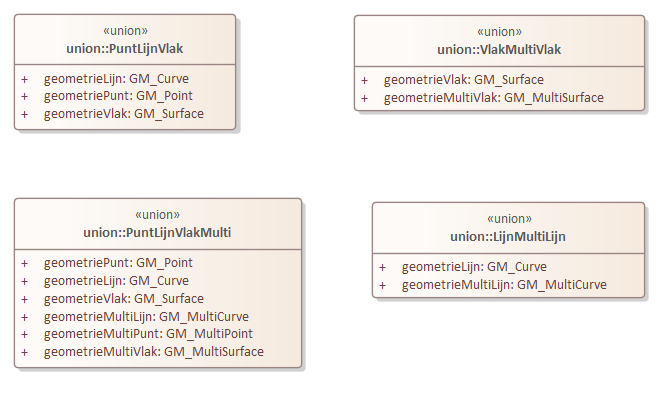

# Geometrietypen {#1139BF9A}

Voor verschillende klassen in de voorafgaande diagrammen is het mogelijk om verschillende geometrietypen te gebruiken. Om strikt vast te leggen wat deze geometrietypen zijn en dat er bij een specifiek object maar één geometrietype tegelijk gebruikt mag worden is er in die gevallen een samengesteld geometrie datatype gecreëerd. Doormiddel van het UML stereotype &lt;union&gt; wordt afgedwongen dat één van de voorkomens van de attributen moet worden toegepast. In GML wordt dit vertaald naar een ‘Choice’ optie. Voor de verschillende mogelijkheden voor het toekennen van geometrie aan de IMRO objecten zijn de volgende volgende klassen van het stereotype Union gecreëerd. 
<figure></img>
<figcaption>Datatypen gecreerd om de keuze tussen verschillende geometrietypen mogelijk te maken</figcaption></figure>

