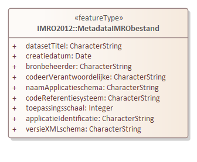

# Metadata {#5B919E61}

Metadata zijn gegevens over gegevens. Bepaalde metadata zijn in het GML bestand van de gegevensset opgenomen. Onderstaand diagram en tabel geven de gegevens weer die als metadata in het GML bestand in de klasse MetadataIMRObestand zijn opgenomen. 
<figure></img>
<figcaption>Metadata in het GML bestand</figcaption></figure>

<table style='width: 100%;'><caption>Tabel 2 Klasse MetadataIMRObestand</caption>
<colgroup><col id='col1' style='width: 23.61437688948606%;'>
<col id='col2' style='width: 6.550218340611353%;'>
<col id='col3' style='width: 69.83540476990258%;'>
</colgroup>
<thead valign='top'><tr><th align='left'>Klasse 
</th>
<th align='left' colspan='2'>MetadataIMRObestand 
</th>
</tr>
</thead>
<tbody valign='top'><tr><td align='left'>Definitie 
</td>
<td align='left' colspan='2'>Metadata behorend bij dit bestand. 
</td>
</tr>
<tr><td align='left'>Herkomst definitie  
</td>
<td align='left' colspan='2'></td>
</tr>
<tr><td align='left'>Inwinningsregels 
</td>
<td align='left' colspan='2'></td>
</tr>
<tr><td align='left'>Generalisatie 
</td>
<td align='left' colspan='2'></td>
</tr>
<tr><td align='left'>Specialisatie 
</td>
<td align='left' colspan='2'></td>
</tr>
<tr><td align='left' colspan='3'>Attributen 
</td>
</tr>
<tr><td align='left'><i>Attribuutnaam</i> 
</td>
<td align='left'><b><i>m</i></b> 
</td>
<td align='left'><b><i>Toelichting</i></b> 
</td>
</tr>
<tr><td align='left'>datasetTitel 
</td>
<td align='left'>1 
</td>
<td align='left'>Naam van de dataset of dataset serie. Dit komt overeen met de naam van het plan of besluit. 
</td>
</tr>
<tr><td align='left'>creatiedatum 
</td>
<td align='left'>1 
</td>
<td align='left'>Datum waarop het bestand gemaakt is. In format: jjjj-mm-dd. 
</td>
</tr>
<tr><td align='left'>bronbeheerder 
</td>
<td align='left'>1 
</td>
<td align='left'>Partij die verantwoordelijkheid heeft geaccepteerd en zorg draagt voor het beheer van de data. Naam van gemeente, provincie. ministerie. 
</td>
</tr>
<tr><td align='left'>codeerVerantwoordelijke 
</td>
<td align='left'>1 
</td>
<td align='left'>Organisatie…… 
</td>
</tr>
<tr><td align='left'>naamApplicatieschema 
</td>
<td align='left'>1 
</td>
<td align='left'>Gebruikt applicatieschema/informatiemodel. In dit geval IMRO2012. 
</td>
</tr>
<tr><td align='left'>codeReferentiesysteem 
</td>
<td align='left'>1 
</td>
<td align='left'>Alfanumerieke waarde die het gebruikte coördinaat referentiesysteem van de dataset aangeeft. Hier wordt een code ingevuld afkomstig van de EPSG (European Petrol Survey Group). Het verplicht te gebruiken referentiesysteem is het Rijksdriehoekstelsel de code hiervoor is: <b>28992</b>

</td>
</tr>
<tr><td align='left'>toepassingsschaal

</td>
<td align='left'>1 
</td>
<td align='left'>De beoogde maximum schaal waarop het bestand waarheidsgetrouw gebruikt mag worden. Dit moet een positief numeriek getal zijn. Bijvoorbeeld: 10000 voor een bestand dat tot op schaal 1 : 10.000 gebruikt moet worden. 
</td>
</tr>
<tr><td align='left'>applicatieIdentificatie 
</td>
<td align='left'>1 
</td>
<td align='left'>Aanduiding van applicatie en versienummer waarmee het bestand gecodeerd is. 
</td>
</tr>
<tr><td align='left'>versieXMLschema 
</td>
<td align='left'>1 
</td>
<td align='left'>Versie van het XML schema definitie bestand (XSD). In het XSD vastgelegd als version="versiecode"&gt; 
</td>
</tr>
<tr><td align='left'></td>
<td align='left'></td>
<td align='left'></td>
</tr>
</tbody>
</table>

