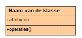
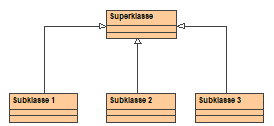
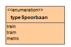

# Bijlage 1: UML-schema presentatie voor klassediagram {#7F7DAF04}

Voor het beschrijven van het model wordt gebruik gemaakt van de grafische modelleertaal UML (Unified Modelling Language). UML vindt zijn oorsprong in de objectoriëntatie en is door de Object management Groep (OMG) ontwikkeld als een standaard voor het beschrijven van objectgeoriënteerde modellen. Het UML klassediagram is één van de mogelijkheden die UML biedt. Dit onderdeel wordt in dit document gebruikt voor het beschrijven van IMRO. Hieronder volgt een beknopte samenvatting van de belangrijkste begrippen en notaties die gebruikt worden in een UML klassediagram.

<table style='width: 100%;'><caption></caption>
<colgroup><col id='col1' style='width: 40.05955107650023%;'>
<col id='col2' style='width: 59.940448923499765%;'>
</colgroup>
<thead valign='top'><tr><th align='left'>Begrip Nederlands (Engels) 
</th>
<th align='left'>UML-notatie 
</th>
</tr>
</thead>
<tbody valign='top'><tr><td align='left'>Klasse (Class) = verzameling objecten met overeenkomstige eigenschappen (‘kenmerken, associaties en gedrag’).

Abstracte klasse (abstract class) = klasse zonder objecten. 
Concrete klasse = klasse met objecten. 
</td>
<td align='left'></img>
Rechthoek met drie compartimenten: 
Naam van de klasse 
Attributen ( kenmerken) 
Operaties ( gedrag) 
</td>
</tr>
<tr><td align='left'>Instantie (instance) = een object uit een klasse 
</td>
<td align='left'></td>
</tr>
<tr><td align='left'>Associatie (association) = relatie tussen twee klassen 
</td>
<td align='left'>Een relatie tussen twee of meer klassen. Om weer te geven hoeveel objecten met elkaar gekoppeld zijn gebruiken we de multipliciteit. 
</img>
Eén object (instantie) van klasse A heeft een relatie met nul of meer objecten (instanties) van klasse B 
</td>
</tr>
<tr><td align='left'>Multipliciteit (multiplicity) = het aantal betrokken objecten in een associatie

</td>
<td align='left'>Opname van een expliciet aantal (1, 2 enz) 
Of een reeks: 
0.. = nul of meer 
1..  = één of meer 
2..5 = twee tot vijf 
</td>
</tr>
<tr><td align='left'>Specialisatie (specialization) = het verfijnen van een klasse (de zgn. superklasse) in onder- of subklassen

</td>
<td align='left'><figure></img>
<figcaption></figcaption></figure>

</td>
</tr>
<tr><td align='left'>Overerving (inheritance) = iedere subklasse erft alle eigenschappen (kenmerken, associaties en gedrag) van zijn superklasse 
</td>
<td align='left'></td>
</tr>
<tr><td align='left'>Aggregatie (aggregation) = een associatie tussen een samengestelde klasse en een component klasse (maakt deel uit van). Objecten van de deelklasse kunnen worden toegevoegd of verwijderd zonder dat de geheelklasse ophoudt te bestaan. 
</td>
<td align='left'><figure></img>
<figcaption></figcaption></figure>

</td>
</tr>
<tr><td align='left'>Compositie (composition) = een associatie die aangeeft dat een of meer klassen (componenten) onderdeel zijn van een andere klasse (compositieklasse), met als restrictie dat een component niet zelfstandig verder leeft als de compositieklasse verdwijnt 
</td>
<td align='left'><figure></img>
<figcaption></figcaption></figure>

</td>
</tr>
<tr><td align='left'>Enumeratie (enumeration) = Een klasse die een lijst van waardes weergeeft. Deze kan gebruikt worden op plaatsen waar voor een bepaalde waarde uit een beperkt aantal vooraf bekende mogelijkheiden gekozen moet worden. Een enumeratie is een klasse met als stereotype ‘&lt;&lt;Enumeration&gt;&gt;’. 
</td>
<td align='left'><figure></img>
<figcaption></figcaption></figure>

</td>
</tr>
<tr><td align='left'>CodeList= Wanneer vooraf niet bekend is welke waardes een bepaald attribuut kan krijgen, maar als er wel een lijst waarschijnlijke waardes is, wordt in plaats van een Enumeratie een CodeList gebruikt. Een CodeList is een klasse met als stereotype ‘&lt;&lt;CodeList&gt;&gt;’. 
</td>
<td align='left'></td>
</tr>
</tbody>
</table>

